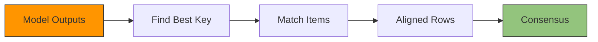

When using `n_consensus > 1`, multiple models extract data from the same document. Their outputs may contain **lists in different orders** or with **slight variations**. The Alignment Engine matches corresponding items before computing consensus.

## The Problem

Three models extract line items from an invoice:

```json
// Model 1
[{"sku": "A", "qty": 10}, {"sku": "B", "qty": 20}]

// Model 2  
[{"sku": "B", "qty": 20}, {"sku": "A", "qty": 10}]  // Different order!

// Model 3
[{"sku": "A", "qty": 10}, {"sku": "B", "qty": 21}]  // Slight variation
```

**Without alignment**: Naive comparison would match `A` with `B` (same index).

**With alignment**: The engine detects these are the **same items** and aligns them correctly before consensus.

---

## How It Works



| Step | Question | Example |
|------|----------|---------|
| **1. Find Best Key** | Which field uniquely identifies items? | `sku` |
| **2. Match Items** | Which items correspond across sources? | `A↔A↔A`, `B↔B↔B` |
| **3. Consensus** | What's the final value for each field? | `qty: 20` (2/3 agree) |

---

## Step 1: Find the Best Key

The engine looks for a field that:
- **Uniquely identifies** each item (no duplicates)
- **Is stable** across sources (same values appear)

### Example

```
Available fields: [sku, qty]

sku: ["A", "B"] in all sources → ✅ Good key (unique, stable)
qty: [10, 20, 10, 21...] → ❌ Values repeat across items
```

For a more complex document with `[sku, qty, price, description]`:
```
sku:         unique per item → ✅ Best key
qty:         values repeat   → ❌ Not unique
price:       values repeat   → ❌ Not unique
description: varies slightly → ⚠️ Needs semantic matching
```

### Key Metrics

| Metric | What it measures |
|--------|------------------|
| **Uniqueness** | Are values distinct within each source? |
| **Jaccard** | How similar are value sets across sources? |
| **I_E** | How many values appear in ALL sources? |
| **Coverage** | What % of items have this field? |

> **Composite Keys**: If no single field is unique, the engine combines fields like `(category, name)`.

---

## Step 2: Match Items

Once the key is selected, items are matched by their key values.

### Simple Example

```
Key selected: "sku"

Source 1: [{"sku": "A", ...}, {"sku": "B", ...}]
Source 2: [{"sku": "B", ...}, {"sku": "A", ...}]  // Different order
Source 3: [{"sku": "A", ...}, {"sku": "B", ...}]

Aligned rows:
  Row 0: [Source1[0], Source2[1], Source3[0]]  // All have sku="A"
  Row 1: [Source1[1], Source2[0], Source3[1]]  // All have sku="B"
```

### Fuzzy Matching

Keys don't always match exactly. The engine handles variations:

**Numeric canonicalization:**
```
Source 1: {"price": -50.00}
Source 2: {"price": 50.00}
→ Same key value (abs + round to 2 decimals → 50.0)

Source 1: {"qty": 10.004}
Source 2: {"qty": 10.006}
→ Same key value (both round to 10.01)
```

**Semantic similarity (embeddings):**
```
Source 1: {"name": "COSRX Snail Mucin 92"}
Source 2: {"name": "Cosrx snail mucin"}
→ Same item (cosine similarity > 0.67 threshold)
```

> **Note**: Fuzzy key matching uses `abs()` + rounding for numbers, not percentage tolerance. The 3% tolerance is used in **consensus** (merging values), not in **alignment** (matching items).

---

## Step 3: Handle Unmatched Items

Items that can't be matched become **solo rows**:

```
Source 1: [A, B, C]
Source 2: [A, B]      // No C
Source 3: [A, B]      // No C

Aligned output:
  Row 0: [A, A, A]     ← Matched
  Row 1: [B, B, B]     ← Matched  
  Row 2: [C, None, None] ← Solo row (only in Source 1)
```

**Zero-loss guarantee**: No data is ever discarded.

---

## Multi-Pass Strategy

Alignment uses multiple passes with different strategies:

| Pass | Strategy | Threshold | Purpose |
|------|----------|-----------|---------|
| 1 | Standard + Semantic | 0.67 | Key-based alignment (bulk matching) |
| 2 | Semantic (medium) | 0.90 | Re-align residuals with high confidence |
| 3 | Semantic (loose) | 0.85 | Catch remaining similar items |

Pass 1 handles the bulk of items using discovered keys. Passes 2-3 progressively try to match remaining unaligned items using semantic similarity.

---

## Result: Aligned Structure

After alignment, the engine produces:

```python
# Original (unaligned)
sources = [
    {"items": [{"sku": "A", "qty": 10}, {"sku": "B", "qty": 20}]},
    {"items": [{"sku": "B", "qty": 20}, {"sku": "A", "qty": 10}]},
    {"items": [{"sku": "A", "qty": 10}, {"sku": "B", "qty": 21}]},
]

# After alignment (conceptually)
aligned = [
    {"items": [
        [{"sku": "A", "qty": 10}, {"sku": "A", "qty": 10}, {"sku": "A", "qty": 10}],  # Row 0
        [{"sku": "B", "qty": 20}, {"sku": "B", "qty": 20}, {"sku": "B", "qty": 21}],  # Row 1
    ]},
]

# Now consensus can compare correctly:
# Row 0, qty: [10, 10, 10] → 10 (100% agreement)
# Row 1, qty: [20, 20, 21] → 20 (67% agreement)
```

---

## When Alignment Matters

| Scenario | Alignment Needed? |
|----------|-------------------|
| Simple fields (`invoice_number`, `date`) | No — same position |
| Tables / line items | **Yes** — order may vary |
| Nested arrays | **Yes** — recursive alignment |
| Single values | No — direct comparison |

The alignment engine activates automatically for arrays of objects when using `n_consensus > 1`.

---

## Special Case: n=2 (Evaluation Mode)

When comparing exactly **2 sources**, the alignment engine has a special optimization:

### Hungarian Algorithm

After the standard multi-pass alignment, any remaining unmatched items are paired using the [Hungarian algorithm](https://en.wikipedia.org/wiki/Hungarian_algorithm) — an optimal bipartite matching that minimizes total "cost" (1 - similarity).

```
Source 1 residuals: [Item_X, Item_Y]
Source 2 residuals: [Item_P, Item_Q]

Similarity matrix:
           Item_P    Item_Q
Item_X      0.9       0.3
Item_Y      0.2       0.85

Hungarian finds optimal pairing:
  Item_X ↔ Item_P (sim: 0.9)
  Item_Y ↔ Item_Q (sim: 0.85)
```

This catches matches that key-based alignment missed.

### Evaluation Use Case

With n=2, one source is typically a **reference** (ground truth) and the other is the **prediction**. This enables:

- **Per-field accuracy**: How similar is each extracted field to the reference?
- **Alignment quality**: Did the model extract the same items?
- **Error analysis**: Which fields diverge from the reference?

```
Reference (ground truth):
  items: [{sku: "A", qty: 10}, {sku: "B", qty: 100}]

Prediction (model output):
  items: [{sku: "B", qty: 101}, {sku: "A", qty: 10}]

After alignment:
  Row 0: [ref.items[0], pred.items[1]]  ← Both sku="A"
  Row 1: [ref.items[1], pred.items[0]]  ← Both sku="B"

Per-field similarity:
  items[0].sku: 1.0   (exact match)
  items[0].qty: 1.0   (exact match)
  items[1].sku: 1.0   (exact match)
  items[1].qty: 1.0   (101 vs 100: 1% diff ≤ 1% tolerance ✓)
```

> **Note**: Numeric similarity is binary — either within 1% tolerance (score = 1.0) or not (score ≈ 0). There's no gradient.

> **Note**: For n=2 evaluation, the output is **similarity scores** (0-1 per field), not consensus values. This tells you how close the prediction is to the reference.
