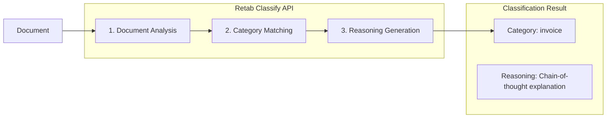

---

## title: Classification

---

### Introduction

The `classify` method in Retab's document processing pipeline analyzes a document and classifies it into exactly one of the user-defined categories. Unlike the `split` method which identifies multiple sections within a document, `classify` determines the single most appropriate category for the entire document, returning the classification along with chain-of-thought reasoning explaining the decision.

Common use cases include:

1. **Document Routing**: Automatically route incoming documents to the appropriate processing pipeline based on their type
2. **Pre-filtering**: Classify documents before extraction to apply the correct schema
3. **Mailroom Automation**: Sort incoming mail and attachments by document type
4. **Quality Control**: Verify document types match expected categories in a workflow



Key features of the Classify API:

- **Single Classification**: Returns exactly one category for the entire document
- **Chain-of-Thought Reasoning**: Provides detailed explanation for the classification decision
- **Vision-Based Analysis**: Uses LLM vision capabilities for accurate document understanding
- **Flexible Categories**: Define custom categories tailored to your document types
- **Explainable Results**: Understand why a document was classified a certain way

## Classify API

<ParamField body="ClassifyRequest" type="ClassifyRequest">
  <Expandable title="properties">

<ParamField body="document" type="MIMEData" required>
  The document to classify. Can be a file path, bytes, or PIL.Image.Image object.
</ParamField>

<ParamField body="model" type="LLMModel" required>
  The AI model to use for document classification. Recommended: `retab-small` for best balance of speed and accuracy.
</ParamField>

<ParamField body="categories" type="array[Category]" required>
  List of categories to classify the document into. Each category has:
  - `name`: Unique identifier for the category
  - `description`: Detailed description to help the model identify this category
</ParamField>

<ParamField body="first_n_pages" type="integer">
  Only use the first N pages of the document for classification. Useful for large documents where classification can be determined from early pages, reducing processing time and cost. Supports PDF and Office documents (docx, pptx, doc, ppt).
</ParamField>

<ParamField body="context" type="string">
  Additional context to guide the classification. Useful for providing iteration context from a loop, business rules, or other relevant information that helps the model make more accurate classification decisions.
</ParamField>

</Expandable>
</ParamField>

<ResponseField name="Returns" type="ClassifyResponse Object">
A ClassifyResponse object containing the classification result with reasoning.
  <Expandable title="properties">
    <ResponseField name="result" type="ClassifyResult">
      The classification result containing:
      - `classification`: The category name that the document belongs to
      - `reasoning`: Step-by-step explanation of why this classification was chosen
    </ResponseField>
  </Expandable>
</ResponseField>

## Use Case: Document Routing in a Processing Pipeline

Classify incoming documents to route them to the appropriate extraction schema.

<CodeGroup>
```python Python
from retab import Retab

client = Retab()

# Define document type categories
categories = [
    {"name": "invoice", "description": "Invoice documents with billing details, line items, totals, and payment terms"},
    {"name": "receipt", "description": "Payment receipts showing transaction confirmation and amounts paid"},
    {"name": "contract", "description": "Legal contracts with terms, conditions, and signature blocks"},
    {"name": "purchase_order", "description": "Purchase order documents with order details and shipping information"},
]

# Classify the document
result = client.documents.classify(
    document="incoming_document.pdf",
    model="retab-small",
    categories=categories
)

print(f"Document classified as: {result.result.classification}")
print(f"Reasoning: {result.result.reasoning}")

# Route to appropriate extraction pipeline
if result.result.classification == "invoice":
    # Use invoice extraction schema
    invoice_schema = {...}
    extraction = client.documents.extract(
        document="incoming_document.pdf",
        model="retab-small",
        json_schema=invoice_schema
    )
elif result.result.classification == "contract":
    # Use contract extraction schema
    contract_schema = {...}
    extraction = client.documents.extract(
        document="incoming_document.pdf",
        model="retab-small",
        json_schema=contract_schema
    )
```

```javascript Javascript
import { Retab } from '@retab/node';

const client = new Retab();

// Define document type categories
const categories = [
    { name: "invoice", description: "Invoice documents with billing details, line items, totals, and payment terms" },
    { name: "receipt", description: "Payment receipts showing transaction confirmation and amounts paid" },
    { name: "contract", description: "Legal contracts with terms, conditions, and signature blocks" },
    { name: "purchase_order", description: "Purchase order documents with order details and shipping information" },
];

// Classify the document
const result = await client.documents.classify({
    document: "incoming_document.pdf",
    model: "retab-small",
    categories: categories
});

console.log(`Document classified as: ${result.result.classification}`);
console.log(`Reasoning: ${result.result.reasoning}`);

// Route to appropriate extraction pipeline
if (result.result.classification === "invoice") {
    // Use invoice extraction schema
    const invoiceSchema = {...};
    const extraction = await client.documents.extract({
        document: "incoming_document.pdf",
        model: "retab-small",
        json_schema: invoiceSchema
    });
} else if (result.result.classification === "contract") {
    // Use contract extraction schema
    const contractSchema = {...};
    const extraction = await client.documents.extract({
        document: "incoming_document.pdf",
        model: "retab-small",
        json_schema: contractSchema
    });
}
```

```typescript TypeScript
import { Retab, type ClassifyRequest, type ClassifyResponse } from '@retab/node';

interface Category {
    name: string;
    description: string;
}

const client = new Retab();

// Define document type categories
const categories: Category[] = [
    { name: "invoice", description: "Invoice documents with billing details, line items, totals, and payment terms" },
    { name: "receipt", description: "Payment receipts showing transaction confirmation and amounts paid" },
    { name: "contract", description: "Legal contracts with terms, conditions, and signature blocks" },
    { name: "purchase_order", description: "Purchase order documents with order details and shipping information" },
];

// Classify the document
const classifyRequest: ClassifyRequest = {
    document: "incoming_document.pdf",
    model: "retab-small",
    categories: categories
};

const result: ClassifyResponse = await client.documents.classify(classifyRequest);

console.log(`Document classified as: ${result.result.classification}`);
console.log(`Reasoning: ${result.result.reasoning}`);

// Route to appropriate extraction pipeline based on classification
switch (result.result.classification) {
    case "invoice":
        // Process as invoice
        break;
    case "contract":
        // Process as contract
        break;
    default:
        // Handle other document types
        break;
}
```
</CodeGroup>

## Use Case: Email Attachment Filtering

Classify email attachments to filter out irrelevant documents.

<CodeGroup>
```python Python
from retab import Retab

client = Retab()

# Define categories for email attachments
categories = [
    {"name": "invoice", "description": "Invoice or billing documents requiring payment"},
    {"name": "quote", "description": "Price quotes or proposals from vendors"},
    {"name": "marketing", "description": "Marketing materials, brochures, or promotional content"},
    {"name": "other", "description": "Miscellaneous documents not fitting other categories"},
]

# Process each attachment
for attachment in email_attachments:
    result = client.documents.classify(
        document=attachment,
        model="retab-small",
        categories=categories
    )
    
    if result.result.classification == "invoice":
        # High priority - process immediately
        process_invoice(attachment)
    elif result.result.classification == "quote":
        # Medium priority - queue for review
        queue_for_review(attachment)
    elif result.result.classification == "marketing":
        # Low priority - skip or archive
        archive_document(attachment)
    
    print(f"{attachment.name}: {result.result.classification}")
    print(f"  Reason: {result.result.reasoning[:100]}...")
```

```javascript Javascript
import { Retab } from '@retab/node';

const client = new Retab();

// Define categories for email attachments
const categories = [
    { name: "invoice", description: "Invoice or billing documents requiring payment" },
    { name: "quote", description: "Price quotes or proposals from vendors" },
    { name: "marketing", description: "Marketing materials, brochures, or promotional content" },
    { name: "other", description: "Miscellaneous documents not fitting other categories" },
];

// Process each attachment
for (const attachment of emailAttachments) {
    const result = await client.documents.classify({
        document: attachment,
        model: "retab-small",
        categories: categories
    });
    
    if (result.result.classification === "invoice") {
        // High priority - process immediately
        await processInvoice(attachment);
    } else if (result.result.classification === "quote") {
        // Medium priority - queue for review
        await queueForReview(attachment);
    } else if (result.result.classification === "marketing") {
        // Low priority - skip or archive
        await archiveDocument(attachment);
    }
    
    console.log(`${attachment.name}: ${result.result.classification}`);
    console.log(`  Reason: ${result.result.reasoning.slice(0, 100)}...`);
}
```
</CodeGroup>

## Classify vs Split: When to Use Each

| Feature | Classify | Split |
|---------|----------|-------|
| **Purpose** | Categorize entire document | Identify sections within document |
| **Output** | Single category | Multiple page ranges |
| **Use Case** | Document routing, filtering | Batch separation, section extraction |
| **Input** | Any document | Typically multi-page documents |
| **Result** | One classification with reasoning | List of sections with page ranges |

**Use Classify when:**
- You need to determine what type of document you have
- Documents are single-purpose (one invoice, one contract, etc.)
- Building a document routing or triage system
- Pre-filtering before extraction

**Use Split when:**
- Documents contain multiple sections of different types
- Processing batched/combined PDFs
- Need to locate specific sections within a document
- Extracting page ranges for further processing

## Best Practices

### Category Definition
- **Be Specific**: Provide detailed descriptions that distinguish categories clearly
- **Use Visual Cues**: Mention distinctive visual elements (logos, headers, layouts)
- **Include Examples**: Reference typical content found in each category
- **Add Catch-all**: Consider an "other" category for documents that don't fit

### Leveraging Reasoning
- **Quality Assurance**: Use reasoning to validate classification decisions
- **Audit Trail**: Store reasoning for compliance and debugging
- **Confidence Assessment**: Longer, more detailed reasoning often indicates higher confidence
- **Human Review**: Flag documents with ambiguous reasoning for manual review

### Model Selection
- **`retab-small`**: Best balance of speed and accuracy for most use cases
- **`retab-large`**: Higher accuracy for complex or ambiguous documents
- **`retab-micro`**: Fastest option for high-volume, straightforward classification

### Performance Tips
- **Limit Categories**: Use 3-7 well-defined categories for best accuracy
- **Test Descriptions**: Iterate on category descriptions to improve classification
- **Parallel Processing**: Classify multiple documents concurrently for higher throughput
- **Use `first_n_pages`**: For large documents where classification can be determined from early pages, use `first_n_pages` to limit processing to the first N pages, reducing latency and cost

