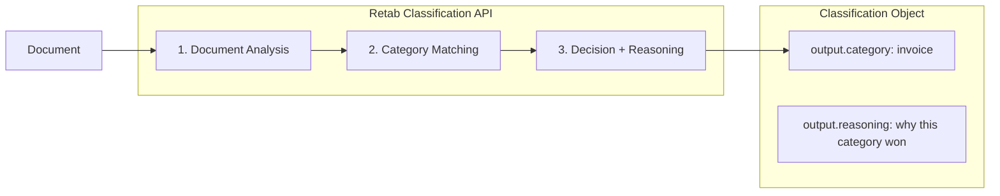

---

## title: Classification

---

### Introduction

Retab classifications use the resource-based `POST /v1/classifications` API. A classification request analyzes a document, chooses exactly one category, and persists the result as a `Classification` object that you can later retrieve or list.

Common use cases include:

1. **Document Routing**: Route incoming files to the right downstream extraction pipeline
2. **Pre-filtering**: Choose the right schema before extraction
3. **Mailroom Automation**: Sort attachments by document type
4. **Quality Control**: Verify documents match the expected category in a workflow


```mermaid
flowchart LR
    A[Document] --> B

    subgraph Retab["Retab Classification API"]
        B[1. Document Analysis]
        B --> C[2. Category Matching]
        C --> D[3. Decision + Reasoning]
    end

    D --> E

    subgraph Output["Classification Object"]
        E[output.category: invoice]
        F[output.reasoning: why this category won]
    end
```

Key features of the Classification API:

- **Single Decision**: Returns exactly one category for the document
- **Reasoned Output**: Includes an explanation for the selected category
- **Custom Categories**: Define categories specific to your workflow
- **Consensus Support**: Run multiple votes with `n_consensus` when you want more stability
- **Stored Resource**: The result is persisted and can be fetched later

## Classification API

<ParamField body="ClassificationRequest" type="ClassificationRequest">
  <Expandable title="properties">

<ParamField body="document" type="MIMEData" required>
  The document to classify. Can be a file path, bytes, or image input.
</ParamField>

<ParamField body="model" type="LLMModel">
  The model to use for classification. Recommended: `retab-small` for most cases.
</ParamField>

<ParamField body="categories" type="array[Category]" required>
  The candidate categories. Each category has:
  - `name`: Stable identifier for the category
  - `description`: Instructions that help the model distinguish that category
</ParamField>

<ParamField body="first_n_pages" type="integer">
  Restrict classification to the first N pages. Useful for large documents when the signal appears early.
</ParamField>

<ParamField body="instructions" type="string">
  Free-form instructions appended to the system prompt to steer the classification.
</ParamField>

<ParamField body="n_consensus" type="integer" default="1">
  Number of votes to run for consensus. Max: `16`.
</ParamField>

</Expandable>
</ParamField>

<ResponseField name="Returns" type="Classification Object">
A stored classification resource containing the decision, consensus metadata, and usage.
  <Expandable title="properties">
    <ResponseField name="id" type="string">
      Unique identifier of the classification.
    </ResponseField>
    <ResponseField name="file" type="object">
      File metadata for the classified document.
    </ResponseField>
    <ResponseField name="model" type="string">
      Model used for classification.
    </ResponseField>
    <ResponseField name="categories" type="array[Category]">
      Categories the document was classified against.
    </ResponseField>
    <ResponseField name="n_consensus" type="integer">
      Number of votes used for the classification.
    </ResponseField>
    <ResponseField name="instructions" type="string | null">
      Free-form instructions supplied with the request.
    </ResponseField>
    <ResponseField name="output" type="ClassificationDecision">
      Final classification decision.
    </ResponseField>
    <ResponseField name="consensus" type="ClassificationConsensus">
      Consensus metadata with flat `choices` entries.
    </ResponseField>
    <ResponseField name="usage" type="RetabUsage | null">
      Usage information for the request.
    </ResponseField>
  </Expandable>
</ResponseField>

## Use Case: Document Routing in a Processing Pipeline

Classify incoming documents, then route them to the right extraction schema based on `output.category`.

<CodeGroup>
```python Python
from retab import Retab

client = Retab()

categories = [
    {"name": "invoice", "description": "Invoice documents with billing details, line items, totals, and payment terms"},
    {"name": "receipt", "description": "Payment receipts showing transaction confirmation and amounts paid"},
    {"name": "contract", "description": "Legal contracts with terms, conditions, and signature blocks"},
    {"name": "purchase_order", "description": "Purchase order documents with order details and shipping information"},
]

classification = client.classifications.create(
    document="incoming_document.pdf",
    model="retab-small",
    categories=categories,
)

print(f"Document classified as: {classification.output.category}")
print(f"Reasoning: {classification.output.reasoning}")

if classification.output.category == "invoice":
    invoice_schema = {...}
    extraction = client.extractions.create(
        document="incoming_document.pdf",
        model="retab-small",
        json_schema=invoice_schema,
    )
elif classification.output.category == "contract":
    contract_schema = {...}
    extraction = client.extractions.create(
        document="incoming_document.pdf",
        model="retab-small",
        json_schema=contract_schema,
    )
```

```javascript Javascript
import { Retab } from '@retab/node';

const client = new Retab();

const categories = [
    { name: "invoice", description: "Invoice documents with billing details, line items, totals, and payment terms" },
    { name: "receipt", description: "Payment receipts showing transaction confirmation and amounts paid" },
    { name: "contract", description: "Legal contracts with terms, conditions, and signature blocks" },
    { name: "purchase_order", description: "Purchase order documents with order details and shipping information" },
];

const classification = await client.classifications.create({
    document: "incoming_document.pdf",
    model: "retab-small",
    categories,
});

console.log(`Document classified as: ${classification.output.category}`);
console.log(`Reasoning: ${classification.output.reasoning}`);

if (classification.output.category === "invoice") {
    const invoiceSchema = {...};
    const extraction = await client.extractions.create({
        document: "incoming_document.pdf",
        model: "retab-small",
        json_schema: invoiceSchema,
    });
} else if (classification.output.category === "contract") {
    const contractSchema = {...};
    const extraction = await client.extractions.create({
        document: "incoming_document.pdf",
        model: "retab-small",
        json_schema: contractSchema,
    });
}
```

```typescript TypeScript
import { Retab } from '@retab/node';

interface Category {
    name: string;
    description: string;
}

const client = new Retab();

const categories: Category[] = [
    { name: "invoice", description: "Invoice documents with billing details, line items, totals, and payment terms" },
    { name: "receipt", description: "Payment receipts showing transaction confirmation and amounts paid" },
    { name: "contract", description: "Legal contracts with terms, conditions, and signature blocks" },
    { name: "purchase_order", description: "Purchase order documents with order details and shipping information" },
];

const classification = await client.classifications.create({
    document: "incoming_document.pdf",
    model: "retab-small",
    categories,
});

console.log(`Document classified as: ${classification.output.category}`);
console.log(`Reasoning: ${classification.output.reasoning}`);

switch (classification.output.category) {
    case "invoice":
        break;
    case "contract":
        break;
    default:
        break;
}
```
</CodeGroup>

## Use Case: Email Attachment Filtering

Classify attachments first, then branch on `output.category`.

<CodeGroup>
```python Python
from retab import Retab

client = Retab()

categories = [
    {"name": "invoice", "description": "Invoice or billing documents requiring payment"},
    {"name": "quote", "description": "Price quotes or proposals from vendors"},
    {"name": "marketing", "description": "Marketing materials, brochures, or promotional content"},
    {"name": "other", "description": "Miscellaneous documents not fitting other categories"},
]

for attachment in email_attachments:
    classification = client.classifications.create(
        document=attachment,
        model="retab-small",
        categories=categories,
    )

    if classification.output.category == "invoice":
        process_invoice(attachment)
    elif classification.output.category == "quote":
        queue_for_review(attachment)
    elif classification.output.category == "marketing":
        archive_document(attachment)

    print(f"{attachment.name}: {classification.output.category}")
    print(f"  Reason: {classification.output.reasoning[:100]}...")
```

```javascript Javascript
import { Retab } from '@retab/node';

const client = new Retab();

const categories = [
    { name: "invoice", description: "Invoice or billing documents requiring payment" },
    { name: "quote", description: "Price quotes or proposals from vendors" },
    { name: "marketing", description: "Marketing materials, brochures, or promotional content" },
    { name: "other", description: "Miscellaneous documents not fitting other categories" },
];

for (const attachment of emailAttachments) {
    const classification = await client.classifications.create({
        document: attachment,
        model: "retab-small",
        categories,
    });

    if (classification.output.category === "invoice") {
        await processInvoice(attachment);
    } else if (classification.output.category === "quote") {
        await queueForReview(attachment);
    } else if (classification.output.category === "marketing") {
        await archiveDocument(attachment);
    }

    console.log(`${attachment.name}: ${classification.output.category}`);
    console.log(`  Reason: ${classification.output.reasoning.slice(0, 100)}...`);
}
```
</CodeGroup>

## Classify vs Split

| Feature | Classify | Split |
|---------|----------|-------|
| **Purpose** | Categorize the whole document | Identify sections within a document |
| **Output** | One `output` decision | Multiple subdocument assignments |
| **Use Case** | Routing, filtering, triage | Batch separation, section extraction |
| **Result Shape** | `output.category`, `output.reasoning` | `output[]` with pages per subdocument |

**Use Classify when:**
- You need to know what kind of document you have
- The document should map to one main category
- You are routing to another workflow or extraction schema

**Use Split when:**
- The file contains multiple sections with different meanings
- You need page-level grouping
- You plan to extract multiple subdocuments from one upload

## Best Practices

### Category Definition
- **Be Specific**: Describe what makes each category unique
- **Use Visual Cues**: Mention layouts, headers, logos, or tables when useful
- **Keep Overlap Low**: Categories should be distinguishable from each other
- **Add a Catch-all**: Include an `other` category when documents can fall outside the expected set

### Reasoning and Consensus
- **Review `output.reasoning`** when you need an audit trail or human validation
- **Use `n_consensus > 1`** for noisy or ambiguous document sets
- **Inspect `consensus.choices`** to understand close calls between categories

### Performance
- **Use 3-7 categories** for best results in most routing setups
- **Limit pages** with `first_n_pages` when the first page contains enough signal
- **Start with `retab-small`** and only scale up when accuracy demands it
