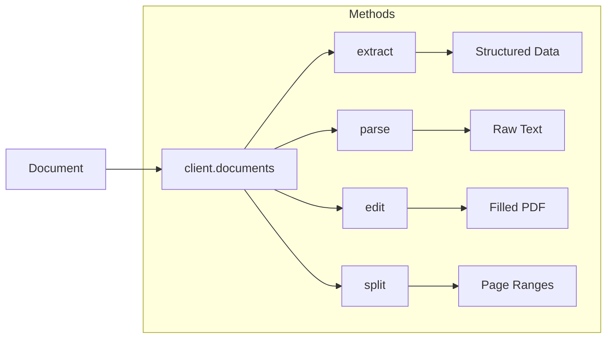

---

## title: Documents

---

### Introduction

Retab offers a consolidated, production-grade pipeline for processing any types of documents with AI. 

**Our model read documents the way humans do.** It accepts native digital files (Images, PDFs, DOCX, XLSX, E-mail) and parses text, detects visual structure across pages, tables, forms, and figures. 

Please check the [API Reference](https://docs.retab.com/api-reference) for more details.



The module exposes four high-level methods:

| Method | Purpose |
| ------ | ------- |
| **`extract`** | Executes the extraction and returns the parsed object (optionally with consensus voting). One-step OCR + LLM parsing when only the structured output is required. |
| **`parse`** | Converts any document into structured text content with page-by-page extraction. Perfect for RAG, text extraction, and preparing documents for further processing or indexing. |
| **`edit`** | Automatically detects form fields in PDFs using OCR and LLM, then fills them based on natural language instructions. Ideal for automated form completion workflows. |
| **`split`** | Analyzes multi-page documents and classifies pages into user-defined categories, returning page ranges for each section. Perfect for separating mixed document batches and organizing content by type. |

The complexities of OCR, layout reconstruction are handled internally, allowing to focus solely on downstream prompt and context-engineering logic.

## The document data structure

Documents in Retab are represented as `MIMEData` objects, which encapsulate the file content and metadata. This structure allows you to work with documents in a consistent way regardless of their original format. **The `url` field directly matches [OpenAI's expected format for image inputs](https://platform.openai.com/docs/guides/images-vision?api-mode=chat&format=base64-encoded).**

<ResponseField name="MIMEData Object Structure" type="object">
  <Expandable title="document">
    <ResponseField name="filename" type="string">
      The original filename of the document.
    </ResponseField>
    <ResponseField name="url" type="string">
      A data URL containing the base64-encoded content of the document, prefixed with the appropriate MIME type.
    </ResponseField>
  </Expandable>
</ResponseField>

<CodeGroup>
```json MIMEData Object Structure
{
  "document": {
    "filename": "Alphabet-10Q-Q1-25.pdf",
    "url": "data:application/pdf;base64,JVBERi0xLjQKJfbk/N8KMSAwIG9iago8PAovVHlwZS…"
  }
}
```
</CodeGroup>

The python SDK is flexible and allows you to use the `document` parameter as a file path, bytes, or a `PIL.Image.Image` object, and we will automatically convert it to a `MIMEData` object for you.

