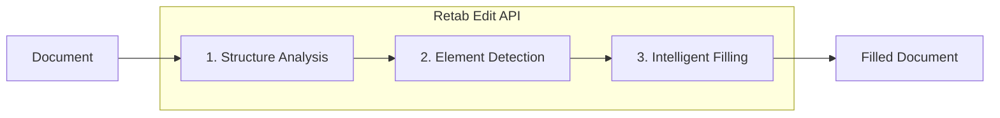

---

## title: Editing

---

### Introduction

The `edit` method in Retab's document processing pipeline enables intelligent document form filling. It supports **PDF, Word (DOCX), Excel (XLSX), and PowerPoint (PPTX)** files, automatically detecting fillable elements and populating them based on natural language instructions. This is ideal for automating form completion workflows, document generation, and batch processing of standardized forms.

### Supported Formats

| Format | Extension | Processing Method |
|--------|-----------|------------------|
| **PDF** | `.pdf` | OCR + LLM form field detection |
| **Word** | `.docx`, `.doc`, `.odt` | Native XML editing (preserves formatting) |
| **Excel** | `.xlsx`, `.xls`, `.ods` | Native cell editing |
| **PowerPoint** | `.pptx`, `.ppt`, `.odp` | Native shape/text editing |

### How It Works

**For PDF files:**
1. **OCR Processing**: Extract text elements with precise bounding box coordinates
2. **Form Field Detection**: Use LLM to identify fillable fields (text inputs, checkboxes)
3. **Intelligent Filling**: Match your instructions to the appropriate form fields
4. **PDF Generation**: Create a new PDF with the filled values

**For Office files (DOCX, XLSX, PPTX):**
1. **Structure Extraction**: Parse the document's XML structure to identify all text elements
2. **Element Detection**: LLM identifies fillable placeholders (empty cells, whitespace after labels, placeholder text)
3. **Native Editing**: Apply edits directly to the XML, preserving all original formatting and styles
4. **Document Generation**: Return the filled document in its original format



Unlike manual form filling or template-based approaches, `edit` provides:
- **Multi-Format Support**: PDF, Word, Excel, and PowerPoint files
- **Zero Configuration**: No need to pre-define field positions or create templates
- **Natural Language Instructions**: Describe what to fill in plain English or JSON
- **Format Preservation**: Office files retain all original formatting, styles, and layout
- **Automatic Field Matching**: LLM intelligently maps your data to form fields
- **MIMEData Output**: Get the filled document as MIMEData with filename and base64 content

## Edit API

<ParamField body="EditRequest" type="EditRequest">
  <Expandable title="properties">

<ParamField body="document" type="MIMEData" required>
  The document to edit. Supports PDF, DOCX, XLSX, and PPTX files. Can be a file path, URL, or MIMEData object containing:
  - `filename`: Name of the file (e.g., "form.pdf", "template.docx", "data.xlsx")
  - `url`: Data URI with base64 content (e.g., "data:application/pdf;base64,...")
</ParamField>

<ParamField body="filling_instructions" type="string" required>
  Natural language or JSON instructions describing how to fill the document. Include the field values you want to populate, e.g., "Name: John Doe, Date: 2025-01-15" or `{"name": "John Doe", "date": "2025-01-15"}`.
</ParamField>

<ParamField body="model" type="LLMModel" default="retab-small">
  The AI model to use for element detection and filling. Recommended: `retab-small` for accuracy.
</ParamField>

</Expandable>
</ParamField>

<ResponseField name="Returns" type="EditResponse Object">
An EditResponse object containing the filled document and form data.
  <Expandable title="properties">

    <ResponseField name="form_data" type="list[FilledFormField]">
      List of form fields with filled values (primarily for PDF). Each field includes bbox, description, type, and value.
    </ResponseField>

    <ResponseField name="filled_document" type="MIMEData">
      The filled document as MIMEData containing filename and url (data URI with base64 content). Returns the same format as the input (PDF → PDF, DOCX → DOCX, etc.).
    </ResponseField>
  </Expandable>
</ResponseField>

## Use Case: PDF Form Filling

Fill PDF forms programmatically using natural language instructions.

<CodeGroup>
```python Python
from retab import Retab
import base64

client = Retab()

# Fill the form with natural language instructions
# The SDK accepts file paths directly
result = client.documents.edit(
    document="application-form.pdf",
    filling_instructions="""
    Full Name: Jane Smith
    Date of Birth: March 15, 1985
    Email: jane.smith@example.com
    Phone: (555) 123-4567
    Address: 456 Oak Avenue, Suite 200
    City: San Francisco
    State: California
    ZIP Code: 94102
    I agree to the terms and conditions: checked
    """,
    model="retab-small",
)

# Save the filled PDF
if result.filled_document:
    # Extract base64 content from data URI
    base64_content = result.filled_document.url.split(",")[1]
    filled_bytes = base64.b64decode(base64_content)
    with open("filled-application.pdf", "wb") as f:
        f.write(filled_bytes)
    print("Filled form saved!")

# Review what was filled
print(f"Filled {len(result.form_data)} form fields:")
for field in result.form_data:
    if field.value:
        print(f"  - {field.description}: {field.value}")
```

```javascript Javascript
import { Retab } from '@retab/node';
import { readFileSync, writeFileSync } from 'fs';

const client = new Retab();

// Read the PDF form
const pdfBuffer = readFileSync("application-form.pdf");
const pdfBase64 = pdfBuffer.toString('base64');

// Fill the form with natural language instructions
const result = await client.documents.edit({
    document: {
        filename: "application-form.pdf",
        url: `data:application/pdf;base64,${pdfBase64}`
    },
    filling_instructions: `
        Full Name: Jane Smith
        Date of Birth: March 15, 1985
        Email: jane.smith@example.com
        Phone: (555) 123-4567
        Address: 456 Oak Avenue, Suite 200
        City: San Francisco
        State: California
        ZIP Code: 94102
        I agree to the terms and conditions: checked
    `,
    model: "retab-small",
});

// Save the filled PDF
if (result.filled_document) {
    const base64Content = result.filled_document.url.split(",")[1];
    const filledBuffer = Buffer.from(base64Content, 'base64');
    writeFileSync("filled-application.pdf", filledBuffer);
    console.log("Filled form saved!");
}

// Review what was filled
console.log(`Filled ${result.form_data.length} form fields:`);
result.form_data.forEach(field => {
    if (field.value) {
        console.log(`  - ${field.description}: ${field.value}`);
    }
});
```

```typescript TypeScript
import { Retab, type EditRequest, type EditResponse } from '@retab/node';
import { readFileSync, writeFileSync } from 'fs';

const client = new Retab();

// Read the PDF form
const pdfBuffer = readFileSync("application-form.pdf");
const pdfBase64 = pdfBuffer.toString('base64');

const editRequest: EditRequest = {
    document: {
        filename: "application-form.pdf",
        url: `data:application/pdf;base64,${pdfBase64}`
    },
    filling_instructions: `
        Full Name: Jane Smith
        Date of Birth: March 15, 1985
        Email: jane.smith@example.com
        Phone: (555) 123-4567
        Address: 456 Oak Avenue, Suite 200
        City: San Francisco
        State: California
        ZIP Code: 94102
        I agree to the terms and conditions: checked
    `,
    model: "retab-small",
};

const result: EditResponse = await client.documents.edit(editRequest);

// Save the filled PDF
if (result.filled_document) {
    const base64Content = result.filled_document.url.split(",")[1];
    const filledBuffer = Buffer.from(base64Content, 'base64');
    writeFileSync("filled-application.pdf", filledBuffer);
    console.log("Filled form saved!");
}

// Review what was filled
console.log(`Filled ${result.form_data.length} form fields:`);
result.form_data.forEach(field => {
    if (field.value) {
        console.log(`  - ${field.description}: ${field.value}`);
    }
});
```
</CodeGroup>

## Use Case: Batch Form Processing

Process multiple forms with different data programmatically.

<CodeGroup>
```python Python
import base64
from retab import Retab

client = Retab()

# Sample data for multiple applicants
applicants = [
    {
        "name": "John Doe",
        "dob": "January 10, 1990",
        "email": "john.doe@example.com",
        "phone": "(555) 111-2222"
    },
    {
        "name": "Alice Johnson", 
        "dob": "July 22, 1988",
        "email": "alice.j@example.com",
        "phone": "(555) 333-4444"
    },
    {
        "name": "Bob Williams",
        "dob": "December 5, 1995",
        "email": "bob.w@example.com", 
        "phone": "(555) 555-6666"
    }
]

# Process each applicant using file path directly
for i, applicant in enumerate(applicants):
    instructions = f"""
    Full Name: {applicant['name']}
    Date of Birth: {applicant['dob']}
    Email Address: {applicant['email']}
    Phone Number: {applicant['phone']}
    """
    
    result = client.documents.edit(
        document="template-form.pdf",
        filling_instructions=instructions,
        model="retab-small"
    )
    
    if result.filled_document:
        output_filename = f"filled-form-{i+1}-{applicant['name'].replace(' ', '-')}.pdf"
        base64_content = result.filled_document.url.split(",")[1]
        with open(output_filename, "wb") as f:
            f.write(base64.b64decode(base64_content))
        print(f"Created: {output_filename}")

print(f"Processed {len(applicants)} forms successfully!")
```

```javascript Javascript
import { Retab } from '@retab/node';
import { readFileSync, writeFileSync } from 'fs';

const client = new Retab();

// Sample data for multiple applicants
const applicants = [
    {
        name: "John Doe",
        dob: "January 10, 1990",
        email: "john.doe@example.com",
        phone: "(555) 111-2222"
    },
    {
        name: "Alice Johnson",
        dob: "July 22, 1988", 
        email: "alice.j@example.com",
        phone: "(555) 333-4444"
    },
    {
        name: "Bob Williams",
        dob: "December 5, 1995",
        email: "bob.w@example.com",
        phone: "(555) 555-6666"
    }
];

// Read the template form once
const templateBuffer = readFileSync("template-form.pdf");
const templateBase64 = templateBuffer.toString('base64');

// Process each applicant
for (let i = 0; i < applicants.length; i++) {
    const applicant = applicants[i];
    const instructions = `
        Full Name: ${applicant.name}
        Date of Birth: ${applicant.dob}
        Email Address: ${applicant.email}
        Phone Number: ${applicant.phone}
    `;
    
    const result = await client.documents.edit({
        document: {
            filename: "template-form.pdf",
            url: `data:application/pdf;base64,${templateBase64}`
        },
        filling_instructions: instructions,
        model: "retab-small"
    });
    
    if (result.filled_document) {
        const outputFilename = `filled-form-${i+1}-${applicant.name.replace(/ /g, '-')}.pdf`;
        const base64Content = result.filled_document.url.split(",")[1];
        writeFileSync(outputFilename, Buffer.from(base64Content, 'base64'));
        console.log(`Created: ${outputFilename}`);
    }
}

console.log(`Processed ${applicants.length} forms successfully!`);
```
</CodeGroup>

## Use Case: Word Document Filling

Fill Word documents (DOCX) while preserving all original formatting and styles.

<CodeGroup>
```python Python
from retab import Retab
import base64

client = Retab()

# Fill a Word document with JSON data
result = client.documents.edit(
    document="contract-template.docx",
    filling_instructions="""
    {
        "client_name": "Acme Corporation",
        "contract_date": "January 15, 2025",
        "project_description": "Website redesign and development",
        "total_amount": "$25,000",
        "payment_terms": "Net 30"
    }
    """,
    model="retab-small",
)

# Save the filled DOCX (preserves original formatting)
if result.filled_document:
    base64_content = result.filled_document.url.split(",")[1]
    filled_bytes = base64.b64decode(base64_content)
    with open("filled-contract.docx", "wb") as f:
        f.write(filled_bytes)
    print("Filled Word document saved!")
```

```javascript Javascript
import { Retab } from '@retab/node';
import { readFileSync, writeFileSync } from 'fs';

const client = new Retab();

const docxBuffer = readFileSync("contract-template.docx");
const docxBase64 = docxBuffer.toString('base64');

const result = await client.documents.edit({
    document: {
        filename: "contract-template.docx",
        url: `data:application/vnd.openxmlformats-officedocument.wordprocessingml.document;base64,${docxBase64}`
    },
    filling_instructions: JSON.stringify({
        client_name: "Acme Corporation",
        contract_date: "January 15, 2025",
        project_description: "Website redesign and development",
        total_amount: "$25,000",
        payment_terms: "Net 30"
    }),
    model: "retab-small",
});

if (result.filled_document) {
    const base64Content = result.filled_document.url.split(",")[1];
    writeFileSync("filled-contract.docx", Buffer.from(base64Content, 'base64'));
    console.log("Filled Word document saved!");
}
```
</CodeGroup>

## Use Case: Excel Spreadsheet Filling

Fill Excel spreadsheets by targeting specific cells with data.

<CodeGroup>
```python Python
from retab import Retab
import base64

client = Retab()

# Fill an Excel spreadsheet
result = client.documents.edit(
    document="invoice-template.xlsx",
    filling_instructions="""
    {
        "invoice_number": "INV-2025-001",
        "customer_name": "Tech Solutions Inc.",
        "invoice_date": "2025-01-15",
        "items": [
            {"description": "Consulting Services", "quantity": 10, "rate": 150},
            {"description": "Software License", "quantity": 1, "rate": 500}
        ],
        "total": "$2,000"
    }
    """,
    model="retab-small",
)

if result.filled_document:
    base64_content = result.filled_document.url.split(",")[1]
    with open("filled-invoice.xlsx", "wb") as f:
        f.write(base64.b64decode(base64_content))
    print("Filled Excel spreadsheet saved!")
```

```javascript Javascript
import { Retab } from '@retab/node';
import { readFileSync, writeFileSync } from 'fs';

const client = new Retab();

const xlsxBuffer = readFileSync("invoice-template.xlsx");
const xlsxBase64 = xlsxBuffer.toString('base64');

const result = await client.documents.edit({
    document: {
        filename: "invoice-template.xlsx",
        url: `data:application/vnd.openxmlformats-officedocument.spreadsheetml.sheet;base64,${xlsxBase64}`
    },
    filling_instructions: JSON.stringify({
        invoice_number: "INV-2025-001",
        customer_name: "Tech Solutions Inc.",
        invoice_date: "2025-01-15",
        items: [
            { description: "Consulting Services", quantity: 10, rate: 150 },
            { description: "Software License", quantity: 1, rate: 500 }
        ],
        total: "$2,000"
    }),
    model: "retab-small",
});

if (result.filled_document) {
    const base64Content = result.filled_document.url.split(",")[1];
    writeFileSync("filled-invoice.xlsx", Buffer.from(base64Content, 'base64'));
    console.log("Filled Excel spreadsheet saved!");
}
```
</CodeGroup>

## Use Case: PowerPoint Presentation Filling

Fill PowerPoint presentations with dynamic content.

<CodeGroup>
```python Python
from retab import Retab
import base64

client = Retab()

# Fill a PowerPoint presentation
result = client.documents.edit(
    document="sales-deck-template.pptx",
    filling_instructions="""
    {
        "company_name": "Acme Corp",
        "presenter_name": "Jane Smith",
        "presentation_date": "Q1 2025",
        "revenue_figure": "$1.2M",
        "growth_percentage": "25%",
        "key_highlights": ["Expanded to 3 new markets", "Launched 2 new products", "Increased team by 40%"]
    }
    """,
    model="retab-small",
)

if result.filled_document:
    base64_content = result.filled_document.url.split(",")[1]
    with open("filled-sales-deck.pptx", "wb") as f:
        f.write(base64.b64decode(base64_content))
    print("Filled PowerPoint presentation saved!")
```

```javascript Javascript
import { Retab } from '@retab/node';
import { readFileSync, writeFileSync } from 'fs';

const client = new Retab();

const pptxBuffer = readFileSync("sales-deck-template.pptx");
const pptxBase64 = pptxBuffer.toString('base64');

const result = await client.documents.edit({
    document: {
        filename: "sales-deck-template.pptx",
        url: `data:application/vnd.openxmlformats-officedocument.presentationml.presentation;base64,${pptxBase64}`
    },
    filling_instructions: JSON.stringify({
        company_name: "Acme Corp",
        presenter_name: "Jane Smith",
        presentation_date: "Q1 2025",
        revenue_figure: "$1.2M",
        growth_percentage: "25%",
        key_highlights: ["Expanded to 3 new markets", "Launched 2 new products", "Increased team by 40%"]
    }),
    model: "retab-small",
});

if (result.filled_document) {
    const base64Content = result.filled_document.url.split(",")[1];
    writeFileSync("filled-sales-deck.pptx", Buffer.from(base64Content, 'base64'));
    console.log("Filled PowerPoint presentation saved!");
}
```
</CodeGroup>

## Best Practices

### Model Selection
- **`retab-large`**: Most accurate for complex documents with many fields or ambiguous layouts. Recommended for production use.
- **`retab-small`**: Faster and more cost-effective, suitable for simple documents with clear field labels.

### Format-Specific Tips

**PDF Forms:**
- Works best with forms that have clear field labels
- Supports both text fields and checkboxes
- For checkboxes, use "checked" or "unchecked" as the value

**Word Documents (DOCX):**
- Best for documents with placeholders like `[Enter name]` or blank spaces after labels
- All formatting (fonts, styles, colors) is preserved
- Tables are fully supported

**Excel Spreadsheets (XLSX):**
- Ideal for templates with empty cells next to labels
- Supports multiple sheets
- Cell references use standard Excel notation (Sheet1!A1)

**PowerPoint Presentations (PPTX):**
- Works with text placeholders in shapes
- Tables within slides are supported
- Preserves all slide formatting and layouts

### Writing Effective Filling Instructions
- **Use JSON for structured data**: `{"name": "John", "date": "2025-01-15"}` works great
- **Be explicit**: Use field labels that match or closely resemble those in the document
- **Use key-value pairs**: Format as "Field Name: Value" for best matching
- **Include context**: If a document has multiple similar fields, add context like "Section A - Name: John"

### Working with MIMEData
- The `filled_document` response is a MIMEData object with `filename` and `url` properties
- The `url` is a data URI with format-appropriate MIME type
- Extract base64 content by splitting on comma: `url.split(",")[1]`
- Python SDK accepts file paths directly and handles MIMEData conversion automatically
- Output format matches input format (DOCX in → DOCX out, XLSX in → XLSX out)
