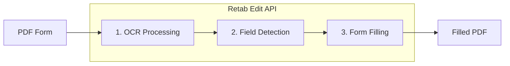

---

## title: Editing

---

### Introduction

The `edit` method in Retab's document processing pipeline enables intelligent PDF form filling. It automatically detects form fields in any PDF document using OCR and LLM inference, then fills them based on natural language instructions. This is ideal for automating form completion workflows, document generation, and batch processing of standardized forms.

The edit workflow follows these steps:

1. **OCR Processing**: Extract text elements with precise bounding box coordinates
2. **Form Field Detection**: Use LLM to identify fillable fields (text inputs, checkboxes)
3. **Intelligent Filling**: Match your instructions to the appropriate form fields
4. **PDF Generation**: Create a new PDF with the filled values



Unlike manual form filling or template-based approaches, `edit` provides:
- **Zero Configuration**: No need to pre-define field positions or create templates
- **Natural Language Instructions**: Describe what to fill in plain English
- **Automatic Field Matching**: LLM intelligently maps your data to form fields
- **Multiple Output Formats**: Get the filled PDF, annotated versions, and structured field data
- **Checkbox Support**: Handles both text fields and checkboxes

## Edit API

<ParamField body="EditRequest" type="EditRequest">
  <Expandable title="properties">

<ParamField body="pdf_base64" type="string" required>
  Base64-encoded PDF file to edit. The PDF should contain fillable form fields or areas where text can be added.
</ParamField>

<ParamField body="filling_instructions" type="string" required>
  Natural language instructions describing how to fill the form. Include the field values you want to populate, e.g., "Name: John Doe, Date: 2025-01-15, Address: 123 Main St".
</ParamField>

<ParamField body="model" type="LLMModel" default="gemini-2.5-pro">
  The AI model to use for form field detection and filling. Recommended: `gemini-2.5-pro` for accuracy.
</ParamField>

<ParamField body="annotation_level" type="string" default="line">
  OCR annotation granularity level:
  - `"line"` (default): Group text by lines - best for most forms
  - `"block"`: Group text by paragraphs/blocks - for dense documents
  - `"token"`: Individual words - for precise field detection
</ParamField>

</Expandable>
</ParamField>

<ResponseField name="Returns" type="EditResponse Object">
An EditResponse object containing the filled PDF and form schema information.
  <Expandable title="properties">
    <ResponseField name="form_schema" type="FormSchema Object">
      The detected form schema with all identified fillable fields and their positions.
    </ResponseField>

    <ResponseField name="filled_form_schema" type="FilledFormSchema Object">
      The form schema with filled values based on your instructions.
    </ResponseField>

    <ResponseField name="ocr_result" type="OCRResult Object">
      Raw OCR results including all detected text elements and their bounding boxes.
    </ResponseField>

    <ResponseField name="ocr_annotated_pdf_base64" type="string">
      Base64-encoded PDF with OCR bounding boxes drawn (useful for debugging).
    </ResponseField>

    <ResponseField name="form_fields_pdf_base64" type="string">
      Base64-encoded PDF with detected form field bounding boxes highlighted.
    </ResponseField>

    <ResponseField name="filled_pdf_base64" type="string">
      Base64-encoded PDF with form fields filled with the provided values.
    </ResponseField>
  </Expandable>
</ResponseField>

## Use Case: Automated Form Filling

Fill PDF forms programmatically using natural language instructions.

<CodeGroup>
```python Python
import base64
from retab import Retab

client = Retab()

# Read the PDF form
with open("application-form.pdf", "rb") as f:
    pdf_base64 = base64.b64encode(f.read()).decode("utf-8")

# Fill the form with natural language instructions
result = client.documents.edit(
    pdf_base64=pdf_base64,
    filling_instructions="""
    Full Name: Jane Smith
    Date of Birth: March 15, 1985
    Email: jane.smith@example.com
    Phone: (555) 123-4567
    Address: 456 Oak Avenue, Suite 200
    City: San Francisco
    State: California
    ZIP Code: 94102
    I agree to the terms and conditions: checked
    """,
    model="gemini-2.5-pro",
    annotation_level="line"
)

# Save the filled PDF
if result.filled_pdf_base64:
    filled_bytes = base64.b64decode(result.filled_pdf_base64)
    with open("filled-application.pdf", "wb") as f:
        f.write(filled_bytes)
    print("Filled form saved!")

# Review what was detected and filled
print(f"Detected {len(result.form_schema.form_fields)} form fields:")
for field in result.form_schema.form_fields:
    print(f"  - {field.type}: {field.description}")

if result.filled_form_schema:
    print("\nFilled values:")
    for field in result.filled_form_schema.form_schema:
        if field.value:
            print(f"  - {field.description}: {field.value}")
```

```javascript Javascript
import { Retab } from '@retab/node';
import { readFileSync, writeFileSync } from 'fs';

const client = new Retab();

// Read the PDF form
const pdfBuffer = readFileSync("application-form.pdf");
const pdfBase64 = pdfBuffer.toString('base64');

// Fill the form with natural language instructions
const result = await client.documents.edit({
    pdf_base64: pdfBase64,
    filling_instructions: `
        Full Name: Jane Smith
        Date of Birth: March 15, 1985
        Email: jane.smith@example.com
        Phone: (555) 123-4567
        Address: 456 Oak Avenue, Suite 200
        City: San Francisco
        State: California
        ZIP Code: 94102
        I agree to the terms and conditions: checked
    `,
    model: "gemini-2.5-pro",
    annotation_level: "line"
});

// Save the filled PDF
if (result.filled_pdf_base64) {
    const filledBuffer = Buffer.from(result.filled_pdf_base64, 'base64');
    writeFileSync("filled-application.pdf", filledBuffer);
    console.log("Filled form saved!");
}

// Review what was detected and filled
console.log(`Detected ${result.form_schema.form_fields.length} form fields:`);
result.form_schema.form_fields.forEach(field => {
    console.log(`  - ${field.type}: ${field.description}`);
});

if (result.filled_form_schema) {
    console.log("\nFilled values:");
    result.filled_form_schema.form_schema.forEach(field => {
        if (field.value) {
            console.log(`  - ${field.description}: ${field.value}`);
        }
    });
}
```

```typescript TypeScript
import { Retab, type EditRequest, type EditResponse } from '@retab/node';
import { readFileSync, writeFileSync } from 'fs';

const client = new Retab();

// Read the PDF form
const pdfBuffer = readFileSync("application-form.pdf");
const pdfBase64 = pdfBuffer.toString('base64');

const editRequest: EditRequest = {
    pdf_base64: pdfBase64,
    filling_instructions: `
        Full Name: Jane Smith
        Date of Birth: March 15, 1985
        Email: jane.smith@example.com
        Phone: (555) 123-4567
        Address: 456 Oak Avenue, Suite 200
        City: San Francisco
        State: California
        ZIP Code: 94102
        I agree to the terms and conditions: checked
    `,
    model: "gemini-2.5-pro",
    annotation_level: "line"
};

const result: EditResponse = await client.documents.edit(editRequest);

// Save the filled PDF
if (result.filled_pdf_base64) {
    const filledBuffer = Buffer.from(result.filled_pdf_base64, 'base64');
    writeFileSync("filled-application.pdf", filledBuffer);
    console.log("Filled form saved!");
}

// Review what was detected and filled
console.log(`Detected ${result.form_schema.form_fields.length} form fields:`);
result.form_schema.form_fields.forEach(field => {
    console.log(`  - ${field.type}: ${field.description}`);
});

if (result.filled_form_schema) {
    console.log("\nFilled values:");
    result.filled_form_schema.form_schema.forEach(field => {
        if (field.value) {
            console.log(`  - ${field.description}: ${field.value}`);
        }
    });
}
```
</CodeGroup>

## Use Case: Batch Form Processing

Process multiple forms with different data programmatically.

<CodeGroup>
```python Python
import base64
from retab import Retab

client = Retab()

# Sample data for multiple applicants
applicants = [
    {
        "name": "John Doe",
        "dob": "January 10, 1990",
        "email": "john.doe@example.com",
        "phone": "(555) 111-2222"
    },
    {
        "name": "Alice Johnson", 
        "dob": "July 22, 1988",
        "email": "alice.j@example.com",
        "phone": "(555) 333-4444"
    },
    {
        "name": "Bob Williams",
        "dob": "December 5, 1995",
        "email": "bob.w@example.com", 
        "phone": "(555) 555-6666"
    }
]

# Read the template form once
with open("template-form.pdf", "rb") as f:
    template_base64 = base64.b64encode(f.read()).decode("utf-8")

# Process each applicant
for i, applicant in enumerate(applicants):
    instructions = f"""
    Full Name: {applicant['name']}
    Date of Birth: {applicant['dob']}
    Email Address: {applicant['email']}
    Phone Number: {applicant['phone']}
    """
    
    result = client.documents.edit(
        pdf_base64=template_base64,
        filling_instructions=instructions,
        model="gemini-2.5-pro"
    )
    
    if result.filled_pdf_base64:
        output_filename = f"filled-form-{i+1}-{applicant['name'].replace(' ', '-')}.pdf"
        with open(output_filename, "wb") as f:
            f.write(base64.b64decode(result.filled_pdf_base64))
        print(f"Created: {output_filename}")

print(f"Processed {len(applicants)} forms successfully!")
```

```javascript Javascript
import { Retab } from '@retab/node';
import { readFileSync, writeFileSync } from 'fs';

const client = new Retab();

// Sample data for multiple applicants
const applicants = [
    {
        name: "John Doe",
        dob: "January 10, 1990",
        email: "john.doe@example.com",
        phone: "(555) 111-2222"
    },
    {
        name: "Alice Johnson",
        dob: "July 22, 1988", 
        email: "alice.j@example.com",
        phone: "(555) 333-4444"
    },
    {
        name: "Bob Williams",
        dob: "December 5, 1995",
        email: "bob.w@example.com",
        phone: "(555) 555-6666"
    }
];

// Read the template form once
const templateBuffer = readFileSync("template-form.pdf");
const templateBase64 = templateBuffer.toString('base64');

// Process each applicant
for (let i = 0; i < applicants.length; i++) {
    const applicant = applicants[i];
    const instructions = `
        Full Name: ${applicant.name}
        Date of Birth: ${applicant.dob}
        Email Address: ${applicant.email}
        Phone Number: ${applicant.phone}
    `;
    
    const result = await client.documents.edit({
        pdf_base64: templateBase64,
        filling_instructions: instructions,
        model: "gemini-2.5-pro"
    });
    
    if (result.filled_pdf_base64) {
        const outputFilename = `filled-form-${i+1}-${applicant.name.replace(/ /g, '-')}.pdf`;
        writeFileSync(outputFilename, Buffer.from(result.filled_pdf_base64, 'base64'));
        console.log(`Created: ${outputFilename}`);
    }
}

console.log(`Processed ${applicants.length} forms successfully!`);
```
</CodeGroup>

## Best Practices

### Model Selection
- **`gemini-2.5-pro`**: Most accurate for complex forms with many fields or ambiguous layouts. Recommended for production use.
- **`gemini-2.5-flash`**: Faster and more cost-effective, suitable for simple forms with clear field labels.

### Annotation Level Selection
- **`line`** (default): Best for most standard forms where fields are organized in rows
- **`block`**: Better for forms with dense text or multi-line field descriptions
- **`token`**: Use when you need precise word-level detection for tightly packed forms

### Writing Effective Filling Instructions
- **Be explicit**: Use field labels that match or closely resemble those in the form
- **Use key-value pairs**: Format as "Field Name: Value" for best matching
- **For checkboxes**: Use "checked" or "unchecked" as the value
- **Include context**: If a form has multiple similar fields, add context like "Section A - Name: John"

### Debugging Tips
- Use `ocr_annotated_pdf_base64` to verify OCR detected all text correctly
- Use `form_fields_pdf_base64` to see which fields were identified
- Review `form_schema.form_fields` to understand what the LLM detected before filling
