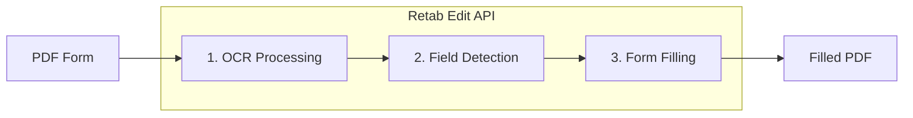

---

## title: Editing

---

### Introduction

The `edit` method in Retab's document processing pipeline enables intelligent PDF form filling. It automatically detects form fields in any PDF document using OCR and LLM inference, then fills them based on natural language instructions. This is ideal for automating form completion workflows, document generation, and batch processing of standardized forms.

The edit workflow follows these steps:

1. **OCR Processing**: Extract text elements with precise bounding box coordinates
2. **Form Field Detection**: Use LLM to identify fillable fields (text inputs, checkboxes)
3. **Intelligent Filling**: Match your instructions to the appropriate form fields
4. **PDF Generation**: Create a new PDF with the filled values



Unlike manual form filling or template-based approaches, `edit` provides:
- **Zero Configuration**: No need to pre-define field positions or create templates
- **Natural Language Instructions**: Describe what to fill in plain English
- **Automatic Field Matching**: LLM intelligently maps your data to form fields
- **MIMEData Output**: Get the filled PDF as MIMEData with filename and base64 content
- **Checkbox Support**: Handles both text fields and checkboxes

## Edit API

<ParamField body="EditRequest" type="EditRequest">
  <Expandable title="properties">

<ParamField body="document" type="MIMEData" required>
  The document to edit. Can be a file path, URL, or MIMEData object containing:
  - `filename`: Name of the file (e.g., "form.pdf")
  - `url`: Data URI with base64 content (e.g., "data:application/pdf;base64,...")
</ParamField>

<ParamField body="filling_instructions" type="string" required>
  Natural language instructions describing how to fill the form. Include the field values you want to populate, e.g., "Name: John Doe, Date: 2025-01-15, Address: 123 Main St".
</ParamField>

<ParamField body="model" type="LLMModel" default="gemini-2.5-pro">
  The AI model to use for form field detection and filling. Recommended: `gemini-2.5-pro` for accuracy.
</ParamField>

</Expandable>
</ParamField>

<ResponseField name="Returns" type="EditResponse Object">
An EditResponse object containing the filled PDF and form data.
  <Expandable title="properties">

    <ResponseField name="form_data" type="list[FilledFormField]">
      List of form fields with filled values based on your instructions. Each field includes bbox, description, type, and value.
    </ResponseField>

    <ResponseField name="filled_document" type="MIMEData">
      The filled PDF as MIMEData containing filename and url (data URI with base64 content).
    </ResponseField>
  </Expandable>
</ResponseField>

## Use Case: Automated Form Filling

Fill PDF forms programmatically using natural language instructions.

<CodeGroup>
```python Python
from retab import Retab
import base64

client = Retab()

# Fill the form with natural language instructions
# The SDK accepts file paths directly
result = client.documents.edit(
    document="application-form.pdf",
    filling_instructions="""
    Full Name: Jane Smith
    Date of Birth: March 15, 1985
    Email: jane.smith@example.com
    Phone: (555) 123-4567
    Address: 456 Oak Avenue, Suite 200
    City: San Francisco
    State: California
    ZIP Code: 94102
    I agree to the terms and conditions: checked
    """,
    model="gemini-2.5-pro",
)

# Save the filled PDF
if result.filled_document:
    # Extract base64 content from data URI
    base64_content = result.filled_document.url.split(",")[1]
    filled_bytes = base64.b64decode(base64_content)
    with open("filled-application.pdf", "wb") as f:
        f.write(filled_bytes)
    print("Filled form saved!")

# Review what was filled
print(f"Filled {len(result.form_data)} form fields:")
for field in result.form_data:
    if field.value:
        print(f"  - {field.description}: {field.value}")
```

```javascript Javascript
import { Retab } from '@retab/node';
import { readFileSync, writeFileSync } from 'fs';

const client = new Retab();

// Read the PDF form
const pdfBuffer = readFileSync("application-form.pdf");
const pdfBase64 = pdfBuffer.toString('base64');

// Fill the form with natural language instructions
const result = await client.documents.edit({
    document: {
        filename: "application-form.pdf",
        url: `data:application/pdf;base64,${pdfBase64}`
    },
    filling_instructions: `
        Full Name: Jane Smith
        Date of Birth: March 15, 1985
        Email: jane.smith@example.com
        Phone: (555) 123-4567
        Address: 456 Oak Avenue, Suite 200
        City: San Francisco
        State: California
        ZIP Code: 94102
        I agree to the terms and conditions: checked
    `,
    model: "gemini-2.5-pro",
});

// Save the filled PDF
if (result.filled_document) {
    const base64Content = result.filled_document.url.split(",")[1];
    const filledBuffer = Buffer.from(base64Content, 'base64');
    writeFileSync("filled-application.pdf", filledBuffer);
    console.log("Filled form saved!");
}

// Review what was filled
console.log(`Filled ${result.form_data.length} form fields:`);
result.form_data.forEach(field => {
    if (field.value) {
        console.log(`  - ${field.description}: ${field.value}`);
    }
});
```

```typescript TypeScript
import { Retab, type EditRequest, type EditResponse } from '@retab/node';
import { readFileSync, writeFileSync } from 'fs';

const client = new Retab();

// Read the PDF form
const pdfBuffer = readFileSync("application-form.pdf");
const pdfBase64 = pdfBuffer.toString('base64');

const editRequest: EditRequest = {
    document: {
        filename: "application-form.pdf",
        url: `data:application/pdf;base64,${pdfBase64}`
    },
    filling_instructions: `
        Full Name: Jane Smith
        Date of Birth: March 15, 1985
        Email: jane.smith@example.com
        Phone: (555) 123-4567
        Address: 456 Oak Avenue, Suite 200
        City: San Francisco
        State: California
        ZIP Code: 94102
        I agree to the terms and conditions: checked
    `,
    model: "gemini-2.5-pro",
};

const result: EditResponse = await client.documents.edit(editRequest);

// Save the filled PDF
if (result.filled_document) {
    const base64Content = result.filled_document.url.split(",")[1];
    const filledBuffer = Buffer.from(base64Content, 'base64');
    writeFileSync("filled-application.pdf", filledBuffer);
    console.log("Filled form saved!");
}

// Review what was filled
console.log(`Filled ${result.form_data.length} form fields:`);
result.form_data.forEach(field => {
    if (field.value) {
        console.log(`  - ${field.description}: ${field.value}`);
    }
});
```
</CodeGroup>

## Use Case: Batch Form Processing

Process multiple forms with different data programmatically.

<CodeGroup>
```python Python
import base64
from retab import Retab

client = Retab()

# Sample data for multiple applicants
applicants = [
    {
        "name": "John Doe",
        "dob": "January 10, 1990",
        "email": "john.doe@example.com",
        "phone": "(555) 111-2222"
    },
    {
        "name": "Alice Johnson", 
        "dob": "July 22, 1988",
        "email": "alice.j@example.com",
        "phone": "(555) 333-4444"
    },
    {
        "name": "Bob Williams",
        "dob": "December 5, 1995",
        "email": "bob.w@example.com", 
        "phone": "(555) 555-6666"
    }
]

# Process each applicant using file path directly
for i, applicant in enumerate(applicants):
    instructions = f"""
    Full Name: {applicant['name']}
    Date of Birth: {applicant['dob']}
    Email Address: {applicant['email']}
    Phone Number: {applicant['phone']}
    """
    
    result = client.documents.edit(
        document="template-form.pdf",
        filling_instructions=instructions,
        model="gemini-2.5-pro"
    )
    
    if result.filled_document:
        output_filename = f"filled-form-{i+1}-{applicant['name'].replace(' ', '-')}.pdf"
        base64_content = result.filled_document.url.split(",")[1]
        with open(output_filename, "wb") as f:
            f.write(base64.b64decode(base64_content))
        print(f"Created: {output_filename}")

print(f"Processed {len(applicants)} forms successfully!")
```

```javascript Javascript
import { Retab } from '@retab/node';
import { readFileSync, writeFileSync } from 'fs';

const client = new Retab();

// Sample data for multiple applicants
const applicants = [
    {
        name: "John Doe",
        dob: "January 10, 1990",
        email: "john.doe@example.com",
        phone: "(555) 111-2222"
    },
    {
        name: "Alice Johnson",
        dob: "July 22, 1988", 
        email: "alice.j@example.com",
        phone: "(555) 333-4444"
    },
    {
        name: "Bob Williams",
        dob: "December 5, 1995",
        email: "bob.w@example.com",
        phone: "(555) 555-6666"
    }
];

// Read the template form once
const templateBuffer = readFileSync("template-form.pdf");
const templateBase64 = templateBuffer.toString('base64');

// Process each applicant
for (let i = 0; i < applicants.length; i++) {
    const applicant = applicants[i];
    const instructions = `
        Full Name: ${applicant.name}
        Date of Birth: ${applicant.dob}
        Email Address: ${applicant.email}
        Phone Number: ${applicant.phone}
    `;
    
    const result = await client.documents.edit({
        document: {
            filename: "template-form.pdf",
            url: `data:application/pdf;base64,${templateBase64}`
        },
        filling_instructions: instructions,
        model: "gemini-2.5-pro"
    });
    
    if (result.filled_document) {
        const outputFilename = `filled-form-${i+1}-${applicant.name.replace(/ /g, '-')}.pdf`;
        const base64Content = result.filled_document.url.split(",")[1];
        writeFileSync(outputFilename, Buffer.from(base64Content, 'base64'));
        console.log(`Created: ${outputFilename}`);
    }
}

console.log(`Processed ${applicants.length} forms successfully!`);
```
</CodeGroup>

## Best Practices

### Model Selection
- **`gemini-2.5-pro`**: Most accurate for complex forms with many fields or ambiguous layouts. Recommended for production use.
- **`gemini-2.5-flash`**: Faster and more cost-effective, suitable for simple forms with clear field labels.

### Annotation Level Selection
- **`line`** (default): Best for most standard forms where fields are organized in rows
- **`block`**: Better for forms with dense text or multi-line field descriptions
- **`token`**: Use when you need precise word-level detection for tightly packed forms

### Writing Effective Filling Instructions
- **Be explicit**: Use field labels that match or closely resemble those in the form
- **Use key-value pairs**: Format as "Field Name: Value" for best matching
- **For checkboxes**: Use "checked" or "unchecked" as the value
- **Include context**: If a form has multiple similar fields, add context like "Section A - Name: John"

### Working with MIMEData
- The `filled_document` response is a MIMEData object with `filename` and `url` properties
- The `url` is a data URI: `data:application/pdf;base64,<base64_content>`
- Extract base64 content by splitting on comma: `url.split(",")[1]`
- Python SDK accepts file paths directly and handles MIMEData conversion automatically
