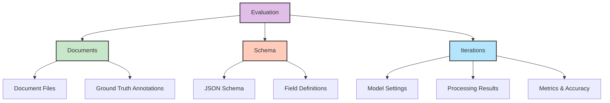

# Evaluations

Evaluations in Retab provide a systematic framework for testing and validating the performance of your document processing schemas against known ground truth data. Think of evaluations as your testing infrastructure for document AI—they allow you to measure accuracy, track performance over time, and optimize your extraction schemas with confidence.

An evaluation consists of three core components: **Documents** (your test data with annotations), **Iterations** (test runs with specific model configurations), and a **Schema** (what you want to extract). This structure enables rigorous testing, A/B comparisons between different models, and systematic optimization of your document processing pipelines.

Please check the [API Reference](https://docs.retab.com/api-reference/evaluations/create) for more details.



## Core Concepts

### Evaluations
An **Evaluation** is a test suite for a specific document processing task. It contains:
- A name and optional project association
- A JSON schema defining the structure of data to extract
- A collection of test documents with ground truth annotations
- Multiple iterations testing different model configurations

### Documents
**Documents** are your test data—real files paired with manually annotated ground truth. Each document contains:
- The source file (PDF, image, Excel, etc.)
- Ground truth annotations showing the correct extraction results
- Metadata for tracking and organization

### Iterations
**Iterations** are individual test runs that process all documents in an evaluation using specific model settings. Each iteration can use different:
- Models (GPT-4o, Claude, Gemini, etc.)
- Temperature settings
- Reasoning effort levels
- Consensus configurations

## Working with Evaluations

### Create an Evaluation

Creates a new evaluation with a schema for structured data extraction.

<ResponseField name="Returns" type="Evaluation Object">
A fully-populated **Evaluation** instance.
  <Expandable title="properties">
    <ResponseField name="id" type="string">Unique identifier for the evaluation.</ResponseField>
    <ResponseField name="name" type="string">Human-readable evaluation name.</ResponseField>
    <ResponseField name="json_schema" type="object">JSON schema defining extraction structure.</ResponseField>
    <ResponseField name="project_id" type="string | null">ID of the owning project.</ResponseField>
    <ResponseField name="default_inference_settings" type="InferenceSettings | null">Default model settings inherited by iterations.</ResponseField>
    <ResponseField name="documents" type="array[EvaluationDocument]">List of test documents.</ResponseField>
    <ResponseField name="iterations" type="array[Iteration]">List of test runs.</ResponseField>
    <ResponseField name="updated_at" type="datetime">Timestamp of last update.</ResponseField>
  </Expandable>
</ResponseField>

<CodeGroup>
```python Request
from retab import Retab

client = Retab()

# Define the schema for invoice extraction
invoice_schema = {
    "title": "InvoiceEvaluation",
    "type": "object",
    "properties": {
        "invoice_number": {
            "type": "string",
            "description": "The unique invoice identifier"
        },
        "total_amount": {
            "type": "number",
            "description": "Total invoice amount"
        },
        "vendor_name": {
            "type": "string",
            "description": "Name of the vendor/supplier"
        },
        "invoice_date": {
            "type": "string",
            "description": "Date the invoice was issued"
        }
    },
    "required": ["invoice_number", "total_amount", "vendor_name"]
}

# Create the evaluation
evaluation = client.evaluations.create(
    name="Invoice Processing Evaluation",
    json_schema=invoice_schema,
    project_id="proj_abc123"
)
```

```json Response
{
  "id": "eval_01HZX4H9Q0J2M4P1ZS6E6FY8MN",
  "name": "Invoice Processing Evaluation",
  "json_schema": { 
    "title": "InvoiceEvaluation",
    "type": "object",
    "properties": { ... }
  },
  "project_id": "proj_abc123",
  "default_inference_settings": {
    "model": "gpt-4o-mini",
    "temperature": 0.0,
    "reasoning_effort": "medium"
  },
  "documents": [],
  "iterations": [],
  "updated_at": "2024-01-15T10:30:00Z"
}
```
</CodeGroup>

### Add Test Documents

Upload documents with ground truth annotations to build your test dataset.

<CodeGroup>
```python Request
# Add a test document with ground truth
document = client.evaluations.documents.create(
    evaluation_id="eval_01HZX4H9Q0J2M4P1ZS6E6FY8MN",
    document="invoices/sample_invoice_1.pdf",
    annotation={
        "invoice_number": "INV-2024-001",
        "total_amount": 1250.00,
        "vendor_name": "Acme Corp",
        "invoice_date": "2024-01-15"
    }
)

# Add multiple documents at once
documents = [
    ("invoices/invoice_2.pdf", {
        "invoice_number": "INV-2024-002",
        "total_amount": 850.75,
        "vendor_name": "Beta Industries",
        "invoice_date": "2024-01-16"
    }),
    ("invoices/invoice_3.jpg", {
        "invoice_number": "2024-Q1-337",
        "total_amount": 2100.50,
        "vendor_name": "Gamma Solutions",
        "invoice_date": "2024-01-17"
    })
]

for doc_path, annotation in documents:
    client.evaluations.documents.create(
        evaluation_id="eval_01HZX4H9Q0J2M4P1ZS6E6FY8MN",
        document=doc_path,
        annotation=annotation
    )
```
</CodeGroup>

### Create and Run Iterations

Run test iterations with different model configurations to find optimal settings.

<CodeGroup>
```python Request
# Test with GPT-4o-mini (fast, cost-effective)
iteration_1 = client.evaluations.iterations.create(
    evaluation_id="eval_01HZX4H9Q0J2M4P1ZS6E6FY8MN",
    model="gpt-4o-mini",
    temperature=0.0,
    reasoning_effort="low"
)

# Test with GPT-4o (higher accuracy)
iteration_2 = client.evaluations.iterations.create(
    evaluation_id="eval_01HZX4H9Q0J2M4P1ZS6E6FY8MN",
    model="gpt-4o",
    temperature=0.0,
    reasoning_effort="medium"
)

# Test with consensus for better reliability
iteration_3 = client.evaluations.iterations.create(
    evaluation_id="eval_01HZX4H9Q0J2M4P1ZS6E6FY8MN",
    model="gpt-4o-mini",
    temperature=0.2,
    n_consensus=3,
    reasoning_effort="medium"
)

# Process all documents in an iteration
processed_iteration = client.evaluations.iterations.process(
    evaluation_id="eval_01HZX4H9Q0J2M4P1ZS6E6FY8MN",
    iteration_id=iteration_1.id
)
```
</CodeGroup>

### Analyze Results

Retrieve detailed metrics and accuracy measurements for your iterations.

<CodeGroup>
```python Request
# Get iteration status and progress
status = client.evaluations.iterations.status(
    evaluation_id="eval_01HZX4H9Q0J2M4P1ZS6E6FY8MN",
    iteration_id=iteration_1.id
)

# Compute detailed distance metrics for a specific document
distances = client.evaluations.iterations.compute_distances(
    evaluation_id="eval_01HZX4H9Q0J2M4P1ZS6E6FY8MN",
    iteration_id=iteration_1.id,
    document_id="doc_xyz789"
)

# List all iterations for comparison
iterations = client.evaluations.iterations.list(
    evaluation_id="eval_01HZX4H9Q0J2M4P1ZS6E6FY8MN"
)

for iteration in iterations:
    print(f"Model: {iteration.inference_settings.model}")
    print(f"Accuracy: {iteration.metrics.overall_accuracy}")
    print(f"Processing time: {iteration.processing_time}")
```

```json Distance Metrics Response
{
  "overall_similarity": 0.92,
  "field_similarities": {
    "invoice_number": 1.0,
    "total_amount": 0.95,
    "vendor_name": 0.88,
    "invoice_date": 0.85
  },
  "distance_metrics": {
    "jaccard": 0.08,
    "levenshtein": 0.12,
    "semantic": 0.07
  }
}
```
</CodeGroup>

## Advanced Features

### Consensus Evaluation

Use multiple model calls to improve reliability and measure consistency.

<CodeGroup>
```python Request
# Run consensus evaluation with 5 attempts
consensus_iteration = client.evaluations.iterations.create(
    evaluation_id="eval_01HZX4H9Q0J2M4P1ZS6E6FY8MN",
    model="gpt-4o-mini",
    temperature=0.3,  # Add some randomness for diversity
    n_consensus=5,    # Run 5 times and reconcile results
    reasoning_effort="medium"
)
```
</CodeGroup>

When `n_consensus > 1`, Retab:
1. Runs the extraction multiple times with the same settings
2. Compares results across all attempts
3. Uses advanced reconciliation to merge consistent fields
4. Provides confidence scores based on agreement levels

### Multi-Modal Processing

Configure iterations for different document types and processing modes.

<CodeGroup>
```python Request
# Optimize for text-heavy documents
text_iteration = client.evaluations.iterations.create(
    evaluation_id="eval_01HZX4H9Q0J2M4P1ZS6E6FY8MN",
    model="gpt-4o",
    modality="text",  # Extract text first, then process
    image_resolution_dpi=150
)

# Optimize for visual documents (forms, charts)
visual_iteration = client.evaluations.iterations.create(
    evaluation_id="eval_01HZX4H9Q0J2M4P1ZS6E6FY8MN",
    model="gpt-4o",
    modality="native",  # Process document as-is
    image_resolution_dpi=300,
    browser_canvas="A4"  # Set canvas size for rendering
)
```
</CodeGroup>

### LLM-Assisted Annotation

Generate ground truth annotations automatically using LLMs, then review and correct.

<CodeGroup>
```python Request
# Auto-annotate a document using LLM
annotation_result = client.evaluations.documents.llm_annotate(
    evaluation_id="eval_01HZX4H9Q0J2M4P1ZS6E6FY8MN",
    document_id="doc_xyz789"
)

# Review and update the annotation
client.evaluations.documents.update(
    evaluation_id="eval_01HZX4H9Q0J2M4P1ZS6E6FY8MN",
    document_id="doc_xyz789",
    annotation={
        "invoice_number": "INV-2024-001",  # Confirmed correct
        "total_amount": 1250.00,          # Confirmed correct
        "vendor_name": "ACME Corporation", # Corrected from "Acme Corp"
        "invoice_date": "2024-01-15"      # Confirmed correct
    }
)
```
</CodeGroup>

## Best Practices

### Building Quality Test Datasets

1. **Diverse Document Types**: Include various formats, layouts, and quality levels
2. **Edge Cases**: Add documents with poor quality, unusual layouts, or missing information
3. **Balanced Annotations**: Ensure ground truth covers all schema fields consistently
4. **Regular Updates**: Keep test data current with real-world document changes

### Iteration Strategy

1. **Start Simple**: Begin with basic models and settings to establish baseline
2. **Systematic Testing**: Change one parameter at a time to isolate impact
3. **Cost vs. Accuracy**: Balance model performance with processing costs
4. **Consensus for Critical**: Use consensus mode for high-stakes extractions

### Performance Monitoring

<CodeGroup>
```python Monitoring Example
# Track performance across iterations
evaluation = client.evaluations.get("eval_01HZX4H9Q0J2M4P1ZS6E6FY8MN")

print("Performance Summary:")
for iteration in evaluation.iterations:
    settings = iteration.inference_settings
    print(f"Model: {settings.model}")
    print(f"Temperature: {settings.temperature}")
    print(f"Consensus: {settings.n_consensus}")
    print(f"Overall Accuracy: {iteration.metrics.accuracy:.2%}")
    print(f"Processing Cost: ${iteration.cost:.4f}")
    print(f"Avg Time per Doc: {iteration.avg_processing_time:.1f}s")
    print("-" * 40)
```
</CodeGroup>

### Management Operations

<CodeGroup>
```python CRUD Operations
# List all evaluations in a project
evaluations = client.evaluations.list(project_id="proj_abc123")

# Update evaluation settings
updated = client.evaluations.update(
    evaluation_id="eval_01HZX4H9Q0J2M4P1ZS6E6FY8MN",
    name="Updated Invoice Evaluation",
    default_inference_settings={
        "model": "gpt-4o",
        "temperature": 0.0,
        "reasoning_effort": "high"
    }
)

# Delete an iteration that didn't perform well
client.evaluations.iterations.delete(
    evaluation_id="eval_01HZX4H9Q0J2M4P1ZS6E6FY8MN",
    iteration_id="iter_poor_performance"
)

# Remove a test document
client.evaluations.documents.delete(
    evaluation_id="eval_01HZX4H9Q0J2M4P1ZS6E6FY8MN",
    document_id="doc_outdated"
)
```
</CodeGroup>

## Integration with Retab Ecosystem

Evaluations integrate seamlessly with other Retab components:

- **Schemas**: Test schema performance before deploying to production
- **Processors**: Validate processor accuracy against test datasets  
- **Automations**: Set up automated testing when schemas or processors change
- **Consensus**: Use evaluation results to optimize consensus settings

Use evaluations as your quality assurance layer to ensure reliable, accurate document processing at scale.

