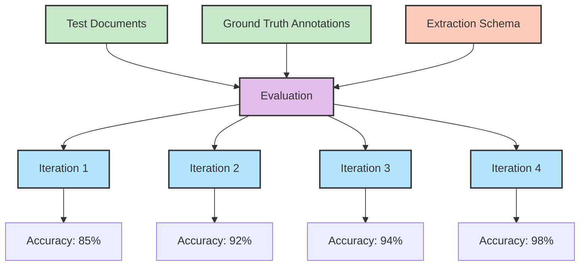

Evaluations provide a systematic way to **test and validate your extraction schemas** against known ground truth data. Think of it as unit testing for document AI—you can measure accuracy, compare different models, and optimize your extraction pipelines with confidence.

An evaluation consists of **documents with annotations** (your test data), **iterations** (test runs with different settings), and a **schema** (what you want to extract). This structure lets you run A/B tests between models and systematically improve your document processing accuracy.




## How it works

1. **Create an evaluation** with your extraction schema
2. **Upload test documents** with manually verified ground truth annotations
3. **Run iterations** with different model settings (GPT-4o vs GPT-4o-mini, consensus, etc.)
4. **Compare results** to find the optimal configuration for your use case

Retab automatically calculates accuracy metrics by comparing each iteration's output against your ground truth annotations, giving you objective performance measurements.

## Schema Optimization Through Evaluations

One of the most powerful features of evaluations is **schema refinement**. When you see poor accuracy on specific fields, you can:

- **Improve descriptions**: Make field descriptions more specific and unambiguous
- **Add reasoning prompts**: Use `X-ReasoningPrompt` for complex calculations or logic
- **Refine field types**: Adjust data types based on extraction patterns

<CodeGroup>

```json Before: Vague Schema
{
  "type": "object",
  "properties": {
    "amount": {
      "type": "number",
      "description": "The amount"
    },
    "date": {
      "type": "string", 
      "description": "The date"
    }
  }
}
```

```json After: Optimized Schema
{
  "type": "object",
  "properties": {
    "amount": {
      "type": "number",
      "description": "Total invoice amount in USD, excluding taxes",
      "X-ReasoningPrompt": "If multiple amounts are present, identify the final total. If currency conversion is needed, show the calculation."
    },
    "date": {
      "type": "string",
      "format": "date", 
      "description": "Invoice issue date in YYYY-MM-DD format"
    }
  }
}
```

</CodeGroup>

**The evaluation workflow for schema optimization:**
1. Run initial evaluation → identify low-accuracy fields
2. Refine descriptions and add reasoning prompts → re-run evaluation  
3. Compare accuracy improvements → iterate until satisfied
4. Deploy optimized schema to production

---

## Quick Start
<Tip>
While you can create evaluations programmatically with the SDK, we recommend using the [Retab platform](https://retab.com) for evaluation management. The web interface provides powerful schema editing tools, visual result comparisons, and collaborative features that make optimization much easier.
</Tip>


Let's create an evaluation for invoice processing:

<CodeGroup>

```python Step 1: Create Evaluation
from retab import Retab

client = Retab()

# Define what you want to extract
invoice_schema = {
    "type": "object",
    "properties": {
        "invoice_number": {"type": "string"},
        "total_amount": {"type": "number"},
        "vendor_name": {"type": "string"},
        "invoice_date": {"type": "string"}
    },
    "required": ["invoice_number", "total_amount", "vendor_name"]
}

evaluation = client.evaluations.create(
    name="Invoice Processing Test",
    json_schema=invoice_schema
)
```

```python Step 2: Add Test Documents
# Upload documents with ground truth annotations
client.evaluations.documents.create(
    evaluation_id=evaluation.id,
    document="test_invoice_1.pdf",
    annotation={
        "invoice_number": "INV-2024-001",
        "total_amount": 1250.00,
        "vendor_name": "Acme Corp",
        "invoice_date": "2024-01-15"
    }
)

client.evaluations.documents.create(
    evaluation_id=evaluation.id,
    document="test_invoice_2.pdf", 
    annotation={
        "invoice_number": "INV-2024-002",
        "total_amount": 850.75,
        "vendor_name": "Beta Industries",
        "invoice_date": "2024-01-16"
    }
)
```

```python Step 3: Run Iterations
# Test different model configurations
iteration_mini = client.evaluations.iterations.create(
    evaluation_id=evaluation.id,
    model="gpt-4o-mini",
    temperature=0.0
)

iteration_4o = client.evaluations.iterations.create(
    evaluation_id=evaluation.id,
    model="gpt-4o", 
    temperature=0.0
)

iteration_consensus = client.evaluations.iterations.create(
    evaluation_id=evaluation.id,
    model="gpt-4o-mini",
    temperature=0.2,
    n_consensus=3
)

# Process all documents
client.evaluations.iterations.process(
    evaluation_id=evaluation.id,
    iteration_id=iteration_mini.id
)
```

```python Step 4: Compare Results
# Get performance metrics
evaluation = client.evaluations.get(evaluation.id)

for iteration in evaluation.iterations:
    print(f"Model: {iteration.inference_settings.model}")
    print(f"Accuracy: {iteration.metrics.overall_accuracy:.1%}")
    print(f"Cost per document: ${iteration.avg_cost:.4f}")
    print("---")
```

</CodeGroup>

---

## Key Benefits

1. **Objective Measurement**: Get precise accuracy scores instead of subjective assessments
2. **Model Comparison**: Test GPT-4o vs GPT-4o-mini vs consensus to find the best fit
3. **Schema Validation**: Identify which fields are hardest to extract accurately
4. **Cost Optimization**: Balance accuracy against processing costs for your use case

## Best Practices

- **Diverse Test Data**: Include various document formats, qualities, and edge cases
- **Sufficient Volume**: Use at least 10-20 test documents for reliable metrics
- **Regular Testing**: Re-run evaluations when updating schemas or switching models
- **Ground Truth Quality**: Double-check your annotations—bad ground truth leads to misleading results

## Integration

Evaluations work seamlessly with other Retab features:
- Test [Reasoning](reasoning) prompts to improve calculation accuracy
- Validate [Processor](processors) configurations before production deployment  
- Use [Consensus](k-llms-consensus) in iterations for higher reliability

Please check the [API Reference](https://docs.retab.com/api-reference/evaluations/create) for complete method documentation.

