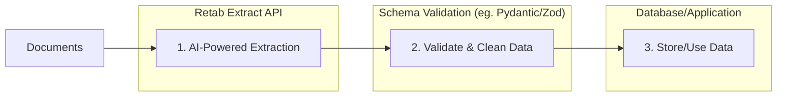

---

## title: Extraction

---

### Introduction

The `extract` method in Retab's document processing pipeline uses AI models to extract structured data from any document based on a provided JSON schema. This endpoint is ideal for automating data extraction tasks, such as pulling key information from invoices, forms, receipts, images, or scanned documents, for use in workflows like data entry automation, analytics, or integration with databases and applications.

The typical extraction workflow follows these steps:

1. **Schema Definition**: Define a JSON schema that describes the structure of the data you want to extract.
2. **Extraction**: Use Retab's `extract` method to process the document and retrieve structured data.
3. **Validation & Usage**: Validate the extracted data (optionally using likelihood scores) and integrate it into your application.

For advanced validation or post-processing, **we recommend** combining this with schema validation libraries like Pydantic (Python) or Zod (JavaScript) to ensure data integrity.



Unlike the `parse` method that focuses on raw text extraction, `extract` provides:
- **Structured Output**: Data extracted directly into JSON format matching your schema.
- **AI-Powered Inference**: Handles complex layouts, handwritten text, and contextual understanding.
- **Modality Support**: Works with text, images, or native document formats.
- **Consensus Mode**: Optional multi-run consensus for higher accuracy on ambiguous documents.
- **Likelihood Scores**: Provides confidence scores for each extracted field.
- **Batch Processing Ready**: Efficient for high-volume extraction tasks.

## Extract API

<ParamField body="ExtractRequest" type="ExtractRequest">
  <Expandable title="properties">

<ParamField body="document" type="string | object" required>
  The document to extract from. Can be a file path (string), or an object with `filename` (string) and `url` (string, e.g., base64-encoded data).
</ParamField>

<ParamField body="model" type="string" required>
  The AI model to use for extraction. Examples: `retab-small` for balanced accuracy and speed.
</ParamField>

<ParamField body="json_schema" type="object" required>
  The JSON schema defining the structure of the extracted data. Includes properties, required fields, and optional `X-SystemPrompt` for custom instructions.
</ParamField>


<ParamField body="image_resolution_dpi" type="integer" default="192">
  The DPI of the image sent to the LLM. Defaults to 192.
</ParamField>

<ParamField body="chunking_keys" type="dict[str, str] | None" default="None">
  If set, keys to be used for the extraction of long lists of data using Parallel OCR. Defaults to None.
</ParamField>

<ParamField body="metadata" type="dict[str, str]" default="{}">
  User-defined metadata to associate with this extraction. Defaults to {}.
</ParamField>

<ParamField body="n_consensus" type="integer" default="1">
  Number of consensus runs. Set to >1 for multi-run averaging to improve accuracy on uncertain extractions (increases cost).
</ParamField>

<ParamField body="additional_messages" type="list[ChatCompletionRetabMessage]" default="null">
  Additional chat messages to append after the document content. Useful for providing extra context, clarifications, or specific instructions that guide the extraction. Each message should have a `role` ("user" or "assistant") and `content` (string or array of content parts).
</ParamField>

  </Expandable>
</ParamField>

<ResponseField name="Returns" type="ParsedChatCompletion">
A ParsedChatCompletion object with the extracted data, usage details, and confidence scores.
  <Expandable title="properties">
    <ResponseField name="content" type="object">
      The core response content, including the OpenAI-compatible chat completion structure.
      <Expandable title="properties">
        <ResponseField name="id" type="string">
          Unique identifier for the completion.
        </ResponseField>
        <ResponseField name="choices" type="array[object]">
          Array of completion choices, typically containing one object with the extracted message.
        </ResponseField>
        <ResponseField name="created" type="integer">
          Timestamp of creation (Unix epoch).
        </ResponseField>
        <ResponseField name="model" type="string">
          The model used for extraction.
        </ResponseField>
        <ResponseField name="object" type="string">
          Object type, e.g., "chat.completion".
        </ResponseField>
        <ResponseField name="service_tier" type="string">
          Service tier used.
        </ResponseField>
        <ResponseField name="system_fingerprint" type="string">
          System fingerprint for tracking.
        </ResponseField>
        <ResponseField name="usage" type="object">
          Token usage details.
        </ResponseField>
        <ResponseField name="likelihoods" type="object">
          Confidence scores for each extracted field (0-1 scale).
        </ResponseField>
      </Expandable>
    </ResponseField>
    <ResponseField name="error" type="object | null">
      Error details if the request failed, otherwise null.
    </ResponseField>
  </Expandable>
</ResponseField>

<CodeGroup>
```python Python
from retab import Retab

client = Retab()

# doc_msg = client.documents.extractions.stream(...) for stream mode
doc_msg = client.documents.extract(
    document = "freight/booking_confirmation.jpg", 
    model="retab-small",
    json_schema = {
      'X-SystemPrompt': 'You are a useful assistant.',
      'properties': {
          'name': {
              'description': 'The name of the calendar event.',
              'title': 'Name',
              'type': 'string'
          },
          'date': {
              'description': 'The date of the calendar event in ISO 8601 format.',
              'title': 'Date',
              'type': 'string'
          }
      },
      'required': ['name', 'date'],
      'title': 'CalendarEvent',
      'type': 'object'
    },
    n_consensus=1 # 1 means disabled (default), if greater than 1 it will run the extraction with n-consensus mode
)
```
```javascript Javascript
import { Retab } from '@retab/node';

const client = new Retab();

// const docMsg = await client.documents.extractions.stream(...) for stream mode
const docMsg = await client.documents.extract({
    document: "freight/booking_confirmation.jpg",
    model: "retab-small",
    json_schema: {
        "X-SystemPrompt": "You are a useful assistant.",
        properties: {
            name: {
                description: "The name of the calendar event.",
                title: "Name",
                type: "string"
            },
            date: {
                description: "The date of the calendar event in ISO 8601 format.",
                title: "Date",
                type: "string"
            }
        },
        required: ["name", "date"],
        title: "CalendarEvent",
        type: "object"
    },
    n_consensus: 1 // 1 means disabled (default), if greater than 1 it will run the extraction with n-consensus mode
});
```
```curl cURL
curl -X POST https://api.retab.com/v1/documents/extract \
-H "Authorization: Bearer $RETAB_API_KEY" \
-H "Content-Type: application/json" \
-d '{
    "document": {
      "filename": "Alphabet-10Q-Q1-25.pdf",
      "url": "data:application/pdf;base64,JVBERi0xLjQKJfbk/N8KMSAwIG9iago8PAovVHlwZS…"
    },
    "model": "retab-small",
    "json_schema": {
        "X-SystemPrompt": "You are a useful assistant.",
        "properties": {
            "name": {
                "description": "The name of the calendar event.",
                "title": "Name",
                "type": "string"  
            },
            "date": {
                "description": "The date of the calendar event in ISO 8601 format.",
                "title": "Date",
                "type": "string"
            }
        },  
        "required": ["name", "date"],
        "title": "CalendarEvent",
        "type": "object"
    },
    "n_consensus": 1
}
```
```json Response
{
    "content": {
        "id": "chatcmpl-AoBs45TNWTB1VKGSXV7NAwCnxMaNN",
        "choices": [
            {
                "finish_reason": "stop",
                "index": 0,
                "logprobs": null,
                "message": {
                    "content": "{\"name\": \"Confirmation d'affr\\u00e9tement\", \"date\": \"2024-11-08\"}",
                    "refusal": null,
                    "role": "assistant",
                    "audio": null,
                    "function_call": null,
                    "tool_calls": [],
                    "parsed": {
                        "name": "Confirmation d'affr\u00e9tement",
                        "date": "2024-11-08"
                    }
                }
            }
        ],
        "created": 1736525396,
        "model": "retab-small",
        "object": "chat.completion",
        "service_tier": "default",
        "system_fingerprint": "fp_f2cd28694a",
        "usage": {
            "completion_tokens": 20,
            "prompt_tokens": 2760,
            "total_tokens": 2780,
            "completion_tokens_details": {
                "accepted_prediction_tokens": 0,
                "audio_tokens": 0,
                "reasoning_tokens": 0,
                "rejected_prediction_tokens": 0
            },
            "prompt_tokens_details": {
                "audio_tokens": 0,
                "cached_tokens": 0
            }
        },
        "likelihoods": {
            "name": 0.7227993785831323,
            "date": 0.7306298416895017
        },
    },
    "error": null
}
```
</CodeGroup>

## Use Case: Extracting Event Information from Documents

Extract structured calendar event data from a booking confirmation image and validate confidence scores before saving to a database.

<CodeGroup>
```python Python
from retab import Retab
from pydantic import BaseModel, ValidationError

client = Retab()

# Define Pydantic model matching the schema for validation
class CalendarEvent(BaseModel):
    name: str
    date: str  # ISO 8601

# Extract data
result = client.documents.extract(
    document="freight/booking_confirmation.jpg",
    model="retab-small",
    json_schema={
        'X-SystemPrompt': 'You are a useful assistant.',
        'properties': {
            'name': {
                'description': 'The name of the calendar event.',
                'title': 'Name',
                'type': 'string'
            },
            'date': {
                'description': 'The date of the calendar event in ISO 8601 format.',
                'title': 'Date',
                'type': 'string'
            }
        },
        'required': ['name', 'date'],
        'title': 'CalendarEvent',
        'type': 'object'
    },
    n_consensus=1
)

# Access extracted data
extracted_data = result.content.choices[0].message.parsed
likelihoods = result.content.likelihoods

# Validate with Pydantic
try:
    event = CalendarEvent(**extracted_data)
    print(f"Extracted Event: {event.name} on {event.date}")
    
    # Check confidence
    if all(score > 0.7 for score in likelihoods.values()):
        print("High confidence extraction - Saving to DB...")
        # db.save(event)  # Pseudo-code for DB integration
    else:
        print("Low confidence - Review manually")
except ValidationError as e:
    print(f"Validation failed: {e}")

print(f"Processed with {result.content.usage.total_tokens} tokens")
```

```javascript Javascript
import { Retab } from '@retab/node';
import { z } from 'zod';

const client = new Retab();

// Define Zod schema for validation
const CalendarEventSchema = z.object({
    name: z.string(),
    date: z.string().refine((val) => {
        return /^\d{4}-\d{2}-\d{2}$/.test(val);  // Basic ISO date check
    }, { message: "Invalid ISO 8601 date" })
});

// Extract data
const result = await client.documents.extract({
    document: "freight/booking_confirmation.jpg",
    model: "retab-small",
    json_schema: {
        "X-SystemPrompt": "You are a useful assistant.",
        properties: {
            name: {
                description: "The name of the calendar event.",
                title: "Name",
                type: "string"
            },
            date: {
                description: "The date of the calendar event in ISO 8601 format.",
                title: "Date",
                type: "string"
            }
        },
        required: ["name", "date"],
        title: "CalendarEvent",
        type: "object"
    },
    n_consensus: 1
});

// Access extracted data
const extractedData = result.content.choices[0].message.parsed;
const likelihoods = result.content.likelihoods;

// Validate with Zod
const validation = CalendarEventSchema.safeParse(extractedData);
if (validation.success) {
    const event = validation.data;
    console.log(`Extracted Event: ${event.name} on ${event.date}`);
    
    // Check confidence
    const minScore = Math.min(...Object.values(likelihoods));
    if (minScore > 0.7) {
        console.log("High confidence extraction - Saving to DB...");
        // db.save(event);  // Pseudo-code for DB integration
    } else {
        console.log("Low confidence - Review manually");
    }
} else {
    console.log("Validation failed:", validation.error);
}

console.log(`Processed with ${result.content.usage.total_tokens} tokens`);
```
</CodeGroup>

## Use Case: Using Additional Messages for Context

Use `additional_messages` to provide extra context or specific instructions that help guide the extraction. This is useful when you need to clarify ambiguous fields, provide domain-specific knowledge, or correct the model's behavior.

<CodeGroup>
```python Python
from retab import Retab

client = Retab()

# Extract invoice data with additional context
result = client.documents.extract(
    document="invoices/invoice_001.pdf",
    model="retab-small",
    json_schema={
        'properties': {
            'vendor_name': {'type': 'string', 'description': 'Name of the vendor'},
            'invoice_number': {'type': 'string', 'description': 'Invoice number'},
            'total_amount': {'type': 'number', 'description': 'Total amount due'},
            'currency': {'type': 'string', 'description': 'Currency code (e.g., USD, EUR)'}
        },
        'required': ['vendor_name', 'invoice_number', 'total_amount'],
        'type': 'object'
    },
    additional_messages=[
        {
            "role": "user", 
            "content": "Note: This invoice is from our European supplier. Amounts should be in EUR unless explicitly stated otherwise."
        },
        {
            "role": "user",
            "content": [
                {
                    "type": "image_url",
                    "image_url": {
                        "url": "https://www.example.com/logo.png"
                    }
                }
            ]
        }
    ]
)

print(result.choices[0].message.parsed)
```

```javascript Javascript
import { Retab } from '@retab/node';

const client = new Retab();

// Extract invoice data with additional context
const result = await client.documents.extract({
    document: "invoices/invoice_001.pdf",
    model: "retab-small",
    json_schema: {
        properties: {
            vendor_name: { type: "string", description: "Name of the vendor" },
            invoice_number: { type: "string", description: "Invoice number" },
            total_amount: { type: "number", description: "Total amount due" },
            currency: { type: "string", description: "Currency code (e.g., USD, EUR)" }
        },
        required: ["vendor_name", "invoice_number", "total_amount"],
        type: "object"
    },
    additional_messages: [
        {
            role: "user",
            content: "Note: This invoice is from our European supplier. Amounts should be in EUR unless explicitly stated otherwise."
        },
        {
            role: "assistant",
            content: "Understood. I will default to EUR for currency unless the document specifies a different currency."
        }
    ]
});

console.log(result.choices[0].message.parsed);
```

```curl cURL
curl -X POST https://api.retab.com/v1/documents/extract \
-H "Authorization: Bearer $RETAB_API_KEY" \
-H "Content-Type: application/json" \
-d '{
    "document": {
      "filename": "invoice_001.pdf",
      "url": "data:application/pdf;base64,..."
    },
    "model": "retab-small",
    "json_schema": {
        "properties": {
            "vendor_name": {"type": "string", "description": "Name of the vendor"},
            "invoice_number": {"type": "string", "description": "Invoice number"},
            "total_amount": {"type": "number", "description": "Total amount due"},
            "currency": {"type": "string", "description": "Currency code (e.g., USD, EUR)"}
        },
        "required": ["vendor_name", "invoice_number", "total_amount"],
        "type": "object"
    },
    "additional_messages": [
        {
            "role": "user",
            "content": "Note: This invoice is from our European supplier. Amounts should be in EUR unless explicitly stated otherwise."
        },
        {
            "role": "assistant", 
            "content": "Understood. I will default to EUR for currency unless the document specifies a different currency."
        }
    ]
}'
```
</CodeGroup>

## Metadata Filters

Use `metadata` at extraction time to tag each document with stable identifiers, then filter those extractions later using the same keys.

This is especially important in multi-tenant systems: always include stable tenant-scoping metadata keys to avoid cross-tenant contamination.

### 1. Tag the extraction request with metadata

<CodeGroup>
```python Python
from retab import Retab

client = Retab()

result = client.documents.extract(
    document="freight/booking_confirmation.jpg",
    model="retab-small",
    json_schema=my_schema,
    metadata={
        "organization_id": "org_123",
        "source": "sinari_jobs",
        "project_id": "project_abc",
    },
)
```

```javascript JavaScript
import { Retab } from "@retab/node";

const client = new Retab();

const result = await client.documents.extract({
  document: "freight/booking_confirmation.jpg",
  model: "retab-small",
  json_schema: mySchema,
  metadata: {
    organization_id: "org_123",
    source: "sinari_jobs",
    project_id: "project_abc",
  },
});
```
</CodeGroup>

### 2. Filter extractions by metadata

<CodeGroup>
```python Python
from retab import Retab

client = Retab()

tenant_extractions = client.extractions.list(
    limit=50,
    metadata={
        "organization_id": "org_123",
        "source": "sinari_jobs",
    },
)
```

```javascript JavaScript
import { Retab } from "@retab/node";

const client = new Retab();

const tenantExtractions = await client.extractions.list({
  limit: 50,
  metadata: {
    organization_id: "org_123",
    source: "sinari_jobs",
  },
});
```

```curl cURL
curl -G 'https://api.retab.com/v1/extractions' \
  -H 'Authorization: Bearer $RETAB_API_KEY' \
  --data-urlencode 'limit=50' \
  --data-urlencode 'metadata={"organization_id":"org_123","source":"sinari_jobs"}'
```
</CodeGroup>

When multiple metadata keys are provided, all keys are applied together as exact-match filters.

## Best Practices

### Model Selection
- **`retab-large`**: Use for complex documents requiring deep contextual understanding.
- **`retab-small`**: Balanced for accuracy and cost, recommended for most extraction tasks.
- **`retab-micro`**: Faster and cheaper for simple extractions or high-volume processing.

### Schema Design
- Keep schemas concise: Only include required fields to improve extraction accuracy.
- Use descriptive `description` fields: Helps the AI model understand what to extract.
- Add `X-SystemPrompt` for custom guidance: E.g., "Focus on freight details" for domain-specific extractions.

### Confidence Handling
- Set a threshold (e.g., 0.7) for automated processing.
- For critical tasks, enable `n_consensus > 1` to average results and boost reliability.

### Using Additional Messages
- Use `additional_messages` to provide domain-specific context or clarifications.
- Simulate a conversation: Add a user message with context, then an assistant acknowledgment to prime the model.
- Ideal for: currency defaults, date format preferences, handling ambiguous abbreviations, or specifying regional conventions.
- Keep messages concise to avoid diluting the extraction focus.

```python
# Create messages from a reference document

# Use those messages as additional context for extraction
result = client.documents.extract(
    document="invoices/invoice_001.pdf",
    json_schema=my_schema,
    model="retab-small",
    additional_messages=[{
        "role": "user",
        "content": "Note: This invoice is from our European supplier. Amounts should be in EUR unless explicitly stated otherwise."
    }]
)
```
