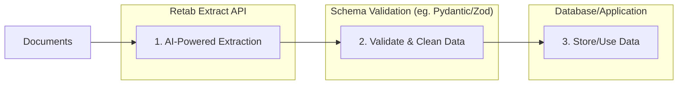

---

## title: Extraction

---

### Introduction

The `extractions.create` method in Retab's document processing pipeline uses AI models to extract structured data from any document based on a provided JSON schema. This endpoint is ideal for automating data extraction tasks, such as pulling key information from invoices, forms, receipts, images, or scanned documents, for use in workflows like data entry automation, analytics, or integration with databases and applications.

The typical extraction workflow follows these steps:

1. **Schema Definition**: Define a JSON schema that describes the structure of the data you want to extract.
2. **Extraction**: Call `client.extractions.create(...)` to process the document and retrieve structured data.
3. **Validation & Usage**: Validate the extracted data (optionally using likelihood scores) and integrate it into your application.

The SDKs already help here:

- Python parses `message.parsed` against the JSON schema you pass in
- Node accepts a JSON schema object, a schema file path, or a `zod` schema directly

You can still add your own application-level validation if you want stricter business rules.


```mermaid
flowchart LR
    A[Documents] --> B
    
    subgraph Retab["Retab Extract API"]
    B[1. AI-Powered Extraction]
    end
    
    B --> C
    
    subgraph Validation["Schema Validation (eg. Pydantic/Zod)"]
        C[2. Validate & Clean Data]
    end
    
    C --> D

    subgraph Application["Database/Application"]
        D[3. Store/Use Data]
    end
```

Unlike the `parse` method that focuses on raw text extraction, `extract` provides:
- **Structured Output**: Data extracted directly into JSON format matching your schema.
- **AI-Powered Inference**: Handles complex layouts, handwritten text, and contextual understanding.
- **Modality Support**: Works with text, images, or native document formats.
- **Consensus Mode**: Optional multi-run consensus for higher accuracy on ambiguous documents.
- **Likelihood Scores**: Provides likelihood scores for each extracted field.
- **Batch Processing Ready**: Efficient for high-volume extraction tasks.

## Extract API

<ParamField body="ExtractionRequest" type="ExtractionRequest">
  <Expandable title="properties">

<ParamField body="document" type="string | object" required>
  The document to extract from. Can be a file path (string), or an object with `filename` (string) and `url` (string, e.g., base64-encoded data).
</ParamField>

<ParamField body="model" type="string" required>
  The AI model to use for extraction. Examples: `retab-small` for balanced accuracy and speed.
</ParamField>

<ParamField body="json_schema" type="object" required>
  The JSON schema defining the structure of the extracted data. Includes properties, required fields, and optional `X-SystemPrompt` for custom instructions.
</ParamField>


<ParamField body="image_resolution_dpi" type="integer" default="192">
  The DPI of the image sent to the LLM. Defaults to 192.
</ParamField>

<ParamField body="metadata" type="dict[str, str]" default="{}">
  User-defined metadata to associate with this extraction. Defaults to {}.
</ParamField>

<ParamField body="n_consensus" type="integer" default="1">
  Number of consensus runs. Set to >1 for multi-run averaging to improve accuracy on uncertain extractions (increases cost).
</ParamField>

<ParamField body="instructions" type="string | null" default="null">
  Free-form instructions appended to the system prompt to steer the extraction.
</ParamField>

  </Expandable>
</ParamField>

<ResponseField name="Returns" type="Extraction">
An `Extraction` record with the extracted data, usage details, consensus likelihoods, and a persisted `id`.
  <Expandable title="properties">
    <ResponseField name="id" type="string">
      Unique identifier for the stored extraction record.
    </ResponseField>
    <ResponseField name="output" type="object">
      The extracted structured data (parsed against your `json_schema`).
    </ResponseField>
    <ResponseField name="consensus" type="object">
      Consensus metadata. `consensus.likelihoods` holds per-field confidence scores (populated when `n_consensus > 1`).
    </ResponseField>
    <ResponseField name="usage" type="object">
      Token usage details.
    </ResponseField>
    <ResponseField name="file" type="object">
      Information about the extracted file.
    </ResponseField>
  </Expandable>
</ResponseField>

<CodeGroup>
```python Python
from retab import Retab
from retab.types.extractions import ExtractionRequest

client = Retab()

extraction = client.extractions.create(
    ExtractionRequest(
        document="freight/booking_confirmation.jpg",
        model="retab-micro",
        json_schema={
            'X-SystemPrompt': 'You are a useful assistant.',
            'properties': {
                'name': {
                    'description': 'The name of the calendar event.',
                    'title': 'Name',
                    'type': 'string'
                },
                'date': {
                    'description': 'The date of the calendar event in ISO 8601 format.',
                    'title': 'Date',
                    'type': 'string'
                }
            },
            'required': ['name', 'date'],
            'title': 'CalendarEvent',
            'type': 'object'
        },
        n_consensus=1,  # 1 means disabled (default); if > 1 the extraction runs in consensus mode
    )
)

print(extraction.output)
print(extraction.consensus.likelihoods)
print(extraction.id)
```
```javascript Javascript
import { Retab } from '@retab/node';

const client = new Retab({ apiKey: process.env.RETAB_API_KEY });

const extraction = await client.extractions.create({
    document: "freight/booking_confirmation.jpg",
    model: "retab-micro",
    json_schema: {
        "X-SystemPrompt": "You are a useful assistant.",
        properties: {
            name: {
                description: "The name of the calendar event.",
                title: "Name",
                type: "string"
            },
            date: {
                description: "The date of the calendar event in ISO 8601 format.",
                title: "Date",
                type: "string"
            }
        },
        required: ["name", "date"],
        title: "CalendarEvent",
        type: "object"
    },
    n_consensus: 1 // 1 means disabled (default); if > 1 the extraction runs in consensus mode
});

console.log(extraction.output);
console.log(extraction.consensus?.likelihoods);
console.log(extraction.id);
```
```curl cURL
curl -X POST https://api.retab.com/v1/extractions \
-H "Api-Key: $RETAB_API_KEY" \
-H "Content-Type: application/json" \
-d '{
    "document": {
      "filename": "Alphabet-10Q-Q1-25.pdf",
      "url": "data:application/pdf;base64,JVBERi0xLjQKJfbk/N8KMSAwIG9iago8PAovVHlwZS…"
    },
    "model": "retab-micro",
    "json_schema": {
        "X-SystemPrompt": "You are a useful assistant.",
        "properties": {
            "name": {
                "description": "The name of the calendar event.",
                "title": "Name",
                "type": "string"  
            },
            "date": {
                "description": "The date of the calendar event in ISO 8601 format.",
                "title": "Date",
                "type": "string"
            }
        },  
        "required": ["name", "date"],
        "title": "CalendarEvent",
        "type": "object"
    },
    "n_consensus": 1
}
```
```json Response
{
    "id": "extr_01HZX0ABCDEF123456",
    "file": {
        "filename": "booking_confirmation.jpg",
        "mime_type": "image/jpeg"
    },
    "model": "retab-micro",
    "json_schema": { "...": "..." },
    "n_consensus": 1,
    "output": {
        "name": "Confirmation d'affrètement",
        "date": "2024-11-08"
    },
    "consensus": {
        "choices": [],
        "likelihoods": {
            "name": 0.7227993785831323,
            "date": 0.7306298416895017
        }
    },
    "usage": {
        "completion_tokens": 20,
        "prompt_tokens": 2760,
        "total_tokens": 2780
    },
    "created_at": "2025-01-10T15:30:00Z"
}
```
</CodeGroup>

## Use Case: Extracting Event Information from Documents

Extract structured calendar event data from a booking confirmation image and validate likelihood scores before saving to a database.

<CodeGroup>
```python Python
from retab import Retab
from retab.types.extractions import ExtractionRequest

client = Retab()

# Extract data
result = client.extractions.create(
    ExtractionRequest(
        document="freight/booking_confirmation.jpg",
        model="retab-micro",
        json_schema={
            'X-SystemPrompt': 'You are a useful assistant.',
            'properties': {
                'name': {
                    'description': 'The name of the calendar event.',
                    'title': 'Name',
                    'type': 'string'
                },
                'date': {
                    'description': 'The date of the calendar event in ISO 8601 format.',
                    'title': 'Date',
                    'type': 'string'
                }
            },
            'required': ['name', 'date'],
            'title': 'CalendarEvent',
            'type': 'object'
        },
        n_consensus=1,
    )
)

extracted_data = result.output
likelihoods = (result.consensus.likelihoods or {}) if result.consensus else {}

print(f"Extracted Event: {extracted_data.get('name')} on {extracted_data.get('date')}")

if likelihoods and all(score > 0.7 for score in likelihoods.values()):
    print("High likelihood extraction - Saving to DB...")
else:
    print("Low likelihood - Review manually")

if result.usage:
    print(f"Processed with {result.usage.total_tokens} tokens")
```

```javascript Javascript
import { Retab } from '@retab/node';
import { z } from 'zod';

const client = new Retab({ apiKey: process.env.RETAB_API_KEY });

const CalendarEventSchema = z.object({
    name: z.string(),
    date: z.string().refine((val) => {
        return /^\d{4}-\d{2}-\d{2}$/.test(val);  // Basic ISO date check
    }, { message: "Invalid ISO 8601 date" })
});

// Extract data
const result = await client.extractions.create({
    document: "freight/booking_confirmation.jpg",
    model: "retab-micro",
    json_schema: CalendarEventSchema,
    n_consensus: 1
});

// Access extracted data
const extractedData = result.output;
const likelihoods = result.consensus?.likelihoods ?? {};

// Validate with Zod
const validation = CalendarEventSchema.safeParse(extractedData);
if (validation.success) {
    const event = validation.data;
    console.log(`Extracted Event: ${event.name} on ${event.date}`);

    // Check likelihoods
    const scores = Object.values(likelihoods);
    if (scores.length > 0 && Math.min(...scores) > 0.7) {
        console.log("High likelihood extraction - Saving to DB...");
        // db.save(event);  // Pseudo-code for DB integration
    } else {
        console.log("Low likelihood - Review manually");
    }
} else {
    console.log("Validation failed:", validation.error);
}

console.log(`Processed with ${result.usage?.total_tokens} tokens`);
```
</CodeGroup>

## Use Case: Passing Extra Instructions

Use `instructions` to provide a freeform note that guides the extraction — useful for iteration context from a loop, tenant-specific conventions, or any hint that isn't captured by the schema itself.

<CodeGroup>
```python Python
from retab import Retab
from retab.types.extractions import ExtractionRequest

client = Retab()

result = client.extractions.create(
    ExtractionRequest(
        document="invoices/invoice_001.pdf",
        model="retab-micro",
        json_schema={
            'properties': {
                'vendor_name': {'type': 'string', 'description': 'Name of the vendor'},
                'invoice_number': {'type': 'string', 'description': 'Invoice number'},
                'total_amount': {'type': 'number', 'description': 'Total amount due'},
                'currency': {'type': 'string', 'description': 'Currency code (e.g., USD, EUR)'}
            },
            'required': ['vendor_name', 'invoice_number', 'total_amount'],
            'type': 'object'
        },
        instructions=(
            "This invoice is from our European supplier. "
            "Amounts should be in EUR unless explicitly stated otherwise. "
            "Extract values exactly as written; do not infer a missing currency."
        ),
    )
)

print(result.output)
```

```javascript Javascript
import { Retab } from '@retab/node';

const client = new Retab({ apiKey: process.env.RETAB_API_KEY });

const result = await client.extractions.create({
    document: "invoices/invoice_001.pdf",
    model: "retab-micro",
    json_schema: {
        properties: {
            vendor_name: { type: "string", description: "Name of the vendor" },
            invoice_number: { type: "string", description: "Invoice number" },
            total_amount: { type: "number", description: "Total amount due" },
            currency: { type: "string", description: "Currency code (e.g., USD, EUR)" }
        },
        required: ["vendor_name", "invoice_number", "total_amount"],
        type: "object"
    },
    instructions: "This invoice is from our European supplier. Amounts should be in EUR unless explicitly stated otherwise. Extract values exactly as written; do not infer a missing currency."
});

console.log(result.output);
```

```curl cURL
curl -X POST https://api.retab.com/v1/extractions \
-H "Api-Key: $RETAB_API_KEY" \
-H "Content-Type: application/json" \
-d '{
    "document": {
      "filename": "invoice_001.pdf",
      "url": "data:application/pdf;base64,..."
    },
    "model": "retab-micro",
    "json_schema": {
        "properties": {
            "vendor_name": {"type": "string", "description": "Name of the vendor"},
            "invoice_number": {"type": "string", "description": "Invoice number"},
            "total_amount": {"type": "number", "description": "Total amount due"},
            "currency": {"type": "string", "description": "Currency code (e.g., USD, EUR)"}
        },
        "required": ["vendor_name", "invoice_number", "total_amount"],
        "type": "object"
    },
    "instructions": "This invoice is from our European supplier. Amounts should be in EUR unless explicitly stated otherwise."
}'
```
</CodeGroup>

## Metadata Filters

Use `metadata` at extraction time to tag each document with stable identifiers, then filter those extractions later using the same keys.

This is especially important in multi-tenant systems: always include stable tenant-scoping metadata keys to avoid cross-tenant contamination.

### 1. Tag the extraction request with metadata

<CodeGroup>
```python Python
from retab import Retab
from retab.types.extractions import ExtractionRequest

client = Retab()

result = client.extractions.create(
    ExtractionRequest(
        document="freight/booking_confirmation.jpg",
        model="retab-small",
        json_schema=my_schema,
        metadata={
            "organization_id": "org_123",
            "source": "sinari_jobs",
            "project_id": "project_abc",
        },
    )
)
```

```javascript JavaScript
import { Retab } from "@retab/node";

const client = new Retab();

const result = await client.extractions.create({
  document: "freight/booking_confirmation.jpg",
  model: "retab-small",
  json_schema: mySchema,
  metadata: {
    organization_id: "org_123",
    source: "sinari_jobs",
    project_id: "project_abc",
  },
});
```
</CodeGroup>

### 2. Filter extractions by metadata

<CodeGroup>
```python Python
from retab import Retab

client = Retab()

tenant_extractions = client.extractions.list(
    limit=50,
    metadata={
        "organization_id": "org_123",
        "source": "sinari_jobs",
    },
)
```

```javascript JavaScript
import { Retab } from "@retab/node";

const client = new Retab();

const tenantExtractions = await client.extractions.list({
  limit: 50,
  metadata: {
    organization_id: "org_123",
    source: "sinari_jobs",
  },
});
```

```curl cURL
curl -G 'https://api.retab.com/v1/extractions' \
  -H 'Api-Key: $RETAB_API_KEY' \
  --data-urlencode 'limit=50' \
  --data-urlencode 'metadata={"organization_id":"org_123","source":"sinari_jobs"}'
```
</CodeGroup>

When multiple metadata keys are provided, all keys are applied together as exact-match filters.

## Best Practices

### Model Selection
- **`retab-large`**: Use for complex documents requiring deep contextual understanding.
- **`retab-small`**: Balanced for accuracy and cost, recommended for most extraction tasks.
- **`retab-micro`**: Faster and cheaper for simple extractions or high-volume processing.

### Schema Design
- Keep schemas concise: Only include required fields to improve extraction accuracy.
- Use descriptive `description` fields: Helps the AI model understand what to extract.
- Add `X-SystemPrompt` for custom guidance: E.g., "Focus on freight details" for domain-specific extractions.

### Confidence Handling
- Set a threshold (e.g., 0.7) for automated processing.
- For critical tasks, enable `n_consensus > 1` to average results and boost reliability.

### Using Instructions
- Use `instructions` to pass domain-specific hints that aren't part of the schema.
- Ideal for: currency defaults, date format preferences, handling ambiguous abbreviations, or specifying regional conventions.
- Keep the string concise to avoid diluting the extraction focus.

```python
from retab.types.extractions import ExtractionRequest

result = client.extractions.create(
    ExtractionRequest(
        document="invoices/invoice_001.pdf",
        json_schema=my_schema,
        model="retab-small",
        instructions="This invoice is from our European supplier. Amounts should be in EUR unless explicitly stated otherwise.",
    )
)
```
