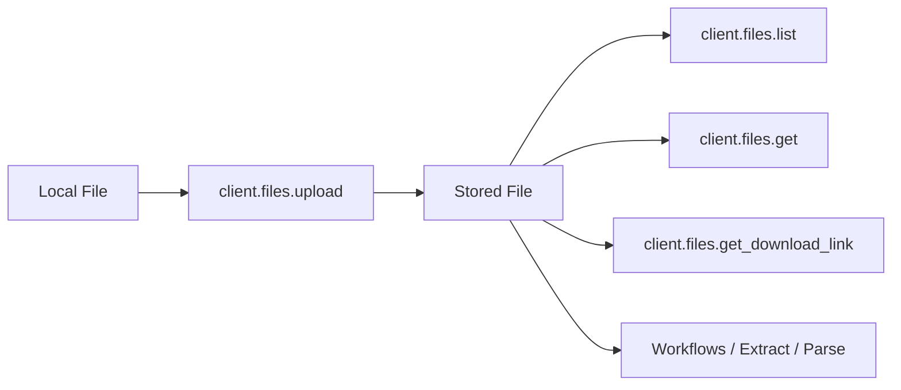

### Introduction

The Files API lets you upload, manage, and retrieve documents stored in Retab. Files are the foundation of document processing — once uploaded, a file can be referenced by ID across extractions and workflows without re-uploading.



The module exposes four methods:

| Method | Purpose |
| ------ | ------- |
| **`upload`** | Upload a document and receive a persistent `file_id` for future reference. |
| **`list`** | List uploaded files with pagination, filename prefix search, and MIME type filtering. |
| **`get`** | Retrieve metadata for a single file by ID. |
| **`get_download_link`** | Get a temporary signed URL (60 min) to download the original file. |

## Uploading files

SDK uploads use a direct-to-storage flow. The SDK first creates an upload session, uploads the bytes to the signed storage URL, then completes the upload and returns a durable Retab storage URL.

<CodeGroup>
```python Python
from retab import Retab
from pathlib import Path

client = Retab()

# Upload from a file path
response = client.files.upload(Path("invoice.pdf"))
print(f"File ID: {response.file_id}")
print(f"Storage URL: {response.storage_url}")
```

```javascript JavaScript
import Retab from 'retab';

const client = new Retab();

const response = await client.files.upload("invoice.pdf");

console.log(`File ID: ${response.fileId}`);
console.log(`Storage URL: ${response.storageUrl}`);
```

```bash cURL
SESSION=$(curl -s -X POST \
  'https://api.retab.com/v1/files/upload' \
  -H "Api-Key: $RETAB_API_KEY" \
  -H 'Content-Type: application/json' \
  -d '{
    "filename": "invoice.pdf",
    "content_type": "application/pdf",
    "size_bytes": 12345
  }')

UPLOAD_URL=$(echo "$SESSION" | jq -r '.uploadUrl')
FILE_ID=$(echo "$SESSION" | jq -r '.fileId')

curl -X PUT "$UPLOAD_URL" \
  -H 'Content-Type: application/pdf' \
  --data-binary '@invoice.pdf'

curl -X POST \
  "https://api.retab.com/v1/files/upload/$FILE_ID/complete" \
  -H "Api-Key: $RETAB_API_KEY" \
  -H 'Content-Type: application/json' \
  -d '{}'
```
</CodeGroup>

The returned `storage_url` / `storageUrl` has the form `https://storage.retab.com/file_...`. You can pass it as the `url` in `MIMEData` requests without sending the file bytes again.

## The file data structure

<ResponseField name="File Object" type="object">
  <Expandable title="properties">
    <ResponseField name="id" type="string">
      Unique file identifier, prefixed with `file_`.
    </ResponseField>
    <ResponseField name="object" type="string">
      Always `"file"`.
    </ResponseField>
    <ResponseField name="filename" type="string">
      The original filename of the uploaded document.
    </ResponseField>
    <ResponseField name="organization_id" type="string">
      The organization that owns this file.
    </ResponseField>
    <ResponseField name="page_count" type="integer | null">
      Number of pages in the document (if applicable).
    </ResponseField>
    <ResponseField name="created_at" type="string">
      ISO 8601 timestamp of when the file was uploaded.
    </ResponseField>
    <ResponseField name="updated_at" type="string">
      ISO 8601 timestamp of the last update.
    </ResponseField>
  </Expandable>
</ResponseField>

<CodeGroup>
```json File Object
{
  "id": "file_a1b2c3d4e5f6",
  "object": "file",
  "filename": "invoice.pdf",
  "organization_id": "org_abc123",
  "page_count": 3,
  "created_at": "2024-01-15T10:30:00Z",
  "updated_at": "2024-01-15T10:30:00Z"
}
```
</CodeGroup>

## Listing and filtering

Use `list` to browse uploaded files with cursor-based pagination:

<CodeGroup>
```python Python
# List recent files
files = client.files.list(limit=20)
for f in files:
    print(f"{f.id}: {f.filename}")

# Filter by filename prefix
pdfs = client.files.list(filename="invoice", mime_type="application/pdf")
```

```javascript JavaScript
const files = await client.files.list({ limit: 20 });
for (const f of files) {
    console.log(`${f.id}: ${f.filename}`);
}
```
</CodeGroup>

## Downloading files

Retrieve a time-limited signed URL to download the original file:

<CodeGroup>
```python Python
link = client.files.get_download_link("file_a1b2c3d4e5f6")
print(f"Download URL: {link.download_url}")
print(f"Expires in: {link.expires_in}")
```

```javascript JavaScript
const link = await client.files.getDownloadLink("file_a1b2c3d4e5f6");
console.log(`Download URL: ${link.downloadUrl}`);
console.log(`Expires in: ${link.expiresIn}`);
```
</CodeGroup>
