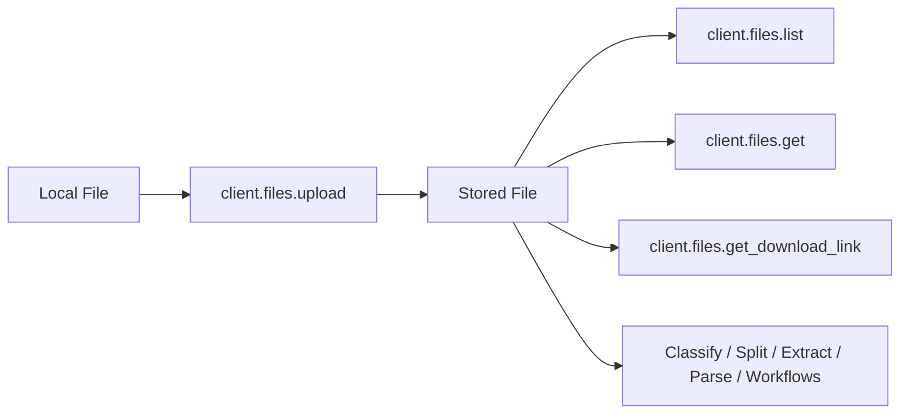

### Introduction

The Files API lets you upload, manage, and retrieve documents stored in Retab. Files are the foundation of document processing: once uploaded, a file can be reused across classify, split, extract, parse, and workflow calls without sending the bytes again.



The module exposes four methods:

| Method | Purpose |
| ------ | ------- |
| **`upload`** | Upload a document and receive a durable `MIMEData` reference for future requests. |
| **`list`** | List uploaded files with pagination, filename prefix search, and MIME type filtering. |
| **`get`** | Retrieve metadata for a single file by ID. |
| **`get_download_link`** | Get a temporary signed URL (60 min) to download the original file. |

## Uploading files

SDK uploads use a direct-to-storage flow. The SDK first creates an upload session, uploads the bytes to the signed storage URL, then completes the upload and returns `MIMEData`.

<CodeGroup>
```python Python
from retab import Retab
from pathlib import Path

client = Retab()

# Upload from a file path
mime_data = client.files.upload(Path("invoice.pdf"))
print(f"Filename: {mime_data.filename}")
print(f"URL: {mime_data.url}")
```

```javascript JavaScript
import { Retab } from '@retab/node';

const client = new Retab();

const mimeData = await client.files.upload("invoice.pdf");

console.log(`Filename: ${mimeData.filename}`);
console.log(`URL: ${mimeData.url}`);
```

```bash cURL
SESSION=$(curl -s -X POST \
  'https://api.retab.com/v1/files/upload' \
  -H "Api-Key: $RETAB_API_KEY" \
  -H 'Content-Type: application/json' \
  -d '{
    "filename": "invoice.pdf",
    "content_type": "application/pdf",
    "size_bytes": 12345
  }')

UPLOAD_URL=$(echo "$SESSION" | jq -r '.uploadUrl')
FILE_ID=$(echo "$SESSION" | jq -r '.fileId')

curl -X PUT "$UPLOAD_URL" \
  -H 'Content-Type: application/pdf' \
  --data-binary '@invoice.pdf'

curl -X POST \
  "https://api.retab.com/v1/files/upload/$FILE_ID/complete" \
  -H "Api-Key: $RETAB_API_KEY" \
  -H 'Content-Type: application/json' \
  -d '{}'
```
</CodeGroup>

The returned `url` has the form `https://storage.retab.com/file_...`. It is an opaque Retab URL, not a public signed URL, and can be passed to later processing requests without sending the file bytes again.

## Large documents: avoid inline uploads

When you pass a local file path directly to an SDK processing call, the SDK may send the document as inline MIME/base64 data. This is convenient for small files, but large scanned PDFs can make the request body too large and trigger `413 Request Entity Too Large`.

For large documents, use one of these URL-backed flows instead:

1. **Preferred: use your own object-storage URL.** Retab fetches the file server-side, so the document bytes are not sent inline in the API request. Use a time-limited signed URL when the object is private.
2. **Alternative: upload to Retab first.** The SDK uploads the file once, then you pass the returned Retab storage URL to classify, split, extract, parse, or workflow calls.

### Option 1: object-storage URL

Pass an HTTPS URL from object storage directly as the `document`.

Supported remote URL hosts include:

| Provider | Supported URL shape |
| -------- | ------------------- |
| Azure Blob Storage | `https://<account>.blob.core.windows.net/...` |
| Google Cloud Storage | `https://storage.googleapis.com/...` or `https://<bucket>.storage.googleapis.com/...` |
| Amazon S3 | `https://<bucket>.s3.<region>.amazonaws.com/...` or other `amazonaws.com` S3 URLs |
| Cloudflare R2 | `https://<account>.r2.cloudflarestorage.com/...` and public `https://<public-id>.r2.dev/...` URLs |

Custom domains are not fetched by default. Contact support if you need a custom storage hostname allowlisted. For private files, generate a signed URL with enough time for Retab to fetch the document.

<CodeGroup>
```python Python
from retab import Retab

client = Retab(api_key="YOUR_RETAB_API_KEY")

schema = {
    "type": "object",
    "properties": {
        "invoice_number": {"type": "string"},
        "total_amount": {"type": "number"},
    },
}

azure_blob_url = "https://<account>.blob.core.windows.net/<container>/large_document.pdf?<sas_token>"

extraction = client.extractions.create(
    document=azure_blob_url,
    model="retab-small",
    json_schema=schema,
)

print(extraction.output)
```

```javascript JavaScript
import { Retab } from '@retab/node';

const client = new Retab({ apiKey: process.env.RETAB_API_KEY });

const schema = {
    type: "object",
    properties: {
        invoice_number: { type: "string" },
        total_amount: { type: "number" },
    },
};

const cloudflareR2Url = "https://<public-id>.r2.dev/large_document.pdf";

const extraction = await client.extractions.create({
    document: cloudflareR2Url,
    model: "retab-small",
    json_schema: schema,
});

console.log(extraction.output);
```
</CodeGroup>

### Option 2: upload to Retab, then reuse the URL

If you do not have an object-storage URL available, upload the file to Retab first and use the returned `mime_ref.url`.

<CodeGroup>
```python Python
from retab import Retab

client = Retab(api_key="YOUR_RETAB_API_KEY")

mime_ref = client.files.upload("large_document.pdf")

extraction = client.extractions.create(
    document=mime_ref.url,
    model="retab-small",
    json_schema={
        "type": "object",
        "properties": {
            "invoice_number": {"type": "string"},
            "total_amount": {"type": "number"},
        },
    },
)
```

```javascript JavaScript
import { Retab } from '@retab/node';

const client = new Retab({ apiKey: process.env.RETAB_API_KEY });

const mimeRef = await client.files.upload("large_document.pdf");

const extraction = await client.extractions.create({
    document: mimeRef.url,
    model: "retab-small",
    json_schema: {
        type: "object",
        properties: {
            invoice_number: { type: "string" },
            total_amount: { type: "number" },
        },
    },
});
```
</CodeGroup>

You can also pass `document=mime_ref` directly. Passing `mime_ref.url` is equivalent for Retab storage URLs: the backend parses the file ID and resolves it against the authenticated caller's organization before processing.

### Security model

Signed object-storage URLs are bearer URLs controlled by you. Keep them time-limited and scoped to the single document being processed. Public object-storage URLs, such as public Cloudflare R2 `r2.dev` URLs, can also be fetched but are not access-restricted by the URL itself.

Retab storage URLs such as `https://storage.retab.com/file_...` are different: they are opaque Retab file references, not public download links. Retab resolves the file ID against the authenticated caller's organization. If the file is missing, belongs to another organization, or is not fully uploaded, the request is rejected.

## The file data structure

<ResponseField name="File Object" type="object">
  <Expandable title="properties">
    <ResponseField name="id" type="string">
      Unique file identifier, prefixed with `file_`.
    </ResponseField>
    <ResponseField name="object" type="string">
      Always `"file"`.
    </ResponseField>
    <ResponseField name="filename" type="string">
      The original filename of the uploaded document.
    </ResponseField>
    <ResponseField name="organization_id" type="string">
      The organization that owns this file.
    </ResponseField>
    <ResponseField name="page_count" type="integer | null">
      Number of pages in the document (if applicable).
    </ResponseField>
    <ResponseField name="created_at" type="string">
      ISO 8601 timestamp of when the file was uploaded.
    </ResponseField>
    <ResponseField name="updated_at" type="string">
      ISO 8601 timestamp of the last update.
    </ResponseField>
  </Expandable>
</ResponseField>

<CodeGroup>
```json File Object
{
  "id": "file_a1b2c3d4e5f6",
  "object": "file",
  "filename": "invoice.pdf",
  "organization_id": "org_abc123",
  "page_count": 3,
  "created_at": "2024-01-15T10:30:00Z",
  "updated_at": "2024-01-15T10:30:00Z"
}
```
</CodeGroup>

## Listing and filtering

Use `list` to browse uploaded files with cursor-based pagination:

<CodeGroup>
```python Python
# List recent files
files = client.files.list(limit=20)
for f in files:
    print(f"{f.id}: {f.filename}")

# Filter by filename prefix
pdfs = client.files.list(filename="invoice", mime_type="application/pdf")
```

```javascript JavaScript
const files = await client.files.list({ limit: 20 });
for (const f of files) {
    console.log(`${f.id}: ${f.filename}`);
}
```
</CodeGroup>

## Downloading files

Retrieve a time-limited signed URL to download the original file:

<CodeGroup>
```python Python
link = client.files.get_download_link("file_a1b2c3d4e5f6")
print(f"Download URL: {link.download_url}")
print(f"Expires in: {link.expires_in}")
```

```javascript JavaScript
const link = await client.files.getDownloadLink("file_a1b2c3d4e5f6");
console.log(`Download URL: ${link.downloadUrl}`);
console.log(`Expires in: ${link.expiresIn}`);
```
</CodeGroup>
