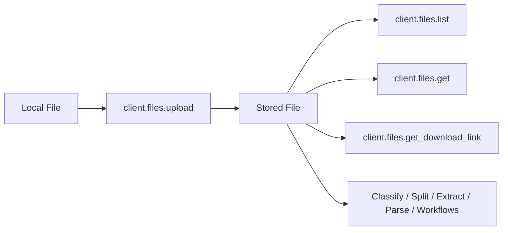

### Introduction

The Files API lets you upload, manage, and retrieve documents stored in Retab. Files are the foundation of document processing: once uploaded, a file can be reused across classify, split, extract, parse, and workflow calls without sending the bytes again.



The module exposes four methods:

| Method                  | Purpose                                                                               |
| ----------------------- | ------------------------------------------------------------------------------------- |
| **`upload`**            | Upload a document and receive a durable `MIMEData` reference for future requests.     |
| **`list`**              | List uploaded files with pagination, filename prefix search, and MIME type filtering. |
| **`get`**               | Retrieve metadata for a single file by ID.                                            |
| **`get_download_link`** | Get a temporary signed URL (60 min) to download the original file.                    |

## Uploading files

SDK uploads use a direct-to-storage flow. The SDK first creates an upload session, uploads the bytes to the signed storage URL, then completes the upload and returns `MIMEData`.

<CodeGroup>
```python Python
from retab import Retab
from pathlib import Path

client = Retab()

# Create an upload session for a local file.
invoice_path = Path("invoice.pdf")
session = client.files.create_upload(
    filename=invoice_path.name,
    size_bytes=invoice_path.stat().st_size,
    content_type="application/pdf",
)
mime_data = session.mime_data
print(f"Filename: {mime_data.filename}")
print(f"URL: {mime_data.url}")

````

```typescript TypeScript
import { Retab } from '@retab/node';

const client = new Retab({ apiKey: process.env.RETAB_API_KEY });

const mimeData = await client.files.complete_upload((await client.files.create_upload("invoice.pdf", 1024, "application/pdf")).fileId);

console.log(`Filename: ${mimeData.filename}`);
console.log(`URL: ${mimeData.url}`);
````

```go Go
package main

import (
	"context"
	"fmt"
	"log"
	"os"

	retab "github.com/retab-dev/retab/clients/go"
)

func main() {
	ctx := context.Background()

	client, err := retab.NewClient("")
	if err != nil {
		log.Fatal(err)
	}

	contentType := "application/pdf"
	info, err := os.Stat("invoice.pdf")
	if err != nil {
		log.Fatal(err)
	}

	session, err := client.Files.CreateUpload(ctx, &retab.FilesCreateUploadParams{
		Filename:    "invoice.pdf",
		SizeBytes:   int(info.Size()),
		ContentType: &contentType,
	})
	if err != nil {
		log.Fatal(err)
	}

	mimeData, err := client.Files.CompleteUpload(ctx, session.FileID, &retab.FilesCompleteUploadParams{})
	if err != nil {
		log.Fatal(err)
	}

	fmt.Printf("Filename: %s\n", mimeData.Filename)
	fmt.Printf("URL: %s\n", mimeData.URL)
}
```

```ruby Ruby
require 'retab'

client = Retab::Client.new

# 1. Create the upload session
path = 'invoice.pdf'
session = client.files.create_upload(
  filename: File.basename(path),
  size_bytes: File.size(path),
  content_type: 'application/pdf',
)

# 2. PUT the bytes to the signed storage URL
require 'net/http'
require 'uri'
uri = URI(session.upload_url)
http = Net::HTTP.new(uri.host, uri.port)
http.use_ssl = (uri.scheme == 'https')
request = Net::HTTP::Put.new(uri)
(session.upload_headers || { 'Content-Type' => 'application/pdf' }).each do |k, v|
  request[k] = v
end
request.body = File.binread(path)
http.request(request)

# 3. Finalize and receive the durable MimeData reference
mime_data = client.files.complete_upload(file_id: session.file_id)
puts "Filename: #{mime_data.filename}"
puts "URL: #{mime_data.url}"
```

```php PHP
<?php
require 'vendor/autoload.php';

use GuzzleHttp\Client as HttpClient;
use Retab\Client;

$client = new Client();

// 1. Create the upload session
$path = 'invoice.pdf';
$session = $client->files()->createUpload(
    filename: basename($path),
    sizeBytes: filesize($path),
    contentType: 'application/pdf',
);

// 2. PUT the bytes to the signed storage URL
(new HttpClient())->request(
    $session->uploadMethod ?? 'PUT',
    $session->uploadUrl,
    [
        'headers' => $session->uploadHeaders ?? ['Content-Type' => 'application/pdf'],
        'body' => fopen($path, 'rb'),
    ],
);

// 3. Finalize and receive the durable MimeData reference
$mimeData = $client->files()->completeUpload($session->fileId);
echo 'Filename: ' . $mimeData->filename . PHP_EOL;
echo 'URL: ' . $mimeData->url . PHP_EOL;
```

```rust Rust
use retab::models::{CompleteFileUploadRequest, UploadFileRequest};
use retab::resources::files::{CompleteUploadParams, CreateUploadParams};
use retab::Retab;
use std::fs;
use std::process::Command;

#[tokio::main]
async fn main() -> Result<(), Box<dyn std::error::Error>> {
    let client = Retab::new(std::env::var("RETAB_API_KEY")?);

    // 1. Create the upload session
    let path = "invoice.pdf";
    let bytes = fs::read(path)?;
    let mut upload_req = UploadFileRequest::new(path, bytes.len() as i64);
    upload_req.content_type = Some("application/pdf".into());

    let session = client
        .files()
        .create_upload(CreateUploadParams::new(upload_req))
        .await?;

    // 2. PUT the bytes to the signed storage URL
    let mut upload = Command::new("curl");
    upload
        .arg("-X")
        .arg("PUT")
        .arg(&session.upload_url)
        .arg("--data-binary")
        .arg(format!("@{path}"));
    if let Some(headers) = &session.upload_headers {
        for (k, v) in headers {
            upload.arg("-H").arg(format!("{k}: {v}"));
        }
    }
    let status = upload.status()?;
    if !status.success() {
        return Err("file upload failed".into());
    }

    // 3. Finalize and receive the durable MimeData reference
    let mime_data = client
        .files()
        .complete_upload(
            &session.file_id,
            CompleteUploadParams::new(CompleteFileUploadRequest::default()),
        )
        .await?;

    println!("Filename: {}", mime_data.filename);
    println!("URL: {}", mime_data.url);
    Ok(())
}
```

```java Java
import com.retab.RetabClient;

public final class Example {
  public static void main(String[] args) throws Exception {
    RetabClient client = new RetabClient(System.getenv("RETAB_API_KEY"));

    var session = client.files().createUpload("invoice.pdf", "application/pdf", 1024L, null);
    System.out.println(session);
  }
}
```

```curl cURL
SESSION=$(curl -s -X POST \
  'https://api.retab.com/v1/files/upload' \
  -H "Authorization: Bearer $RETAB_API_KEY" \
  -H 'Content-Type: application/json' \
  -d '{
    "filename": "invoice.pdf",
    "content_type": "application/pdf",
    "size_bytes": 12345
  }')

UPLOAD_URL=$(echo "$SESSION" | jq -r '.uploadUrl')
FILE_ID=$(echo "$SESSION" | jq -r '.fileId')

curl -X PUT "$UPLOAD_URL" \
  -H 'Content-Type: application/pdf' \
  --data-binary '@invoice.pdf'

curl -X POST \
  "https://api.retab.com/v1/files/upload/$FILE_ID/complete" \
  -H "Authorization: Bearer $RETAB_API_KEY" \
  -H 'Content-Type: application/json' \
  -d '{}'
```

```csharp C#
using System;
using System.IO;
using System.Net.Http;
using System.Threading.Tasks;
using Retab;
using RetabClient = Retab.Retab;

var client = new RetabClient("YOUR_API_KEY");

// 1. Create the upload session
var path = "invoice.pdf";
var bytes = await System.IO.File.ReadAllBytesAsync(path);
var session = await client.Files.CreateUploadAsync(
    new FilesCreateUploadOptions
    {
        Filename = Path.GetFileName(path),
        ContentType = "application/pdf",
        SizeBytes = bytes.LongLength,
    }
);

// 2. PUT the bytes to the signed storage URL
using var http = new HttpClient();
using var content = new ByteArrayContent(bytes);
content.Headers.Add("Content-Type", "application/pdf");
if (session.UploadHeaders != null)
{
    foreach (var kv in session.UploadHeaders)
    {
        content.Headers.TryAddWithoutValidation(kv.Key, kv.Value);
    }
}
var put = await http.PutAsync(session.UploadUrl, content);
put.EnsureSuccessStatusCode();

// 3. Finalize and receive the durable MimeData reference
var mimeData = await client.Files.CompleteUploadAsync(
    session.FileId,
    new FilesCompleteUploadOptions()
);
Console.WriteLine($"Filename: {mimeData.Filename}");
Console.WriteLine($"URL: {mimeData.Url}");
```

</CodeGroup>

The returned `url` has the form `https://storage.retab.com/file_...`. It is an opaque Retab URL, not a public signed URL, and can be passed to later processing requests without sending the file bytes again.

## Large documents: avoid inline uploads

When you pass a local file path directly to an SDK processing call, the SDK may send the document as inline MIME/base64 data. This is convenient for small files, but large scanned PDFs can make the request body too large and trigger `413 Request Entity Too Large`.

For large documents, use one of these URL-backed flows instead:

1. **Preferred: use your own object-storage URL.** Retab fetches the file server-side, so the document bytes are not sent inline in the API request. Use a time-limited signed URL when the object is private.
2. **Alternative: upload to Retab first.** The SDK uploads the file once, then you pass the returned Retab storage URL to classify, split, extract, parse, or workflow calls.

URL-backed remote documents are streamed into Retab storage and capped at 2 GiB (2,147,483,648 bytes) per document.

### Option 1: object-storage URL

Pass an HTTPS URL from object storage directly as the `document`.

Supported remote URL hosts include:

| Provider             | Supported URL shape                                                                               |
| -------------------- | ------------------------------------------------------------------------------------------------- |
| Azure Blob Storage   | `https://<account>.blob.core.windows.net/...`                                                     |
| Google Cloud Storage | `https://storage.googleapis.com/...` or `https://<bucket>.storage.googleapis.com/...`             |
| Amazon S3            | `https://<bucket>.s3.<region>.amazonaws.com/...` or other `amazonaws.com` S3 URLs                 |
| Cloudflare R2        | `https://<account>.r2.cloudflarestorage.com/...` and public `https://<public-id>.r2.dev/...` URLs |

Custom domains are not fetched by default. Contact support if you need a custom storage hostname allowlisted. For private files, generate a signed URL with enough time for Retab to fetch the document.

<CodeGroup>
```python Python
from retab import Retab

client = Retab(api_key="YOUR_RETAB_API_KEY")

schema = {
"type": "object",
"properties": {
"invoice_number": {"type": "string"},
"total_amount": {"type": "number"},
},
}

azure_blob_url = "https://<account>.blob.core.windows.net/<container>/large_document.pdf?<sas_token>"

extraction = client.extractions.create(
document=azure_blob_url,
model="retab-small",
json_schema=schema,
)

print(extraction.output)

````

```typescript TypeScript
import { Retab } from '@retab/node';

const client = new Retab({ apiKey: process.env.RETAB_API_KEY });

const schema = {
    type: "object",
    properties: {
        invoice_number: { type: "string" },
        total_amount: { type: "number" },
    },
};

const cloudflareR2Url = "https://<public-id>.r2.dev/large_document.pdf";

const extraction = await client.extractions.create(cloudflareR2Url, schema, "retab-small");

console.log(extraction.output);
````

```go Go
package main

import (
	"context"
	"fmt"
	"log"

	retab "github.com/retab-dev/retab/clients/go"
)

func main() {
	ctx := context.Background()

	client, err := retab.NewClient("YOUR_RETAB_API_KEY")
	if err != nil {
		log.Fatal(err)
	}

	schema := map[string]any{
		"type": "object",
		"properties": map[string]any{
			"invoice_number": map[string]any{"type": "string"},
			"total_amount":   map[string]any{"type": "number"},
		},
	}

	cloudflareR2URL := "https://<public-id>.r2.dev/large_document.pdf"

	model := "retab-small"
	extraction, err := client.Extractions.Create(ctx, &retab.ExtractionsCreateParams{
		Document:   cloudflareR2URL,
		Model:      &model,
		JSONSchema: schema,
	})
	if err != nil {
		log.Fatal(err)
	}

	fmt.Println(extraction.Output)
}
```

```ruby Ruby
require 'retab'

client = Retab::Client.new(api_key: 'YOUR_RETAB_API_KEY')

schema = {
  type: 'object',
  properties: {
    invoice_number: { type: 'string' },
    total_amount: { type: 'number' },
  },
}

cloudflare_r2_url = 'https://<public-id>.r2.dev/large_document.pdf'

extraction = client.extractions.create(
  document: cloudflare_r2_url,
  model: 'retab-small',
  json_schema: schema,
)

puts extraction.output
```

```php PHP
<?php
require 'vendor/autoload.php';

use Retab\Client;

$client = new Client(apiKey: 'YOUR_RETAB_API_KEY');

$schema = [
    'type' => 'object',
    'properties' => [
        'invoice_number' => ['type' => 'string'],
        'total_amount' => ['type' => 'number'],
    ],
];

$cloudflareR2Url = 'https://<public-id>.r2.dev/large_document.pdf';

$extraction = $client->extractions()->create(
    document: $cloudflareR2Url,
    jsonSchema: $schema,
    model: 'retab-small',
);

print_r($extraction->output);
```

```rust Rust
use retab::resources::extractions::CreateParams;
use retab::Retab;
use std::collections::HashMap;

#[tokio::main]
async fn main() -> Result<(), Box<dyn std::error::Error>> {
    let client = Retab::new(std::env::var("RETAB_API_KEY")?);

    let schema: HashMap<String, serde_json::Value> = serde_json::from_value(serde_json::json!({
        "type": "object",
        "properties": {
            "invoice_number": {"type": "string"},
            "total_amount": {"type": "number"}
        }
    }))?;

    let cloudflare_r2_url = "https://<public-id>.r2.dev/large_document.pdf";

    let mut params = CreateParams::new(cloudflare_r2_url, schema);
    params.body.model = Some("retab-small".into());

    let extraction = client.extractions().create(params).await?;
    println!("{:?}", extraction.output);
    Ok(())
}
```

```csharp C#
using System;
using System.Collections.Generic;
using System.Threading.Tasks;
using Retab;
using RetabClient = Retab.Retab;

var client = new RetabClient("YOUR_RETAB_API_KEY");

var schema = new Dictionary<string, object>
{
    ["type"] = "object",
    ["properties"] = new Dictionary<string, object>
    {
        ["invoice_number"] = new Dictionary<string, object> { ["type"] = "string" },
        ["total_amount"] = new Dictionary<string, object> { ["type"] = "number" },
    },
};

var cloudflareR2Url = new Uri("https://<public-id>.r2.dev/large_document.pdf");

var extraction = await client.Extractions.CreateAsync(
    new ExtractionsCreateOptions
    {
        Document = cloudflareR2Url,
        Model = "retab-small",
        JsonSchema = schema,
    }
);

foreach (var kv in extraction.Output)
{
    Console.WriteLine($"{kv.Key}: {kv.Value}");
}
```

```java Java
import com.retab.RetabClient;

public final class Example {
  public static void main(String[] args) throws Exception {
    RetabClient client = new RetabClient(System.getenv("RETAB_API_KEY"));

    var result = client.extractions().create(null, null, "retab-1.5", 10L, "Extract the invoice fields", 10L, null, null, null, null, null, null);
    System.out.println(result);
  }
}
```

</CodeGroup>

### Option 2: upload to Retab, then reuse the URL

If you do not have an object-storage URL available, upload the file to Retab first and use the returned `mime_ref.url`.

<CodeGroup>
```python Python
from retab import Retab

client = Retab(api_key="YOUR_RETAB_API_KEY")

session = client.files.create_upload(
    filename="large_document.pdf",
    size_bytes=12345,
    content_type="application/pdf",
)
mime_ref = session.mime_data

extraction = client.extractions.create(
document=mime_ref.url,
model="retab-small",
json_schema={
"type": "object",
"properties": {
"invoice_number": {"type": "string"},
"total_amount": {"type": "number"},
},
},
)

````

```typescript TypeScript
import { Retab } from '@retab/node';

const client = new Retab({ apiKey: process.env.RETAB_API_KEY });

const mimeRef = await client.files.complete_upload((await client.files.create_upload("large_document.pdf", 1024, "application/pdf")).fileId);

const extraction = await client.extractions.create(mimeRef.url, {
        type: "object",
        properties: {
            invoice_number: { type: "string" },
            total_amount: { type: "number" },
        },
    }, "retab-small");
````

```go Go
package main

import (
	"context"
	"log"
	"os"

	retab "github.com/retab-dev/retab/clients/go"
)

func main() {
	ctx := context.Background()

	client, err := retab.NewClient("YOUR_RETAB_API_KEY")
	if err != nil {
		log.Fatal(err)
	}

	contentType := "application/pdf"
	info, err := os.Stat("large_document.pdf")
	if err != nil {
		log.Fatal(err)
	}

	session, err := client.Files.CreateUpload(ctx, &retab.FilesCreateUploadParams{
		Filename:    "large_document.pdf",
		SizeBytes:   int(info.Size()),
		ContentType: &contentType,
	})
	if err != nil {
		log.Fatal(err)
	}

	mimeRef, err := client.Files.CompleteUpload(ctx, session.FileID, &retab.FilesCompleteUploadParams{})
	if err != nil {
		log.Fatal(err)
	}

	model := "retab-small"
	_, err = client.Extractions.Create(ctx, &retab.ExtractionsCreateParams{
		Document: mimeRef.URL,
		Model:    &model,
		JSONSchema: map[string]any{
			"type": "object",
			"properties": map[string]any{
				"invoice_number": map[string]any{"type": "string"},
				"total_amount":   map[string]any{"type": "number"},
			},
		},
	})
	if err != nil {
		log.Fatal(err)
	}
}
```

```ruby Ruby
require 'retab'
require 'net/http'
require 'uri'

client = Retab::Client.new(api_key: 'YOUR_RETAB_API_KEY')

path = 'large_document.pdf'
session = client.files.create_upload(
  filename: File.basename(path),
  size_bytes: File.size(path),
  content_type: 'application/pdf',
)

uri = URI(session.upload_url)
http = Net::HTTP.new(uri.host, uri.port)
http.use_ssl = (uri.scheme == 'https')
request = Net::HTTP::Put.new(uri)
(session.upload_headers || { 'Content-Type' => 'application/pdf' }).each do |k, v|
  request[k] = v
end
request.body = File.binread(path)
http.request(request)

mime_ref = client.files.complete_upload(file_id: session.file_id)

extraction = client.extractions.create(
  document: mime_ref.url,
  model: 'retab-small',
  json_schema: {
    type: 'object',
    properties: {
      invoice_number: { type: 'string' },
      total_amount: { type: 'number' },
    },
  },
)
```

```php PHP
<?php
require 'vendor/autoload.php';

use GuzzleHttp\Client as HttpClient;
use Retab\Client;

$client = new Client(apiKey: 'YOUR_RETAB_API_KEY');

$path = 'large_document.pdf';
$session = $client->files()->createUpload(
    filename: basename($path),
    sizeBytes: filesize($path),
    contentType: 'application/pdf',
);

(new HttpClient())->request(
    $session->uploadMethod ?? 'PUT',
    $session->uploadUrl,
    ['headers' => $session->uploadHeaders ?? ['Content-Type' => 'application/pdf'], 'body' => fopen($path, 'rb')],
);

$mimeRef = $client->files()->completeUpload($session->fileId);

$extraction = $client->extractions()->create(
    document: $mimeRef->url,
    jsonSchema: [
        'type' => 'object',
        'properties' => [
            'invoice_number' => ['type' => 'string'],
            'total_amount' => ['type' => 'number'],
        ],
    ],
    model: 'retab-small',
);
```

```rust Rust
use retab::models::{CompleteFileUploadRequest, UploadFileRequest};
use retab::resources::extractions::CreateParams as ExtractionCreateParams;
use retab::resources::files::{CompleteUploadParams, CreateUploadParams};
use retab::Retab;
use std::collections::HashMap;
use std::fs;
use std::process::Command;

#[tokio::main]
async fn main() -> Result<(), Box<dyn std::error::Error>> {
    let client = Retab::new(std::env::var("RETAB_API_KEY")?);

    let path = "large_document.pdf";
    let bytes = fs::read(path)?;
    let mut upload_req = UploadFileRequest::new(path, bytes.len() as i64);
    upload_req.content_type = Some("application/pdf".into());

    let session = client
        .files()
        .create_upload(CreateUploadParams::new(upload_req))
        .await?;

    let mut upload = Command::new("curl");
    upload
        .arg("-X")
        .arg("PUT")
        .arg(&session.upload_url)
        .arg("--data-binary")
        .arg(format!("@{path}"));
    if let Some(headers) = &session.upload_headers {
        for (k, v) in headers {
            upload.arg("-H").arg(format!("{k}: {v}"));
        }
    }
    let status = upload.status()?;
    if !status.success() {
        return Err("file upload failed".into());
    }

    let mime_ref = client
        .files()
        .complete_upload(
            &session.file_id,
            CompleteUploadParams::new(CompleteFileUploadRequest::default()),
        )
        .await?;

    let schema: HashMap<String, serde_json::Value> = serde_json::from_value(serde_json::json!({
        "type": "object",
        "properties": {
            "invoice_number": {"type": "string"},
            "total_amount": {"type": "number"}
        }
    }))?;

    let mut params = ExtractionCreateParams::new(mime_ref.url.as_str(), schema);
    params.body.model = Some("retab-small".into());

    let extraction = client.extractions().create(params).await?;
    println!("{:?}", extraction.output);
    Ok(())
}
```

```csharp C#
using System;
using System.Collections.Generic;
using System.IO;
using System.Net.Http;
using System.Threading.Tasks;
using Retab;
using RetabClient = Retab.Retab;

var client = new RetabClient("YOUR_RETAB_API_KEY");

// 1. Upload to Retab storage
var path = "large_document.pdf";
var bytes = await System.IO.File.ReadAllBytesAsync(path);
var session = await client.Files.CreateUploadAsync(
    new FilesCreateUploadOptions
    {
        Filename = Path.GetFileName(path),
        ContentType = "application/pdf",
        SizeBytes = bytes.LongLength,
    }
);

using var http = new HttpClient();
using var content = new ByteArrayContent(bytes);
content.Headers.Add("Content-Type", "application/pdf");
(await http.PutAsync(session.UploadUrl, content)).EnsureSuccessStatusCode();

var mimeRef = await client.Files.CompleteUploadAsync(
    session.FileId,
    new FilesCompleteUploadOptions()
);

// 2. Reuse the durable Retab URL on subsequent calls
var extraction = await client.Extractions.CreateAsync(
    new ExtractionsCreateOptions
    {
        Document = new Uri(mimeRef.Url),
        Model = "retab-small",
        JsonSchema = new Dictionary<string, object>
        {
            ["type"] = "object",
            ["properties"] = new Dictionary<string, object>
            {
                ["invoice_number"] = new Dictionary<string, object> { ["type"] = "string" },
                ["total_amount"] = new Dictionary<string, object> { ["type"] = "number" },
            },
        },
    }
);
```

```java Java
import com.retab.RetabClient;

public final class Example {
  public static void main(String[] args) throws Exception {
    RetabClient client = new RetabClient(System.getenv("RETAB_API_KEY"));

    var result = client.extractions().create(null, null, "retab-1.5", 10L, "Extract the invoice fields", 10L, null, null, null, null, null, null);
    System.out.println(result);
  }
}
```

</CodeGroup>

You can also pass `document=mime_ref` directly. Passing `mime_ref.url` is equivalent for Retab storage URLs: the backend parses the file ID and resolves it against the authenticated caller's organization before processing.

### Security model

Signed object-storage URLs are bearer URLs controlled by you. Keep them time-limited and scoped to the single document being processed. Public object-storage URLs, such as public Cloudflare R2 `r2.dev` URLs, can also be fetched but are not access-restricted by the URL itself.

Retab storage URLs such as `https://storage.retab.com/file_...` are different: they are opaque Retab file references, not public download links. Retab resolves the file ID against the authenticated caller's organization. If the file is missing, belongs to another organization, or is not fully uploaded, the request is rejected.

## The file data structure

<ResponseField name="File Object" type="object">
  <Expandable title="properties">
    <ResponseField name="id" type="string">
      Unique file identifier, prefixed with `file_`.
    </ResponseField>
    <ResponseField name="object" type="string">
      Always `"file"`.
    </ResponseField>
    <ResponseField name="filename" type="string">
      The original filename of the uploaded document.
    </ResponseField>
    <ResponseField name="page_count" type="integer | null">
      Number of pages in the document (if applicable).
    </ResponseField>
    <ResponseField name="created_at" type="string">
      ISO 8601 timestamp of when the file was uploaded.
    </ResponseField>
    <ResponseField name="updated_at" type="string">
      ISO 8601 timestamp of the last update.
    </ResponseField>
  </Expandable>
</ResponseField>

```json File Object
{
  "id": "file_a1b2c3d4e5f6",
  "object": "file",
  "filename": "invoice.pdf",
  "page_count": 3,
  "created_at": "2024-01-15T10:30:00Z",
  "updated_at": "2024-01-15T10:30:00Z"
}
```

## Listing and filtering

Use `list` to browse uploaded files with id-based pagination:

<CodeGroup>
```python Python
# List recent files
files = client.files.list(limit=20)
for f in files:
    print(f"{f.id}: {f.filename}")

# Filter by filename prefix

pdfs = client.files.list(filename="invoice", mime_type="application/pdf")

````

```typescript TypeScript
const files = await client.files.list({ limit: 20 });
for (const f of files) {
    console.log(`${f.id}: ${f.filename}`);
}
````

```go Go
files, err := client.Files.List(ctx, &retab.ListFilesParams{
    ListParams: retab.ListParams{Limit: 20},
})
if err != nil {
    log.Fatal(err)
}
for _, f := range files.Data {
    fmt.Printf("%s: %s\n", f["id"], f["filename"])
}
```

```ruby Ruby
# List recent files
files = client.files.list(limit: 20)
files.each do |f|
  puts "#{f.id}: #{f.filename}"
end

# Filter by filename prefix and MIME type
pdfs = client.files.list(filename: 'invoice', mime_type: 'application/pdf')
```

```php PHP
$files = $client->files()->list(limit: 20);
foreach ($files->data as $f) {
    echo "{$f->id}: {$f->filename}" . PHP_EOL;
}

// Filter by filename prefix and MIME type
$pdfs = $client->files()->list(filename: 'invoice', mimeType: 'application/pdf');
```

```rust Rust
use retab::resources::files::ListParams;
use retab::Retab;

#[tokio::main]
async fn main() -> Result<(), Box<dyn std::error::Error>> {
    let client = Retab::new(std::env::var("RETAB_API_KEY")?);

    // List recent files
    let files = client
        .files()
        .list(ListParams {
            limit: Some(20),
            ..Default::default()
        })
        .await?;
    for f in &files.data {
        println!("{}: {}", f.id, f.filename);
    }

    // Filter by filename prefix and MIME type
    let pdfs = client
        .files()
        .list(ListParams {
            filename: Some("invoice".into()),
            mime_type: Some("application/pdf".into()),
            ..Default::default()
        })
        .await?;
    println!("{:?}", pdfs.data);
    Ok(())
}
```

```csharp C#
using System;
using System.Threading.Tasks;
using Retab;
using RetabClient = Retab.Retab;

var client = new RetabClient("YOUR_API_KEY");

// List recent files
var files = await client.Files.ListAsync(new FilesListOptions { Limit = 20 });
await foreach (var f in files)
{
    Console.WriteLine($"{f.Id}: {f.Filename}");
}

// Filter by filename prefix and MIME type
var pdfs = await client.Files.ListAsync(
    new FilesListOptions { Filename = "invoice", MimeType = "application/pdf" }
);
```

```java Java
import com.retab.RetabClient;

public final class Example {
  public static void main(String[] args) throws Exception {
    RetabClient client = new RetabClient(System.getenv("RETAB_API_KEY"));

    var result = client.files().list(null, null, 10L, null, "invoice.pdf", null, null, null, null, "created_at");
    System.out.println(result);
  }
}
```

</CodeGroup>

## Downloading files

Retrieve a time-limited signed URL to download the original file:

<CodeGroup>
```python Python
link = client.files.get_download_link("file_a1b2c3d4e5f6")
print(f"Download URL: {link.download_url}")
print(f"Expires in: {link.expires_in}")
```

```typescript TypeScript
const link = await client.files.get_download_link("file_a1b2c3d4e5f6");
console.log(`Download URL: ${link.downloadUrl}`);
console.log(`Expires in: ${link.expiresIn}`);
```

```go Go
link, err := client.Files.GetDownloadLink(ctx, "file_a1b2c3d4e5f6")
if err != nil {
    log.Fatal(err)
}
fmt.Printf("Download URL: %s\n", link.DownloadURL)
fmt.Printf("Expires in: %s\n", link.ExpiresIn)
```

```ruby Ruby
link = client.files.get_download_link(file_id: 'file_a1b2c3d4e5f6')
puts "Download URL: #{link.download_url}"
puts "Expires in: #{link.expires_in}"
```

```php PHP
$link = $client->files()->getDownloadLink('file_a1b2c3d4e5f6');
echo "Download URL: {$link->downloadUrl}" . PHP_EOL;
echo "Expires in: {$link->expiresIn}" . PHP_EOL;
```

```rust Rust
use retab::Retab;

#[tokio::main]
async fn main() -> Result<(), Box<dyn std::error::Error>> {
    let client = Retab::new(std::env::var("RETAB_API_KEY")?);

    let link = client.files().get_download_link("file_a1b2c3d4e5f6").await?;
    println!("Download URL: {}", link.download_url);
    println!("Expires in: {}", link.expires_in);
    Ok(())
}
```

```csharp C#
using System;
using System.Threading.Tasks;
using Retab;
using RetabClient = Retab.Retab;

var client = new RetabClient("YOUR_API_KEY");

var link = await client.Files.GetDownloadLinkAsync("file_a1b2c3d4e5f6");
Console.WriteLine($"Download URL: {link.DownloadUrl}");
Console.WriteLine($"Expires in: {link.ExpiresIn}");
```

```java Java
import com.retab.RetabClient;

public final class Example {
  public static void main(String[] args) {
    RetabClient client = new RetabClient(System.getenv("RETAB_API_KEY"));
    System.out.println(client.workflows() != null);
  }
}
```

</CodeGroup>
