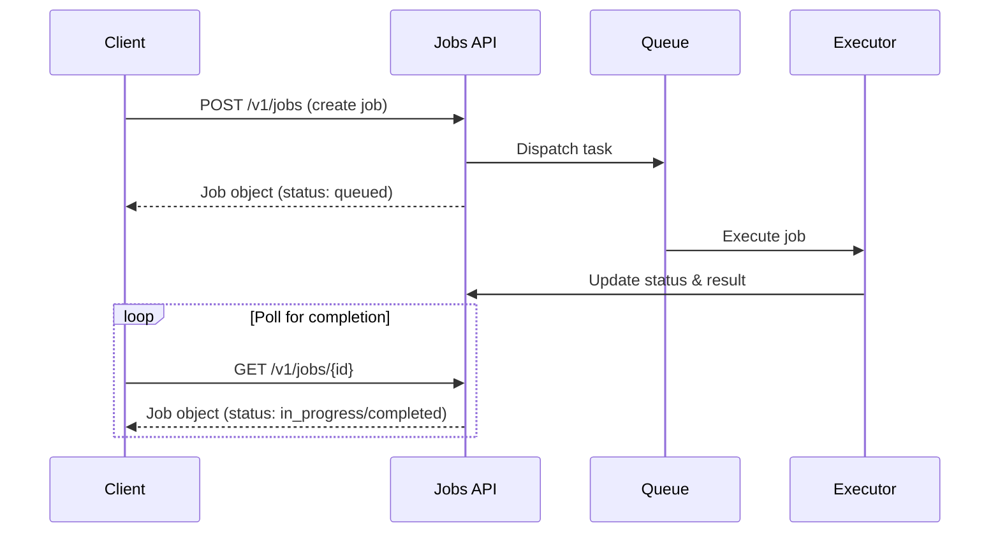

The Jobs API enables asynchronous processing for document operations. Instead of waiting for a synchronous response, you submit a job that processes in the background and poll for results when ready.

## Why Use the Jobs API?

The Jobs API provides several advantages over synchronous requests:

- **Avoid request timeouts**: Process large documents that would exceed HTTP timeout limits
- **Resilient to disconnections**: Jobs continue processing even if your client disconnects
- **Higher throughput**: Queue multiple jobs without waiting for each to complete
- **Progress tracking**: Monitor job status and get detailed error information

Use the Jobs API when processing documents that may take more than a few seconds, when you need to process multiple documents in parallel, or when you want guaranteed delivery of results.

## Getting Started

This guide walks you through creating a job, polling for completion, and retrieving results.

### 1. Prepare Your Request

Before creating a job, prepare your document and any required parameters. Documents can be provided as base64-encoded data URLs:

<CodeGroup>
```python Python
import base64

# Load and encode your document
with open("invoice.pdf", "rb") as f:
    content = base64.b64encode(f.read()).decode()
    document = {
        "filename": "invoice.pdf",
        "url": f"data:application/pdf;base64,{content}",
    }
```

```javascript JavaScript
import fs from 'fs';

// Load and encode your document
const content = fs.readFileSync('invoice.pdf').toString('base64');
const document = {
    filename: 'invoice.pdf',
    url: `data:application/pdf;base64,${content}`,
};
```
</CodeGroup>

### 2. Create the Job

Submit your job by specifying the target endpoint and the request body:

<CodeGroup>
```python Python
from retab import Retab

client = Retab()

job = client.jobs.create(
    endpoint="/v1/documents/extract",
    request={
        "document": document,
        "json_schema": schema,
        "model": "retab-small",
    },
)

print(f"Job created: {job.id}")
print(f"Status: {job.status}")  # "queued"
```

```javascript JavaScript
import { Retab } from '@retab/node';

const client = new Retab();

const job = await client.jobs.create({
    endpoint: "/v1/documents/extract",
    request: {
        document: document,
        json_schema: schema,
        model: "retab-small",
    },
});

console.log(`Job created: ${job.id}`);
console.log(`Status: ${job.status}`);  // "queued"
```

```bash cURL
curl -X POST https://api.retab.com/v1/jobs \
  -H "Api-Key: $RETAB_API_KEY" \
  -H "Content-Type: application/json" \
  -d '{
    "endpoint": "/v1/documents/extract",
    "request": {
      "document": {
        "filename": "invoice.pdf",
        "url": "data:application/pdf;base64,..."
      },
      "json_schema": { ... },
      "model": "retab-small"
    }
  }'
```
</CodeGroup>

### 3. Check Job Status

Poll the job until it reaches a terminal status:

<CodeGroup>
```python Python
import time

while job.status not in ("completed", "failed", "cancelled", "expired"):
    time.sleep(2)
    job = client.jobs.retrieve(job.id)
    print(f"Status: {job.status}")
```

```javascript JavaScript
const terminalStatuses = ["completed", "failed", "cancelled", "expired"];

while (!terminalStatuses.includes(job.status)) {
    await new Promise(resolve => setTimeout(resolve, 2000));
    job = await client.jobs.retrieve(job.id);
    console.log(`Status: ${job.status}`);
}
```

```bash cURL
curl https://api.retab.com/v1/jobs/{job_id} \
  -H "Api-Key: $RETAB_API_KEY"
```
</CodeGroup>

SDK note: `jobs.retrieve(...)` is lightweight by default in both Python and JavaScript clients. Use `retrieve_full`/`retrieveFull` when you need `request` or `response` payloads.

Or use the SDK helper method:

<CodeGroup>
```python Python
completed_job = client.jobs.wait_for_completion(
    job.id,
    poll_interval_seconds=2.0,  # seconds between polls
    timeout_seconds=300         # max seconds to wait
)
```

```javascript JavaScript
const completedJob = await client.jobs.waitForCompletion(job.id, {
    poll_interval_ms: 2000,
    timeout_ms: 300_000,
});
```
</CodeGroup>

### 4. Retrieve Results

If you used lightweight polling with `jobs.retrieve(...)`, fetch full payloads before reading `response`:

<CodeGroup>
```python Python
if job.status == "completed":
    job = client.jobs.retrieve_full(job.id)
    result = job.response.body
    print(result)
elif job.status == "failed":
    print(f"Error: {job.error.message}")
```

```javascript JavaScript
if (job.status === "completed") {
    job = await client.jobs.retrieveFull(job.id);
    const result = job.response.body;
    console.log(result);
} else if (job.status === "failed") {
    console.log(`Error: ${job.error.message}`);
}
```
</CodeGroup>

### 5. Cancel a Job (Optional)

Cancel a job that is queued or in progress:

<CodeGroup>
```python Python
cancelled_job = client.jobs.cancel(job.id)
print(f"Status: {cancelled_job.status}")  # "cancelled"
```

```javascript JavaScript
const cancelledJob = await client.jobs.cancel(job.id);
console.log(`Status: ${cancelledJob.status}`);  // "cancelled"
```

```bash cURL
curl -X POST https://api.retab.com/v1/jobs/{job_id}/cancel \
  -H "Api-Key: $RETAB_API_KEY"
```
</CodeGroup>

### 6. List Jobs

View all your jobs with optional filtering:

By default, `GET /v1/jobs` returns a lightweight list for fast polling:

- `request` is omitted (`null`)
- `response` is omitted (`null`)

Use `GET /v1/jobs?include_request=true&include_response=true` if you need full payloads in list results. For most workflows, list for discovery and call `retrieve_full`/`retrieveFull` on specific job IDs for full details.

<CodeGroup>
```python Python
# List all jobs
jobs_response = client.jobs.list(limit=20)
for job in jobs_response.data:
    print(f"{job.id}: {job.status}")

# Filter by status
queued_jobs = client.jobs.list(status="queued")

# Paginate through results
if jobs_response.has_more:
    next_page = client.jobs.list(after=jobs_response.last_id)
```

```javascript JavaScript
// List all jobs
const jobsResponse = await client.jobs.list({ limit: 20 });
for (const job of jobsResponse.data) {
    console.log(`${job.id}: ${job.status}`);
}

// Filter by status
const queuedJobs = await client.jobs.list({ status: "queued" });

// Paginate through results
if (jobsResponse.has_more) {
    const nextPage = await client.jobs.list({ after: jobsResponse.last_id });
}
```

```bash cURL
# Lightweight list (default)
curl https://api.retab.com/v1/jobs?limit=20 \
  -H "Api-Key: $RETAB_API_KEY"

# Include full request/response payloads
curl "https://api.retab.com/v1/jobs?limit=20&include_request=true&include_response=true" \
  -H "Api-Key: $RETAB_API_KEY"
```
</CodeGroup>

## Complete Examples

### Extract Structured Data

Extract structured data from documents using a JSON schema:

<CodeGroup>
```python Python
import base64
import json
import time
from retab import Retab

client = Retab()

# Load document
with open("invoice.pdf", "rb") as f:
    content = base64.b64encode(f.read()).decode()
    document = {
        "filename": "invoice.pdf",
        "url": f"data:application/pdf;base64,{content}",
    }

# Define extraction schema
schema = {
    "type": "object",
    "properties": {
        "invoice_number": {"type": "string"},
        "date": {"type": "string"},
        "total_amount": {"type": "number"},
        "vendor_name": {"type": "string"},
    },
    "required": ["invoice_number", "total_amount"],
}

# Create extraction job
job = client.jobs.create(
    endpoint="/v1/documents/extract",
    request={
        "document": document,
        "json_schema": schema,
        "model": "retab-small",
    },
)
print(f"Job created: {job.id}")

# Poll until complete
while job.status not in ("completed", "failed", "cancelled", "expired"):
    time.sleep(2)
    job = client.jobs.retrieve(job.id)
    print(f"Status: {job.status}")

# Get extracted data
if job.status == "completed":
    job = client.jobs.retrieve_full(job.id)
    extracted = job.response.body["choices"][0]["message"]["parsed"]
    print(f"Invoice: {extracted['invoice_number']}")
    print(f"Total: ${extracted['total_amount']}")
else:
    print(f"Job failed: {job.error.message}")
```

```javascript JavaScript
import fs from 'fs';
import { Retab } from '@retab/node';

const client = new Retab();

// Load document
const content = fs.readFileSync('invoice.pdf').toString('base64');
const document = {
    filename: 'invoice.pdf',
    url: `data:application/pdf;base64,${content}`,
};

// Define extraction schema
const schema = {
    type: "object",
    properties: {
        invoice_number: { type: "string" },
        date: { type: "string" },
        total_amount: { type: "number" },
        vendor_name: { type: "string" },
    },
    required: ["invoice_number", "total_amount"],
};

// Create extraction job
let job = await client.jobs.create({
    endpoint: "/v1/documents/extract",
    request: {
        document: document,
        json_schema: schema,
        model: "retab-small",
    },
});
console.log(`Job created: ${job.id}`);

// Poll until complete
const terminalStatuses = ["completed", "failed", "cancelled", "expired"];
while (!terminalStatuses.includes(job.status)) {
    await new Promise(resolve => setTimeout(resolve, 2000));
    job = await client.jobs.retrieve(job.id);
    console.log(`Status: ${job.status}`);
}

// Get extracted data
if (job.status === "completed") {
    job = await client.jobs.retrieveFull(job.id);
    const extracted = job.response.body.choices[0].message.parsed;
    console.log(`Invoice: ${extracted.invoice_number}`);
    console.log(`Total: $${extracted.total_amount}`);
} else {
    console.log(`Job failed: ${job.error.message}`);
}
```
</CodeGroup>

### Parse Document to Text

Convert documents to text or markdown format:

<CodeGroup>
```python Python
import base64
import time
from retab import Retab

client = Retab()

# Load document
with open("document.pdf", "rb") as f:
    content = base64.b64encode(f.read()).decode()
    document = {
        "filename": "document.pdf",
        "url": f"data:application/pdf;base64,{content}",
    }

# Create parse job
job = client.jobs.create(
    endpoint="/v1/documents/parse",
    request={
        "document": document,
    },
)
print(f"Job created: {job.id}")

# Poll until complete
while job.status not in ("completed", "failed", "cancelled", "expired"):
    time.sleep(2)
    job = client.jobs.retrieve(job.id)
    print(f"Status: {job.status}")

# Get parsed content
if job.status == "completed":
    job = client.jobs.retrieve_full(job.id)
    result = job.response.body
    print(f"Parsed text:\n{result['text']}")
    print(f"Total pages: {len(result['pages'])}")
else:
    print(f"Job failed: {job.error.message}")
```

```javascript JavaScript
import fs from 'fs';
import { Retab } from '@retab/node';

const client = new Retab();

// Load document
const content = fs.readFileSync('document.pdf').toString('base64');
const document = {
    filename: 'document.pdf',
    url: `data:application/pdf;base64,${content}`,
};

// Create parse job
let job = await client.jobs.create({
    endpoint: "/v1/documents/parse",
    request: {
        document: document,
    },
});
console.log(`Job created: ${job.id}`);

// Poll until complete
const terminalStatuses = ["completed", "failed", "cancelled", "expired"];
while (!terminalStatuses.includes(job.status)) {
    await new Promise(resolve => setTimeout(resolve, 2000));
    job = await client.jobs.retrieve(job.id);
    console.log(`Status: ${job.status}`);
}

// Get parsed content
if (job.status === "completed") {
    job = await client.jobs.retrieveFull(job.id);
    const result = job.response.body;
    console.log(`Parsed text:\n${result.text}`);
    console.log(`Total pages: ${result.pages.length}`);
} else {
    console.log(`Job failed: ${job.error.message}`);
}
```
</CodeGroup>

### Classify Documents

Classify documents into predefined categories:

<CodeGroup>
```python Python
import base64
import time
from retab import Retab

client = Retab()

# Load document
with open("document.pdf", "rb") as f:
    content = base64.b64encode(f.read()).decode()
    document = {
        "filename": "document.pdf",
        "url": f"data:application/pdf;base64,{content}",
    }

# Define categories
categories = [
    {"name": "Invoice", "description": "Invoice or bill documents"},
    {"name": "Bank Statement", "description": "Bank account statements"},
    {"name": "Receipt", "description": "Payment receipts"},
    {"name": "Contract", "description": "Legal contracts or agreements"},
    {"name": "ID Document", "description": "Identity documents"},
    {"name": "Other", "description": "Other document types"},
]

# Create classification job
job = client.jobs.create(
    endpoint="/v1/documents/classify",
    request={
        "document": document,
        "model": "retab-small",
        "categories": categories,
    },
)
print(f"Job created: {job.id}")

# Poll until complete
while job.status not in ("completed", "failed", "cancelled", "expired"):
    time.sleep(2)
    job = client.jobs.retrieve(job.id)
    print(f"Status: {job.status}")

# Get classification result
if job.status == "completed":
    job = client.jobs.retrieve_full(job.id)
    result = job.response.body["result"]
    print(f"Classification: {result['classification']}")
    print(f"Reasoning: {result['reasoning']}")
else:
    print(f"Job failed: {job.error.message}")
```

```javascript JavaScript
import fs from 'fs';
import { Retab } from '@retab/node';

const client = new Retab();

// Load document
const content = fs.readFileSync('document.pdf').toString('base64');
const document = {
    filename: 'document.pdf',
    url: `data:application/pdf;base64,${content}`,
};

// Define categories
const categories = [
    { name: "Invoice", description: "Invoice or bill documents" },
    { name: "Bank Statement", description: "Bank account statements" },
    { name: "Receipt", description: "Payment receipts" },
    { name: "Contract", description: "Legal contracts or agreements" },
    { name: "ID Document", description: "Identity documents" },
    { name: "Other", description: "Other document types" },
];

// Create classification job
let job = await client.jobs.create({
    endpoint: "/v1/documents/classify",
    request: {
        document: document,
        model: "retab-small",
        categories: categories,
    },
});
console.log(`Job created: ${job.id}`);

// Poll until complete
const terminalStatuses = ["completed", "failed", "cancelled", "expired"];
while (!terminalStatuses.includes(job.status)) {
    await new Promise(resolve => setTimeout(resolve, 2000));
    job = await client.jobs.retrieve(job.id);
    console.log(`Status: ${job.status}`);
}

// Get classification result
if (job.status === "completed") {
    job = await client.jobs.retrieveFull(job.id);
    const result = job.response.body.result;
    console.log(`Classification: ${result.classification}`);
    console.log(`Reasoning: ${result.reasoning}`);
} else {
    console.log(`Job failed: ${job.error.message}`);
}
```
</CodeGroup>

## Supported Endpoints

The Jobs API supports the following endpoints:

| Endpoint | Description |
|----------|-------------|
| `/v1/documents/extract` | Extract structured data from documents |
| `/v1/documents/parse` | Parse documents to text/markdown |
| `/v1/documents/split` | Split multi-page documents |
| `/v1/documents/classify` | Classify documents into categories |
| `/v1/schemas/generate` | Generate JSON schemas from documents |
| `/v1/edit/agent/fill` | Fill form fields using AI agent |
| `/v1/edit/templates/fill` | Fill templates with data |
| `/v1/edit/templates/generate` | Generate form schemas from PDFs |
| `/v1/projects/extract` | Extract using a project configuration |

## Job Lifecycle

Jobs progress through the following statuses:

```
validating → queued → in_progress → completed/failed/cancelled/expired
```

| Status | Description |
|--------|-------------|
| `validating` | The request is being validated before the job can begin |
| `queued` | Job is waiting in the processing queue |
| `in_progress` | Job is currently being processed by the executor |
| `completed` | Job finished successfully, results available in `response` |
| `failed` | Job execution failed, see `error` field for details |
| `cancelled` | Job was cancelled by user request |
| `expired` | Job data expired (7 days after creation) |



## Rate Limits and Constraints

The Jobs API has the following limits:

| Constraint | Limit |
|------------|-------|
| Metadata key-value pairs | 16 maximum |
| Metadata key length | 64 characters |
| Metadata value length | 512 characters |
| Concurrent jobs | Unlimited |

Jobs are processed in the order they are created. There is no limit on the number of concurrent jobs, but processing throughput depends on system capacity.

## Job Response Structure

When a job completes successfully, the result is available in the `response` field:

```json
{
  "id": "job_abc123xyz",
  "object": "job",
  "status": "completed",
  "endpoint": "/v1/documents/extract",
  "request": { ... },
  "response": {
    "status_code": 200,
    "body": {
      "choices": [
        {
          "message": {
            "parsed": {
              "invoice_number": "INV-2024-001",
              "total": 1250.00
            }
          }
        }
      ]
    }
  },
  "created_at": 1705420800,
  "started_at": 1705420802,
  "completed_at": 1705420810,
  "organization_id": "org_xxx"
}
```

Note: in list responses (`GET /v1/jobs`) and retrieve responses (`GET /v1/jobs/{job_id}`), the `request` and `response` fields are `null` by default unless `include_request/include_response` query parameters are enabled.

## Error Handling

When a job fails, the `error` field contains details about what went wrong:

```json
{
  "id": "job_abc123xyz",
  "status": "failed",
  "error": {
    "code": "validation_error",
    "message": "Invalid JSON schema: missing required field 'type'",
    "details": { ... }
  }
}
```

Jobs can also include non-fatal `warnings` (for example, if request/response document restoration from storage fails during retrieve/list). In that case, affected document objects may include `gcs_error` placeholders such as `download_failed` or `reconstruct_failed`.

Handle errors in your code:

<CodeGroup>
```python Python
job = client.jobs.wait_for_completion(job_id)

if job.status == "failed":
    print(f"Error code: {job.error.code}")
    print(f"Error message: {job.error.message}")
    if job.error.details:
        print(f"Details: {job.error.details}")
```

```javascript JavaScript
const job = await client.jobs.waitForCompletion(jobId);

if (job.status === "failed") {
    console.log(`Error code: ${job.error.code}`);
    console.log(`Error message: ${job.error.message}`);
    if (job.error.details) {
        console.log("Details:", job.error.details);
    }
}
```
</CodeGroup>

## Best Practices

### Polling Strategy

- Use reasonable poll intervals (2-5 seconds) to balance responsiveness and API usage
- Set timeouts to avoid indefinite waiting for stuck jobs
- Use the `wait_for_completion` helper method when possible

```python
# Recommended: Use the helper with timeout
try:
    job = client.jobs.wait_for_completion(
        job.id,
        poll_interval_seconds=2.0,
        timeout_seconds=300
    )
except TimeoutError:
    print("Job did not complete within timeout")
```

### Using Metadata

Use the `metadata` field to attach context to jobs for tracking and filtering:

```python
job = client.jobs.create(
    endpoint="/v1/documents/extract",
    request={ ... },
    metadata={
        "batch_id": "batch_20240115",
        "source": "email_attachments",
        "user_id": "user_123",
    }
)
```

Metadata is preserved throughout the job lifecycle and can help with:
- Tracking jobs by batch or source system
- Debugging failed jobs
- Filtering jobs when listing

### Error Recovery

Implement retry logic for transient failures:

```python
import time

MAX_RETRIES = 3

for attempt in range(MAX_RETRIES):
    job = client.jobs.create(endpoint=endpoint, request=request)
    job = client.jobs.wait_for_completion(job.id, timeout_seconds=300)

    if job.status == "completed":
        break
    elif job.status == "failed":
        if attempt < MAX_RETRIES - 1:
            print(f"Attempt {attempt + 1} failed, retrying...")
            time.sleep(5)
        else:
            raise Exception(f"Job failed after {MAX_RETRIES} attempts: {job.error.message}")
```

### Processing Multiple Documents

For batch processing, create jobs in parallel and collect results:

```python
import concurrent.futures

def process_document(doc_path):
    with open(doc_path, "rb") as f:
        content = base64.b64encode(f.read()).decode()

    job = client.jobs.create(
        endpoint="/v1/documents/extract",
        request={
            "document": {"filename": doc_path, "url": f"data:application/pdf;base64,{content}"},
            "json_schema": schema,
            "model": "retab-small",
        }
    )
    return client.jobs.wait_for_completion(job.id)

# Process documents in parallel
documents = ["doc1.pdf", "doc2.pdf", "doc3.pdf"]
with concurrent.futures.ThreadPoolExecutor(max_workers=5) as executor:
    results = list(executor.map(process_document, documents))
```
