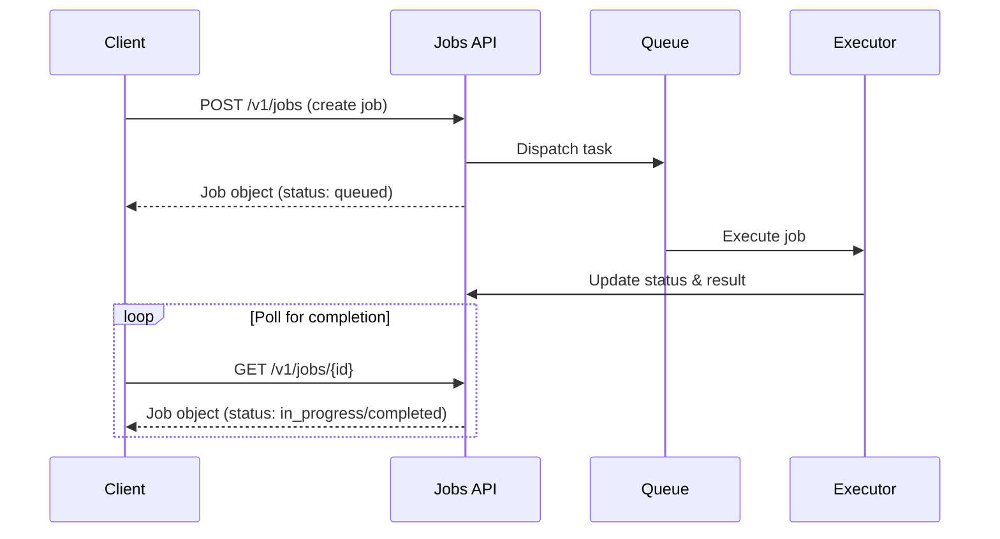

The Jobs API enables asynchronous processing for document operations. Instead of waiting for a synchronous response, you submit a job that processes in the background and poll for results when ready.

## Why Use the Jobs API?

The Jobs API provides several advantages over synchronous requests:

- **Avoid request timeouts**: Process large documents that would exceed HTTP timeout limits
- **Resilient to disconnections**: Jobs continue processing even if your client disconnects
- **Higher throughput**: Queue multiple jobs without waiting for each to complete
- **Progress tracking**: Monitor job status and get detailed error information

Use the Jobs API when processing documents that may take more than a few seconds, when you need to process multiple documents in parallel, or when you want guaranteed delivery of results.

## Getting Started

This guide walks you through creating a job, polling for completion, and retrieving results.

### 1. Prepare Your Request

Before creating a job, prepare your document and any required parameters. Documents can be provided as base64-encoded data URLs:

<CodeGroup>
```python Python
import base64

# Load and encode your document

with open("invoice.pdf", "rb") as f:
content = base64.b64encode(f.read()).decode()
document = {
"filename": "invoice.pdf",
"url": f"data:application/pdf;base64,{content}",
}

````

```typescript TypeScript
import fs from 'fs';

// Load and encode your document
const content = fs.readFileSync('invoice.pdf').toString('base64');
const document = {
    filename: 'invoice.pdf',
    url: `data:application/pdf;base64,${content}`,
};
````

```go Go
package main

import (
	"encoding/base64"
	"fmt"
	"log"
	"os"

	retab "github.com/retab-dev/retab/clients/go"
)

func main() {
	// Load and encode your document
	content, err := os.ReadFile("invoice.pdf")
	if err != nil {
		log.Fatal(err)
	}
	encoded := base64.StdEncoding.EncodeToString(content)
	document := retab.MIMEData{
		Filename: "invoice.pdf",
		URL:      fmt.Sprintf("data:application/pdf;base64,%s", encoded),
	}
	_ = document
}
```

```ruby Ruby
require 'base64'

# Load and encode your document
content = Base64.strict_encode64(File.binread('invoice.pdf'))
document = {
  filename: 'invoice.pdf',
  url: "data:application/pdf;base64,#{content}",
}
```

```php PHP
<?php
// Load and encode your document
$content = base64_encode(file_get_contents('invoice.pdf'));
$document = [
    'filename' => 'invoice.pdf',
    'url' => "data:application/pdf;base64,{$content}",
];
```

```rust Rust
use base64::engine::general_purpose::STANDARD;
use base64::Engine;
use retab::MimeData;
use std::fs;

fn main() -> Result<(), Box<dyn std::error::Error>> {
    // Load and encode your document
    let content = fs::read("invoice.pdf")?;
    let encoded = STANDARD.encode(&content);
    let document = MimeData::new(
        "invoice.pdf",
        format!("data:application/pdf;base64,{encoded}"),
    );
    let _ = document;
    Ok(())
}
```

```csharp C#
using System;
using System.IO;
using System.Threading.Tasks;
using Retab;
using RetabClient = Retab.Retab;

// Load your document — MimeData accepts a FileInfo directly,
// or build a data URL by hand if you need to inline base64.
var document = (MimeData)new FileInfo("invoice.pdf");

// Equivalent inline base64 form:
// var bytes = await System.IO.File.ReadAllBytesAsync("invoice.pdf");
// var dataUrl = $"data:application/pdf;base64,{Convert.ToBase64String(bytes)}";
// var document = MimeData.FromDataUrl(dataUrl, "invoice.pdf");
```

```java Java
import java.nio.file.Files;
import java.nio.file.Path;
import java.util.Base64;
import java.util.Map;

public final class Example {
  public static void main(String[] args) throws Exception {
    byte[] content = Files.readAllBytes(Path.of("invoice.pdf"));
    String encoded = Base64.getEncoder().encodeToString(content);

    Map<String, Object> document =
        Map.of("filename", "invoice.pdf", "url", "data:application/pdf;base64," + encoded);
    System.out.println(document);
  }
}
```

</CodeGroup>

### 2. Create the Job

Submit your job by specifying the target endpoint and the request body:

<CodeGroup>
```python Python
from retab import Retab

client = Retab()

job = client.jobs.create(
endpoint="/v1/extractions",
request={
"document": document,
"json_schema": schema,
"model": "retab-small",
},
)

print(f"Job created: {job.id}")
print(f"Status: {job.status}") # "queued"

````

```typescript TypeScript
import { Retab } from '@retab/node';

const client = new Retab({ apiKey: process.env.RETAB_API_KEY });

const job = await client.jobs.create("/v1/extractions", {
        document: document,
        json_schema: schema,
        model: "retab-small",
    });

console.log(`Job created: ${job.id}`);
console.log(`Status: ${job.status}`);  // "queued"
````

```go Go
package main

import (
	"context"
	"fmt"
	"log"

	retab "github.com/retab-dev/retab/clients/go"
)

func main() {
	ctx := context.Background()

	client, err := retab.NewClient("")
	if err != nil {
		log.Fatal(err)
	}

	document := "invoice.pdf"
	schema := map[string]any{
		"type": "object",
		"properties": map[string]any{
			"invoice_number": map[string]any{"type": "string"},
			"total_amount":   map[string]any{"type": "number"},
		},
	}

	job, err := client.Jobs.Create(ctx, &retab.JobsCreateParams{
		Endpoint: "/v1/extractions",
		Request: retab.Resource{
			"document":    document,
			"json_schema": schema,
			"model":       "retab-small",
		},
	})
	if err != nil {
		log.Fatal(err)
	}

	fmt.Printf("Job created: %s\n", job.ID)
	fmt.Printf("Status: %s\n", *job.Status) // "queued"
}
```

```ruby Ruby
require 'retab'

client = Retab::Client.new(api_key: ENV['RETAB_API_KEY'])

job = client.jobs.create(
  endpoint: '/v1/extractions',
  request: {
    document: document,
    json_schema: schema,
    model: 'retab-small',
  },
)

puts "Job created: #{job.id}"
puts "Status: #{job.status}" # "queued"
```

```php PHP
<?php
require 'vendor/autoload.php';

use Retab\Client;
use Retab\Resource\JobsEndpoint;

$client = new Client();

$job = $client->jobs()->create(
    endpoint: JobsEndpoint::V1Extractions,
    request: [
        'document' => $document,
        'json_schema' => $schema,
        'model' => 'retab-small',
    ],
);

echo "Job created: {$job->id}" . PHP_EOL;
echo 'Status: ' . $job->status?->value . PHP_EOL; // "queued"
```

```rust Rust
use retab::enums::CreateJobRequestEndpoint;
use retab::models::CreateJobRequest;
use retab::resources::jobs::CreateParams;
use retab::Retab;
use std::collections::HashMap;

#[tokio::main]
async fn main() -> Result<(), Box<dyn std::error::Error>> {
    let client = Retab::new(std::env::var("RETAB_API_KEY")?);

    let request: HashMap<String, serde_json::Value> = serde_json::from_value(serde_json::json!({
        "document": { "filename": "invoice.pdf", "url": "data:application/pdf;base64,..." },
        "json_schema": { "type": "object" },
        "model": "retab-small"
    }))?;

    let job = client
        .jobs()
        .create(CreateParams::new(CreateJobRequest::new(
            CreateJobRequestEndpoint::V1Extractions,
            request,
        )))
        .await?;

    println!("Job created: {:?}", job.id);
    println!("Status: {:?}", job.status); // "queued"
    Ok(())
}
```

```java Java
import com.retab.RetabClient;

public final class Example {
  public static void main(String[] args) throws Exception {
    RetabClient client = new RetabClient(System.getenv("RETAB_API_KEY"));

    var result = client.jobs().create(null, null, null);
    System.out.println(result);
  }
}
```

```curl cURL
curl -X POST https://api.retab.com/v1/jobs \
  -H "Api-Key: $RETAB_API_KEY" \
  -H "Content-Type: application/json" \
  -d '{
    "endpoint": "/v1/extractions",
    "request": {
      "document": {
        "filename": "invoice.pdf",
        "url": "data:application/pdf;base64,..."
      },
      "json_schema": { ... },
      "model": "retab-small"
    }
  }'
```

```csharp C#
using System;
using System.Collections.Generic;
using System.Threading.Tasks;
using Retab;
using RetabClient = Retab.Retab;

var client = new RetabClient(Environment.GetEnvironmentVariable("RETAB_API_KEY")!);

var document = new Dictionary<string, object>
{
    ["filename"] = "invoice.pdf",
    ["url"] = "data:application/pdf;base64,...",
};
var schema = new Dictionary<string, object>
{
    ["type"] = "object",
    ["properties"] = new Dictionary<string, object>(),
};

var job = await client.Jobs.CreateAsync(
    new JobsCreateOptions
    {
        Endpoint = CreateJobRequestEndpoint.V1Extractions,
        Request = new Dictionary<string, object>
        {
            ["document"] = document,
            ["json_schema"] = schema,
            ["model"] = "retab-small",
        },
    }
);

Console.WriteLine($"Job created: {job.Id}");
Console.WriteLine($"Status: {job.Status}"); // "queued"
```

</CodeGroup>

### 3. Check Job Status

Poll the job until it reaches a terminal status:

<CodeGroup>
```python Python
import time

while job.status not in ("completed", "failed", "cancelled", "expired"):
time.sleep(2)
job = client.jobs.get(job.id)
print(f"Status: {job.status}")

````

```typescript TypeScript
const terminalStatuses = ["completed", "failed", "cancelled", "expired"];

while (!terminalStatuses.includes(job.status)) {
    await new Promise(resolve => setTimeout(resolve, 2000));
    job = await client.jobs.get(job.id);
    console.log(`Status: ${job.status}`);
}
````

```go Go
terminalStatuses := map[string]bool{
    "completed": true,
    "failed":    true,
    "cancelled": true,
    "expired":   true,
}

for {
    status := string(*job.Status)
    if terminalStatuses[status] {
        break
    }
    time.Sleep(2 * time.Second)
    jobID := *job.ID
    job, err = client.Jobs.Get(ctx, jobID, nil)
    if err != nil {
        log.Fatal(err)
    }
    fmt.Printf("Status: %s\n", *job.Status)
}
```

```ruby Ruby
terminal_statuses = ['completed', 'failed', 'cancelled', 'expired']

until terminal_statuses.include?(job.status)
  sleep 2
  job = client.jobs.get(job_id: job.id)
  puts "Status: #{job.status}"
end
```

```java Java
import com.retab.RetabClient;

public final class Example {
  public static void main(String[] args) throws Exception {
    RetabClient client = new RetabClient(System.getenv("RETAB_API_KEY"));

    var result = client.jobs().get("job_abc123", null, null);
    System.out.println(result);
  }
}
```

```curl cURL
curl https://api.retab.com/v1/jobs/{job_id} \
  -H "Api-Key: $RETAB_API_KEY"
```

```php PHP
<?php
$terminalStatuses = ['completed', 'failed', 'cancelled', 'expired'];

while (!in_array($job->status?->value, $terminalStatuses, true)) {
    sleep(2);
    $job = $client->jobs()->get($job->id);
    echo 'Status: ' . $job->status?->value . PHP_EOL;
}
```

```rust Rust
use retab::enums::JobStatus;
use retab::resources::jobs::GetParams;
use retab::Retab;
use std::time::Duration;

#[tokio::main]
async fn main() -> Result<(), Box<dyn std::error::Error>> {
    let client = Retab::new(std::env::var("RETAB_API_KEY")?);

    let mut job = client.jobs().get("job_id", GetParams::default()).await?;
    let job_id = job.id.clone();

    loop {
        let status = job.status.clone();
        let terminal = matches!(
            status,
            Some(JobStatus::Completed | JobStatus::Failed | JobStatus::Cancelled | JobStatus::Expired),
        );
        if terminal {
            break;
        }
        tokio::time::sleep(Duration::from_secs(2)).await;
        job = client.jobs().get(&job_id, GetParams::default()).await?;
        println!("Status: {:?}", job.status);
    }
    Ok(())
}
```

```csharp C#
using System;
using System.Threading.Tasks;
using Retab;
using RetabClient = Retab.Retab;

var client = new RetabClient("YOUR_API_KEY");
var job = await client.Jobs.GetAsync("job_id");
var terminalStatuses = new HashSet<JobStatus>
{
    JobStatus.Completed,
    JobStatus.Failed,
    JobStatus.Cancelled,
    JobStatus.Expired,
};

while (job.Status is null || !terminalStatuses.Contains(job.Status.Value))
{
    await Task.Delay(TimeSpan.FromSeconds(2));
    job = await client.Jobs.GetAsync(job.Id);
    Console.WriteLine($"Status: {job.Status}");
}
```

</CodeGroup>

SDK note: `jobs.retrieve(...)` is lightweight by default. Pass `include_response` or `include_request` when you need payloads.

Or use the SDK helper method:

<CodeGroup>
```python Python
completed_job = client.jobs.wait_for_completion(
    job.id,
    poll_interval_seconds=2.0,  # seconds between polls
    timeout_seconds=300         # max seconds to wait
)
```

```typescript TypeScript
const completedJob = await client.jobs.waitForCompletion(job.id, {
  poll_interval_ms: 2000,
  timeout_ms: 300_000,
});
```

```go Go
completedJob, err := client.Jobs.WaitForCompletion(ctx, jobID, &retab.JobWaitForCompletionParams{
    PollInterval: 2 * time.Second,
    Timeout:      5 * time.Minute,
})
if err != nil {
    log.Fatal(err)
}
_ = completedJob
```

```ruby Ruby
# The Ruby SDK does not currently expose a built-in helper; poll with client.jobs.get(...).
terminal_statuses = ['completed', 'failed', 'cancelled', 'expired']
deadline = Time.now + 300

until terminal_statuses.include?(job.status)
  raise 'Timed out waiting for job to complete' if Time.now > deadline
  sleep 2
  job = client.jobs.get(job_id: job.id)
end

completed_job = job
```

```php PHP
<?php
// The PHP SDK does not currently expose a built-in helper; poll with $client->jobs()->get(...).
$terminalStatuses = ['completed', 'failed', 'cancelled', 'expired'];
$deadline = time() + 300;
while (!in_array($job->status?->value, $terminalStatuses, true)) {
    if (time() > $deadline) {
        throw new RuntimeException('Timed out waiting for job to complete');
    }
    sleep(2);
    $job = $client->jobs()->get($job->id);
}
$completedJob = $job;
```

```rust Rust
use retab::enums::JobStatus;
use retab::resources::jobs::GetParams;
use retab::Retab;
use std::time::{Duration, Instant};

#[tokio::main]
async fn main() -> Result<(), Box<dyn std::error::Error>> {
    let client = Retab::new(std::env::var("RETAB_API_KEY")?);

    // The Rust SDK does not currently expose a built-in helper; poll with client.jobs().get(...).
    let mut job = client.jobs().get("job_id", GetParams::default()).await?;
    let job_id = job.id.clone();
    let deadline = Instant::now() + Duration::from_secs(300);

    loop {
        let terminal = matches!(
            job.status,
            Some(JobStatus::Completed | JobStatus::Failed | JobStatus::Cancelled | JobStatus::Expired),
        );
        if terminal {
            break;
        }
        if Instant::now() > deadline {
            return Err("Timed out waiting for job to complete".into());
        }
        tokio::time::sleep(Duration::from_secs(2)).await;
        job = client.jobs().get(&job_id, GetParams::default()).await?;
    }

    let _completed_job = job;
    Ok(())
}
```

```csharp C#
using System;
using System.Collections.Generic;
using System.Threading.Tasks;
using Retab;
using RetabClient = Retab.Retab;

// The .NET SDK does not currently expose a built-in helper; poll with client.Jobs.GetAsync(...).
var client = new RetabClient("YOUR_API_KEY");
var job = await client.Jobs.GetAsync("job_id");
var terminalStatuses = new HashSet<JobStatus>
{
    JobStatus.Completed,
    JobStatus.Failed,
    JobStatus.Cancelled,
    JobStatus.Expired,
};

var deadline = DateTime.UtcNow + TimeSpan.FromSeconds(300);
while (job.Status is null || !terminalStatuses.Contains(job.Status.Value))
{
    if (DateTime.UtcNow > deadline)
        throw new TimeoutException("Timed out waiting for job to complete");
    await Task.Delay(TimeSpan.FromSeconds(2));
    job = await client.Jobs.GetAsync(job.Id);
}

var completedJob = job;
```

```java Java
import com.retab.RetabClient;

public final class Example {
  public static void main(String[] args) throws Exception {
    RetabClient client = new RetabClient(System.getenv("RETAB_API_KEY"));

    var result = client.jobs().get("job_abc123", null, null);
    System.out.println(result);
  }
}
```

</CodeGroup>

### 4. Retrieve Results

If you used lightweight polling with `jobs.retrieve(...)`, fetch response payloads before reading `response`:

<CodeGroup>
```python Python
if job.status == "completed":
    job = client.jobs.get(job.id, include_response=True)
    result = job.response.body
    print(result)
elif job.status == "failed":
    print(f"Error: {job.error.message}")
```

```typescript TypeScript
if (job.status === "completed") {
  job = await client.jobs.get(job.id, { includeResponse: true });
  const result = job.response.body;
  console.log(result);
} else if (job.status === "failed") {
  console.log(`Error: ${job.error.message}`);
}
```

```go Go
status := string(*job.Status)
if status == "completed" {
    includeResponse := true
    job, err = client.Jobs.Get(ctx, jobID, &retab.JobsGetParams{IncludeResponse: &includeResponse})
    if err != nil {
        log.Fatal(err)
    }
    result := job.Response.Body
    fmt.Println(result)
} else if status == "failed" {
    if job.Error != nil {
        fmt.Printf("Error: %v\n", job.Error.Message)
    }
}
```

```ruby Ruby
if job.status == 'completed'
  job = client.jobs.get(job_id: job.id, include_response: true)
  result = job.response.body
  puts result
elsif job.status == 'failed'
  puts "Error: #{job.error.message}"
end
```

```php PHP
<?php
if ($job->status?->value === 'completed') {
    $job = $client->jobs()->get($job->id, includeResponse: true);
    $result = $job->response?->body;
    print_r($result);
} elseif ($job->status?->value === 'failed') {
    echo 'Error: ' . ($job->error?->message ?? '') . PHP_EOL;
}
```

```rust Rust
use retab::enums::JobStatus;
use retab::resources::jobs::GetParams;
use retab::Retab;

#[tokio::main]
async fn main() -> Result<(), Box<dyn std::error::Error>> {
    let client = Retab::new(std::env::var("RETAB_API_KEY")?);

    let mut job = client.jobs().get("job_id", GetParams::default()).await?;
    let job_id = job.id.clone();

    match job.status {
        Some(JobStatus::Completed) => {
            job = client
                .jobs()
                .get(
                    &job_id,
                    GetParams {
                        include_response: Some(true),
                        ..Default::default()
                    },
                )
                .await?;
            if let Some(response) = &job.response {
                println!("{:?}", response.body);
            }
        }
        Some(JobStatus::Failed) => {
            if let Some(err) = &job.error {
                println!("Error: {}", err.message);
            }
        }
        _ => {}
    }
    Ok(())
}
```

```csharp C#
using System;
using System.Threading.Tasks;
using Retab;
using RetabClient = Retab.Retab;

var client = new RetabClient("YOUR_API_KEY");
var job = await client.Jobs.GetAsync("job_id");
if (job.Status == JobStatus.Completed)
{
    job = await client.Jobs.GetAsync(
        job.Id,
        new JobsGetOptions { IncludeResponse = true }
    );
    var result = job.Response?.Body;
    Console.WriteLine(result);
}
else if (job.Status == JobStatus.Failed)
{
    Console.WriteLine($"Error: {job.Error?.Message}");
}
```

```java Java
import com.retab.RetabClient;

public final class Example {
  public static void main(String[] args) throws Exception {
    RetabClient client = new RetabClient(System.getenv("RETAB_API_KEY"));

    var result = client.jobs().get("job_abc123", null, null);
    System.out.println(result);
  }
}
```

</CodeGroup>

### 5. Cancel a Job (Optional)

Cancel a job that is queued or in progress:

<CodeGroup>
```python Python
cancelled_job = client.jobs.cancel(job.id)
print(f"Status: {cancelled_job.status}")  # "cancelled"
```

```typescript TypeScript
const cancelledJob = await client.jobs.cancel(job.id);
console.log(`Status: ${cancelledJob.status}`); // "cancelled"
```

```go Go
cancelledJob, err := client.Jobs.Cancel(ctx, jobID)
if err != nil {
    log.Fatal(err)
}
fmt.Printf("Status: %s\n", (*cancelledJob)["status"]) // "cancelled"
```

```ruby Ruby
cancelled_job = client.jobs.cancel(job_id: job.id)
puts "Status: #{cancelled_job.status}" # "cancelled"
```

```java Java
import com.retab.RetabClient;

public final class Example {
  public static void main(String[] args) throws Exception {
    RetabClient client = new RetabClient(System.getenv("RETAB_API_KEY"));

    var result = client.jobs().cancel("job_abc123");
    System.out.println(result);
  }
}
```

```curl cURL
curl -X POST https://api.retab.com/v1/jobs/{job_id}/cancel \
  -H "Api-Key: $RETAB_API_KEY"
```

```php PHP
<?php
$cancelledJob = $client->jobs()->cancel($job->id);
echo 'Status: ' . $cancelledJob->status?->value . PHP_EOL; // "cancelled"
```

```rust Rust
use retab::Retab;

#[tokio::main]
async fn main() -> Result<(), Box<dyn std::error::Error>> {
    let client = Retab::new(std::env::var("RETAB_API_KEY")?);

    let cancelled_job = client.jobs().cancel("job_id").await?;
    println!("Status: {:?}", cancelled_job.status); // "cancelled"
    Ok(())
}
```

```csharp C#
using System;
using System.Threading.Tasks;
using Retab;
using RetabClient = Retab.Retab;

var client = new RetabClient("YOUR_API_KEY");
var job = await client.Jobs.GetAsync("job_id");
var cancelledJob = await client.Jobs.CancelAsync(job.Id);
Console.WriteLine($"Status: {cancelledJob.Status}"); // "cancelled"
```

</CodeGroup>

### 6. List Jobs

View all your jobs with optional filtering:

By default, `GET /v1/jobs` returns a lightweight list for fast polling:

- `request` is omitted (`null`)
- `response` is omitted (`null`)

Use `GET /v1/jobs?include_request=true&include_response=true` if you need full payloads in list results. For most workflows, list for discovery and call `retrieve` with `include_response` on specific job IDs for full details.

<CodeGroup>
```python Python
# List all jobs
jobs_response = client.jobs.list(limit=20)
for job in jobs_response.data:
    print(f"{job.id}: {job.status}")

# Filter by status

queued_jobs = client.jobs.list(status="queued")

# Paginate through results

if jobs_response.has_more:
next_page = client.jobs.list(after=jobs_response.last_id)

````

```typescript TypeScript
// List all jobs
const jobsResponse = await client.jobs.list({ limit: 20 });
for (const job of jobsResponse.data) {
    console.log(`${job.id}: ${job.status}`);
}

// Filter by status
const queuedJobs = await client.jobs.list({ status: "queued" });

// Paginate through results
if (jobsResponse.has_more) {
    const nextPage = await client.jobs.list({ after: jobsResponse.last_id });
}
````

```go Go
// List all jobs
jobsResponse, err := client.Jobs.List(ctx, &retab.ListJobsParams{Limit: 20})
if err != nil {
    log.Fatal(err)
}
for _, job := range jobsResponse.Data {
    fmt.Printf("%s: %s\n", job["id"], job["status"])
}

// Filter by status
queuedJobs, err := client.Jobs.List(ctx, &retab.ListJobsParams{Status: "queued"})
if err != nil {
    log.Fatal(err)
}
_ = queuedJobs

// Paginate through results
if jobsResponse.HasMore {
    nextPage, err := client.Jobs.List(ctx, &retab.ListJobsParams{After: jobsResponse.LastID})
    if err != nil {
        log.Fatal(err)
    }
    _ = nextPage
}
```

```ruby Ruby
# List all jobs
jobs_response = client.jobs.list(limit: 20)
jobs_response.data.each do |job|
  puts "#{job.id}: #{job.status}"
end

# Filter by status
queued_jobs = client.jobs.list(status: 'queued')

# Paginate through results
if jobs_response.has_more
  next_page = client.jobs.list(after: jobs_response.last_id)
end
```

```java Java
import com.retab.RetabClient;

public final class Example {
  public static void main(String[] args) throws Exception {
    RetabClient client = new RetabClient(System.getenv("RETAB_API_KEY"));

    var result = client.jobs().list(null, null, 10L, null, "job_abc123", null, null, null, null, "wf_abc123", null, "retab-1.5", null, null, null, null, null, null, null, null);
    System.out.println(result);
  }
}
```

```curl cURL
# Lightweight list (default)
curl https://api.retab.com/v1/jobs?limit=20 \
  -H "Api-Key: $RETAB_API_KEY"

# Include full request/response payloads
curl "https://api.retab.com/v1/jobs?limit=20&include_request=true&include_response=true" \
  -H "Api-Key: $RETAB_API_KEY"
```

```php PHP
<?php
use Retab\Resource\JobStatus;

// List all jobs
$jobsResponse = $client->jobs()->list(limit: 20);
foreach ($jobsResponse->data as $job) {
    echo "{$job->id}: " . $job->status?->value . PHP_EOL;
}

// Filter by status
$queuedJobs = $client->jobs()->list(status: JobStatus::Queued);

// Paginate through results
$nextPage = $jobsResponse->nextPage();
```

```rust Rust
use retab::enums::JobsStatus;
use retab::resources::jobs::ListParams;
use retab::Retab;

#[tokio::main]
async fn main() -> Result<(), Box<dyn std::error::Error>> {
    let client = Retab::new(std::env::var("RETAB_API_KEY")?);

    // List all jobs
    let jobs_response = client
        .jobs()
        .list(ListParams {
            limit: Some(20),
            ..Default::default()
        })
        .await?;
    for job in &jobs_response.data {
        println!("{:?}: {:?}", job.id, job.status);
    }

    // Filter by status
    let queued_jobs = client
        .jobs()
        .list(ListParams {
            status: Some(JobsStatus::Queued),
            ..Default::default()
        })
        .await?;
    let _ = queued_jobs;

    // Paginate through results
    if let Some(after) = &jobs_response.list_metadata.after {
        let _next_page = client
            .jobs()
            .list(ListParams {
                after: Some(after.clone()),
                ..Default::default()
            })
            .await?;
    }
    Ok(())
}
```

```csharp C#
using System;
using System.Threading.Tasks;
using Retab;
using RetabClient = Retab.Retab;

var client = new RetabClient("YOUR_API_KEY");

// List all jobs (first page)
var jobsResponse = await client.Jobs.ListAsync(
    new JobsListOptions { Limit = 20 }
);
foreach (var job in jobsResponse.Data)
{
    Console.WriteLine($"{job.Id}: {job.Status}");
}

// Filter by status
var queuedJobs = await client.Jobs.ListAsync(
    new JobsListOptions { Status = JobStatus.Queued }
);

// Iterate every page automatically
await foreach (var job in jobsResponse)
{
    Console.WriteLine($"{job.Id}: {job.Status}");
}
```

</CodeGroup>

## Complete Examples

### Extract Structured Data

Extract structured data from documents using a JSON schema:

<CodeGroup>
```python Python
import base64
import json
import time
from retab import Retab

client = Retab()

# Load document.
with open("invoice.pdf", "rb") as f:
    content = base64.b64encode(f.read()).decode()
document = {
    "filename": "invoice.pdf",
    "url": f"data:application/pdf;base64,{content}",
}

# Define extraction schema.
schema = {
    "type": "object",
    "properties": {
        "invoice_number": {"type": "string"},
        "date": {"type": "string"},
        "total_amount": {"type": "number"},
        "vendor_name": {"type": "string"},
    },
    "required": ["invoice_number", "total_amount"],
}

# Create extraction job.
job = client.jobs.create(
    endpoint="/v1/extractions",
    request={
        "document": document,
        "json_schema": schema,
        "model": "retab-small",
    },
)
print(f"Job created: {job.id}")

# Poll until complete.
while job.status not in ("completed", "failed", "cancelled", "expired"):
    time.sleep(2)
    job = client.jobs.get(job.id)
    print(f"Status: {job.status}")

# Get extracted data.
if job.status == "completed":
    job = client.jobs.get(job.id, include_response=True)
    extracted = job.response.body["output"]
    print(f"Invoice: {extracted['invoice_number']}")
    print(f"Total: ${extracted['total_amount']}")
else:
    print(f"Job failed: {job.error.message}")

````

```typescript TypeScript
import fs from 'fs';
import { Retab } from '@retab/node';

const client = new Retab({ apiKey: process.env.RETAB_API_KEY });

// Load document
const content = fs.readFileSync('invoice.pdf').toString('base64');
const document = {
    filename: 'invoice.pdf',
    url: `data:application/pdf;base64,${content}`,
};

// Define extraction schema
const schema = {
    type: "object",
    properties: {
        invoice_number: { type: "string" },
        date: { type: "string" },
        total_amount: { type: "number" },
        vendor_name: { type: "string" },
    },
    required: ["invoice_number", "total_amount"],
};

// Create extraction job
let job = await client.jobs.create("/v1/extractions", {
        document: document,
        json_schema: schema,
        model: "retab-small",
    });
console.log(`Job created: ${job.id}`);

// Poll until complete
const terminalStatuses = ["completed", "failed", "cancelled", "expired"];
while (!terminalStatuses.includes(job.status)) {
    await new Promise(resolve => setTimeout(resolve, 2000));
    job = await client.jobs.get(job.id);
    console.log(`Status: ${job.status}`);
}

// Get extracted data
if (job.status === "completed") {
    job = await client.jobs.get(job.id, { includeResponse: true });
    const extracted = (job.response.body as { output: { invoice_number?: string; total_amount?: number } }).output;
    console.log(`Invoice: ${extracted.invoice_number}`);
    console.log(`Total: $${extracted.total_amount}`);
} else {
    console.log(`Job failed: ${job.error.message}`);
}
````

```go Go
package main

import (
	"context"
	"encoding/base64"
	"fmt"
	"log"
	"os"
	"time"

	retab "github.com/retab-dev/retab/clients/go"
)

func main() {
	ctx := context.Background()

	client, err := retab.NewClient("")
	if err != nil {
		log.Fatal(err)
	}

	// Load document
	content, err := os.ReadFile("invoice.pdf")
	if err != nil {
		log.Fatal(err)
	}
	encoded := base64.StdEncoding.EncodeToString(content)
	document := retab.MIMEData{
		Filename: "invoice.pdf",
		URL:      fmt.Sprintf("data:application/pdf;base64,%s", encoded),
	}

	// Define extraction schema
	schema := map[string]any{
		"type": "object",
		"properties": map[string]any{
			"invoice_number": map[string]any{"type": "string"},
			"date":           map[string]any{"type": "string"},
			"total_amount":   map[string]any{"type": "number"},
			"vendor_name":    map[string]any{"type": "string"},
		},
		"required": []string{"invoice_number", "total_amount"},
	}

	// Create extraction job
	job, err := client.Jobs.Create(ctx, &retab.JobsCreateParams{
		Endpoint: "/v1/extractions",
		Request: retab.Resource{
			"document":    document,
			"json_schema": schema,
			"model":       "retab-small",
		},
	})
	if err != nil {
		log.Fatal(err)
	}
	jobID := job.ID
	fmt.Printf("Job created: %s\n", jobID)

	// Poll until complete
	terminalStatuses := map[string]bool{"completed": true, "failed": true, "cancelled": true, "expired": true}
	for {
		status := string(*job.Status)
		if terminalStatuses[status] {
			break
		}
		time.Sleep(2 * time.Second)
		job, err = client.Jobs.Get(ctx, jobID, nil)
		if err != nil {
			log.Fatal(err)
		}
		fmt.Printf("Status: %s\n", *job.Status)
	}

	// Get extracted data
	status := string(*job.Status)
	if status == "completed" {
		includeResponse := true
		job, err = client.Jobs.Get(ctx, jobID, &retab.JobsGetParams{IncludeResponse: &includeResponse})
		if err != nil {
			log.Fatal(err)
		}
		body := job.Response.Body
		extracted, _ := body["output"].(map[string]any)
		fmt.Printf("Invoice: %v\n", extracted["invoice_number"])
		fmt.Printf("Total: $%v\n", extracted["total_amount"])
	} else {
		fmt.Printf("Job failed: %v\n", job.Error.Message)
	}
}
```

```ruby Ruby
require 'base64'
require 'retab'

client = Retab::Client.new(api_key: ENV['RETAB_API_KEY'])

# Load document.
content = Base64.strict_encode64(File.binread('invoice.pdf'))
document = {
  filename: 'invoice.pdf',
  url: "data:application/pdf;base64,#{content}",
}

# Define extraction schema.
schema = {
  type: 'object',
  properties: {
    invoice_number: { type: 'string' },
    date: { type: 'string' },
    total_amount: { type: 'number' },
    vendor_name: { type: 'string' },
  },
  required: ['invoice_number', 'total_amount'],
}

# Create extraction job.
job = client.jobs.create(
  endpoint: '/v1/extractions',
  request: {
    document: document,
    json_schema: schema,
    model: 'retab-small',
  },
)
puts "Job created: #{job.id}"

# Poll until complete.
terminal_statuses = ['completed', 'failed', 'cancelled', 'expired']
until terminal_statuses.include?(job.status)
  sleep 2
  job = client.jobs.get(job_id: job.id)
  puts "Status: #{job.status}"
end

# Get extracted data.
if job.status == 'completed'
  job = client.jobs.get(job_id: job.id, include_response: true)
  extracted = job.response.body['output']
  puts "Invoice: #{extracted['invoice_number']}"
  puts "Total: $#{extracted['total_amount']}"
else
  puts "Job failed: #{job.error.message}"
end
```

```php PHP
<?php
require 'vendor/autoload.php';

use Retab\Client;
use Retab\Resource\JobsEndpoint;

$client = new Client();

// Load document.
$content = base64_encode(file_get_contents('invoice.pdf'));
$document = [
    'filename' => 'invoice.pdf',
    'url' => "data:application/pdf;base64,{$content}",
];

// Define extraction schema.
$schema = [
    'type' => 'object',
    'properties' => [
        'invoice_number' => ['type' => 'string'],
        'date' => ['type' => 'string'],
        'total_amount' => ['type' => 'number'],
        'vendor_name' => ['type' => 'string'],
    ],
    'required' => ['invoice_number', 'total_amount'],
];

// Create extraction job.
$job = $client->jobs()->create(
    endpoint: JobsEndpoint::V1Extractions,
    request: [
        'document' => $document,
        'json_schema' => $schema,
        'model' => 'retab-small',
    ],
);
echo "Job created: {$job->id}" . PHP_EOL;

// Poll until complete.
$terminalStatuses = ['completed', 'failed', 'cancelled', 'expired'];
while (!in_array($job->status?->value, $terminalStatuses, true)) {
    sleep(2);
    $job = $client->jobs()->get($job->id);
    echo 'Status: ' . $job->status?->value . PHP_EOL;
}

// Get extracted data.
if ($job->status?->value === 'completed') {
    $job = $client->jobs()->get($job->id, includeResponse: true);
    $extracted = $job->response?->body['output'] ?? [];
    echo "Invoice: {$extracted['invoice_number']}" . PHP_EOL;
    echo "Total: \${$extracted['total_amount']}" . PHP_EOL;
} else {
    echo 'Job failed: ' . ($job->error?->message ?? '') . PHP_EOL;
}
```

```rust Rust
use base64::engine::general_purpose::STANDARD;
use base64::Engine;
use retab::enums::{CreateJobRequestEndpoint, JobStatus};
use retab::models::CreateJobRequest;
use retab::resources::jobs::{CreateParams, GetParams};
use retab::Retab;
use std::collections::HashMap;
use std::fs;
use std::time::Duration;

#[tokio::main]
async fn main() -> Result<(), Box<dyn std::error::Error>> {
    let client = Retab::new(std::env::var("RETAB_API_KEY")?);

    // Load document.
    let content = fs::read("invoice.pdf")?;
    let encoded = STANDARD.encode(&content);
    let document = serde_json::json!({
        "filename": "invoice.pdf",
        "url": format!("data:application/pdf;base64,{encoded}"),
    });

    // Define extraction schema.
    let schema = serde_json::json!({
        "type": "object",
        "properties": {
            "invoice_number": {"type": "string"},
            "date": {"type": "string"},
            "total_amount": {"type": "number"},
            "vendor_name": {"type": "string"}
        },
        "required": ["invoice_number", "total_amount"]
    });

    let request: HashMap<String, serde_json::Value> = serde_json::from_value(serde_json::json!({
        "document": document,
        "json_schema": schema,
        "model": "retab-small"
    }))?;

    // Create extraction job.
    let mut job = client
        .jobs()
        .create(CreateParams::new(CreateJobRequest::new(
            CreateJobRequestEndpoint::V1Extractions,
            request,
        )))
        .await?;
    let job_id = job.id.clone();
    println!("Job created: {job_id}");

    // Poll until complete.
    loop {
        let terminal = matches!(
            job.status,
            Some(JobStatus::Completed | JobStatus::Failed | JobStatus::Cancelled | JobStatus::Expired),
        );
        if terminal {
            break;
        }
        tokio::time::sleep(Duration::from_secs(2)).await;
        job = client.jobs().get(&job_id, GetParams::default()).await?;
        println!("Status: {:?}", job.status);
    }

    if matches!(job.status, Some(JobStatus::Completed)) {
        job = client
            .jobs()
            .get(
                &job_id,
                GetParams {
                    include_response: Some(true),
                    ..Default::default()
                },
            )
            .await?;
        if let Some(response) = &job.response {
            if let Some(extracted) = response.body.get("output") {
                println!("Invoice: {:?}", extracted.get("invoice_number"));
                println!("Total: ${:?}", extracted.get("total_amount"));
            }
        }
    } else if let Some(err) = &job.error {
        println!("Job failed: {}", err.message);
    }
    Ok(())
}
```

```csharp C#
using System;
using System.Collections.Generic;
using System.IO;
using System.Threading.Tasks;
using Retab;
using RetabClient = Retab.Retab;

var client = new RetabClient(Environment.GetEnvironmentVariable("RETAB_API_KEY")!);

// Load document.
var document = (MimeData)new FileInfo("invoice.pdf");

// Define extraction schema.
var schema = new Dictionary<string, object>
{
    ["type"] = "object",
    ["properties"] = new Dictionary<string, object>
    {
        ["invoice_number"] = new Dictionary<string, object> { ["type"] = "string" },
        ["date"] = new Dictionary<string, object> { ["type"] = "string" },
        ["total_amount"] = new Dictionary<string, object> { ["type"] = "number" },
        ["vendor_name"] = new Dictionary<string, object> { ["type"] = "string" },
    },
    ["required"] = new List<string> { "invoice_number", "total_amount" },
};

// Create extraction job.
var job = await client.Jobs.CreateAsync(
    new JobsCreateOptions
    {
        Endpoint = CreateJobRequestEndpoint.V1Extractions,
        Request = new Dictionary<string, object>
        {
            ["document"] = document,
            ["json_schema"] = schema,
            ["model"] = "retab-small",
        },
    }
);
Console.WriteLine($"Job created: {job.Id}");

// Poll until complete.
var terminalStatuses = new HashSet<JobStatus>
{
    JobStatus.Completed,
    JobStatus.Failed,
    JobStatus.Cancelled,
    JobStatus.Expired,
};
while (job.Status is null || !terminalStatuses.Contains(job.Status.Value))
{
    await Task.Delay(TimeSpan.FromSeconds(2));
    job = await client.Jobs.GetAsync(job.Id);
    Console.WriteLine($"Status: {job.Status}");
}

// Get extracted data.
if (job.Status == JobStatus.Completed)
{
    job = await client.Jobs.GetAsync(
        job.Id,
        new JobsGetOptions { IncludeResponse = true }
    );
    var body = job.Response?.Body as IDictionary<string, object>;
    var extracted = body?["output"] as IDictionary<string, object>;
    Console.WriteLine($"Invoice: {extracted?["invoice_number"]}");
    Console.WriteLine($"Total: ${extracted?["total_amount"]}");
}
else
{
    Console.WriteLine($"Job failed: {job.Error?.Message}");
}
```

```java Java
import com.retab.RetabClient;

public final class Example {
  public static void main(String[] args) throws Exception {
    RetabClient client = new RetabClient(System.getenv("RETAB_API_KEY"));

    var result = client.jobs().get("job_abc123", null, null);
    System.out.println(result);
  }
}
```

</CodeGroup>

### Parse Document to Text

Convert documents to text or markdown format:

<CodeGroup>
```python Python
import base64
import time
from retab import Retab

client = Retab()

# Load document.
with open("document.pdf", "rb") as f:
    content = base64.b64encode(f.read()).decode()
document = {
    "filename": "document.pdf",
    "url": f"data:application/pdf;base64,{content}",
}

# Create parse job.
job = client.jobs.create(
    endpoint="/v1/parses",
    request={"document": document},
)
print(f"Job created: {job.id}")

# Poll until complete.
while job.status not in ("completed", "failed", "cancelled", "expired"):
    time.sleep(2)
    job = client.jobs.get(job.id)
    print(f"Status: {job.status}")

# Get parsed content.
if job.status == "completed":
    job = client.jobs.get(job.id, include_response=True)
    result = job.response.body
    print(f"Parsed text:\n{result['output']['text']}")
    print(f"Total pages: {len(result['output']['pages'])}")
else:
    print(f"Job failed: {job.error.message}")

````

```typescript TypeScript
import fs from 'fs';
import { Retab } from '@retab/node';

const client = new Retab({ apiKey: process.env.RETAB_API_KEY });

// Load document
const content = fs.readFileSync('document.pdf').toString('base64');
const document = {
    filename: 'document.pdf',
    url: `data:application/pdf;base64,${content}`,
};

// Create parse job
let job = await client.jobs.create("/v1/parses", {
        document: document,
    });
console.log(`Job created: ${job.id}`);

// Poll until complete
const terminalStatuses = ["completed", "failed", "cancelled", "expired"];
while (!terminalStatuses.includes(job.status)) {
    await new Promise(resolve => setTimeout(resolve, 2000));
    job = await client.jobs.get(job.id);
    console.log(`Status: ${job.status}`);
}

// Get parsed content
if (job.status === "completed") {
    job = await client.jobs.get(job.id, { includeResponse: true });
    const result = job.response.body as { output: { text: string; pages: unknown[] } };
    console.log(`Parsed text:\n${result.output.text}`);
    console.log(`Total pages: ${result.output.pages.length}`);
} else {
    console.log(`Job failed: ${job.error.message}`);
}
````

```go Go
package main

import (
	"context"
	"encoding/base64"
	"fmt"
	"log"
	"os"
	"time"

	retab "github.com/retab-dev/retab/clients/go"
)

func main() {
	ctx := context.Background()

	client, err := retab.NewClient("")
	if err != nil {
		log.Fatal(err)
	}

	// Load document
	content, err := os.ReadFile("document.pdf")
	if err != nil {
		log.Fatal(err)
	}
	encoded := base64.StdEncoding.EncodeToString(content)
	document := retab.MIMEData{
		Filename: "document.pdf",
		URL:      fmt.Sprintf("data:application/pdf;base64,%s", encoded),
	}

	// Create parse job
	job, err := client.Jobs.Create(ctx, &retab.JobsCreateParams{
		Endpoint: "/v1/parses",
		Request: retab.Resource{
			"document": document,
		},
	})
	if err != nil {
		log.Fatal(err)
	}
	jobID := job.ID
	fmt.Printf("Job created: %s\n", jobID)

	// Poll until complete
	terminalStatuses := map[string]bool{"completed": true, "failed": true, "cancelled": true, "expired": true}
	for {
		status := string(*job.Status)
		if terminalStatuses[status] {
			break
		}
		time.Sleep(2 * time.Second)
		job, err = client.Jobs.Get(ctx, jobID, nil)
		if err != nil {
			log.Fatal(err)
		}
		fmt.Printf("Status: %s\n", *job.Status)
	}

	// Get parsed content
	status := string(*job.Status)
	if status == "completed" {
		includeResponse := true
		job, err = client.Jobs.Get(ctx, jobID, &retab.JobsGetParams{IncludeResponse: &includeResponse})
		if err != nil {
			log.Fatal(err)
		}
		result := job.Response.Body
		output, _ := result["output"].(map[string]any)
		fmt.Printf("Parsed text:\n%v\n", output["text"])
		pages, _ := output["pages"].([]any)
		fmt.Printf("Total pages: %d\n", len(pages))
	} else {
		fmt.Printf("Job failed: %v\n", job.Error.Message)
	}
}
```

```ruby Ruby
require 'base64'
require 'retab'

client = Retab::Client.new(api_key: ENV['RETAB_API_KEY'])

# Load document.
content = Base64.strict_encode64(File.binread('document.pdf'))
document = {
  filename: 'document.pdf',
  url: "data:application/pdf;base64,#{content}",
}

# Create parse job.
job = client.jobs.create(
  endpoint: '/v1/parses',
  request: { document: document },
)
puts "Job created: #{job.id}"

# Poll until complete.
terminal_statuses = ['completed', 'failed', 'cancelled', 'expired']
until terminal_statuses.include?(job.status)
  sleep 2
  job = client.jobs.get(job_id: job.id)
  puts "Status: #{job.status}"
end

# Get parsed content.
if job.status == 'completed'
  job = client.jobs.get(job_id: job.id, include_response: true)
  result = job.response.body
  puts "Parsed text:\n#{result['output']['text']}"
  puts "Total pages: #{result['output']['pages'].length}"
else
  puts "Job failed: #{job.error.message}"
end
```

```php PHP
<?php
require 'vendor/autoload.php';

use Retab\Client;
use Retab\Resource\JobsEndpoint;

$client = new Client();

// Load document.
$content = base64_encode(file_get_contents('document.pdf'));
$document = [
    'filename' => 'document.pdf',
    'url' => "data:application/pdf;base64,{$content}",
];

// Create parse job.
$job = $client->jobs()->create(
    endpoint: JobsEndpoint::V1Parses,
    request: ['document' => $document],
);
echo "Job created: {$job->id}" . PHP_EOL;

// Poll until complete.
$terminalStatuses = ['completed', 'failed', 'cancelled', 'expired'];
while (!in_array($job->status?->value, $terminalStatuses, true)) {
    sleep(2);
    $job = $client->jobs()->get($job->id);
    echo 'Status: ' . $job->status?->value . PHP_EOL;
}

// Get parsed content.
if ($job->status?->value === 'completed') {
    $job = $client->jobs()->get($job->id, includeResponse: true);
    $result = $job->response?->body ?? [];
    echo "Parsed text:\n" . ($result['output']['text'] ?? '') . PHP_EOL;
    echo 'Total pages: ' . count($result['output']['pages'] ?? []) . PHP_EOL;
} else {
    echo 'Job failed: ' . ($job->error?->message ?? '') . PHP_EOL;
}
```

```rust Rust
use base64::engine::general_purpose::STANDARD;
use base64::Engine;
use retab::enums::{CreateJobRequestEndpoint, JobStatus};
use retab::models::CreateJobRequest;
use retab::resources::jobs::{CreateParams, GetParams};
use retab::Retab;
use std::collections::HashMap;
use std::fs;
use std::time::Duration;

#[tokio::main]
async fn main() -> Result<(), Box<dyn std::error::Error>> {
    let client = Retab::new(std::env::var("RETAB_API_KEY")?);

    let content = fs::read("document.pdf")?;
    let encoded = STANDARD.encode(&content);
    let document = serde_json::json!({
        "filename": "document.pdf",
        "url": format!("data:application/pdf;base64,{encoded}"),
    });

    let request: HashMap<String, serde_json::Value> = serde_json::from_value(serde_json::json!({
        "document": document,
        "model": "retab-small",
        "table_parsing_format": "markdown"
    }))?;

    let mut job = client
        .jobs()
        .create(CreateParams::new(CreateJobRequest::new(
            CreateJobRequestEndpoint::V1Parses,
            request,
        )))
        .await?;
    let job_id = job.id.clone();
    println!("Job created: {job_id}");

    loop {
        let terminal = matches!(
            job.status,
            Some(JobStatus::Completed | JobStatus::Failed | JobStatus::Cancelled | JobStatus::Expired),
        );
        if terminal {
            break;
        }
        tokio::time::sleep(Duration::from_secs(2)).await;
        job = client.jobs().get(&job_id, GetParams::default()).await?;
        println!("Status: {:?}", job.status);
    }

    if matches!(job.status, Some(JobStatus::Completed)) {
        job = client
            .jobs()
            .get(
                &job_id,
                GetParams {
                    include_response: Some(true),
                    ..Default::default()
                },
            )
            .await?;
        if let Some(response) = &job.response {
            if let Some(output) = response.body.get("output") {
                if let Some(text) = output.get("text").and_then(|v| v.as_str()) {
                    println!("Parsed text:\n{text}");
                }
                if let Some(pages) = output.get("pages").and_then(|v| v.as_array()) {
                    println!("Total pages: {}", pages.len());
                }
            }
        }
    } else if let Some(err) = &job.error {
        println!("Job failed: {}", err.message);
    }
    Ok(())
}
```

```csharp C#
using System;
using System.Collections.Generic;
using System.IO;
using System.Threading.Tasks;
using Retab;
using RetabClient = Retab.Retab;

var client = new RetabClient(Environment.GetEnvironmentVariable("RETAB_API_KEY")!);

// Load document.
var document = (MimeData)new FileInfo("document.pdf");

// Create parse job.
var job = await client.Jobs.CreateAsync(
    new JobsCreateOptions
    {
        Endpoint = CreateJobRequestEndpoint.V1Parses,
        Request = new Dictionary<string, object> { ["document"] = document },
    }
);
Console.WriteLine($"Job created: {job.Id}");

// Poll until complete.
var terminalStatuses = new HashSet<JobStatus>
{
    JobStatus.Completed,
    JobStatus.Failed,
    JobStatus.Cancelled,
    JobStatus.Expired,
};
while (job.Status is null || !terminalStatuses.Contains(job.Status.Value))
{
    await Task.Delay(TimeSpan.FromSeconds(2));
    job = await client.Jobs.GetAsync(job.Id);
    Console.WriteLine($"Status: {job.Status}");
}

// Get parsed content.
if (job.Status == JobStatus.Completed)
{
    job = await client.Jobs.GetAsync(
        job.Id,
        new JobsGetOptions { IncludeResponse = true }
    );
    var body = job.Response?.Body as IDictionary<string, object>;
    var output = body?["output"] as IDictionary<string, object>;
    Console.WriteLine($"Parsed text:\n{output?["text"]}");
    var pages = output?["pages"] as System.Collections.IList;
    Console.WriteLine($"Total pages: {pages?.Count ?? 0}");
}
else
{
    Console.WriteLine($"Job failed: {job.Error?.Message}");
}
```

```java Java
import com.retab.RetabClient;

public final class Example {
  public static void main(String[] args) throws Exception {
    RetabClient client = new RetabClient(System.getenv("RETAB_API_KEY"));

    var result = client.jobs().get("job_abc123", null, null);
    System.out.println(result);
  }
}
```

</CodeGroup>

### Classify Documents

Classify documents into predefined categories:

<CodeGroup>
```python Python
import base64
import time
from retab import Retab

client = Retab()

# Load document.
with open("document.pdf", "rb") as f:
    content = base64.b64encode(f.read()).decode()
document = {
    "filename": "document.pdf",
    "url": f"data:application/pdf;base64,{content}",
}

# Define categories.
categories = [
    {"name": "Invoice", "description": "Invoice or bill documents"},
    {"name": "Bank Statement", "description": "Bank account statements"},
    {"name": "Receipt", "description": "Payment receipts"},
    {"name": "Contract", "description": "Legal contracts or agreements"},
    {"name": "ID Document", "description": "Identity documents"},
    {"name": "Other", "description": "Other document types"},
]

# Create classification job.
job = client.jobs.create(
    endpoint="/v1/classifications",
    request={
        "document": document,
        "model": "retab-small",
        "categories": categories,
    },
)
print(f"Job created: {job.id}")

# Poll until complete.
while job.status not in ("completed", "failed", "cancelled", "expired"):
    time.sleep(2)
    job = client.jobs.get(job.id)
    print(f"Status: {job.status}")

# Get classification result.
if job.status == "completed":
    job = client.jobs.get(job.id, include_response=True)
    result = job.response.body["output"]
    print(f"Classification: {result['category']}")
    print(f"Reasoning: {result['reasoning']}")
else:
    print(f"Job failed: {job.error.message}")

````

```typescript TypeScript
import fs from 'fs';
import { Retab } from '@retab/node';

const client = new Retab({ apiKey: process.env.RETAB_API_KEY });

// Load document
const content = fs.readFileSync('document.pdf').toString('base64');
const document = {
    filename: 'document.pdf',
    url: `data:application/pdf;base64,${content}`,
};

// Define categories
const categories = [
    { name: "Invoice", description: "Invoice or bill documents" },
    { name: "Bank Statement", description: "Bank account statements" },
    { name: "Receipt", description: "Payment receipts" },
    { name: "Contract", description: "Legal contracts or agreements" },
    { name: "ID Document", description: "Identity documents" },
    { name: "Other", description: "Other document types" },
];

// Create classification job
let job = await client.jobs.create("/v1/classifications", {
        document: document,
        model: "retab-small",
        categories: categories,
    });
console.log(`Job created: ${job.id}`);

// Poll until complete
const terminalStatuses = ["completed", "failed", "cancelled", "expired"];
while (!terminalStatuses.includes(job.status)) {
    await new Promise(resolve => setTimeout(resolve, 2000));
    job = await client.jobs.get(job.id);
    console.log(`Status: ${job.status}`);
}

// Get classification result
if (job.status === "completed") {
    job = await client.jobs.get(job.id, { includeResponse: true });
    const result = (job.response.body as { output: { category?: string; reasoning?: string } }).output;
    console.log(`Classification: ${result.category}`);
    console.log(`Reasoning: ${result.reasoning}`);
} else {
    console.log(`Job failed: ${job.error.message}`);
}
````

```go Go
package main

import (
	"context"
	"encoding/base64"
	"fmt"
	"log"
	"os"
	"time"

	retab "github.com/retab-dev/retab/clients/go"
)

func main() {
	ctx := context.Background()

	client, err := retab.NewClient("")
	if err != nil {
		log.Fatal(err)
	}

	// Load document
	content, err := os.ReadFile("document.pdf")
	if err != nil {
		log.Fatal(err)
	}
	encoded := base64.StdEncoding.EncodeToString(content)
	document := retab.MIMEData{
		Filename: "document.pdf",
		URL:      fmt.Sprintf("data:application/pdf;base64,%s", encoded),
	}

	// Define categories
	categories := []map[string]string{
		{"name": "Invoice", "description": "Invoice or bill documents"},
		{"name": "Bank Statement", "description": "Bank account statements"},
		{"name": "Receipt", "description": "Payment receipts"},
		{"name": "Contract", "description": "Legal contracts or agreements"},
		{"name": "ID Document", "description": "Identity documents"},
		{"name": "Other", "description": "Other document types"},
	}

	// Create classification job
	job, err := client.Jobs.Create(ctx, &retab.JobsCreateParams{
		Endpoint: "/v1/classifications",
		Request: retab.Resource{
			"document":   document,
			"model":      "retab-small",
			"categories": categories,
		},
	})
	if err != nil {
		log.Fatal(err)
	}
	jobID := job.ID
	fmt.Printf("Job created: %s\n", jobID)

	// Poll until complete
	terminalStatuses := map[string]bool{"completed": true, "failed": true, "cancelled": true, "expired": true}
	for {
		status := string(*job.Status)
		if terminalStatuses[status] {
			break
		}
		time.Sleep(2 * time.Second)
		job, err = client.Jobs.Get(ctx, jobID, nil)
		if err != nil {
			log.Fatal(err)
		}
		fmt.Printf("Status: %s\n", *job.Status)
	}

	// Get classification result
	status := string(*job.Status)
	if status == "completed" {
		includeResponse := true
		job, err = client.Jobs.Get(ctx, jobID, &retab.JobsGetParams{IncludeResponse: &includeResponse})
		if err != nil {
			log.Fatal(err)
		}
		body := job.Response.Body
		result, _ := body["output"].(map[string]any)
		fmt.Printf("Classification: %v\n", result["category"])
		fmt.Printf("Reasoning: %v\n", result["reasoning"])
	} else {
		fmt.Printf("Job failed: %v\n", job.Error.Message)
	}
}
```

```ruby Ruby
require 'base64'
require 'retab'

client = Retab::Client.new(api_key: ENV['RETAB_API_KEY'])

# Load document.
content = Base64.strict_encode64(File.binread('document.pdf'))
document = {
  filename: 'document.pdf',
  url: "data:application/pdf;base64,#{content}",
}

# Define categories.
categories = [
  { name: 'Invoice', description: 'Invoice or bill documents' },
  { name: 'Bank Statement', description: 'Bank account statements' },
  { name: 'Receipt', description: 'Payment receipts' },
  { name: 'Contract', description: 'Legal contracts or agreements' },
  { name: 'ID Document', description: 'Identity documents' },
  { name: 'Other', description: 'Other document types' },
]

# Create classification job.
job = client.jobs.create(
  endpoint: '/v1/classifications',
  request: {
    document: document,
    model: 'retab-small',
    categories: categories,
  },
)
puts "Job created: #{job.id}"

# Poll until complete.
terminal_statuses = ['completed', 'failed', 'cancelled', 'expired']
until terminal_statuses.include?(job.status)
  sleep 2
  job = client.jobs.get(job_id: job.id)
  puts "Status: #{job.status}"
end

# Get classification result.
if job.status == 'completed'
  job = client.jobs.get(job_id: job.id, include_response: true)
  result = job.response.body['output']
  puts "Classification: #{result['category']}"
  puts "Reasoning: #{result['reasoning']}"
else
  puts "Job failed: #{job.error.message}"
end
```

```php PHP
<?php
require 'vendor/autoload.php';

use Retab\Client;
use Retab\Resource\JobsEndpoint;

$client = new Client();

// Load document.
$content = base64_encode(file_get_contents('document.pdf'));
$document = [
    'filename' => 'document.pdf',
    'url' => "data:application/pdf;base64,{$content}",
];

// Define categories.
$categories = [
    ['name' => 'Invoice', 'description' => 'Invoice or bill documents'],
    ['name' => 'Bank Statement', 'description' => 'Bank account statements'],
    ['name' => 'Receipt', 'description' => 'Payment receipts'],
    ['name' => 'Contract', 'description' => 'Legal contracts or agreements'],
    ['name' => 'ID Document', 'description' => 'Identity documents'],
    ['name' => 'Other', 'description' => 'Other document types'],
];

// Create classification job.
$job = $client->jobs()->create(
    endpoint: JobsEndpoint::V1Classifications,
    request: [
        'document' => $document,
        'model' => 'retab-small',
        'categories' => $categories,
    ],
);
echo "Job created: {$job->id}" . PHP_EOL;

// Poll until complete.
$terminalStatuses = ['completed', 'failed', 'cancelled', 'expired'];
while (!in_array($job->status?->value, $terminalStatuses, true)) {
    sleep(2);
    $job = $client->jobs()->get($job->id);
    echo 'Status: ' . $job->status?->value . PHP_EOL;
}

// Get classification result.
if ($job->status?->value === 'completed') {
    $job = $client->jobs()->get($job->id, includeResponse: true);
    $result = $job->response?->body['output'] ?? [];
    echo "Classification: {$result['category']}" . PHP_EOL;
    echo "Reasoning: {$result['reasoning']}" . PHP_EOL;
} else {
    echo 'Job failed: ' . ($job->error?->message ?? '') . PHP_EOL;
}
```

```rust Rust
use base64::engine::general_purpose::STANDARD;
use base64::Engine;
use retab::enums::{CreateJobRequestEndpoint, JobStatus};
use retab::models::CreateJobRequest;
use retab::resources::jobs::{CreateParams, GetParams};
use retab::Retab;
use std::collections::HashMap;
use std::fs;
use std::time::Duration;

#[tokio::main]
async fn main() -> Result<(), Box<dyn std::error::Error>> {
    let client = Retab::new(std::env::var("RETAB_API_KEY")?);

    let content = fs::read("contract.pdf")?;
    let encoded = STANDARD.encode(&content);
    let document = serde_json::json!({
        "filename": "contract.pdf",
        "url": format!("data:application/pdf;base64,{encoded}"),
    });

    let categories = serde_json::json!([
        {"name": "contract", "description": "Legal agreements and contracts"},
        {"name": "invoice", "description": "Billing documents and invoices"},
        {"name": "report", "description": "Business or financial reports"}
    ]);

    let request: HashMap<String, serde_json::Value> = serde_json::from_value(serde_json::json!({
        "document": document,
        "model": "retab-small",
        "categories": categories
    }))?;

    let mut job = client
        .jobs()
        .create(CreateParams::new(CreateJobRequest::new(
            CreateJobRequestEndpoint::V1Classifications,
            request,
        )))
        .await?;
    let job_id = job.id.clone();
    println!("Job created: {job_id}");

    loop {
        let terminal = matches!(
            job.status,
            Some(JobStatus::Completed | JobStatus::Failed | JobStatus::Cancelled | JobStatus::Expired),
        );
        if terminal {
            break;
        }
        tokio::time::sleep(Duration::from_secs(2)).await;
        job = client.jobs().get(&job_id, GetParams::default()).await?;
        println!("Status: {:?}", job.status);
    }

    if matches!(job.status, Some(JobStatus::Completed)) {
        job = client
            .jobs()
            .get(
                &job_id,
                GetParams {
                    include_response: Some(true),
                    ..Default::default()
                },
            )
            .await?;
        if let Some(response) = &job.response {
            if let Some(output) = response.body.get("output") {
                println!("Classification: {:?}", output.get("category"));
                println!("Reasoning: {:?}", output.get("reasoning"));
            }
        }
    } else if let Some(err) = &job.error {
        println!("Job failed: {}", err.message);
    }
    Ok(())
}
```

```csharp C#
using System.Net.Http.Json;

var apiKey = Environment.GetEnvironmentVariable("RETAB_API_KEY")!;
using var http = new HttpClient();
http.DefaultRequestHeaders.Add("Api-Key", apiKey);

var response = await http.PostAsJsonAsync("https://api.retab.com/v1/jobs", new { });
response.EnsureSuccessStatusCode();
Console.WriteLine(await response.Content.ReadAsStringAsync());
```

```java Java
import com.retab.RetabClient;

public final class Example {
  public static void main(String[] args) throws Exception {
    RetabClient client = new RetabClient(System.getenv("RETAB_API_KEY"));

    var result = client.jobs().get("job_abc123", null, null);
    System.out.println(result);
  }
}
```

</CodeGroup>

## Supported Endpoints

The Jobs API supports the following endpoints:

| Endpoint                   | Description                                            |
| -------------------------- | ------------------------------------------------------ |
| `/v1/extractions`          | Extract structured data from documents                 |
| `/v1/parses`               | Parse documents to text/markdown                       |
| `/v1/splits`               | Split multi-page documents                             |
| `/v1/classifications`      | Create a classification resource                       |
| `/v1/schemas/generate`     | Generate JSON schemas from documents                   |
| `/v1/edits`                | Fill form fields with AI (direct document or template) |
| `/v1/edits/templates`      | Register a reusable PDF form template                  |

## Job Lifecycle

Jobs progress through the following statuses:

```
validating → queued → in_progress → completed/failed/cancelled/expired
```

| Status        | Description                                                |
| ------------- | ---------------------------------------------------------- |
| `validating`  | The request is being validated before the job can begin    |
| `queued`      | Job is waiting in the processing queue                     |
| `in_progress` | Job is currently being processed by the executor           |
| `completed`   | Job finished successfully, results available in `response` |
| `failed`      | Job execution failed, see `error` field for details        |
| `cancelled`   | Job was cancelled by user request                          |
| `expired`     | Job data expired (7 days after creation)                   |


```mermaid
sequenceDiagram
    participant Client
    participant Jobs API
    participant Queue
    participant Executor

    Client->>Jobs API: POST /v1/jobs (create job)
    Jobs API->>Queue: Dispatch task
    Jobs API-->>Client: Job object (status: queued)

    Queue->>Executor: Execute job
    Executor->>Jobs API: Update status & result

    loop Poll for completion
        Client->>Jobs API: GET /v1/jobs/{id}
        Jobs API-->>Client: Job object (status: in_progress/completed)
    end
```

## Rate Limits and Constraints

The Jobs API has the following limits:

| Constraint               | Limit          |
| ------------------------ | -------------- |
| Metadata key-value pairs | 16 maximum     |
| Metadata key length      | 64 characters  |
| Metadata value length    | 512 characters |
| Concurrent jobs          | Unlimited      |

Jobs are processed in the order they are created. There is no limit on the number of concurrent jobs, but processing throughput depends on system capacity.

## Job Response Structure

When a job completes successfully, the result is available in the `response` field:

```json
{
  "id": "job_abc123xyz",
  "object": "job",
  "status": "completed",
  "endpoint": "/v1/extractions",
  "request": { ... },
  "response": {
    "status_code": 200,
    "body": {
      "id": "extr_01HZX0ABCDEF123456",
      "output": {
        "invoice_number": "INV-2024-001",
        "total": 1250.00
      },
      "consensus": { "choices": [], "likelihoods": null },
      "usage": { "total_tokens": 2780 }
    }
  },
  "created_at": 1705420800,
  "started_at": 1705420802,
  "completed_at": 1705420810,
}
```

Note: in list responses (`GET /v1/jobs`) and retrieve responses (`GET /v1/jobs/{job_id}`), the `request` and `response` fields are `null` by default unless `include_request/include_response` query parameters are enabled.

## Error Handling

When a job fails, the `error` field contains details about what went wrong:

```json
{
  "id": "job_abc123xyz",
  "status": "failed",
  "error": {
    "code": "validation_error",
    "message": "Invalid JSON schema: missing required field 'type'",
    "details": { ... }
  }
}
```

Jobs can also include non-fatal `warnings` (for example, if request/response document restoration from storage fails during retrieve/list). In that case, affected document objects may include `gcs_error` placeholders such as `download_failed` or `reconstruct_failed`.

Handle errors in your code:

<CodeGroup>
```python Python
job = client.jobs.wait_for_completion(job_id)

if job.status == "failed":
print(f"Error code: {job.error.code}")
print(f"Error message: {job.error.message}")
if job.error.details:
print(f"Details: {job.error.details}")

````

```typescript TypeScript
const job = await client.jobs.waitForCompletion(jobId);

if (job.status === "failed") {
    console.log(`Error code: ${job.error.code}`);
    console.log(`Error message: ${job.error.message}`);
    if (job.error.details) {
        console.log("Details:", job.error.details);
    }
}
````

```go Go
job, err := client.Jobs.Get(ctx, jobID, nil)
if err != nil {
    log.Fatal(err)
}

if status := string(*job.Status); status == "failed" && job.Error != nil {
    fmt.Printf("Error code: %v\n", job.Error.Code)
    fmt.Printf("Error message: %v\n", job.Error.Message)
    if job.Error.Details != nil {
        fmt.Println("Details:", job.Error.Details)
    }
}
```

```ruby Ruby
# The Ruby SDK does not currently expose a built-in helper; poll with client.jobs.get(...).
if job.status == 'failed'
  puts "Error code: #{job.error.code}"
  puts "Error message: #{job.error.message}"
  puts "Details: #{job.error.details}" if job.error.details
end
```

```php PHP
<?php
// The PHP SDK does not currently expose a built-in helper; poll with $client->jobs()->get(...).
if ($job->status?->value === 'failed') {
    echo 'Error code: ' . ($job->error?->code ?? '') . PHP_EOL;
    echo 'Error message: ' . ($job->error?->message ?? '') . PHP_EOL;
    if (!empty($job->error?->details)) {
        echo 'Details: ' . json_encode($job->error->details) . PHP_EOL;
    }
}
```

```rust Rust
use retab::enums::JobStatus;
use retab::resources::jobs::GetParams;
use retab::Retab;

#[tokio::main]
async fn main() -> Result<(), Box<dyn std::error::Error>> {
    let client = Retab::new(std::env::var("RETAB_API_KEY")?);

    // The Rust SDK does not currently expose a built-in helper; poll with client.jobs().get(...).
    let job = client.jobs().get("job_id", GetParams::default()).await?;

    if matches!(job.status, Some(JobStatus::Failed)) {
        if let Some(err) = &job.error {
            println!("Error code: {}", err.code);
            println!("Error message: {}", err.message);
            if let Some(details) = &err.details {
                println!("Details: {:?}", details);
            }
        }
    }
    Ok(())
}
```

```csharp C#
using System.Net.Http.Json;

var apiKey = Environment.GetEnvironmentVariable("RETAB_API_KEY")!;
using var http = new HttpClient();
http.DefaultRequestHeaders.Add("Api-Key", apiKey);

var response = await http.PostAsJsonAsync("https://api.retab.com/v1/jobs", new { });
response.EnsureSuccessStatusCode();
Console.WriteLine(await response.Content.ReadAsStringAsync());
```

```java Java
import com.retab.RetabClient;

public final class Example {
  public static void main(String[] args) throws Exception {
    RetabClient client = new RetabClient(System.getenv("RETAB_API_KEY"));

    var result = client.jobs().get("job_abc123", null, null);
    System.out.println(result);
  }
}
```

</CodeGroup>

## Best Practices

### Polling Strategy

- Use reasonable poll intervals (2-5 seconds) to balance responsiveness and API usage
- Set timeouts to avoid indefinite waiting for stuck jobs
- Use the `wait_for_completion` helper method when possible

```python
# Recommended: Use the helper with timeout
try:
    job = client.jobs.wait_for_completion(
        job.id,
        poll_interval_seconds=2.0,
        timeout_seconds=300
    )
except TimeoutError:
    print("Job did not complete within timeout")
```

### Using Metadata

Use the `metadata` field to attach context to jobs for tracking and filtering:

```python
job = client.jobs.create(
    endpoint="/v1/extractions",
    request={ ... },
    metadata={
        "batch_id": "batch_20240115",
        "source": "email_attachments",
        "user_id": "user_123",
    }
)
```

Metadata is preserved throughout the job lifecycle and can help with:

- Tracking jobs by batch or source system
- Debugging failed jobs
- Filtering jobs when listing

### Error Recovery

Implement retry logic for transient failures:

```python
import time

MAX_RETRIES = 3

for attempt in range(MAX_RETRIES):
    job = client.jobs.create(endpoint=endpoint, request=request)
    job = client.jobs.wait_for_completion(job.id, timeout_seconds=300)

    if job.status == "completed":
        break
    elif job.status == "failed":
        if attempt < MAX_RETRIES - 1:
            print(f"Attempt {attempt + 1} failed, retrying...")
            time.sleep(5)
        else:
            raise Exception(f"Job failed after {MAX_RETRIES} attempts: {job.error.message}")
```

### Processing Multiple Documents

For batch processing, create jobs in parallel and collect results:

```python
import concurrent.futures

def process_document(doc_path):
    with open(doc_path, "rb") as f:
        content = base64.b64encode(f.read()).decode()

    job = client.jobs.create(
        endpoint="/v1/extractions",
        request={
            "document": {"filename": doc_path, "url": f"data:application/pdf;base64,{content}"},
            "json_schema": schema,
            "model": "retab-small",
        }
    )
    return client.jobs.wait_for_completion(job.id)

# Process documents in parallel
documents = ["doc1.pdf", "doc2.pdf", "doc3.pdf"]
with concurrent.futures.ThreadPoolExecutor(max_workers=5) as executor:
    results = list(executor.map(process_document, documents))
```
