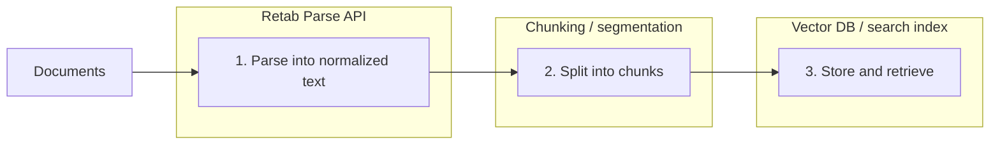

### Introduction

The `parse` method turns a document into normalized text content, returned both page-by-page and as one combined string. It is the right tool when you need readable document text for RAG pipelines, search indexing, prompting, debugging, or any workflow that works on free text rather than schema-constrained extraction.

Unlike `extract`, `parse` does not try to fit the document into a JSON schema. Instead, it returns:

- `pages`: one parsed string per page
- `text`: the full document content as a single string
- `document`: basic file metadata
- `usage`: page count and credits consumed

Table content can be rendered as `html`, `markdown`, `yaml`, or `json`, depending on what your downstream system expects.



For chunking, [chonkie](https://chonkie.ai/) is a good fit for RAG-style pipelines.

## Parse API

<ParamField body="ParseRequest" type="ParseRequest">
  <Expandable title="properties">

<ParamField body="document" type="MIMEData" required>
  The document to parse. The HTTP API accepts `MIMEData`. The SDK also accepts convenient local inputs such as file paths, file-like objects, images, buffers, and URLs, then converts them for you.
</ParamField>

<ParamField body="model" type="string" default="retab-small">
  The model used for parsing.
</ParamField>

<ParamField body="table_parsing_format" type='"markdown" | "yaml" | "html" | "json"' default="html">
  Controls how tables are represented in the parsed text.
</ParamField>

<ParamField body="image_resolution_dpi" type="integer" default="192">
  DPI used when rasterizing pages for OCR-backed parsing. Accepted values are `96` to `300`.
</ParamField>

  </Expandable>
</ParamField>

<ResponseField name="Returns" type="ParseResponse">
  A parsed document payload with text content and usage metadata.
  <Expandable title="properties">
    <ResponseField name="document" type="FileRef">
      Processed document metadata with `id`, `filename`, and `mime_type`.
    </ResponseField>

    <ResponseField name="usage" type="RetabUsage">
      Processing usage information including `page_count` and `credits`.
    </ResponseField>

    <ResponseField name="pages" type="array[string]">
      Parsed content for each page.
    </ResponseField>

    <ResponseField name="text" type="string">
      Full document content as a single string.
    </ResponseField>
  </Expandable>
</ResponseField>

## Use Case: Preparing Documents For RAG

This pattern is useful when you want Retab to handle document parsing and your application to handle chunking and indexing.

<CodeGroup>
```python Python
from retab import Retab
from chonkie import SentenceChunker

client = Retab()

result = client.documents.parse(
    document="technical-manual.pdf",
    model="retab-small",
    table_parsing_format="markdown",
    image_resolution_dpi=192,
)

chunker = SentenceChunker(
    tokenizer_or_token_counter="gpt2",
    chunk_size=512,
    chunk_overlap=128,
    min_sentences_per_chunk=1,
)

all_chunks = []
for page_num, page_text in enumerate(result.pages, start=1):
    chunks = list(chunker(page_text))
    for chunk_idx, chunk in enumerate(chunks):
        all_chunks.append(
            {
                "page": page_num,
                "chunk_id": f"page_{page_num}_chunk_{chunk_idx}",
                "text": str(chunk),
                "document": result.document.filename,
            }
        )

print(f"Created {len(all_chunks)} chunks from {result.usage.page_count} pages")
```

```javascript JavaScript
import { Retab } from '@retab/node';

const client = new Retab();

const result = await client.documents.parse({
  document: 'technical-manual.pdf',
  model: 'retab-small',
  table_parsing_format: 'markdown',
  image_resolution_dpi: 192,
});

const allChunks = [];
result.pages.forEach((pageText, index) => {
  const pageNum = index + 1;
  const sentences = pageText.split(/[.!?]+/).filter((s) => s.trim().length > 0);

  for (let i = 0; i < sentences.length; i += 3) {
    allChunks.push({
      page: pageNum,
      chunk_id: `page_${pageNum}_chunk_${Math.floor(i / 3)}`,
      text: sentences.slice(i, i + 3).join('. '),
      document: result.document.filename,
    });
  }
});

console.log(`Created ${allChunks.length} chunks from ${result.usage.page_count} pages`);
console.log(result.text);
```

```typescript TypeScript
import { Retab, type ParseRequest, type ParseResponse } from '@retab/node';

interface ChunkData {
  page: number;
  chunk_id: string;
  text: string;
  document: string;
}

const client = new Retab();

const parseRequest: ParseRequest = {
  document: 'technical-manual.pdf',
  model: 'retab-small',
  table_parsing_format: 'markdown',
  image_resolution_dpi: 192,
};

const result: ParseResponse = await client.documents.parse(parseRequest);

const allChunks: ChunkData[] = [];
result.pages.forEach((pageText, index) => {
  const pageNum = index + 1;
  const sentences = pageText.split(/[.!?]+/).filter((s) => s.trim().length > 0);

  for (let i = 0; i < sentences.length; i += 3) {
    allChunks.push({
      page: pageNum,
      chunk_id: `page_${pageNum}_chunk_${Math.floor(i / 3)}`,
      text: sentences.slice(i, i + 3).join('. '),
      document: result.document.filename,
    });
  }
});

console.log(`Created ${allChunks.length} chunks from ${result.usage.page_count} pages`);
console.log(result.text);
```
</CodeGroup>

## Best Practices

### When To Use Parse

- Use `parse` when your downstream system wants readable text.
- Use `extract` when you need typed fields that match a schema.

### Picking A Table Format

- Use `markdown` for chunking, prompting, and most RAG pipelines.
- Use `html` when preserving table structure matters more than readability.
- Use `json` or `yaml` when another parser will consume the table output directly.

### Choosing DPI

- Start with `192` DPI for general-purpose parsing.
- Drop to `96` DPI when throughput matters more than OCR quality.
- Increase toward `300` DPI for scans, fine print, or low-quality images.

### Indexing Advice

- Store the page number with every chunk you create from `result.pages`.
- Keep the original `document.id` or `document.filename` alongside indexed text so retrieval results remain traceable.
