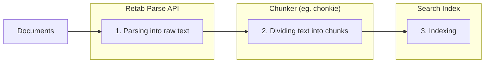

### Introduction

The `parse` method in Retab's document processing pipeline converts any document into cleaned, raw markdown text with page-by-page extraction. This endpoint is ideal for extracting cleaned document content to be used as context for downstream processing, such as RAG pipelines, custom ingestion pipelines, embeddings classification, and content indexing workflows.

The typical RAG workflow follows these steps:

1. **Parsing**: Extract clean text from documents using Retab's `parse` method
2. **Chunking**: Split the text into manageable blocks (sentences, paragraphs, etc..) called "chunks" for embedding
3. **Indexing**: Store chunks in a vector database or any other search index for retrieval

For chunking, **we recommend** [chonkie](https://chonkie.ai/) - a powerful and flexible text chunking library designed specifically for RAG pipelines.



Unlike other methods that focus on chat formatting or structured extraction, `parse` provides:
- **Clean Text Output**: Removes formatting artifacts and provides readable text
- **Page-by-Page Processing**: Access content from individual pages
- **Flexible Table Formats**: Choose how tables are represented (HTML, Markdown, JSON, YAML)
- **OCR Integration**: Handles both text-based and image-based documents
- **Batch Processing Ready**: Efficient for processing multiple documents

## Parse API

<ParamField body="ParseRequest" type="ParseRequest">
  <Expandable title="properties">

<ParamField body="document" type="MIMEData" required>
  The document to parse. Can be a file path, bytes, or PIL.Image.Image object.
</ParamField>

<ParamField body="model" type="LLMModel">
  The AI model to use for document parsing. Recommended: `gemini-2.5-flash` for speed, `gpt-4.1-nano` for accuracy.
</ParamField>

<ParamField body="table_parsing_format" type="TableParsingFormat" default="html">
  Format for parsing tables within the document:
  - `"html"` (default): Tables converted to HTML format
  - `"markdown"`: Tables converted to Markdown format
  - `"yaml"`: Tables converted to YAML format
  - `"json"`: Tables converted to JSON format
</ParamField>

<ParamField body="image_resolution_dpi" type="integer" default="72">
  DPI (dots per inch) for image processing. Higher values (150-300) for better OCR quality.
</ParamField>

<ParamField body="browser_canvas" type="BrowserCanvas" default="A4">
  Canvas size for document rendering. Options: "A4", "Letter", "Legal", "A3".
</ParamField>

<ParamField body="idempotency_key" type="string">
  Optional idempotency key for the request to ensure the same operation is not performed multiple times.
</ParamField>
</Expandable>
</ParamField>

<ResponseField name="Returns" type="ParseResult Object">
A ParseResult object containing the extracted text content and processing information.
  <Expandable title="properties">
    <ResponseField name="document" type="BaseMIMEData Object">
      Processed document metadata containing file information.
    </ResponseField>

    <ResponseField name="usage" type="RetabUsage Object">
      Processing usage information including page count and credits consumed.
    </ResponseField>

    <ResponseField name="pages" type="array[string]">
      Text content of each page as separate strings in the array.
    </ResponseField>

    <ResponseField name="text" type="string">
      Complete text content of the document as a single concatenated string.
    </ResponseField>
  </Expandable>
</ResponseField>

## Use Case: RAG (Retrieval-Augmented Generation) Pipeline Preparation

Prepare documents for RAG applications by extracting and chunking text content.

<CodeGroup>
```python RAG Pipeline Preparation
from retab import Retab
from chonkie import SentenceChunker

reclient = Retab()

# Parse the document
result = reclient.documents.parse(
    document="technical-manual.pdf",
    model="gemini-2.5-flash",
    table_parsing_format="markdown",  # Better for RAG
    image_resolution_dpi=150  # Higher quality for technical docs
)

# Initialize chunker for RAG
chunker = SentenceChunker(
    tokenizer_or_token_counter="gpt2",
    chunk_size=512,
    chunk_overlap=128,
    min_sentences_per_chunk=1
)

# Process each page and create chunks
all_chunks = []
for page_num, page_text in enumerate(result.pages, 1):
    chunks = list(chunker(page_text))
    
    for chunk_idx, chunk in enumerate(chunks):
        chunk_data = {
            "page": page_num,
            "chunk_id": f"page_{page_num}_chunk_{chunk_idx}",
            "text": str(chunk),
            "document": result.document.name
        }
        all_chunks.append(chunk_data)

print(f"Created {len(all_chunks)} chunks from {result.usage.page_count} pages")
```
</CodeGroup>


## Best Practices

### Model Selection
- **`gemini-2.5-pro`**: Most accurate and robust model, recommended for complex or high-stakes document parsing tasks.
- **`gemini-2.5-flash`**: Best for speed and cost-effectiveness, suitable for most general-purpose documents.
- **`gemini-2.5-flash-lite`**: Fastest and most cost-efficient, ideal for simple documents or high-volume batch processing where maximum throughput is needed.

### Image Quality Settings
- **Standard documents**: 72-96 DPI
- **Technical documents**: 150 DPI  
- **Fine print/small text**: 300+ DPI

