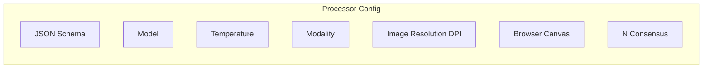

Processors are reusable configurations for document extraction that can be called via the API route `https://api.retab.com/v1/processors/{processor_id}/submit`.




Processors eliminate the complexity of manually configuring extraction parameters for each document, allowing you to focus on defining your output schema and reusing proven configurations across multiple documents and automation workflows.

Please check the [API Reference](https://docs.retab.com/api-reference/processors/create) for more details.


## Processor

---

| Method                    | Purpose                                                                                   |
| ------------------------- | ----------------------------------------------------------------------------------------- |
| **`create`**             | Creates a new processor configuration with specified extraction parameters.               |
| **`submit`**             | Processes documents using an existing processor and returns structured JSON.             |

### Object

<ResponseField name="Object" type="Processor">
A Processor object containing the extraction configuration.
  <Expandable title="properties">

<ResponseField name="object" type="string">
  The type of object. Always `"processor"`.
</ResponseField>

<ResponseField name="processor_id" type="string">
  Unique identifier for the processor, prefixed with `"proc_"`.
</ResponseField>

<ResponseField name="name" type="string">
  Human-readable name of the processor.
</ResponseField>

<ResponseField name="json_schema" type="Dict[str, Any]">
  Output schema describing the JSON structure you expect to extract.
</ResponseField>

<ResponseField name="model" type="string">
  AI model used for extraction (e.g., `"gpt-4o-mini"`, `"gpt-4o"`, `"claude-3-5-sonnet"`).
</ResponseField>

<ResponseField name="modality" type="string">
  Document processing pipeline (`"native"`, `"vision"`, `"text"`).
</ResponseField>

<ResponseField name="temperature" type="float">
  Model temperature for controlling randomness (0–2). Lower values are more deterministic.
</ResponseField>

<ResponseField name="image_resolution_dpi" type="int">
  Resolution in DPI when converting PDFs to images for vision models.
</ResponseField>

<ResponseField name="browser_canvas" type="string">
  Viewport size for rendering HTML documents (`"A3"`, `"A4"`, `"A5"`).
</ResponseField>

<ResponseField name="n_consensus" type="int">
  Number of parallel extraction runs for consensus voting. Values > 1 enable consensus mode.
</ResponseField>

<ResponseField name="created_at" type="datetime">
  UTC timestamp when the processor was created.
</ResponseField>

<ResponseField name="updated_at" type="datetime">
  UTC timestamp of the last processor update.
</ResponseField>

  </Expandable>
</ResponseField>

### Create

Creates a new processor with the specified extraction configuration. The processor can then be used repeatedly to extract structured data from documents.

<ResponseField name="Returns" type="Processor">
A newly created Processor object with the specified configuration.
</ResponseField>

<CodeGroup>

```python Request
from retab import Retab

reclient = Retab()

processor = reclient.processors.create(
    name="Invoice Processor",
    json_schema="Invoice_schema.json",
    model="gpt-4o-mini",
    modality="native",
    temperature=0.1,
    n_consensus=3,  # Enable consensus with 3 parallel runs
    image_resolution_dpi=150
)
```

```json Response
{
  "object": "processor",
  "processor_id": "proc_01G34H8J2K",
  "name": "Invoice Processor",
  "json_schema": {
    "type": "object",
    "properties": {
      "invoice_number": {
        "type": "string",
        "description": "The unique invoice identifier"
      },
      "total_amount": {
        "type": "number",
        "description": "Total invoice amount including taxes"
      },
      "issue_date": {
        "type": "string",
        "description": "Invoice issue date in ISO format"
      },
      "vendor_name": {
        "type": "string",
        "description": "Name of the vendor or company"
      }
    },
    "required": ["invoice_number", "total_amount", "issue_date", "vendor_name"]
  },
  "model": "gpt-4o-mini",
  "temperature": 0.1,
  "image_resolution_dpi": 150,
  "n_consensus": 3,
  "created_at": "2025-01-21T12:34:56Z",
  "updated_at": "2025-01-21T12:34:56Z"
}
```

</CodeGroup>

### Submit

Processes a document using an existing project configuration and returns the extracted structured data.

<ResponseField name="Returns" type="Dict[str, Any]">
The extracted data as a JSON object matching the project's schema.
</ResponseField>

<CodeGroup>

```python Request
from retab import Retab, MIMEData

reclient = Retab()

with open("invoice.pdf", "rb") as f:
    mime = MIMEData.from_bytes(f.read(), filename="invoice.pdf")

completion = reclient.processors.submit(
    processor_id="proc_01G34H8J2K",
    document=mime
)
```


```json Response
{
  "invoice_number": "INV-2024-0789",
  "total_amount": 1576.75,
  "issue_date": "2024-04-15",
  "vendor_name": "ACME Corporation"
}
```

</CodeGroup>
