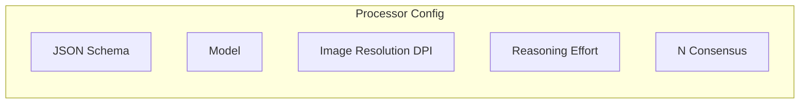

Processors are reusable configurations for document extraction that can be called via the API route `https://api.retab.com/v1/processors/{processor_id}/submit`.


```mermaid
graph BT
    subgraph PS["Processor Config"]
        JS["JSON Schema"]
        M["Model"]
        DPI["Image Resolution DPI"]
        RE["Reasoning Effort"]
        NC["N Consensus"]
    end
```

Processors eliminate the complexity of manually configuring extraction parameters for each document, allowing you to focus on defining your output schema and reusing proven configurations across multiple documents and automation workflows.

Use `POST /v1/processors` to create a processor and `POST /v1/processors/{processor_id}/submit` to run it.

## Processor

---

| Method       | Purpose                                                                      |
| ------------ | ---------------------------------------------------------------------------- |
| **`create`** | Creates a new processor configuration with specified extraction parameters.  |
| **`submit`** | Processes documents using an existing processor and returns structured JSON. |

### Object

<ResponseField name="Object" type="Processor">
A Processor object containing the extraction configuration.
  <Expandable title="properties">

<ResponseField name="object" type="string">
  The type of object. Always `"processor"`.
</ResponseField>

<ResponseField name="id" type="string">
  Unique identifier for the processor, prefixed with `"proc_"`.
</ResponseField>

<ResponseField name="name" type="string">
  Human-readable name of the processor.
</ResponseField>

<ResponseField name="json_schema" type="Dict[str, Any]">
  Output schema describing the JSON structure you expect to extract.
</ResponseField>

<ResponseField name="model" type="string">
  AI model used for extraction, such as `"retab-small"`.
</ResponseField>

<ResponseField name="image_resolution_dpi" type="int">
  Resolution in DPI when converting PDFs to images for vision models.
</ResponseField>

<ResponseField name="reasoning_effort" type="string">
  Reasoning effort passed to compatible models. Defaults to `"minimal"`.
</ResponseField>

<ResponseField name="n_consensus" type="int">
  Number of parallel extraction runs for consensus voting. Values > 1 enable
  consensus mode.
</ResponseField>

<ResponseField name="schema_id" type="string">
  Stable ID derived from the processor JSON schema.
</ResponseField>

<ResponseField name="schema_data_id" type="string">
  Stable data-version ID derived from the processor JSON schema.
</ResponseField>

<ResponseField name="updated_at" type="datetime">
  UTC timestamp of the last processor update.
</ResponseField>

  </Expandable>
</ResponseField>

### Create

Creates a new processor with the specified extraction configuration. The processor can then be used repeatedly to extract structured data from documents.

<ResponseField name="Returns" type="Processor">
  A newly created Processor object with the specified configuration.
</ResponseField>

<CodeGroup>

```python Request
import os
import requests

api_key = os.environ["RETAB_API_KEY"]

schema = {
    "type": "object",
    "properties": {
        "invoice_number": {"type": "string"},
        "total_amount": {"type": "number"},
    },
}

response = requests.post(
    "https://api.retab.com/v1/processors",
    headers={"Api-Key": api_key},
    json={
        "name": "Invoice Processor",
        "json_schema": schema,
        "model": "retab-small",
        "n_consensus": 3,
        "image_resolution_dpi": 150,
    },
)
response.raise_for_status()
processor = response.json()
```

```go Request
// The Go SDK does not yet model the processors API. Call /v1/processors directly.
package main

import (
	"bytes"
	"encoding/json"
	"fmt"
	"io"
	"log"
	"net/http"
	"os"
)

func main() {
	schema := map[string]any{
		"type": "object",
		"properties": map[string]any{
			"invoice_number": map[string]any{"type": "string"},
			"total_amount":   map[string]any{"type": "number"},
		},
	}

	body, err := json.Marshal(map[string]any{
		"name":                 "Invoice Processor",
		"json_schema":          schema,
		"model":                "retab-small",
		"n_consensus":          3,
		"image_resolution_dpi": 150,
	})
	if err != nil {
		log.Fatal(err)
	}

	req, err := http.NewRequest(
		http.MethodPost,
		"https://api.retab.com/v1/processors",
		bytes.NewReader(body),
	)
	if err != nil {
		log.Fatal(err)
	}
	req.Header.Set("Api-Key", os.Getenv("RETAB_API_KEY"))
	req.Header.Set("Content-Type", "application/json")

	resp, err := http.DefaultClient.Do(req)
	if err != nil {
		log.Fatal(err)
	}
	defer resp.Body.Close()

	payload, _ := io.ReadAll(resp.Body)
	fmt.Println(string(payload))
}
```

```json Response
{
  "object": "processor",
  "id": "proc_01G34H8J2K",
  "name": "Invoice Processor",
  "json_schema": {
    "type": "object",
    "properties": {
      "invoice_number": {
        "type": "string",
        "description": "The unique invoice identifier"
      },
      "total_amount": {
        "type": "number",
        "description": "Total invoice amount including taxes"
      },
      "issue_date": {
        "type": "string",
        "description": "Invoice issue date in ISO format"
      },
      "vendor_name": {
        "type": "string",
        "description": "Name of the vendor or company"
      }
    },
    "required": ["invoice_number", "total_amount", "issue_date", "vendor_name"]
  },
  "model": "retab-small",
  "reasoning_effort": "minimal",
  "image_resolution_dpi": 150,
  "n_consensus": 3,
  "schema_id": "schema_...",
  "schema_data_id": "schema_data_...",
  "updated_at": "2025-01-21T12:34:56Z"
}
```

</CodeGroup>

### Submit

Processes a document using an existing processor configuration and returns the extracted structured data.

<ResponseField name="Returns" type="Dict[str, Any]">
  The parsed chat completion response. The extracted data is available as the
  top-level `data` shortcut and at `choices[0].message.parsed`.
</ResponseField>

<CodeGroup>

```python Request
import os
import requests

api_key = os.environ["RETAB_API_KEY"]

with open("invoice.pdf", "rb") as invoice:
    response = requests.post(
        "https://api.retab.com/v1/processors/proc_01G34H8J2K/submit",
        headers={"Api-Key": api_key},
        files={"document": ("invoice.pdf", invoice, "application/pdf")},
    )
response.raise_for_status()
completion = response.json()
print(completion["data"])
```

```go Request
// The Go SDK does not yet model the processors API. Submit documents as multipart form data.
package main

import (
	"bytes"
	"fmt"
	"io"
	"log"
	"mime/multipart"
	"net/http"
	"os"
)

func main() {
	file, err := os.Open("invoice.pdf")
	if err != nil {
		log.Fatal(err)
	}
	defer file.Close()

	var body bytes.Buffer
	writer := multipart.NewWriter(&body)
	part, err := writer.CreateFormFile("document", "invoice.pdf")
	if err != nil {
		log.Fatal(err)
	}
	if _, err := io.Copy(part, file); err != nil {
		log.Fatal(err)
	}
	if err := writer.Close(); err != nil {
		log.Fatal(err)
	}

	req, err := http.NewRequest(
		http.MethodPost,
		"https://api.retab.com/v1/processors/proc_01G34H8J2K/submit",
		&body,
	)
	if err != nil {
		log.Fatal(err)
	}
	req.Header.Set("Api-Key", os.Getenv("RETAB_API_KEY"))
	req.Header.Set("Content-Type", writer.FormDataContentType())

	resp, err := http.DefaultClient.Do(req)
	if err != nil {
		log.Fatal(err)
	}
	defer resp.Body.Close()

	payload, _ := io.ReadAll(resp.Body)
	fmt.Println(string(payload))
}
```

```json Response
{
  "id": "chatcmpl_...",
  "object": "chat.completion",
  "choices": [
    {
      "index": 0,
      "message": {
        "role": "assistant",
        "content": "{\"invoice_number\":\"INV-2024-0789\",\"total_amount\":1576.75}",
        "parsed": {
          "invoice_number": "INV-2024-0789",
          "total_amount": 1576.75
        }
      },
      "finish_reason": "stop"
    }
  ],
  "data": {
    "invoice_number": "INV-2024-0789",
    "total_amount": 1576.75
  }
}
```

</CodeGroup>
