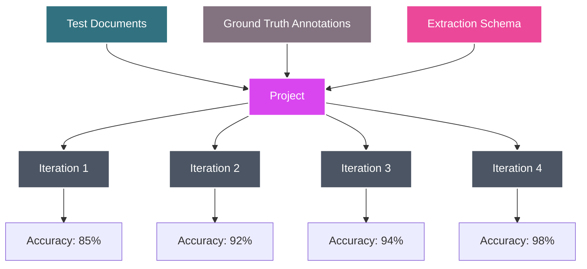
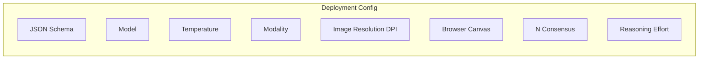

---

## title: Projects

---

Projects provide a systematic way to **test and validate your extraction schemas** against known ground truth data. Think of it as unit testing for document AI—you can measure accuracy, compare different models, and optimize your extraction pipelines with confidence.

A project consists of **documents with annotations** (your test data), **iterations** (test runs with different settings), and a **schema** (what you want to extract). This structure lets you run A/B tests between models and systematically improve your document processing accuracy.




## How it works

1. **Create an project** with your extraction schema
2. **Upload test documents** with manually verified ground truth annotations
3. **Run iterations** with different model settings (GPT-4o vs GPT-4o-mini, consensus, etc.)
4. **Compare results** to find the optimal configuration for your use case

Retab automatically calculates accuracy metrics by comparing each iteration's output against your ground truth annotations, giving you objective performance measurements.

## Schema Optimization Through Projects

One of the most powerful features of projects is **schema refinement**. When you see poor accuracy on specific fields, you can:

- **Improve descriptions**: Make field descriptions more specific and unambiguous
- **Add reasoning prompts**: Use `X-ReasoningPrompt` for complex calculations or logic
- **Refine field types**: Adjust data types based on extraction patterns

<CodeGroup>

```json Before: Vague Schema
{
  "type": "object",
  "properties": {
    "amount": {
      "type": "number",
      "description": "The amount"
    },
    "date": {
      "type": "string", 
      "description": "The date"
    }
  }
}
```

```json After: Optimized Schema
{
  "type": "object",
  "properties": {
    "amount": {
      "type": "number",
      "description": "Total invoice amount in USD, excluding taxes",
      "X-ReasoningPrompt": "If multiple amounts are present, identify the final total. If currency conversion is needed, show the calculation."
    },
    "date": {
      "type": "string",
      "format": "date", 
      "description": "Invoice issue date in YYYY-MM-DD format"
    }
  }
}
```

</CodeGroup>

**The project workflow for schema optimization:**
1. Run initial project → identify low-accuracy fields
2. Refine descriptions and add reasoning prompts → re-run project  
3. Compare accuracy improvements → iterate until satisfied
4. Deploy optimized schema to production

---

## Quick Start
<Tip>
While you can create projects programmatically with the SDK, we recommend using the [Retab platform](https://retab.com) for project management. The web interface provides powerful schema editing tools, visual result comparisons, and collaborative features that make optimization much easier.
</Tip>


Let's create an project for invoice processing:

<CodeGroup>

```python Step 1: Create Project
from retab import Retab

client = Retab()

# Define what you want to extract
invoice_schema = {
    "type": "object",
    "properties": {
        "invoice_number": {"type": "string"},
        "total_amount": {"type": "number"},
        "vendor_name": {"type": "string"},
        "invoice_date": {"type": "string"}
    },
    "required": ["invoice_number", "total_amount", "vendor_name"]
}

project = client.projects.create(
    name="Invoice Processing Test",
    json_schema=invoice_schema
)
```

```python Step 2: Add Test Documents
# Upload documents with ground truth annotations
client.projects.documents.create(
    project_id=project.id,
    document="test_invoice_1.pdf",
    annotation={
        "invoice_number": "INV-2024-001",
        "total_amount": 1250.00,
        "vendor_name": "Acme Corp",
        "invoice_date": "2024-01-15"
    }
)

client.projects.documents.create(
    project_id=project.id,
    document="test_invoice_2.pdf", 
    annotation={
        "invoice_number": "INV-2024-002",
        "total_amount": 850.75,
        "vendor_name": "Beta Industries",
        "invoice_date": "2024-01-16"
    }
)
```

```python Step 3: Run Iterations
# Test different model configurations
iteration_mini = client.projects.iterations.create(
    project_id=project.id,
    model="gpt-4o-mini",
    temperature=0.0
)

iteration_4o = client.projects.iterations.create(
    project_id=project.id,
    model="gpt-4o", 
    temperature=0.0
)

iteration_consensus = client.projects.iterations.create(
    project_id=project.id,
    model="gpt-4o-mini",
    temperature=0.2,
    n_consensus=3
)

# Process all documents
client.projects.iterations.process(
    project_id=project.id,
    iteration_id=iteration_mini.id
)
```

```python Step 4: Compare Results
# Get performance metrics
project = client.projects.get(project.id)

for iteration in project.iterations:
    print(f"Model: {iteration.inference_settings.model}")
    print(f"Accuracy: {iteration.metrics.overall_accuracy:.1%}")
    print(f"Cost per document: ${iteration.avg_cost:.4f}")
    print("---")
```

</CodeGroup>

---


### Key Benefits

1. **Objective Measurement**: Get precise accuracy scores instead of subjective assessments
2. **Model Comparison**: Test different models to find the best fit
3. **Schema Validation**: Identify which fields are hardest to extract accurately
4. **Cost Optimization**: Balance accuracy against processing costs for your use case

### Best Practices

- **Diverse Test Data**: Include various document formats, qualities, and edge cases
- **Sufficient Volume**: Use at least 5-10 test documents for reliable metrics
- **Ground Truth Quality**: Double-check your annotations—bad ground truth leads to misleading results

## Deployments

Deployments are project-based configurations for document extraction that can be called via the API route `https://api.retab.com/v1/projects/extract/{project_id}/{iteration_id}`.



This is the primary method for executing document extraction using project-based configurations.

<ResponseField name="Returns" type="RetabParsedChatCompletion">
The extracted data as a JSON object matching the project's schema.
</ResponseField>

<CodeGroup>

```python Request (Single Document)
from retab import Retab, MIMEData

client = Retab()

# Process a single document
with open("invoice.pdf", "rb") as f:
    mime = MIMEData.from_bytes(f.read(), filename="invoice.pdf")

completion = client.projects.extract(
    project_id="proj_01G34H8J2K",
    iteration_id="iter_01G34H8J2L",  # or "base-configuration" for default settings
    document=mime,
    temperature=0.1,  # Optional override
    seed=42,  # Optional for reproducibility
    store=True  # Whether to store results
)
```

```python Request (Multiple Documents)
from retab import Retab, MIMEData

client = Retab()

# Process multiple documents in batch
documents = []
for filename in ["invoice1.pdf", "invoice2.pdf", "invoice3.pdf"]:
    with open(filename, "rb") as f:
        mime = MIMEData.from_bytes(f.read(), filename=filename)
        documents.append(mime)

results = client.projects.extract(
    project_id="proj_01G34H8J2K",
    iteration_id="iter_01G34H8J2L",
    documents=documents,  # Note: plural for batch processing
    temperature=0.1,
    store=True
)
```

```python Request (Base Configuration)
from retab import Retab, MIMEData

client = Retab()

# Use project's default settings with base-configuration
with open("invoice.pdf", "rb") as f:
    mime = MIMEData.from_bytes(f.read(), filename="invoice.pdf")

completion = client.projects.extract(
    project_id="proj_01G34H8J2K",
    iteration_id="base-configuration",  # Use project defaults
    document=mime
)
```

```json Response (Single Document)
{
  "object": "chat.completion",
  "id": "extr_01G34H8J2K",
  "created": 1641024000,
  "model": "gpt-4o-mini",
  "choices": [
    {
      "index": 0,
      "message": {
        "role": "assistant",
        "content": null,
        "parsed": {
          "invoice_number": "INV-2024-0789",
          "total_amount": 1576.75,
          "issue_date": "2024-04-15",
          "vendor_name": "ACME Corporation"
        }
      },
      "finish_reason": "stop"
    }
  ],
  "usage": {
    "prompt_tokens": 1250,
    "completion_tokens": 85,
    "total_tokens": 1335
  }
}
```

```json Response (Multiple Documents)
{
  "object": "chat.completion",
  "id": "extr_01G34H8J2K",
  "created": 1641024000,
  "model": "gpt-4o-mini",
  "choices": [
    {
      "index": 0,
      "message": {
        "role": "assistant",
        "content": null,
        "parsed": [
          {
            "invoice_number": "INV-2024-0789",
            "total_amount": 1576.75,
            "issue_date": "2024-04-15",
            "vendor_name": "ACME Corporation"
          },
          {
            "invoice_number": "INV-2024-0790",
            "total_amount": 2340.50,
            "issue_date": "2024-04-16",
            "vendor_name": "ACME Corporation"
          },
          {
            "invoice_number": "INV-2024-0791",
            "total_amount": 890.25,
            "issue_date": "2024-04-17",
            "vendor_name": "ACME Corporation"
          }
        ]
      },
      "finish_reason": "stop"
    }
  ],
  "usage": {
    "prompt_tokens": 3750,
    "completion_tokens": 255,
    "total_tokens": 4005
  }
}
```

</CodeGroup>

### Parameters

<ResponseField name="project_id" type="string" required>
  ID of the project
</ResponseField>

<ResponseField name="iteration_id" type="string" required>
  ID of the specific iteration to use, or `"base-configuration"` to use the project's default settings.
</ResponseField>

<ResponseField name="document" type="Path | str | bytes | IOBase | MIMEData | PIL.Image.Image | HttpUrl">
  Single document to process (mutually exclusive with documents).
</ResponseField>

<ResponseField name="documents" type="List[Path | str | bytes | IOBase | MIMEData | PIL.Image.Image | HttpUrl]">
  List of documents to process (mutually exclusive with document).
</ResponseField>

<ResponseField name="temperature" type="float">
  Optional temperature override for this specific request. Overrides the default temperature.
</ResponseField>

<ResponseField name="seed" type="int">
  Optional seed for reproducible results across multiple runs.
</ResponseField>

<ResponseField name="store" type="bool" default="True">
  Whether to store the extraction results for later retrieval and analysis.
</ResponseField>

Please check the [API Reference](https://docs.retab.com/api-reference/projects/extract) for complete method documentation.

