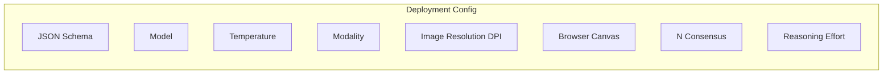

---

## title: Projects

---

Projects provide a systematic way to **test and validate your extraction schemas** against known ground truth data. Think of it as evals for document AI. You can measure accuracy, compare different models, and optimize your extraction pipelines with confidence.

A project consists of **documents with annotations** (your test data), **iterations** (test runs with different settings), and a **schema** (what you want to extract). This structure lets you run A/B tests between models and systematically improve your document processing accuracy.

## Deployments

Deployments are project-based configurations for document extraction that can be called via the API route `https://api.retab.com/v1/projects/extract/{project_id}/{iteration_id}`.



This is the primary method for executing document extraction using project-based configurations.

<ResponseField name="Returns" type="RetabParsedChatCompletion">
The extracted data as a JSON object matching the project's schema.
</ResponseField>

<CodeGroup>

```python Request (Single Document)
from retab import Retab, MIMEData

client = Retab()

# Process a single document
with open("invoice.pdf", "rb") as f:
    mime = MIMEData.from_bytes(f.read(), filename="invoice.pdf")

completion = client.projects.extract(
    project_id="proj_01G34H8J2K",
    iteration_id="iter_01G34H8J2L",  # or "base-configuration" for default settings
    document=mime,
    temperature=0.1,  # Optional override
    seed=42,  # Optional for reproducibility
    store=True  # Whether to store results
)
```

```python Request (Multiple Documents)
from retab import Retab, MIMEData

client = Retab()

# Process multiple documents in batch
documents = []
for filename in ["invoice1.pdf", "invoice2.pdf", "invoice3.pdf"]:
    with open(filename, "rb") as f:
        mime = MIMEData.from_bytes(f.read(), filename=filename)
        documents.append(mime)

results = client.projects.extract(
    project_id="proj_01G34H8J2K",
    iteration_id="iter_01G34H8J2L",
    documents=documents,  # Note: plural for batch processing
    temperature=0.1,
    store=True
)
```

```python Request (Base Configuration)
from retab import Retab, MIMEData

client = Retab()

# Use project's default settings with base-configuration
with open("invoice.pdf", "rb") as f:
    mime = MIMEData.from_bytes(f.read(), filename="invoice.pdf")

completion = client.projects.extract(
    project_id="proj_01G34H8J2K",
    iteration_id="base-configuration",  # Use project defaults
    document=mime
)
```

```json Response (Single Document)
{
  "object": "chat.completion",
  "id": "extr_01G34H8J2K",
  "created": 1641024000,
  "model": "gpt-4o-mini",
  "choices": [
    {
      "index": 0,
      "message": {
        "role": "assistant",
        "content": null,
        "parsed": {
          "invoice_number": "INV-2024-0789",
          "total_amount": 1576.75,
          "issue_date": "2024-04-15",
          "vendor_name": "ACME Corporation"
        }
      },
      "finish_reason": "stop"
    }
  ],
  "usage": {
    "prompt_tokens": 1250,
    "completion_tokens": 85,
    "total_tokens": 1335
  }
}
```

```json Response (Multiple Documents)
{
  "object": "chat.completion",
  "id": "extr_01G34H8J2K",
  "created": 1641024000,
  "model": "gpt-4o-mini",
  "choices": [
    {
      "index": 0,
      "message": {
        "role": "assistant",
        "content": null,
        "parsed": [
          {
            "invoice_number": "INV-2024-0789",
            "total_amount": 1576.75,
            "issue_date": "2024-04-15",
            "vendor_name": "ACME Corporation"
          },
          {
            "invoice_number": "INV-2024-0790",
            "total_amount": 2340.50,
            "issue_date": "2024-04-16",
            "vendor_name": "ACME Corporation"
          },
          {
            "invoice_number": "INV-2024-0791",
            "total_amount": 890.25,
            "issue_date": "2024-04-17",
            "vendor_name": "ACME Corporation"
          }
        ]
      },
      "finish_reason": "stop"
    }
  ],
  "usage": {
    "prompt_tokens": 3750,
    "completion_tokens": 255,
    "total_tokens": 4005
  }
}
```

</CodeGroup>

### Parameters

<ResponseField name="project_id" type="string" required>
  ID of the project
</ResponseField>

<ResponseField name="iteration_id" type="string" required>
  ID of the specific iteration to use, or `"base-configuration"` to use the project's default settings.
</ResponseField>

<ResponseField name="document" type="Path | str | bytes | IOBase | MIMEData | PIL.Image.Image | HttpUrl">
  Single document to process (mutually exclusive with documents).
</ResponseField>

<ResponseField name="documents" type="List[Path | str | bytes | IOBase | MIMEData | PIL.Image.Image | HttpUrl]">
  List of documents to process (mutually exclusive with document).
</ResponseField>

<ResponseField name="temperature" type="float">
  Optional temperature override for this specific request. Overrides the default temperature.
</ResponseField>

<ResponseField name="seed" type="int">
  Optional seed for reproducible results across multiple runs.
</ResponseField>

<ResponseField name="store" type="bool" default="True">
  Whether to store the extraction results for later retrieval and analysis.
</ResponseField>

Please check the [API Reference](https://docs.retab.com/api-reference/projects/extract) for complete method documentation.

