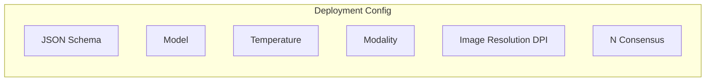

---

## title: Projects

---

Projects provide a systematic way to **test and validate your extraction schemas** against known ground truth data. Think of it as evals for document AI. You can measure accuracy, compare different models, and optimize your extraction pipelines with confidence.

A project consists of **documents with annotations** (your test data), **iterations** (test runs with different settings), and a **schema** (what you want to extract). This structure lets you run A/B tests between models and systematically improve your document processing accuracy.

## Deployments

Deployments are project-based configurations for document extraction that can be called via the API route `https://api.retab.com/v1/projects/extract/{project_id}`.



This is the primary method for executing document extraction using project-based configurations.

<ResponseField name="Returns" type="RetabParsedChatCompletion">
The extracted data as a JSON object matching the project's schema.
</ResponseField>

<CodeGroup>

```python Python
from retab import Retab

client = Retab()

completion = client.projects.extract(
    project_id="proj_01G34H8J2K",
    document="invoice.pdf"
)
```

```javascript JavaScript
import { Retab } from '@retab/node';

const client = new Retab();

const completion = await client.projects.extract({
    project_id: "proj_01G34H8J2K",
    document: "invoice.pdf"
});
```

```json Response
{
  "object": "chat.completion",
  "id": "extr_01G34H8J2K",
  "created": 1641024000,
  "model": "gpt-5.2",
  "choices": [
    {
      "index": 0,
      "message": {
        "role": "assistant",
        "content": null,
        "parsed": {
          "invoice_number": "INV-2024-0789",
          "total_amount": 1576.75,
          "issue_date": "2024-04-15",
          "vendor_name": "ACME Corporation"
        }
      },
      "finish_reason": "stop"
    }
  ],
  "usage": {
    "prompt_tokens": 1250,
    "completion_tokens": 85,
    "total_tokens": 1335
  }
}
```

</CodeGroup>

### Parameters

<ResponseField name="project_id" type="string" required>
  ID of the project
</ResponseField>

<ResponseField name="iteration_id" type="string" required>
  ID of the specific iteration to use, or `"base-configuration"` to use the project's default settings.
</ResponseField>

<ResponseField name="document" type="Path | str | bytes | IOBase | MIMEData | PIL.Image.Image | HttpUrl">
  Document to process.
</ResponseField>


<ResponseField name="temperature" type="float">
  Optional temperature override for this specific request. Overrides the default temperature.
</ResponseField>

<ResponseField name="metadata" type="dict[str, str]">
  Custom key-value metadata to attach to the extraction for organization and filtering.
</ResponseField>

## Organizing Extractions with Metadata

The `metadata` parameter allows you to attach custom key-value pairs to your extractions, making it easy to organize, filter, and retrieve results later. This is particularly useful when processing documents for multiple clients, departments, or workflows within a single project.

<CodeGroup>

```python Python
from retab import Retab

client = Retab()

# Attach metadata to organize extractions by customer
completion = client.projects.extract(
    project_id="proj_01G34H8J2K",
    document="invoice.pdf",
    metadata={
        "organization_id": "org_acme_corp",
        "department": "accounting",
        "batch_id": "batch_2024_04"
    }
)
```

```javascript JavaScript
import { Retab } from '@retab/node';

const client = new Retab();

// Attach metadata to organize extractions by customer
const completion = await client.projects.extract({
    project_id: "proj_01G34H8J2K",
    document: "invoice.pdf",
    metadata: {
        organization_id: "org_acme_corp",
        department: "accounting",
        batch_id: "batch_2024_04"
    }
});
```

</CodeGroup>

Common use cases for metadata include:
- **Multi-tenant applications**: Tag extractions with `organization_id` or `customer_id` to separate data by client
- **Workflow tracking**: Add `batch_id`, `pipeline_stage`, or `source_system` to trace document processing
- **Categorization**: Include `document_type`, `region`, or `priority` for filtering and reporting

Please check the [API Reference](https://docs.retab.com/api-reference/projects/extract) for complete method documentation.
