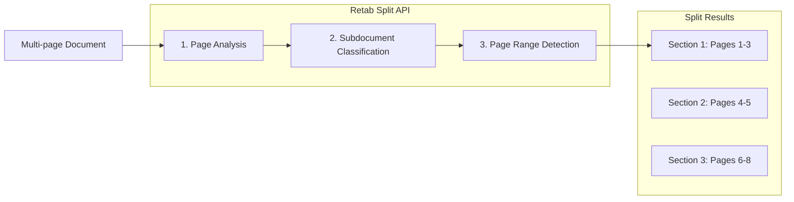

---

## title: Splitting

---

### Introduction

The `split` method in Retab's document processing pipeline analyzes multi-page documents and classifies pages into user-defined subdocuments, returning the page ranges for each section. This endpoint is ideal for processing batches of mixed documents, separating combined PDFs, and organizing document collections by content type.

Common use cases include:

1. **Document Separation**: Split a combined PDF containing multiple invoices, receipts, or contracts into individual sections
2. **Content Classification**: Identify and locate different sections within legal documents, reports, or manuals
3. **Batch Processing**: Process scanned document batches and organize them by document type
4. **Workflow Automation**: Route different document types to appropriate processing pipelines



Key features of the Split API:

- **Multi-Subdocument Support**: Define multiple subdocuments with descriptions for accurate classification
- **Discontinuous Sections**: Same subdocument can appear multiple times for non-contiguous content
- **Page-Level Precision**: Get exact start and end pages for each section
- **Vision-Based Analysis**: Uses LLM vision capabilities for accurate page classification
- **Flexible Subdocuments**: Define custom subdocuments tailored to your document types

## Split API

<ParamField body="SplitRequest" type="SplitRequest">
  <Expandable title="properties">

<ParamField body="document" type="MIMEData" required>
  The document to split. Can be a file path, bytes, or PIL.Image.Image object.
</ParamField>

<ParamField body="model" type="LLMModel" required>
  The AI model to use for document splitting. Recommended: `retab-small` for best balance of speed and accuracy.
</ParamField>

<ParamField body="subdocuments" type="array[Subdocument]" required>
  List of subdocuments to classify document sections into. Each subdocument has:
  - `name`: Unique identifier for the subdocument
  - `description`: Detailed description to help the model identify this subdocument
  - `partition_key` (optional): A key to further partition this subdocument. When specified, the API will identify individual items within pages belonging to this subdocument (e.g., "property ID" to find individual properties within a real estate document, or "invoice number" to separate multiple invoices)
</ParamField>

<ParamField body="context" type="string">
  Additional context to guide the split operation. Useful for providing iteration context from a loop, business rules, or other relevant information that helps the model make more accurate splitting decisions.
</ParamField>

</Expandable>
</ParamField>

<ResponseField name="Returns" type="SplitResponse Object">
A SplitResponse object containing the classified sections with their page ranges.
  <Expandable title="properties">
    <ResponseField name="splits" type="array[SplitResult]">
      List of document sections, each containing:
      - `name`: The subdocument name this section belongs to
      - `pages`: List of 1-indexed page numbers belonging to this section
      - `partitions`: List of sub-page partitions (populated when `partition_key` is specified on the subdocument)
        - `key`: The partition key value (e.g., property ID, invoice number)
        - `pages`: List of page numbers in this partition
        - `first_page_y_start`: Y-coordinate (0-1) where content starts on the first page
        - `last_page_y_end`: Y-coordinate (0-1) where content ends on the last page
    </ResponseField>
  </Expandable>
</ResponseField>

## Use Case: Processing Mixed Document Batches

Split a batch of scanned documents into individual invoices, receipts, and contracts for separate processing.

<CodeGroup>
```python Python
from retab import Retab

client = Retab()

# Define subdocuments for classification
subdocuments = [
    {"name": "invoice", "description": "Invoice documents with billing details, line items, totals, and payment terms"},
    {"name": "receipt", "description": "Payment receipts showing transaction confirmation and amounts paid"},
    {"name": "contract", "description": "Legal contracts with terms, conditions, and signature blocks"},
    {"name": "cover_letter", "description": "Cover letters or transmittal documents"},
]

# Split the document batch
result = client.documents.split(
    document="scanned_batch.pdf",
    model="retab-small",
    subdocuments=subdocuments
)

# Process each section
for split in result.splits:
    print(f"{split.name}: pages {split.pages}")

    # Route to appropriate processing pipeline
    if split.name == "invoice":
        # Extract invoice data
        pass
    elif split.name == "contract":
        # Extract contract terms
        pass

# Example output:
# invoice: pages [1, 2, 3]
# receipt: pages [4]
# contract: pages [5, 6, 7, 8]
# invoice: pages [9, 10, 11]
```

```javascript Javascript
import { Retab } from '@retab/node';

const client = new Retab();

// Define subdocuments for classification
const subdocuments = [
    { name: "invoice", description: "Invoice documents with billing details, line items, totals, and payment terms" },
    { name: "receipt", description: "Payment receipts showing transaction confirmation and amounts paid" },
    { name: "contract", description: "Legal contracts with terms, conditions, and signature blocks" },
    { name: "cover_letter", description: "Cover letters or transmittal documents" },
];

// Split the document batch
const result = await client.documents.split({
    document: "scanned_batch.pdf",
    model: "retab-small",
    subdocuments: subdocuments
});

// Process each section
result.splits.forEach(split => {
    console.log(`${split.name}: pages ${split.pages}`);

    // Route to appropriate processing pipeline
    if (split.name === "invoice") {
        // Extract invoice data
    } else if (split.name === "contract") {
        // Extract contract terms
    }
});
```

```typescript TypeScript
import { Retab, type SplitRequest, type SplitResponse, type Subdocument } from '@retab/node';

const client = new Retab();

// Define subdocuments for classification
const subdocuments: Subdocument[] = [
    { name: "invoice", description: "Invoice documents with billing details, line items, totals, and payment terms" },
    { name: "receipt", description: "Payment receipts showing transaction confirmation and amounts paid" },
    { name: "contract", description: "Legal contracts with terms, conditions, and signature blocks" },
    { name: "cover_letter", description: "Cover letters or transmittal documents" },
];

// Split the document batch
const splitRequest: SplitRequest = {
    document: "scanned_batch.pdf",
    model: "retab-small",
    subdocuments: subdocuments
};

const result: SplitResponse = await client.documents.split(splitRequest);

// Process each section
result.splits.forEach(split => {
    console.log(`${split.name}: pages ${split.pages}`);

    // Route to appropriate processing pipeline
    if (split.name === "invoice") {
        // Extract invoice data
    } else if (split.name === "contract") {
        // Extract contract terms
    }
});
```
</CodeGroup>

## Use Case: Extracting Specific Sections from Reports

Identify and locate specific sections within a large report or manual.

<CodeGroup>
```python Python
from retab import Retab

client = Retab()

# Define report sections
subdocuments = [
    {"name": "executive_summary", "description": "Executive summary with key findings and recommendations"},
    {"name": "financial_data", "description": "Financial statements, tables, charts, and numerical analysis"},
    {"name": "appendix", "description": "Appendices with supporting documents, references, and supplementary materials"},
    {"name": "table_of_contents", "description": "Table of contents or index pages"},
]

result = client.documents.split(
    document="annual_report.pdf",
    model="retab-small",
    subdocuments=subdocuments
)

# Find specific sections
financial_sections = [s for s in result.splits if s.name == "financial_data"]
for section in financial_sections:
    print(f"Financial data found on pages {section.pages}")
```

```javascript Javascript
import { Retab } from '@retab/node';

const client = new Retab();

// Define report sections
const subdocuments = [
    { name: "executive_summary", description: "Executive summary with key findings and recommendations" },
    { name: "financial_data", description: "Financial statements, tables, charts, and numerical analysis" },
    { name: "appendix", description: "Appendices with supporting documents, references, and supplementary materials" },
    { name: "table_of_contents", description: "Table of contents or index pages" },
];

const result = await client.documents.split({
    document: "annual_report.pdf",
    model: "retab-small",
    subdocuments: subdocuments
});

// Find specific sections
const financialSections = result.splits.filter(s => s.name === "financial_data");
financialSections.forEach(section => {
    console.log(`Financial data found on pages ${section.pages}`);
});
```
</CodeGroup>

## Understanding Discontinuous Sections

The Split API correctly handles cases where the same subdocument appears multiple times in a document. This is common when documents are interleaved or when similar content appears in different parts of a document.

```python
# Example: A batch with interleaved invoices and receipts
result = client.documents.split(
    document="mixed_batch.pdf",
    model="retab-small",
    subdocuments=[
        {"name": "invoice", "description": "Invoice documents"},
        {"name": "receipt", "description": "Receipt documents"},
    ]
)

# The result correctly identifies non-contiguous sections:
# invoice: pages [1, 2, 3]
# receipt: pages [4, 5]
# invoice: pages [6, 7, 8]  <- Same subdocument, different location
# receipt: pages [9, 10]

for split in result.splits:
    print(f"{split.name}: pages {split.pages}")
```

## Use Case: Partitioning by Key

When processing documents that contain multiple items of the same type (e.g., multiple invoices, multiple property listings), use the `partition_key` parameter to identify and separate individual items within a subdocument.

<CodeGroup>
```python Python
from retab import Retab

client = Retab()

# Define subdocuments with partition_key for sub-document splitting
subdocuments = [
    {
        "name": "property_listing",
        "description": "Real estate property listings with details and photos",
        "partition_key": "property ID"  # Will identify individual properties
    },
    {
        "name": "legal_notices",
        "description": "Legal disclaimers and general information"
    },
]

result = client.documents.split(
    document="property_portfolio.pdf",
    model="retab-small",
    subdocuments=subdocuments
)

# Access partitions for each subdocument
for split in result.splits:
    print(f"{split.name}: pages {split.pages}")
    for partition in split.partitions:
        print(f"  Property {partition.key}: pages {partition.pages}")

# Example output:
# property_listing: pages [1, 2, 3, 4, 5, 6]
#   Property PROP-001: pages [1, 2]
#   Property PROP-002: pages [3, 4]
#   Property PROP-003: pages [5, 6]
# legal_notices: pages [7]
```

```javascript Javascript
import { Retab } from '@retab/node';

const client = new Retab();

// Define subdocuments with partition_key for sub-document splitting
const subdocuments = [
    {
        name: "property_listing",
        description: "Real estate property listings with details and photos",
        partition_key: "property ID"  // Will identify individual properties
    },
    {
        name: "legal_notices",
        description: "Legal disclaimers and general information"
    },
];

const result = await client.documents.split({
    document: "property_portfolio.pdf",
    model: "retab-small",
    subdocuments: subdocuments
});

// Access partitions for each subdocument
result.splits.forEach(split => {
    console.log(`${split.name}: pages ${split.pages}`);
    split.partitions.forEach(partition => {
        console.log(`  Property ${partition.key}: pages ${partition.pages}`);
    });
});
```
</CodeGroup>

## Sub-Page Precision with Partitions

The Split API provides sub-page level precision through the `partitions` field. Each partition includes Y-coordinates that specify exactly where content starts and ends within pages, enabling precise extraction even when document sections don't align with page boundaries.

```python
from retab import Retab

client = Retab()

result = client.documents.split(
    document="multi_invoice_page.pdf",
    model="retab-small",
    subdocuments=[
        {
            "name": "invoice",
            "description": "Invoice documents with billing details",
            "partition_key": "invoice number"
        },
    ]
)

# Access partition details for precise content boundaries
for split in result.splits:
    print(f"{split.name}: pages {split.pages}")
    for partition in split.partitions:
        print(f"  Invoice {partition.key}:")
        print(f"    Pages: {partition.pages}")
        print(f"    Y-start: {partition.first_page_y_start:.2f}")
        print(f"    Y-end: {partition.last_page_y_end:.2f}")

# Example output:
# invoice: pages [1, 2]
#   Invoice INV-001:
#     Pages: [1]
#     Y-start: 0.00
#     Y-end: 0.45
#   Invoice INV-002:
#     Pages: [1, 2]
#     Y-start: 0.45
#     Y-end: 0.60
#   Invoice INV-003:
#     Pages: [2]
#     Y-start: 0.60
#     Y-end: 1.00
```

The Y-coordinates are normalized values between 0 and 1, where:
- `0.0` represents the top of the page
- `1.0` represents the bottom of the page
- `first_page_y_start` indicates where content begins on the first page of the partition
- `last_page_y_end` indicates where content ends on the last page of the partition

## Best Practices

### Subdocument Definition
- **Be Specific**: Provide detailed descriptions that distinguish subdocuments clearly
- **Use Visual Cues**: Mention distinctive visual elements (logos, headers, layouts)
- **Include Examples**: Reference typical content found in each subdocument
- **Avoid Overlap**: Ensure subdocuments are mutually exclusive when possible

### Model Selection
- **`retab-large`**: Best balance of speed and accuracy for most use cases
- **`retab-small`**: Higher accuracy for complex or ambiguous documents
- **`retab-micro`**: Alternative for specific document types

### Performance Tips
- **Batch Similar Documents**: Group similar document types for consistent results
- **Limit Subdocuments**: Use 3-7 well-defined subdocuments for best accuracy
- **Test Descriptions**: Iterate on subdocument descriptions to improve classification

