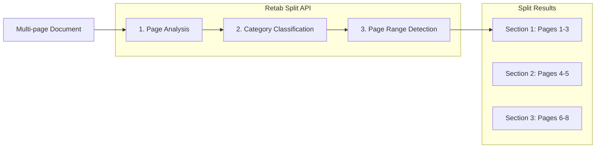

---

## title: Splitting

---

### Introduction

The `split` method in Retab's document processing pipeline analyzes multi-page documents and classifies pages into user-defined categories, returning the page ranges for each section. This endpoint is ideal for processing batches of mixed documents, separating combined PDFs, and organizing document collections by content type.

Common use cases include:

1. **Document Separation**: Split a combined PDF containing multiple invoices, receipts, or contracts into individual sections
2. **Content Classification**: Identify and locate different sections within legal documents, reports, or manuals
3. **Batch Processing**: Process scanned document batches and organize them by document type
4. **Workflow Automation**: Route different document types to appropriate processing pipelines



Key features of the Split API:

- **Multi-Category Support**: Define multiple categories with descriptions for accurate classification
- **Discontinuous Sections**: Same category can appear multiple times for non-contiguous content
- **Page-Level Precision**: Get exact start and end pages for each section
- **Vision-Based Analysis**: Uses LLM vision capabilities for accurate page classification
- **Flexible Categories**: Define custom categories tailored to your document types

## Split API

<ParamField body="SplitRequest" type="SplitRequest">
  <Expandable title="properties">

<ParamField body="document" type="MIMEData" required>
  The document to split. Can be a file path, bytes, or PIL.Image.Image object.
</ParamField>

<ParamField body="model" type="LLMModel" required>
  The AI model to use for document splitting. Recommended: `retab-small` for best balance of speed and accuracy.
</ParamField>

<ParamField body="categories" type="array[Category]" required>
  List of categories to classify document sections into. Each category has:
  - `name`: Unique identifier for the category
  - `description`: Detailed description to help the model identify this category
</ParamField>

</Expandable>
</ParamField>

<ResponseField name="Returns" type="SplitResponse Object">
A SplitResponse object containing the classified sections with their page ranges.
  <Expandable title="properties">
    <ResponseField name="splits" type="array[SplitResult]">
      List of document sections, each containing:
      - `name`: The category name this section belongs to
      - `start_page`: 1-indexed start page of the section
      - `end_page`: 1-indexed end page of the section (inclusive)
    </ResponseField>
  </Expandable>
</ResponseField>

## Use Case: Processing Mixed Document Batches

Split a batch of scanned documents into individual invoices, receipts, and contracts for separate processing.

<CodeGroup>
```python Python
from retab import Retab

client = Retab()

# Define categories for classification
categories = [
    {"name": "invoice", "description": "Invoice documents with billing details, line items, totals, and payment terms"},
    {"name": "receipt", "description": "Payment receipts showing transaction confirmation and amounts paid"},
    {"name": "contract", "description": "Legal contracts with terms, conditions, and signature blocks"},
    {"name": "cover_letter", "description": "Cover letters or transmittal documents"},
]

# Split the document batch
result = client.documents.split(
    document="scanned_batch.pdf",
    model="retab-small",
    categories=categories
)

# Process each section
for split in result.splits:
    print(f"{split.name}: pages {split.start_page}-{split.end_page}")
    
    # Route to appropriate processing pipeline
    if split.name == "invoice":
        # Extract invoice data
        pass
    elif split.name == "contract":
        # Extract contract terms
        pass

# Example output:
# invoice: pages 1-3
# receipt: pages 4-4
# contract: pages 5-8
# invoice: pages 9-11
```

```javascript Javascript
import { Retab } from '@retab/node';

const client = new Retab();

// Define categories for classification
const categories = [
    { name: "invoice", description: "Invoice documents with billing details, line items, totals, and payment terms" },
    { name: "receipt", description: "Payment receipts showing transaction confirmation and amounts paid" },
    { name: "contract", description: "Legal contracts with terms, conditions, and signature blocks" },
    { name: "cover_letter", description: "Cover letters or transmittal documents" },
];

// Split the document batch
const result = await client.documents.split({
    document: "scanned_batch.pdf",
    model: "retab-small",
    categories: categories
});

// Process each section
result.splits.forEach(split => {
    console.log(`${split.name}: pages ${split.start_page}-${split.end_page}`);
    
    // Route to appropriate processing pipeline
    if (split.name === "invoice") {
        // Extract invoice data
    } else if (split.name === "contract") {
        // Extract contract terms
    }
});
```

```typescript TypeScript
import { Retab, type SplitRequest, type SplitResponse } from '@retab/node';

interface Category {
    name: string;
    description: string;
}

const client = new Retab();

// Define categories for classification
const categories: Category[] = [
    { name: "invoice", description: "Invoice documents with billing details, line items, totals, and payment terms" },
    { name: "receipt", description: "Payment receipts showing transaction confirmation and amounts paid" },
    { name: "contract", description: "Legal contracts with terms, conditions, and signature blocks" },
    { name: "cover_letter", description: "Cover letters or transmittal documents" },
];

// Split the document batch
const splitRequest: SplitRequest = {
    document: "scanned_batch.pdf",
    model: "retab-small",
    categories: categories
};

const result: SplitResponse = await client.documents.split(splitRequest);

// Process each section
result.splits.forEach(split => {
    console.log(`${split.name}: pages ${split.start_page}-${split.end_page}`);
    
    // Route to appropriate processing pipeline
    if (split.name === "invoice") {
        // Extract invoice data
    } else if (split.name === "contract") {
        // Extract contract terms
    }
});
```
</CodeGroup>

## Use Case: Extracting Specific Sections from Reports

Identify and locate specific sections within a large report or manual.

<CodeGroup>
```python Python
from retab import Retab

client = Retab()

# Define report sections
categories = [
    {"name": "executive_summary", "description": "Executive summary with key findings and recommendations"},
    {"name": "financial_data", "description": "Financial statements, tables, charts, and numerical analysis"},
    {"name": "appendix", "description": "Appendices with supporting documents, references, and supplementary materials"},
    {"name": "table_of_contents", "description": "Table of contents or index pages"},
]

result = client.documents.split(
    document="annual_report.pdf",
    model="retab-small",
    categories=categories
)

# Find specific sections
financial_sections = [s for s in result.splits if s.name == "financial_data"]
for section in financial_sections:
    print(f"Financial data found on pages {section.start_page}-{section.end_page}")
```

```javascript Javascript
import { Retab } from '@retab/node';

const client = new Retab();

// Define report sections
const categories = [
    { name: "executive_summary", description: "Executive summary with key findings and recommendations" },
    { name: "financial_data", description: "Financial statements, tables, charts, and numerical analysis" },
    { name: "appendix", description: "Appendices with supporting documents, references, and supplementary materials" },
    { name: "table_of_contents", description: "Table of contents or index pages" },
];

const result = await client.documents.split({
    document: "annual_report.pdf",
    model: "retab-small",
    categories: categories
});

// Find specific sections
const financialSections = result.splits.filter(s => s.name === "financial_data");
financialSections.forEach(section => {
    console.log(`Financial data found on pages ${section.start_page}-${section.end_page}`);
});
```
</CodeGroup>

## Understanding Discontinuous Sections

The Split API correctly handles cases where the same category appears multiple times in a document. This is common when documents are interleaved or when similar content appears in different parts of a document.

```python
# Example: A batch with interleaved invoices and receipts
result = client.documents.split(
    document="mixed_batch.pdf",
    model="retab-small",
    categories=[
        {"name": "invoice", "description": "Invoice documents"},
        {"name": "receipt", "description": "Receipt documents"},
    ]
)

# The result correctly identifies non-contiguous sections:
# invoice: pages 1-3
# receipt: pages 4-5
# invoice: pages 6-8  <- Same category, different location
# receipt: pages 9-10

for split in result.splits:
    print(f"{split.name}: pages {split.start_page}-{split.end_page}")
```

## Best Practices

### Category Definition
- **Be Specific**: Provide detailed descriptions that distinguish categories clearly
- **Use Visual Cues**: Mention distinctive visual elements (logos, headers, layouts)
- **Include Examples**: Reference typical content found in each category
- **Avoid Overlap**: Ensure categories are mutually exclusive when possible

### Model Selection
- **`retab-large`**: Best balance of speed and accuracy for most use cases
- **`retab-small`**: Higher accuracy for complex or ambiguous documents
- **`retab-micro`**: Alternative for specific document types

### Performance Tips
- **Batch Similar Documents**: Group similar document types for consistent results
- **Limit Categories**: Use 3-7 well-defined categories for best accuracy
- **Test Descriptions**: Iterate on category descriptions to improve classification

