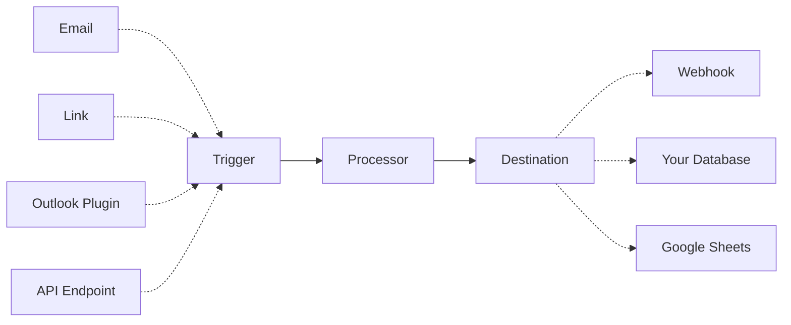

An **automation** is a way to automatically send data to your processor when triggered by events like receiving an email, clicking a link, or using the Outlook plugin. Once triggered, the processor extracts structured data from your documents and sends the results to your chosen destination.

## Introduction

Retab uses HTTPS to send webhook events to your app as a JSON payload representing a `WebhookRequest` object.
You will need a server with a webhook endpoint that will receive the `webhook_request` payload, allowing you to process them as you want after that.

<ResponseField name="webhook_request" type="WebhookRequest Object">
  <Expandable title="properties">
    <ResponseField name="completion" type="ParsedChatCompletion">
      The parsed chat completion object, containing the extracted data.
    </ResponseField>

    <ResponseField name="user" type="EmailStr">
      The user email address.
    </ResponseField>


    <ResponseField name="file_payload" type="MIMEData">
      The file payload object, containing the file name, url and other metadata.
      <Expandable title="properties">
        <ResponseField name="filename" type="str">
          The filename of the file.
        </ResponseField>
        <ResponseField name="url" type="str">
          The URL of the file in base64 format.
        </ResponseField>
      </Expandable>
    </ResponseField>


    <ResponseField name="metadata" type="dict[str, Any]">
      Some additional metadata.
    </ResponseField>

  </Expandable>
</ResponseField>

To start receiving webhook events in your app:

- Create a new processor with your extraction configuration.
- Create a webhook endpoint handler to receive event data POST requests.
- Create a new automation sending data to your webhook endpoint.
- Test your webhook endpoint handler locally using the Retab SDK.
- Secure your webhook endpoint.

## Create your processor

Start by creating a **processor** with your extraction configuration.

<CodeGroup>
```python Python
import os
import requests

api_key = os.environ["RETAB_API_KEY"]
schema = {
"type": "object",
"properties": {
"invoice_number": {"type": "string"},
},
}

response = requests.post(
"https://api.retab.com/v1/processors",
headers={"Authorization": f"Bearer {api_key}"},
json={
"name": "Invoice Processor",
"model": "retab-small",
"json_schema": schema,
},
)
response.raise_for_status()
processor = response.json()

````

```go Go
// The Go SDK does not yet model the processors API. Call /v1/processors directly.
package main

import (
	"bytes"
	"encoding/json"
	"fmt"
	"io"
	"log"
	"net/http"
	"os"
)

func main() {
	schema := map[string]any{
		"type": "object",
		"properties": map[string]any{
			"invoice_number": map[string]any{"type": "string"},
		},
	}
	body, err := json.Marshal(map[string]any{
		"name":        "Invoice Processor",
		"model":       "retab-small",
		"json_schema": schema,
	})
	if err != nil {
		log.Fatal(err)
	}

	req, err := http.NewRequest(
		http.MethodPost,
		"https://api.retab.com/v1/processors",
		bytes.NewReader(body),
	)
	if err != nil {
		log.Fatal(err)
	}
	req.Header.Set("Authorization", "Bearer "+os.Getenv("RETAB_API_KEY"))
	req.Header.Set("Content-Type", "application/json")

	resp, err := http.DefaultClient.Do(req)
	if err != nil {
		log.Fatal(err)
	}
	defer resp.Body.Close()

	payload, _ := io.ReadAll(resp.Body)
	fmt.Println(string(payload))
}
````

```ruby Ruby
# The Ruby SDK does not yet model the processors API. Call /v1/processors directly.
require 'net/http'
require 'uri'
require 'json'

schema = {
  type: 'object',
  properties: {
    invoice_number: { type: 'string' },
  },
}

uri = URI('https://api.retab.com/v1/processors')
http = Net::HTTP.new(uri.host, uri.port)
http.use_ssl = true
request = Net::HTTP::Post.new(uri)
request['Authorization'] = "Bearer #{ENV['RETAB_API_KEY']}"
request['Content-Type'] = 'application/json'
request.body = {
  name: 'Invoice Processor',
  model: 'retab-small',
  json_schema: schema,
}.to_json

response = http.request(request)
processor = JSON.parse(response.body)
```


```typescript TypeScript
const schema = {
  type: "object",
  properties: { invoice_number: { type: "string" } },
};

const response = await fetch("https://api.retab.com/v1/processors", {
  method: "POST",
  headers: {
    "Authorization": `Bearer ${process.env.RETAB_API_KEY!}`,
    "Content-Type": "application/json",
  },
  body: JSON.stringify({
    name: "Invoice Processor",
    model: "retab-small",
    json_schema: schema,
  }),
});

const processor = await response.json();
console.log(processor);
```

```rust Rust
let api_key = std::env::var("RETAB_API_KEY")?;
let schema = serde_json::json!({
    "type": "object",
    "properties": { "invoice_number": { "type": "string" } }
});

let processor: serde_json::Value = reqwest::Client::new()
    .post("https://api.retab.com/v1/processors")
    .header("Authorization", format!("Bearer {}", api_key))
    .json(&serde_json::json!({
        "name": "Invoice Processor",
        "model": "retab-small",
        "json_schema": schema
    }))
    .send()
    .await?
    .error_for_status()?
    .json()
    .await?;
println!("{processor:#?}");
```

```csharp C#
using System.Net.Http.Json;

var apiKey = Environment.GetEnvironmentVariable("RETAB_API_KEY")!;
using var http = new HttpClient();
http.DefaultRequestHeaders.Add("Authorization", "Bearer " + apiKey);

var response = await http.PostAsJsonAsync("https://api.retab.com/v1/processors", new
{
    name = "Invoice Processor",
    model = "retab-small",
    json_schema = new { type = "object", properties = new { invoice_number = new { type = "string" } } },
});
response.EnsureSuccessStatusCode();
Console.WriteLine(await response.Content.ReadAsStringAsync());
```

```php PHP
<?php
$schema = ['type' => 'object', 'properties' => ['invoice_number' => ['type' => 'string']]];
$ch = curl_init('https://api.retab.com/v1/processors');
curl_setopt_array($ch, [
    CURLOPT_POST => true,
    CURLOPT_RETURNTRANSFER => true,
    CURLOPT_HTTPHEADER => ['Authorization: Bearer ' . getenv('RETAB_API_KEY'), 'Content-Type: application/json'],
    CURLOPT_POSTFIELDS => json_encode(['name' => 'Invoice Processor', 'model' => 'retab-small', 'json_schema' => $schema]),
]);
echo curl_exec($ch) . PHP_EOL;
curl_close($ch);
```


```java Java
import java.net.URI;
import java.net.http.HttpClient;
import java.net.http.HttpRequest;
import java.net.http.HttpResponse;

public final class Example {
  public static void main(String[] args) throws Exception {
    String body =
        "{\"name\":\"Invoice Processor\","
            + "\"model\":\"retab-small\","
            + "\"json_schema\":{\"type\":\"object\"}}";

    HttpRequest request =
        HttpRequest.newBuilder(URI.create("https://api.retab.com/v1/processors"))
            .header("Authorization", "Bearer " + System.getenv("RETAB_API_KEY"))
            .header("Content-Type", "application/json")
            .POST(HttpRequest.BodyPublishers.ofString(body))
            .build();

    HttpResponse<String> response =
        HttpClient.newHttpClient().send(request, HttpResponse.BodyHandlers.ofString());
    System.out.println(response.body());
  }
}
```
</CodeGroup>

## Create your FastAPI server with a webhook

Then, set up a FastAPI route that will handle incoming webhook POST requests. You will need it to create an automation. Below is an example of a simple FastAPI application with a webhook endpoint:

<CodeGroup>
```python main.py
import json
from fastapi import FastAPI, Request

app = FastAPI()

@app.post("/webhook")
async def webhook(request: Request):
webhook_request = await request.json()
invoice_object = json.loads(
webhook_request["completion"]["choices"][0]["message"]["content"] or "{}"
)
print("📬 Webhook received:", invoice_object)
return {"status": "success", "data": invoice_object}

# To run the FastAPI app locally, use the command:

# uvicorn your_module_name:app --reload

if **name** == "**main**":
import uvicorn
uvicorn.run(app, host="0.0.0.0", port=8000)

````

```ruby Ruby (Sinatra)
require 'sinatra'
require 'json'

post '/webhook' do
  request.body.rewind
  webhook_request = JSON.parse(request.body.read)
  invoice_object = JSON.parse(
    webhook_request.dig('completion', 'choices', 0, 'message', 'content') || '{}'
  )
  puts "📬 Webhook received: #{invoice_object}"
  content_type :json
  { status: 'success', data: invoice_object }.to_json
end

# Run with: ruby your_module_name.rb -p 8000
```

You can test the webhook endpoint locally with a tool like curl or Postman. For example, using curl:

```bash testing locally
curl -X POST http://localhost:8000/webhook \
     -H "Content-Type: application/json" \
     -d '{"completion":{"id":"id","choices":[{"index":0,"message":{"content":"{\"name\" : \"Team Meeting!\", \"date\" : \"2023-12-31\" }","role":"assistant"}}],"created":0,"model":"gpt-5-nano","object":"chat.completion","likelihoods":{}},"file_payload":{"filename":"example.pdf","url":"data:application/pdf;base64,the_content_of_the_pdf_file"}}'
````


```typescript TypeScript
import express from "express";

const app = express();
app.use(express.json());

app.post("/webhook", (req, res) => {
  const invoiceObject = JSON.parse(
    req.body.completion?.choices?.[0]?.message?.content ?? "{}",
  );
  console.log("Webhook received:", invoiceObject);
  res.json({ status: "success", data: invoiceObject });
});
```

```go Go
package main

import (
	"encoding/json"
	"log"
	"net/http"
)

func webhook(w http.ResponseWriter, r *http.Request) {
	var payload map[string]any
	if err := json.NewDecoder(r.Body).Decode(&payload); err != nil {
		http.Error(w, err.Error(), http.StatusBadRequest)
		return
	}
	log.Printf("Webhook received: %#v", payload)
	_ = json.NewEncoder(w).Encode(map[string]string{"status": "success"})
}
```

```rust Rust
use axum::{extract::Json, response::IntoResponse, routing::post, Router};
use serde_json::{json, Value};

async fn webhook(Json(payload): Json<Value>) -> impl IntoResponse {
    println!("Webhook received: {payload:#?}");
    Json(json!({ "status": "success", "data": payload }))
}

let app = Router::new().route("/webhook", post(webhook));
```

```csharp C#
var builder = WebApplication.CreateBuilder(args);
var app = builder.Build();

app.MapPost("/webhook", async (HttpRequest request) =>
{
    var payload = await request.ReadFromJsonAsync<Dictionary<string, object>>();
    Console.WriteLine($"Webhook received: {payload}");
    return Results.Json(new { status = "success", data = payload });
});
```

```php PHP
<?php
$payload = json_decode(file_get_contents('php://input'), true);
$content = $payload['completion']['choices'][0]['message']['content'] ?? '{}';
$invoiceObject = json_decode($content, true);
error_log('Webhook received: ' . json_encode($invoiceObject));
header('Content-Type: application/json');
echo json_encode(['status' => 'success', 'data' => $invoiceObject]);
```


```java Java
import com.sun.net.httpserver.HttpServer;
import java.net.InetSocketAddress;
import java.nio.charset.StandardCharsets;

public final class Example {
  public static void main(String[] args) throws Exception {
    HttpServer server = HttpServer.create(new InetSocketAddress(8000), 0);
    server.createContext(
        "/webhook",
        exchange -> {
          byte[] payload = exchange.getRequestBody().readAllBytes();
          System.out.println(new String(payload, StandardCharsets.UTF_8));
          byte[] response = "{\"status\":\"success\"}".getBytes(StandardCharsets.UTF_8);
          exchange.getResponseHeaders().add("Content-Type", "application/json");
          exchange.sendResponseHeaders(200, response.length);
          exchange.getResponseBody().write(response);
          exchange.close();
        });
    server.start();
  }
}
```
</CodeGroup>

## Secure your webhook endpoint

When you set up a webhook, you provide an **HTTP endpoint** on your server for Retab to send data to. If this endpoint is not secured (i.e., it accepts unauthenticated `POST` requests from anywhere), it essentially becomes a public door into your system. **Any actor** could attempt to call this URL and send fake data. This is inherently dangerous: a malicious party might send **forged webhook requests** that masquerade as Retab, but contain bogus or harmful data.

To secure webhook deliveries, Retab employs a **signature verification** mechanism using an HMAC-like scheme. Retab and your application share a **webhook secret** (a random string known only to Retab and you). This secret is available in your [Retab dashboard](https://www.retab.com/dashboard/settings) (Labeled as `WEBHOOKS_SECRET`). Retab uses this secret to include a special signature header with every webhook request. When your endpoint receives the webhook, your code should perform the same HMAC-SHA256 computation on the request body using the shared secret, then compare your computed signature to the value in the `X-Retab-Signature` header. If the signatures **match**, the request truly came from Retab and the payload was not altered in transit.

<Warning>Make sure to set your `WEBHOOKS_SECRET` environment variable with the secret from your [Retab dashboard](https://www.retab.com/dashboard/settings).</Warning>

Here's how to implement signature verification in your FastAPI webhook:

<CodeGroup>
```python Python {13-26}
import hashlib
import hmac
import json
import os

from fastapi import FastAPI, HTTPException, Request

app = FastAPI()


def _verify_signature(payload: bytes, signature_header: str | None, secret: str) -> None:
    """Constant-time HMAC-SHA256 check against the X-Retab-Signature header."""
    if not signature_header:
        raise HTTPException(status_code=400, detail="Missing X-Retab-Signature header")
    expected = hmac.new(secret.encode(), payload, hashlib.sha256).hexdigest()
    if not hmac.compare_digest(expected, signature_header):
        raise HTTPException(status_code=401, detail="Invalid webhook signature")


@app.post("/webhook")
async def webhook_handler(request: Request):
    payload = await request.body()
    _verify_signature(
        payload,
        request.headers.get("X-Retab-Signature"),
        os.environ["WEBHOOKS_SECRET"],
    )

    webhook_request = json.loads(payload.decode("utf-8"))
    invoice_object = json.loads(
        webhook_request["completion"]["choices"][0]["message"]["content"] or "{}"
    )
    print("📬 Webhook received:", invoice_object)
    return {"status": "success", "data": invoice_object}

````

```go Go
package main

import (
	"crypto/hmac"
	"crypto/sha256"
	"encoding/hex"
	"encoding/json"
	"fmt"
	"io"
	"log"
	"net/http"
	"os"
)

type WebhookRequest struct {
	Completion  json.RawMessage   `json:"completion"`
	User        string            `json:"user,omitempty"`
	FilePayload json.RawMessage   `json:"file_payload"`
	Metadata    map[string]any    `json:"metadata,omitempty"`
}

func verifyEvent[T any](body []byte, signature string, secret string) (T, error) {
	var event T

	mac := hmac.New(sha256.New, []byte(secret))
	_, _ = mac.Write(body)
	expected := hex.EncodeToString(mac.Sum(nil))
	if !hmac.Equal([]byte(signature), []byte(expected)) {
		return event, fmt.Errorf("invalid webhook signature")
	}
	if err := json.Unmarshal(body, &event); err != nil {
		return event, err
	}
	return event, nil
}

func handler(w http.ResponseWriter, r *http.Request) {
	body, err := io.ReadAll(r.Body)
	if err != nil {
		http.Error(w, err.Error(), http.StatusBadRequest)
		return
	}
	signature := r.Header.Get("X-Retab-Signature")
	if signature == "" {
		http.Error(w, "Missing X-Retab-Signature header", http.StatusBadRequest)
		return
	}
	event, err := verifyEvent[WebhookRequest](
		body,
		signature,
		os.Getenv("WEBHOOKS_SECRET"),
	)
	if err != nil {
		http.Error(w, fmt.Sprintf("Webhook error: %v", err), http.StatusBadRequest)
		return
	}
	log.Printf("Webhook received: %+v", event)
	w.WriteHeader(http.StatusOK)
	_, _ = w.Write([]byte(`{"status":"success"}`))
}

func main() {
	http.HandleFunc("/webhook", handler)
	log.Fatal(http.ListenAndServe(":8000", nil))
}
````

```ruby Ruby (Sinatra)
require 'sinatra'
require 'json'
require 'openssl'

# Constant-time HMAC-SHA256 check against the X-Retab-Signature header.
def verify_signature(payload, signature_header, secret)
  halt 400, 'Missing X-Retab-Signature header' if signature_header.nil? || signature_header.empty?
  expected = OpenSSL::HMAC.hexdigest('sha256', secret, payload)
  halt 401, 'Invalid webhook signature' unless Rack::Utils.secure_compare(expected, signature_header)
end

post '/webhook' do
  request.body.rewind
  payload = request.body.read
  verify_signature(payload, request.env['HTTP_X_RETAB_SIGNATURE'], ENV['WEBHOOKS_SECRET'])

  webhook_request = JSON.parse(payload)
  invoice_object = JSON.parse(
    webhook_request.dig('completion', 'choices', 0, 'message', 'content') || '{}'
  )
  puts "📬 Webhook received: #{invoice_object}"
  content_type :json
  { status: 'success', data: invoice_object }.to_json
end
```


```typescript TypeScript
import crypto from "crypto";

function verifySignature(payload: Buffer, signature: string | undefined, secret: string) {
  if (!signature) throw new Error("Missing X-Retab-Signature header");
  const expected = crypto.createHmac("sha256", secret).update(payload).digest("hex");
  const a = Buffer.from(expected, "hex");
  const b = Buffer.from(signature, "hex");
  if (a.length !== b.length || !crypto.timingSafeEqual(a, b)) {
    throw new Error("Invalid webhook signature");
  }
}
```

```rust Rust
use hmac::{Hmac, Mac};
use sha2::Sha256;

fn verify_signature(payload: &[u8], signature: &str, secret: &str) -> anyhow::Result<()> {
    let mut mac = Hmac::<Sha256>::new_from_slice(secret.as_bytes())?;
    mac.update(payload);
    let expected = hex::encode(mac.finalize().into_bytes());
    if subtle::ConstantTimeEq::ct_eq(expected.as_bytes(), signature.as_bytes()).unwrap_u8() != 1 {
        anyhow::bail!("invalid webhook signature");
    }
    Ok(())
}
```

```csharp C#
using System.Security.Cryptography;
using System.Text;

static void VerifySignature(byte[] payload, string? signature, string secret)
{
    if (string.IsNullOrEmpty(signature)) throw new InvalidOperationException("Missing X-Retab-Signature header");
    using var hmac = new HMACSHA256(Encoding.UTF8.GetBytes(secret));
    var expected = Convert.ToHexString(hmac.ComputeHash(payload)).ToLowerInvariant();
    if (!CryptographicOperations.FixedTimeEquals(Encoding.UTF8.GetBytes(expected), Encoding.UTF8.GetBytes(signature)))
        throw new InvalidOperationException("Invalid webhook signature");
}
```

```php PHP
<?php
function verify_signature(string $payload, ?string $signature, string $secret): void {
    if (!$signature) {
        http_response_code(400);
        throw new RuntimeException('Missing X-Retab-Signature header');
    }
    $expected = hash_hmac('sha256', $payload, $secret);
    if (!hash_equals($expected, $signature)) {
        http_response_code(401);
        throw new RuntimeException('Invalid webhook signature');
    }
}
```


```java Java
import com.sun.net.httpserver.HttpServer;
import java.net.InetSocketAddress;
import java.nio.charset.StandardCharsets;
import javax.crypto.Mac;
import javax.crypto.spec.SecretKeySpec;

public final class Example {
  static String hmacSha256(byte[] payload, String secret) throws Exception {
    Mac mac = Mac.getInstance("HmacSHA256");
    mac.init(new SecretKeySpec(secret.getBytes(StandardCharsets.UTF_8), "HmacSHA256"));
    byte[] digest = mac.doFinal(payload);
    StringBuilder hex = new StringBuilder();
    for (byte value : digest) {
      hex.append(String.format("%02x", value));
    }
    return hex.toString();
  }

  public static void main(String[] args) throws Exception {
    HttpServer server = HttpServer.create(new InetSocketAddress(8000), 0);
    server.createContext(
        "/webhook",
        exchange -> {
          try {
            byte[] payload = exchange.getRequestBody().readAllBytes();
            String signature = exchange.getRequestHeaders().getFirst("X-Retab-Signature");
            String expected = hmacSha256(payload, System.getenv("WEBHOOKS_SECRET"));
            int status = expected.equals(signature) ? 200 : 401;
            byte[] response = "{\"status\":\"success\"}".getBytes(StandardCharsets.UTF_8);
            exchange.getResponseHeaders().add("Content-Type", "application/json");
            exchange.sendResponseHeaders(status, response.length);
            exchange.getResponseBody().write(response);
          } catch (Exception error) {
            byte[] response = error.getMessage().getBytes(StandardCharsets.UTF_8);
            exchange.sendResponseHeaders(400, response.length);
            exchange.getResponseBody().write(response);
          } finally {
            exchange.close();
          }
        });
    server.start();
  }
}
```
</CodeGroup>

## Exposing local server to the internet using ngrok

<Warning>To continue, you need to deploy your FastAPI app to a server to make your webhook endpoint publicly accessible. We recommend using [Replit](https://replit.com/) to get started quickly if you don't have a server yet. An alternative is to use [ngrok](https://ngrok.com/) to expose your local server to the internet.</Warning>

We have a very simple Dockerfile that fastapi+ngrok to get you started.
Check out the [webhook_server](https://github.com/retab-dev/retab/tree/main/examples/automations/webhook_server) folder for more details.

<Tip>You will need a ngrok auth token to run the docker container. You can get one [here](https://dashboard.ngrok.com/get-started)</Tip>

Start fastapi+ngrok server:

<CodeGroup>
```bash startup
git clone https://github.com/retab-dev/retab.git
cd retab/examples/webhook_server
docker build -t webhook_server .
docker run --rm -it -e NGROK_AUTH_TOKEN=[your_ngrok_auth_token] webhook_server
```

```logs {4} server logs
INFO:     Started server process [1]
INFO:     Waiting for application startup.
🌍 Ngrok tunnel established!
📬 Webhook URL: https://some-random-ngrok-url.ngrok-free.app/webhook
📬 Simple curl for testing: curl -X POST https://some-random-ngrok-url.ngrok-free.app/webhook -H "Content-Type: application/json" -d '{"completion":{"id":"id","choices":[{"index":0,"message":{"content":"{\"message\" : \"Hello, World!\"}","role":"assistant"}}],"created":0,"model":"gpt-5-nano","object":"chat.completion","likelihoods":{}},"file_payload":{"filename":"example.pdf","url":"data:application/pdf;base64,the_content_of_the_pdf_file"}}'
INFO:     Application startup complete.
INFO:     Uvicorn running on http://0.0.0.0:8000 (Press CTRL+C to quit)
```


</CodeGroup>

Take note of the `webhook URL`, you will need it on the next steps.

## Create an automation

Now, you can create an automation that will use your processor to extract data from emails.

Create the mailbox automation from the dashboard and attach it to the processor
you created above. Use your deployed webhook URL as the automation destination.

At any email sent to `invoices@mailbox.retab.com`, the automation will use your processor configuration to extract data and send a POST request to your FastAPI webhook endpoint.

You can see the processor and automation you just created on your [dashboard](https://www.retab.com/dashboard/processors)!

### Test your automation

Finally, you can test the processor and automation rapidly with the test functions of the SDK:

<CodeGroup>
```python Python
import os
import requests

api_key = os.environ["RETAB_API_KEY"]
automation_id = "auto_abc"

# If you just want to send an test request to your webhook

webhook_log = requests.post(
f"https://api.retab.com/v1/processors/automations/tests/webhook/{automation_id}",
headers={"Authorization": f"Bearer {api_key}"},
)
webhook_log.raise_for_status()

# If you want to test the file processing logic:

with open("your_invoice_email.eml", "rb") as document:
upload_log = requests.post(
f"https://api.retab.com/v1/processors/automations/tests/upload/{automation_id}",
headers={"Authorization": f"Bearer {api_key}"},
files={"file": ("your_invoice_email.eml", document, "message/rfc822")},
)
upload_log.raise_for_status()

````

```go Go
// The Go SDK does not yet model the automations test API. Call the test
// endpoints directly via /v1/processors/automations/tests/...
package main

import (
	"bytes"
	"encoding/json"
	"fmt"
	"io"
	"log"
	"net/http"
	"os"

	retab "github.com/retab-dev/retab/clients/go"
)

func post(url string, body any) ([]byte, error) {
	var reader *bytes.Reader
	if body != nil {
		raw, err := json.Marshal(body)
		if err != nil {
			return nil, err
		}
		reader = bytes.NewReader(raw)
	} else {
		reader = bytes.NewReader([]byte("{}"))
	}
	req, err := http.NewRequest(http.MethodPost, url, reader)
	if err != nil {
		return nil, err
	}
	req.Header.Set("Authorization", "Bearer "+os.Getenv("RETAB_API_KEY"))
	req.Header.Set("Content-Type", "application/json")
	resp, err := http.DefaultClient.Do(req)
	if err != nil {
		return nil, err
	}
	defer resp.Body.Close()
	return io.ReadAll(resp.Body)
}

func main() {
	// Send an test request to your webhook
	if out, err := post(
		"https://api.retab.com/v1/processors/automations/tests/webhook/auto_abc",
		map[string]any{},
	); err != nil {
		log.Fatal(err)
	} else {
		fmt.Println(string(out))
	}

	// Test the file processing logic
	mime, err := retab.InferMIMEData("your_invoice_email.eml")
	if err != nil {
		log.Fatal(err)
	}
	if out, err := post(
		"https://api.retab.com/v1/processors/automations/tests/upload/auto_abc",
		map[string]any{"document": mime},
	); err != nil {
		log.Fatal(err)
	} else {
		fmt.Println(string(out))
	}

}
````

```ruby Ruby
# The Ruby SDK does not yet model the automations test API. Call the test
# endpoints directly via /v1/processors/automations/tests/...
require 'net/http'
require 'uri'
require 'json'
require 'base64'

api_key = ENV['RETAB_API_KEY']
automation_id = 'auto_abc'

# If you just want to send an test request to your webhook
uri = URI("https://api.retab.com/v1/processors/automations/tests/webhook/#{automation_id}")
http = Net::HTTP.new(uri.host, uri.port)
http.use_ssl = true
request = Net::HTTP::Post.new(uri)
request['Authorization'] = "Bearer #{api_key}"
webhook_log = http.request(request)
raise "Webhook test failed: #{webhook_log.code}" unless webhook_log.is_a?(Net::HTTPSuccess)

# If you want to test the file processing logic:
File.open('your_invoice_email.eml', 'rb') do |document|
  upload_uri = URI("https://api.retab.com/v1/processors/automations/tests/upload/#{automation_id}")
  upload_http = Net::HTTP.new(upload_uri.host, upload_uri.port)
  upload_http.use_ssl = true

  boundary = "----RetabBoundary#{Time.now.to_i}"
  body = +"--#{boundary}\r\n"
  body << "Content-Disposition: form-data; name=\"file\"; filename=\"your_invoice_email.eml\"\r\n"
  body << "Content-Type: message/rfc822\r\n\r\n"
  body << document.read
  body << "\r\n--#{boundary}--\r\n"

  upload_req = Net::HTTP::Post.new(upload_uri)
  upload_req['Authorization'] = "Bearer #{api_key}"
  upload_req['Content-Type'] = "multipart/form-data; boundary=#{boundary}"
  upload_req.body = body
  upload_log = upload_http.request(upload_req)
  raise "Upload test failed: #{upload_log.code}" unless upload_log.is_a?(Net::HTTPSuccess)
end
```


```typescript TypeScript
const automationId = "auto_abc";

await fetch(`https://api.retab.com/v1/processors/automations/tests/webhook/${automationId}`, {
  method: "POST",
  headers: { "Authorization": `Bearer ${process.env.RETAB_API_KEY!}` },
});

const form = new FormData();
form.append("file", new Blob([emailBytes], { type: "message/rfc822" }), "your_invoice_email.eml");
await fetch(`https://api.retab.com/v1/processors/automations/tests/upload/${automationId}`, {
  method: "POST",
  headers: { "Authorization": `Bearer ${process.env.RETAB_API_KEY!}` },
  body: form,
});
```

```rust Rust
let api_key = std::env::var("RETAB_API_KEY")?;
let automation_id = "auto_abc";
let client = reqwest::Client::new();

client
    .post(format!("https://api.retab.com/v1/processors/automations/tests/webhook/{automation_id}"))
    .header("Authorization", format!("Bearer {}", api_key))
    .send()
    .await?
    .error_for_status()?;
```

```csharp C#
var apiKey = Environment.GetEnvironmentVariable("RETAB_API_KEY")!;
var automationId = "auto_abc";
using var http = new HttpClient();
http.DefaultRequestHeaders.Add("Authorization", "Bearer " + apiKey);

var webhook = await http.PostAsync(
    $"https://api.retab.com/v1/processors/automations/tests/webhook/{automationId}",
    content: null
);
webhook.EnsureSuccessStatusCode();
```

```php PHP
<?php
$automationId = 'auto_abc';
$ch = curl_init("https://api.retab.com/v1/processors/automations/tests/webhook/{$automationId}");
curl_setopt_array($ch, [
    CURLOPT_POST => true,
    CURLOPT_RETURNTRANSFER => true,
    CURLOPT_HTTPHEADER => ['Authorization: Bearer ' . getenv('RETAB_API_KEY')],
]);
echo curl_exec($ch) . PHP_EOL;
curl_close($ch);
```


```java Java
import java.net.URI;
import java.net.http.HttpClient;
import java.net.http.HttpRequest;
import java.net.http.HttpResponse;
import java.nio.file.Files;
import java.nio.file.Path;

public final class Example {
  public static void main(String[] args) throws Exception {
    HttpClient http = HttpClient.newHttpClient();

    HttpRequest webhookRequest =
        HttpRequest.newBuilder(
                URI.create("https://api.retab.com/v1/processors/automations/tests/webhook/auto_abc"))
            .header("Authorization", "Bearer " + System.getenv("RETAB_API_KEY"))
            .POST(HttpRequest.BodyPublishers.ofString("{}"))
            .build();
    System.out.println(http.send(webhookRequest, HttpResponse.BodyHandlers.ofString()).body());

    String boundary = "----RetabBoundary" + System.nanoTime();
    byte[] fileBytes = Files.readAllBytes(Path.of("invoice.pdf"));
    byte[] body =
        ("--" + boundary + "\r\n"
                + "Content-Disposition: form-data; name=\"document\"; filename=\"invoice.pdf\"\r\n"
                + "Content-Type: application/pdf\r\n\r\n")
            .getBytes();
    byte[] ending = ("\r\n--" + boundary + "--\r\n").getBytes();
    byte[] payload = new byte[body.length + fileBytes.length + ending.length];
    System.arraycopy(body, 0, payload, 0, body.length);
    System.arraycopy(fileBytes, 0, payload, body.length, fileBytes.length);
    System.arraycopy(ending, 0, payload, body.length + fileBytes.length, ending.length);

    HttpRequest uploadRequest =
        HttpRequest.newBuilder(
                URI.create("https://api.retab.com/v1/processors/automations/tests/upload/auto_abc"))
            .header("Authorization", "Bearer " + System.getenv("RETAB_API_KEY"))
            .header("Content-Type", "multipart/form-data; boundary=" + boundary)
            .POST(HttpRequest.BodyPublishers.ofByteArray(payload))
            .build();
    System.out.println(http.send(uploadRequest, HttpResponse.BodyHandlers.ofString()).body());
  }
}
```
</CodeGroup>

You can also test your automation directly from the [dashboard](https://www.retab.com/dashboard/processors).

---

That's it! You can start processing documents at scale.
