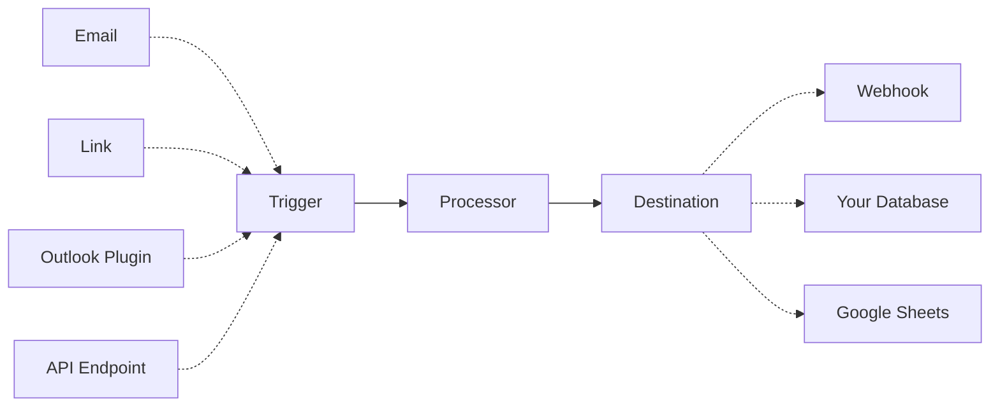

An **automation** is a way to automatically send data to your processor when triggered by events like receiving an email, clicking a link, or using the Outlook plugin. Once triggered, the processor extracts structured data from your documents and sends the results to your chosen destination.

## Introduction

Retab uses HTTPS to send webhook events to your app as a JSON payload representing a `WebhookRequest` object.
You will need a server with a webhook endpoint that will receive the `webhook_request` payload, allowing you to process them as you want after that.


<ResponseField name="webhook_request" type="WebhookRequest Object">
  <Expandable title="properties">
    <ResponseField name="completion" type="ParsedChatCompletion">
      The parsed chat completion object, containing the extracted data.
    </ResponseField>

    <ResponseField name="user" type="EmailStr">
      The user email address.
    </ResponseField>


    <ResponseField name="file_payload" type="MIMEData">
      The file payload object, containing the file name, url and other metadata.
      <Expandable title="properties">
        <ResponseField name="filename" type="str">
          The filename of the file.
        </ResponseField>
        <ResponseField name="url" type="str">
          The URL of the file in base64 format.
        </ResponseField>
      </Expandable>
    </ResponseField>


    <ResponseField name="metadata" type="dict[str, Any]">
      Some additional metadata.
    </ResponseField>
  </Expandable>
</ResponseField>


To start receiving webhook events in your app:

- Create a new processor with your extraction configuration.
- Create a webhook endpoint handler to receive event data POST requests.
- Create a new automation sending data to your webhook endpoint.
- Test your webhook endpoint handler locally using the Retab SDK.
- Secure your webhook endpoint.


## Create your processor

Start by creating a **processor** with your extraction configuration.

```python
from retab import Retab

client = Retab()

processor = client.processors.create(
    name="Invoice Processor",
    model="gpt-4.1",
    json_schema="Invoice_schema.json"
)

```

## Create your FastAPI server with a webhook

Then, set up a FastAPI route that will handle incoming webhook POST requests. You will need it to create an automation. Below is an example of a simple FastAPI application with a webhook endpoint:

<CodeGroup>
```python main.py
from fastapi import FastAPI, Request
from fastapi.responses import JSONResponse
from retab.types.automations.webhooks import WebhookRequest
from pydantic import BaseModel, Field, ConfigDict

app = FastAPI()

@app.post("/webhook")
async def webhook(request: WebhookRequest):
    invoice_object = json.loads(request.completion.choices[0].message.content or "{}") # The parsed object is the same Invoice object as the one you defined in the Pydantic model
    print("📬 Webhook received:", invoice_object)
    return {"status": "success", "data": invoice_object}

# To run the FastAPI app locally, use the command:
# uvicorn your_module_name:app --reload
if __name__ == "__main__":
    import uvicorn
    uvicorn.run(app, host="0.0.0.0", port=8000)
```

You can test the webhook endpoint locally with a tool like curl or Postman. For example, using curl:

```bash testing locally
curl -X POST http://localhost:8000/webhook \
     -H "Content-Type: application/json" \
     -d '{"completion":{"id":"id","choices":[{"index":0,"message":{"content":"{\"name\" : \"Team Meeting!\", \"date\" : \"2023-12-31\" }","role":"assistant"}}],"created":0,"model":"gpt-4.1-nano","object":"chat.completion","likelihoods":{}},"file_payload":{"filename":"example.pdf","url":"data:application/pdf;base64,the_content_of_the_pdf_file"}}'
```
</CodeGroup>


## Secure your webhook endpoint

When you set up a webhook, you provide an **HTTP endpoint** on your server for Retab to send data to. If this endpoint is not secured (i.e., it accepts unauthenticated `POST` requests from anywhere), it essentially becomes a public door into your system. **Any actor** could attempt to call this URL and send fake data. This is inherently dangerous: a malicious party might send **forged webhook requests** that masquerade as Retab, but contain bogus or harmful data.

To secure webhook deliveries, Retab employs a **signature verification** mechanism using an HMAC-like scheme. Retab and your application share a **webhook secret** (a random string known only to Retab and you). This secret is available in your [Retab dashboard](https://www.retab.dev/dashboard/settings) (Labeled as `WEBHOOKS_SECRET`). Retab uses this secret to include a special signature header with every webhook request. When your endpoint receives the webhook, your code should perform the same HMAC-SHA256 computation on the request body using the shared secret, then compare your computed signature to the value in the `Retab-Signature` header. If the signatures **match**, the request truly came from Retab and the payload was not altered in transit.

<Warning>Make sure to set your `WEBHOOKS_SECRET` environment variable with the secret from your [Retab dashboard](https://www.retab.dev/dashboard/settings).</Warning>

Here's how to implement signature verification in your FastAPI webhook:

```python {13-26}
import os
import json
from fastapi import FastAPI, Request, Response, HTTPException
from retab import Retab
from retab.types.automations.webhooks import WebhookRequest

reclient = Retab()
app = FastAPI()

@app.post("/webhook")
async def webhook_handler(request: Request):
    payload = await request.body()

    # Signature verification
    try:
        signature_header = request.headers.get("Retab-Signature")
        if not signature_header:
            raise HTTPException(status_code=400, detail="Missing Retab-Signature header")
        # Verify the signature using Retab SDK
        reclient.processors.automations.verify_event(
            event_body=payload,
            event_signature=signature_header,
            secret=os.getenv("WEBHOOKS_SECRET"),  # Get secret from environment variable
        )
    except Exception as e:
        return Response(status_code=400, content=f"Webhook error: {str(e)}")

    json_data = json.loads(payload.decode('utf-8'))
    webhook_request = WebhookRequest.model_validate(json_data)
    
    invoice_object = json.loads(webhook_request.completion.choices[0].message.content or "{}")
    print("📬 Webhook received:", invoice_object)
    return {"status": "success", "data": invoice_object}
```


## Exposing local server to the internet using ngrok

<Warning>To continue, you need to deploy your FastAPI app to a server to make your webhook endpoint publicly accessible. We recommend using [Replit](https://replit.com/) to get started quickly if you don't have a server yet. An alternative is to use [ngrok](https://ngrok.com/) to expose your local server to the internet.</Warning>


We have a very simple Dockerfile that fastapi+ngrok to get you started.
Check out the [webhook_server](https://github.com/Retab-dev/retab/tree/main/examples/automations/webhook_server) folder for more details.

<Tip>You will need a ngrok auth token to run the docker container. You can get one [here](https://dashboard.ngrok.com/get-started)</Tip>

Start fastapi+ngrok server:

<CodeGroup>
```bash startup
git clone https://github.com/Retab-dev/retab.git
cd retab/examples/webhook_server
docker build -t webhook_server .
docker run --rm -it -e NGROK_AUTH_TOKEN=[your_ngrok_auth_token] webhook_server
```

```logs {4} server logs
INFO:     Started server process [1]
INFO:     Waiting for application startup.
🌍 Ngrok tunnel established!
📬 Webhook URL: https://some-random-ngrok-url.ngrok-free.app/webhook
📬 Simple curl for testing: curl -X POST https://some-random-ngrok-url.ngrok-free.app/webhook -H "Content-Type: application/json" -d '{"completion":{"id":"id","choices":[{"index":0,"message":{"content":"{\"message\" : \"Hello, World!\"}","role":"assistant"}}],"created":0,"model":"gpt-4.1-nano","object":"chat.completion","likelihoods":{}},"file_payload":{"filename":"example.pdf","url":"data:application/pdf;base64,the_content_of_the_pdf_file"}}'
INFO:     Application startup complete.
INFO:     Uvicorn running on http://0.0.0.0:8000 (Press CTRL+C to quit)
```
</CodeGroup>

Take note of the `webhook URL`, you will need it on the next steps.


## Create an automation

Now, you can create an automation that will use your processor to extract data from emails.

```python
from retab import Retab

client = Retab()

# Create a mailbox automation and attach it to the processor
mailbox = client.processors.automations.mailboxes.create(
    name="Invoice Mailbox",
    email="invoices@mailbox.retab.dev",
    processor_id=processor.id, # The processor id you created in the previous step
    webhook_url="https://your-server.com/webhook",  # Replace with your actual webhook URL
)
```

At any email sent to `invoices@mailbox.retab.dev`, the automation will use your processor configuration to extract data and send a POST request to your FastAPI webhook endpoint.

You can see the processor and automation you just created on your [dashboard](https://www.retab.dev/dashboard/processors)!

### Test your automation

Finally, you can test the processor and automation rapidly with the test functions of the SDK: 

```python
from retab import Retab

# Initialize the Retab client
client = Retab()

# If you just want to send a test request to your webhook
log = client.processors.automations.tests.webhook(
    automation_id=mailbox.id, 
)

# If you want to test the file processing logic: 
log = client.processors.automations.tests.upload(
    automation_id=mailbox.id, 
    document="your_invoice_email.eml"
)

# If you want to test a full email forwarding
log = client.processors.automations.mailboxes.tests.forward(
    email="invoices@mailbox.retab.dev", 
    document="your_invoice_email.eml"
)
```

<Tip>You can also test your webhook locally by overriding the webhook url set in the automation</Tip>

You can also test your automation directly from the [dashboard](https://www.retab.dev/dashboard/processors).

```python
from retab import Retab

client = Retab()

# If you just want to send a test request to your webhook
log = client.processors.automations.tests.webhook(
    automation_id=mailbox.id, 
    webhook_url="http://localhost:8000/webhook" # If you want to try your webhook locally, you can override the webhook url set in the automation
)
```


---


That's it! You can start processing documents at scale. 
