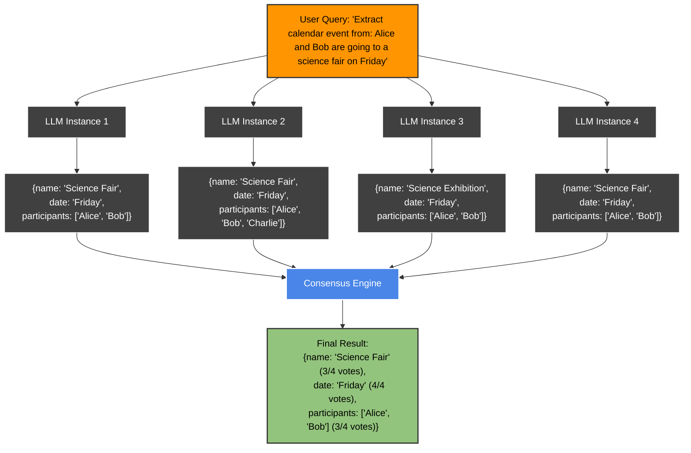

---

## title: k-LLMs Consensus

---

Large language models are **non-deterministic**—the same prompt can return different answers each time. **Consensus reduces this variability** by sending the prompt through **K** independent model calls and merging their JSON outputs into one result.

Our algorithm then compares those outputs *field-by-field* and scores the uncertainty of every field by averaging the pair-wise distance between answers. **The smaller the distance, the higher the likelihood.**

On Retab's platform this signal **exposes ambiguous user queries**. When the calls disagree, it means the prompt can be interpreted in several ways, so we need to tighten the schema—clearer descriptions, less-ambiguous names, stricter types—before moving on.

These field-level likelihoods also lay the groundwork for an agent that can *refine schemas autonomously*, even without human supervision.


You can use consensus using our SDK with the parameter `n_consensus`, but also with our dedicated [k-llms library](https://retab.com/k-llms).




> **Context**: This approach follows similar principles to [Palantir's "K-LLMs" methodology](https://www.linkedin.com/posts/palantir-technologies_never-use-1-llm-when-you-can-use-k-llms-activity-7109622372021780480-eMPG/), where multiple models evaluate the same prompt and their outputs are synthesized for increased accuracy, confidence, and reduced hallucinations.


### How it works
Under the hood Retab:

1. Fires *n\_consensus* identical calls.
2. Parses each raw answer into a Pydantic model / JSON‑Schema object.
3. Runs a **deterministic reconciliation strategy**:
   * **Exact match** vote for scalar fields (strings, numbers, booleans)
   * **Deep merge** for arrays when all models agree on length and order
   * **Recursive reconciliation** for nested objects
4. Returns the reconciled object in `response.output_parsed` (Responses) or `completion.choices[0].message.parsed` (Completions).

If any response fails JSON validation the call is retried at most once; after that a `ConsensusError` is raised.

> **Note**: Running consensus with `n=4` means **4× the API costs** and parallel requests may *hit rate limits*. Consider using smaller models like `gpt-5-mini` for *cost optimization*.


---


## k-LLMs


We provide a quick, type‑safe wrapper around OpenAI **Chat Completions** and **Responses** endpoints with automatic consensus reconciliation.

```bash
pip install k-llms
```


- **Step 1: Generating diverse answers.** We purposely sample each call with diversity settings to obtain *distinct* answers.

- **Step 2: SOTA reconciliation.** A bespoke strategy merge the candidates with *state‑of‑the‑art accuracy*.


### Quick‑Start: **Switch in One Line**

```diff {14}
-  from openai import OpenAI
-  client = OpenAI()
+  from k_llms import KLLMs
+  reclient = KLLMs()

completion = client.chat.completions.create(
  model="gpt-5",
  messages=[
      {
          "role": "user",
          "content": "Write a one-sentence bedtime story about a unicorn."
      }
  ],
  n=5
)

print("Consensus output:", completion.choices[0].message.parsed)
print("Likelihoods:", completion.likelihoods)

for i in range(len(completion.choices)):
    print(f"Choice {i}: {completion.choices[i].message.parsed}")
```


*Everything in the API call stays untouched.*

---

### Arguments

| Name              | Type                                         | Default | Notes                              |
| ----------------- | -------------------------------------------- | ------- | ---------------------------------- |
| `model`           | `str`                                        | —       | Any OpenAI chat model name.        |
| `messages`        | `list[dict]`                                 | —       | Same shape as OpenAI's `messages`. |
| `response_format` | `pydantic.BaseModel` *or* `dict JSON‑Schema` | —       | Target structure.                  |
| `n`               | `int`                                        | `1`     | >1 enables consensus.              |

### Example

<CodeGroup>

```python python {22}
from k_llms import KLLMs
from pydantic import BaseModel

client = KLLMs()

class CalendarEvent(BaseModel):
    name: str
    date: str
    participants: list[str]

completion = client.chat.completions.parse(
    model="gpt-5",
    messages=[
        {"role": "system", "content": "Extract the event information."},
        {"role": "user", "content": "Alice and Bob are going to a science fair on Friday."},
    ],
    response_format=CalendarEvent,
    n=4
)

print("Consensus output:", completion.choices[0].message.parsed)
print("Likelihoods:", completion.likelihoods)

for i in range(len(completion.choices)):
    print(f"Choice {i}: {completion.choices[i].message.parsed}")
```

</CodeGroup>

---