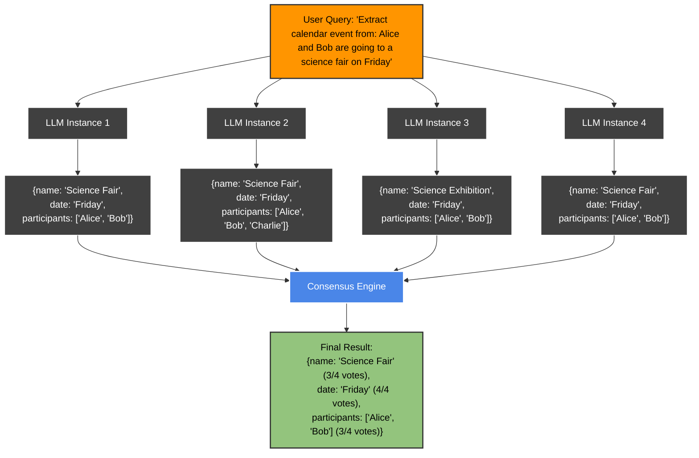

### What is "consensus"?

Consensus is about asking several language‑model instances the **same** question in parallel, then merging their structured outputs into a single, consolidated result.

Consensus offers higher reliability for extraction tasks, zero‑shot majority voting, uncertainty quantification, and automatic guard‑rail against hallucination—without changing your business logic.




> **Related to Palantir's K-LLM strategy**: This approach follows similar principles to [Palantir's "K-LLMs" methodology](https://www.linkedin.com/posts/palantir-technologies_never-use-1-llm-when-you-can-use-k-llms-activity-7109622372021780480-eMPG/), where multiple models evaluate the same prompt and their outputs are synthesized for increased accuracy, confidence, and reduced hallucinations. Like Palantir's approach, Retab's consensus mechanism helps mitigate biases from any single model while providing flexibility across different LLM providers.


### How it works
Under the hood Retab:

1. Fires *n\_consensus* identical calls.
2. Parses each raw answer into a Pydantic model / JSON‑Schema object.
3. Runs a deterministic reconciliation strategy

   * **Exact match** vote for scalar fields.
   * **Deep merge** for arrays / objects when all candidates agree on shape.
4. Returns the reconciled object in `response.output_parsed` (Responses) or `completion.choices[0].message.parsed` (Completions).

If any response fails JSON validation the call is retried once; after that a `ConsensusError` is raised.


---

We provide a quick, type‑safe wrapper around OpenAI **Chat Completions** and **Responses** endpoints with automatic consensus reconciliation.


- **Step 1: Generating diverse answers.** We purposely sample each call with `temperature > 0` to obtain *distinct* answers.

- **Step 2: SOTA reconciliation.** A bespoke, finetuned LLM (code‑name **`reconcile‑v1`**) performs fuzzy string matching and majority‑vote reasoning to merge the candidates with state‑of‑the‑art accuracy.


## Quick‑Start: Switch in One Line

```diff {9}
-  from openai import OpenAI
-  client = OpenAI()
+  from retab import Retab
+  reclient = Retab()

-  response = client.responses.create(
+  response = reclient.consensus.responses.create(
      model="gpt-4.1",
      input="Write a one-sentence bedtime story about a unicorn."
+     n_consensus=4
  )

 print(response.output_text)
 event = response.output_parsed
```

```diff {14}
-  from openai import OpenAI
-  client = OpenAI()
+  from retab import Retab
+  reclient = Retab()

- completion = client.chat.completions.create(
+  completion = reclient.consensus.completions.create(
      model="gpt-4.1",
      messages=[
          {
              "role": "user",
              "content": "Write a one-sentence bedtime story about a unicorn."
          }
      ],
+     n_consensus=4
  )

 print(completion.choices[0].message.content)
```


Everything else (models, schema, temperature, etc.) stays untouched.

---

## Completions API

| Method                          | Description                                                                    |
| ------------------------------- | ------------------------------------------------------------------------------ |
| `client.consensus.completions.parse(...)` | Chat completion that **returns** a parsed object plus the raw OpenAI response. |

### Minimum Arguments

| Name              | Type                                         | Default | Notes                              |
| ----------------- | -------------------------------------------- | ------- | ---------------------------------- |
| `model`           | `str`                                        | —       | Any OpenAI chat model name.        |
| `messages`        | `list[dict]`                                 | —       | Same shape as OpenAI's `messages`. |
| `response_format` | `pydantic.BaseModel` *or* `dict JSON‑Schema` | —       | Target structure.                  |
| `n_consensus`     | `int`                                        | `1`     | >1 enables consensus.              |

### Example

<CodeGroup>

```python python {22}
from retab import Retab
from pydantic import BaseModel

reclient = Retab()

class CalendarEvent(BaseModel):
    name: str
    date: str
    participants: list[str]

completion = reclient.consensus.completions.parse(
    model="gpt-4.1",
    messages=[
        {"role": "system", "content": "Extract the event information."},
        {"role": "user", "content": "Alice and Bob are going to a science fair on Friday."},
    ],
    response_format=CalendarEvent,
    n_consensus=4
)

event = completion.choices[0].message.parsed
```


```bash curl
curl https://api.retab.dev/v1/consensus/completions \
  -H "API-Key: $RETAB_API_KEY" \
  -H "Content-Type: application/json" \
  -d '{
    "model": "gpt-4.1",
    "messages": [
      {
        "role": "system",
        "content": "You are an expert at structured data extraction. You will be given unstructured text from a research paper and should convert it into the given structure."
      },
      {
        "role": "user",
        "content": "..."
      }
    ],
    "response_format": {
      "type": "json_schema",
      "json_schema": {
        "name": "research_paper_extraction",
        "schema": {
          "type": "object",
          "properties": {
            "title": { "type": "string" },
            "authors": {
              "type": "array",
              "items": { "type": "string" }
            },
            "abstract": { "type": "string" },
            "keywords": {
              "type": "array",
              "items": { "type": "string" }
            }
          },
          "required": ["title", "authors", "abstract", "keywords"],
          "additionalProperties": false
        },
        "strict": true
      }
    },
    "n_consensus": 4
  }'
```

</CodeGroup>

---

## Responses API

Use when you have a *single* prompt + *single* expected answer (e.g., function‑calling, multi‑step reasoning).

| Method                        | Description                                                               |
| ----------------------------- | ------------------------------------------------------------------------- |
| `client.consensus.responses.parse(...)` | Thin wrapper for the `/responses` endpoint; consensus works the same way. |

### Arguments

Same as **Completions API**: `model`, `input`, `text_format|text_schema`, `n_consensus`.

### Example


<CodeGroup>

```python python {24}
from retab import Retab
from pydantic import BaseModel

reclient = Retab()

class Step(BaseModel):
    explanation: str
    output: str

class MathReasoning(BaseModel):
    steps: list[Step]
    final_answer: str

response = reclient.consensus.responses.parse(
    model="gpt-4o-2024-08-06",
    input=[
        {
            "role": "system",
            "content": "You are a helpful math tutor. Guide the user through the solution step by step.",
        },
        {"role": "user", "content": "how can I solve 8x + 7 = -23"},
    ],
    text_format=MathReasoning,
    n_consensus=4
)

math_reasoning = response.output_parsed
```


```bash curl
curl -X 'POST' \
  'https://api.retab.dev/v1/consensus/responses' \
  -H 'API-Key: $RETAB_API_KEY' \
  -H 'Content-Type: application/json' \
  -d '{
    "model": "gpt-4o-2024-08-06",
    "input": [
      {
        "role": "system",
        "content": "You are a helpful math tutor. Guide the user through the solution step by step."
      },
      {
        "role": "user",
        "content": "how can I solve 8x + 7 = -23"
      }
    ],
    "text": {
      "format": {
        "type": "json_schema",
        "name": "math_reasoning",
        "schema": {
          "type": "object",
          "properties": {
            "steps": {
              "type": "array",
              "items": {
                "type": "object",
                "properties": {
                  "explanation": { "type": "string" },
                  "output": { "type": "string" }
                },
                "required": ["explanation", "output"],
                "additionalProperties": false
              }
            },
            "final_answer": { "type": "string" }
          },
          "required": ["steps", "final_answer"],
          "additionalProperties": false
        },
        "strict": true
      }
    },
    "n_consensus": 4
  }'
```

</CodeGroup>


---


## Reconcile API

| Method                        | Description                                                                    |
| ----------------------------- | ------------------------------------------------------------------------------ |
| `client.consensus.reconcile(...)` | Direct access to reconcile multiple dictionaries into a single consensus result. |

### Arguments

| Name              | Type                                         | Default | Notes                              |
| ----------------- | -------------------------------------------- | ------- | ---------------------------------- |
| `list_dicts`      | `list[dict]`                                 | —       | List of dictionaries to reconcile. |
| `reference_schema`| `dict`                                       | `None`  | Optional schema to validate dictionaries against. |
| `mode`            | `Literal["direct", "aligned"]`               | `"direct"` | Mode for consensus computation. |
| `idempotency_key` | `str`                                        | `None`  | Optional idempotency key for the request. |

### Example

<CodeGroup>

```python python
from retab import Retab

reclient = Retab()

# List of dictionaries to reconcile
results = [
    {"name": "Science Fair", "date": "2023-06-15", "participants": ["Alice", "Bob"]},
    {"name": "Science Fair", "date": "2023-06-15", "participants": ["Alice", "Bob", "Charlie"]},
    {"name": "Science Exhibition", "date": "2023-06-15", "participants": ["Alice", "Bob"]}
]

# Optional schema
schema = {
    "type": "object",
    "properties": {
        "name": {"type": "string"},
        "date": {"type": "string"},
        "participants": {
            "type": "array",
            "items": {"type": "string"}
        }
    },
    "required": ["name", "date", "participants"]
}

# Reconcile the dictionaries
consensus_result = reclient.consensus.reconcile(
    list_dicts=results,
    reference_schema=schema,
    mode="direct"
)

# Access the reconciled data and confidence scores
reconciled_data = consensus_result["data"]
confidence = consensus_result["likelihoods"]
```

```bash curl
curl https://api.retab.dev/v1/consensus/reconcile \
  -H "API-Key: $RETAB_API_KEY" \
  -H "Content-Type: application/json" \
  -d '{
    "list_dicts": [
      {
        "name": "Science Fair",
        "date": "2023-06-15",
        "participants": ["Alice", "Bob"]
      },
      {
        "name": "Science Fair",
        "date": "2023-06-15",
        "participants": ["Alice", "Bob", "Charlie"]
      },
      {
        "name": "Science Exhibition",
        "date": "2023-06-15",
        "participants": ["Alice", "Bob"]
      }
    ],
    "reference_schema": {
      "type": "object",
      "properties": {
        "name": {"type": "string"},
        "date": {"type": "string"},
        "participants": {
          "type": "array",
          "items": {"type": "string"}
        }
      },
      "required": ["name", "date", "participants"]
    },
    "mode": "direct"
  }'
```


```json Response
{
    "data": {
        "name": "Science Fair",
          "date": "2023-06-15",
          "participants": ["Alice", "Bob"]
      },
      "likelihoods": {
          "name": 0.67,
          "date": 1.0,
          "participants": {
              "$array": 1.0,
              "Alice": 1.0,
              "Bob": 1.0,
              "Charlie": 0.33
        }
    }
}
```


</CodeGroup>
