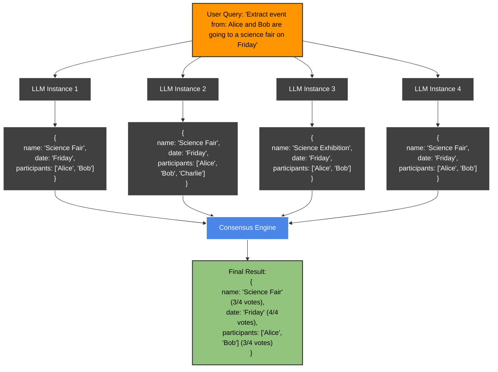

```mermaid
flowchart TD
    User["User Query: 'Extract event from: Alice and Bob are going to a science fair on Friday'"]
    
    User --> LLM1["LLM Instance 1"]
    User --> LLM2["LLM Instance 2"]
    User --> LLM3["LLM Instance 3"]
    User --> LLM4["LLM Instance 4"]
    
    LLM1 --> R1["{
      name: 'Science Fair',
      date: 'Friday',
      participants: ['Alice', 'Bob']
    }"]
    
    LLM2 --> R2["{
      name: 'Science Fair',
      date: 'Friday',
      participants: ['Alice', 'Bob', 'Charlie']
    }"]
    
    LLM3 --> R3["{
      name: 'Science Exhibition',
      date: 'Friday',
      participants: ['Alice', 'Bob']
    }"]
    
    LLM4 --> R4["{
      name: 'Science Fair',
      date: 'Friday',
      participants: ['Alice', 'Bob']
    }"]
    
    R1 --> Consensus["Consensus Engine"]
    R2 --> Consensus
    R3 --> Consensus
    R4 --> Consensus
    
    Consensus --> Final["Final Result:
    {
      name: 'Science Fair' (3/4 votes),
      date: 'Friday' (4/4 votes),
      participants: ['Alice', 'Bob'] (3/4 votes)
    }"]
    
    style User fill:#ff9500,stroke:#333,stroke-width:2px,color:#000
    style LLM1 fill:#404040,stroke:#fff,stroke-width:1px,color:#fff
    style LLM2 fill:#404040,stroke:#fff,stroke-width:1px,color:#fff
    style LLM3 fill:#404040,stroke:#fff,stroke-width:1px,color:#fff
    style LLM4 fill:#404040,stroke:#fff,stroke-width:1px,color:#fff
    style R1 fill:#404040,stroke:#fff,stroke-width:1px,color:#fff
    style R2 fill:#404040,stroke:#fff,stroke-width:1px,color:#fff
    style R3 fill:#404040,stroke:#fff,stroke-width:1px,color:#fff
    style R4 fill:#404040,stroke:#fff,stroke-width:1px,color:#fff
    style Consensus fill:#4a86e8,stroke:#fff,stroke-width:2px,color:#fff
    style Final fill:#93c47d,stroke:#333,stroke-width:2px,color:#000
```