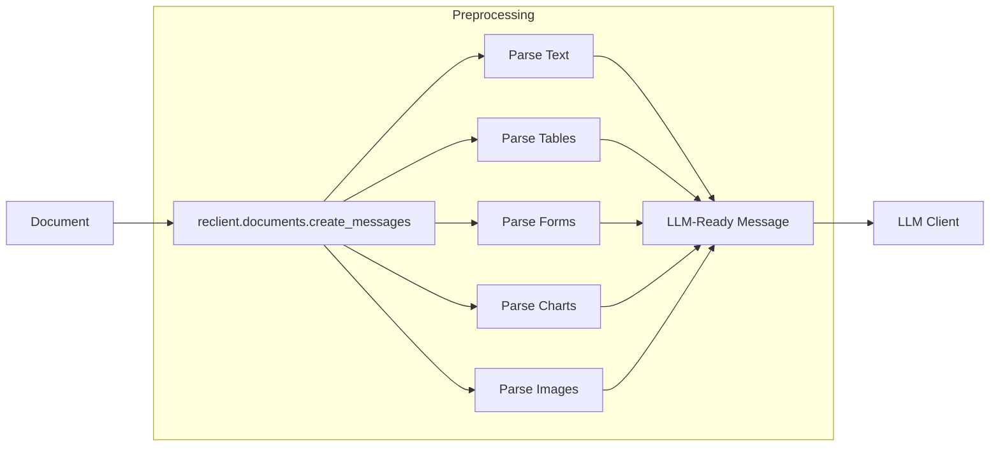

### Introduction

The `client.documents` module offers a consolidated, production-grade pipeline for converting heterogeneous documents into chat-ready payloads for OpenAI, Anthropic, and Gemini endpoints. **Our model read documents the way humans do.** It accepts native digital files (Images, PDFs, DOCX, XLSX, E-mail) and parses text, detects visual structure across pages, tables, forms, and figures, and re-assembles the content in logical reading order before delivering it in the exact message schema required by each provider. Please check the [API Reference](https://docs.retab.dev/api-reference/endpoint/create-messages) for more details.


The module exposes three high-level methods:

| Method                                         | Purpose                                                                                   | Typical Scenario                                                        |
| ---------------------------------------------- | ----------------------------------------------------------------------------------------- | ----------------------------------------------------------------------- |
| **`create_messages`**                          | Generates a verbatim, chat-formatted rendition of the document.                           | Retrieval-augmented generation or “chat with your PDF”.                 |
| **`create_inputs`**                            | Wraps the document in a developer prompt targeting a supplied JSON schema.                | Function-calling or structured extraction with JSON mode.               |
| **`extractions.parse` / `extractions.stream`** | Executes the extraction and returns the parsed object (optionally with consensus voting). | One-step OCR + LLM parsing when only the structured output is required. |

In practice, the workflow is straightforward: load a file, invoke the method that matches the desired outcome, and pass the returned `openai_messages` array directly to `client.chat.completions.create()`. The complexities of OCR, layout reconstruction, and prompt scaffolding are handled internally, allowing to focus solely on downstream model logic.

## Create Messages

Converts any document into OpenAI-compatible chat messages. You can choose between different preprocessing parameters according to your needs: modalities (text, image, native) and image settings (dpi, browser_canvas, etc..).

<ResponseField name="Returns" type="DocumentMessage Object">
A DocumentMessage object with the messages created from the document.
  <Expandable title="properties">
    <ResponseField name="id" type="string">
      A unique identifier for the document loading.
    </ResponseField>

    <ResponseField name="object" type="string">
      The type of object being loaded. Always "document.message".
    </ResponseField>

    <ResponseField name="messages" type="array[ChatCompletionRetabMessage]">
      A list of messages containing the document content and metadata.
    </ResponseField>

    <ResponseField name="created" type="integer">
      The Unix timestamp (in seconds) of when the document was loaded.
    </ResponseField>

    <ResponseField name="modality" type="native | text | image | image+text">
      The modality of the document to load.
    </ResponseField>

    <ResponseField name="document" type="MIMEData Object">
      The document being loaded.
    </ResponseField>

    <ResponseField name="items" type="array">
      Returns the items in the document as a list of strings or PIL Images.
    </ResponseField>

    <ResponseField name="openai_messages" type="array[ChatCompletionMessageParam]">
      Returns the messages in OpenAI's format.
    </ResponseField>

    <ResponseField name="anthropic_system_prompt" type="string">
      Returns the system message in Anthropic's Claude format.
    </ResponseField>

    <ResponseField name="anthropic_messages" type="array[MessageParam]">
      Returns the messages in Anthropic's Claude format.
    </ResponseField>

    <ResponseField name="gemini_messages" type="ContentsType">
      Returns the messages in Google's Gemini format.
    </ResponseField>
  </Expandable>
</ResponseField>


<CodeGroup>
```python Request
from retab import Retab
from openai import OpenAI

reclient = Retab()
doc_msg = reclient.documents.create_messages(
    document = "freight/booking_confirmation.jpg",
    modality = "text",
    image_resolution_dpi = 72,
    browser_canvas = "A4"
)
```
```json Response
{
    "id": "doc_dd003f95-81ce-4a55-9180-00c5a58d82ec",
    "object": "document.message",
    "messages": [
        {
            "role": "user",
            "content": [
                {
                    "text": "/, ACME\n\n4% Corporation\u201d\n\nConfirmation d'affr\u00e9tement\nACME CORPORATION\n\nVAT Number: GB123456789\n\n11/8/2024, 11:41:43 AM\n\naA\n\nD\u00e9tails de la soci\u00e9t\u00e9 Site de: Adresse de facturation:\nContact: Jane Doe 456 Oak Avenue 123 Elm Street\nAcme Corporation Floor 3 Suite 500\nTel: +44 20 7946 0958 Manchester London\nEmail: client@acme.com M1 4WP. WC2N S5DU GB\nUnited Kingdom Tel: +44 20 7946 0958\n\nEmail: client@acme.com\nVAT Number: GB123456789\n\nR\u00e9f\u00e9rence a rappeler sur votre\nfacture\n\nN\u00b0OT : SHIP-001\n\nR\u00e9f.Client : BC-67890\n\nN\u00b0 Cde : SHIP-001\n\nTransporteur :\n\nTRANSPORT EXPRESS.\nAl'attention du Service Logistique\nZone Industrielle Est, Batiment C\n45 rue des Transporteurs\n\n75001 PARIS\n\nFRANCE\n\nT\u00e9l : 0123 45 67 89\n\nFax : 0123 45 67 90\n\nTva : FR12 345 678 901\n\nLe transporteur s'engage :\n\ne a-souscrire une assurance sp\u00e9cifique aux marchandises\nsensibles.\n\n* arespecter les clauses vol de ses polices d'assurance\nmarchandises transport\u00e9es.\n\n\u00a2 a v\u00e9rifier que les marchandises soient bien accompagn\u00e9es des\ndocuments et notamment des documents de douane\ncorrespondants.\n\n\u00a2 ad\u00e9clarer les incidents et notamment contacter imm\u00e9diatement\nnotre bureau d'affr\u00e9tement et le bureau de douanes le plus\nproche en cas de vol attest\u00e9.\n\n\u00a2 a mettre en oeuvre les moyens de pr\u00e9vention visant a la\ns\u00e9curisation de la marchandise dont le stationnement dans des\nendroits clos et gardienn\u00e9s.\n\n \n\nNature des marchandises: Prise en charge le Livraison le\nPoids: 500 T Pallets: 5 Unit\u00e9s: 10 Volume: 1.44 M3 5/2/2023 5/3/2023\nMetres de chargement: 0.4 ML De 08:00 a 12:00 De 10:00 a 16:00\nTemp\u00e9rature: 5\u00b0C - 25\u00b0C (Frais) Acme Corporation Beta Industries\nMarchandises dangereuses: UN1202 Classe 3 - Liquide 123 Elm Street 789 Pine Street\ninflammable Suite 500 Munich, Bavaria\nLondon, Greater London 80331 DE\nWC2N SDU GB +49 89 123456\n\n \n\n \n\n \n\nPrix convenu: 1500 EUR HT PRIX NEGOCIE GASOIL INCLUS R\u00e9f\u00e9rence a rappeler sur votre facture :\n\nBC-67890\n\nConditions de transport et de reglement :\n\nAfin de permettre un reglement conforme aux dispositions, il est rappel\u00e9 au transporteur affr\u00e9t\u00e9 que la facture ne sera admise pour paiement que sous\nla condition stricte de reception des documents l\u00e9gaux requis pour justifier de la r\u00e9alisation de la prestation de transport et notamment : I'original de la\nlettre de voiture accompagn\u00e9 du bon de livraison original r\u00e9gularis\u00e9 et la preuve de l'\u00e9change des palettes consign\u00e9es. II est a noter que le prix\nconvenu a fait l'objet d'une n\u00e9gociation entre les parties et qu'il integre notamment les charges de carburant sur la base de l'indice CNR du mois en\ncours a la date de r\u00e9alisation du transport. Pour les flux belges, le prix convenu comprend la taxe kilom\u00e9trique. Le transporteur affr\u00e9teur s'oblige a\nex\u00e9cuter l'ordre de transport confi\u00e9 par ses propres moyens. Il s'interdit de le sous-traiter a des tiers. Le non respect de cette clause entraine la\nr\u00e9solution imm\u00e9diate et de plein droit du contrat de transport. Il reconnait \u00e9galement que le forfait ci-dessus permet de couvrir l'ensemble des charges\nd\u00e9finies a l'article L3221-1 du Code des Transports. En cons\u00e9quence, il d\u00e9clare \u00e9tre a jour de son obligation de d\u00e9claration, du paiement des charges\nsociales (URSSAF) et du respect de la lutte contre le travail ill\u00e9gal. Il s'engage a respecter les obligations sur le d\u00e9tachement transnational de salari\u00e9s,\naussi il doit \u00e9tre a jour de |'\u00e9tablissement de I'attestation de d\u00e9tachement des salari\u00e9s ainsi que de la nomination d'un repr\u00e9sentant en France. Nous\nvous rappelons la l\u00e9gislation frangaise concernant le cabotage routier de marchandises qui fait l'objet des articles L.3421-3 et suivants du Code des\nTransports modifi\u00e9s par le d\u00e9cret n\u00b0 2016-418 du 7 avril 2016, tout transport doit donc \u00e9tre effectu\u00e9 dans le respect de la loi. Nous vous remercions de\nnous tenir imm\u00e9diatement inform\u00e9s de tout incident rencontr\u00e9 dans |'ex\u00e9cution de ce transport.\n\n \n\nSile transport de marchandises s'effectue sur Retour imp\u00e9ratif par fax avec la mention Bon\ndes palettes Europe, celles-ci doivent \u00e9tre pour accord, votre cachet commercial, vos\n\u00e9chang\u00e9es au chargement ou restitu\u00e9es sous noms et signature. A d\u00e9faut de retour, le\n\n8 jours. Dans le cas contraire, elles vous seront contrat de transport sera r\u00e9put\u00e9 ex\u00e9cut\u00e9 selon\nfactur\u00e9es au prix de 28 \u20ac ht/Palette (14 \u20achtde \u2014_les modalit\u00e9s pr\u00e9cit\u00e9es.Tous les bons de\n\nfrais de dossier non remboursable en cas livraisons devront \u00e9tre retourn\u00e9s sous 8 jours.\nd'avoir).\n\n \n\n \n\n \n\f",
                    "type": "text"
                }
            ]
        }
    ],
    "created": 1736524416,
    "modality": "text",
    "document": {
        "id": "cf908729402d0796537bb91e63df5e339ce93b4cabdcac2f9a4f90592647e130",
        "name": "booking_confirmation.jpg",
        "mime_type": "image/jpeg"
    }
}
```
</CodeGroup>

<Note>Use `doc_msg.items` to have a list of `[PIL.Image.Image | str]` objects</Note>


## Create Inputs

Converts any document and a json schema into OpenAI-compatible responses input. You can choose between different preprocessing parameters according to your needs: modalities (text, image, native) and image settings (dpi, browser_canvas, etc..).

<ResponseField name="Returns" type="DocumentMessage Object">
A DocumentMessage object with the document content structured according to the provided JSON schema.
  <Expandable title="properties">
    <ResponseField name="id" type="string">
      A unique identifier for the document input.
    </ResponseField>

    <ResponseField name="object" type="string">
      The type of object. Always "document.message".
    </ResponseField>

    <ResponseField name="messages" type="array[ChatCompletionRetabMessage]">
      A list of messages containing the document content with schema context.
    </ResponseField>

    <ResponseField name="created" type="integer">
      The Unix timestamp (in seconds) of when the document input was created.
    </ResponseField>

    <ResponseField name="modality" type="native | text | image | image+text">
      The modality used for processing the document.
    </ResponseField>

    <ResponseField name="document" type="MIMEData Object">
      The document being processed.
    </ResponseField>
  </Expandable>
</ResponseField>

<CodeGroup>
```python Request
from retab import Retab

reclient = Retab()
doc_input = reclient.documents.create_inputs(
    document = "freight/invoice.pdf",
    json_schema = {
        "properties": {
            "invoice_number": {
                "type": "string",
                "description": "The invoice number"
            },
            "total_amount": {
                "type": "number",
                "description": "The total invoice amount"
            },
            "issue_date": {
                "type": "string",
                "description": "The date the invoice was issued"
            }
        },
        "required": ["invoice_number", "total_amount", "issue_date"]
    },
    modality = "text",
    image_resolution_dpi = 72,
    browser_canvas = "A4"
)
```
```json Response
{
    "id": "doc_fe785c13-92b4-47ea-b3d1-a8c61d82f7ec",
    "object": "document.message",
    "messages": [
        {
            "role": "developer",
            "content": [
                {
                    "text": "Please extract the following information from this document:\n- invoice_number: The invoice number\n- total_amount: The total invoice amount\n- issue_date: The date the invoice was issued",
                    "type": "text"
                }
            ]
        },
        {
            "role": "user",
            "content": [
                {
                    "text": "ACME CORPORATION\nINVOICE\n\nInvoice #: INV-2024-0789\nDate: April 15, 2024\n\nBill To:\nBeta Industries GmbH\n789 Pine Street\nMunich, Bavaria 80331\nGermany\n\nDescription                  Qty    Rate      Amount\n------------------------------------ ---------- ----------\nPremium Widgets              10     €125.00   €1,250.00\nExpress Shipping                             €75.00\n                                     Subtotal €1,325.00\n                                     VAT (19%) €251.75\n                                     TOTAL    €1,576.75\n\nPayment Terms: Net 30\nBank Details: IBAN: DE89 3704 0044 0532 0130 00\n\nThank you for your business!",
                    "type": "text"
                }
            ]
        }
    ],
    "created": 1737482631,
    "modality": "text",
    "document": {
        "id": "e7a8b9f5d2c1a6b3e7a8b9f5d2c1a6b3e7a8b9f5d2c1a6b3e7a8b9f5d2c1a6b3",
        "name": "invoice.pdf",
        "mime_type": "application/pdf"
    }
}
```
</CodeGroup>


## Extractions

<ResponseField name="Returns" type="ParsedChatCompletion">
An OpenAI ParsedChatCompletion object with the extracted data.
</ResponseField>

<CodeGroup>
```python Request (parse)

from retab import Retab

reclient = Retab()

doc_msg = reclient.documents.extract(
    document = "freight/booking_confirmation.jpg", 
    model="gpt-4.1-nano",
    json_schema = {
      'X-SystemPrompt': 'You are a useful assistant.',
      'properties': {
          'name': {
              'description': 'The name of the calendar event.',
              'title': 'Name',
              'type': 'string'
          },
          'date': {
              'description': 'The date of the calendar event in ISO 8601 format.',
              'title': 'Date',
              'type': 'string'
          }
      },
      'required': ['name', 'date'],
      'title': 'CalendarEvent',
      'type': 'object'
    },
    modality="text",
    n_consensus=1 # 1 means disabled (default), if greater than 1 it will run the extraction with n-consensus mode
)
```
```python Request (stream)

from retab import Retab

reclient = Retab()

doc_msg = reclient.documents.extractions.stream(
    document = "freight/booking_confirmation.jpg", 
    model="gpt-4.1-nano",
    json_schema = {
      'X-SystemPrompt': 'You are a useful assistant.',
      'properties': {
          'name': {
              'description': 'The name of the calendar event.',
              'title': 'Name',
              'type': 'string'
          },
          'date': {
              'description': 'The date of the calendar event in ISO 8601 format.',
              'title': 'Date',
              'type': 'string'
          }
      },
      'required': ['name', 'date'],
      'title': 'CalendarEvent',
      'type': 'object'
    },
    modality="native"
)
```
```json Response
{
    "content": {
        "id": "chatcmpl-AoBs45TNWTB1VKGSXV7NAwCnxMaNN",
        "choices": [
            {
                "finish_reason": "stop",
                "index": 0,
                "logprobs": null,
                "message": {
                    "content": "{\"name\": \"Confirmation d'affr\\u00e9tement\", \"date\": \"2024-11-08\"}",
                    "refusal": null,
                    "role": "assistant",
                    "audio": null,
                    "function_call": null,
                    "tool_calls": [],
                    "parsed": {
                        "name": "Confirmation d'affr\u00e9tement",
                        "date": "2024-11-08"
                    }
                }
            }
        ],
        "created": 1736525396,
        "model": "gpt-4.1-nano",
        "object": "chat.completion",
        "service_tier": "default",
        "system_fingerprint": "fp_f2cd28694a",
        "usage": {
            "completion_tokens": 20,
            "prompt_tokens": 2760,
            "total_tokens": 2780,
            "completion_tokens_details": {
                "accepted_prediction_tokens": 0,
                "audio_tokens": 0,
                "reasoning_tokens": 0,
                "rejected_prediction_tokens": 0
            },
            "prompt_tokens_details": {
                "audio_tokens": 0,
                "cached_tokens": 0
            }
        },
        "likelihoods": {
            "name": 0.7227993785831323,
            "date": 0.7306298416895017
        },
    },
    "error": null
}
```
</CodeGroup>


