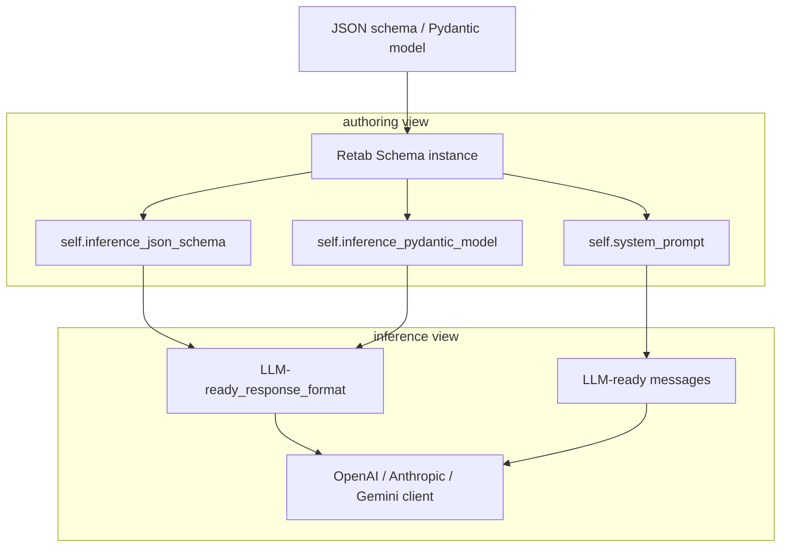

In this section, we will see how to use the methods of the client.schemas module. Please check the [API Reference](https://docs.retab.dev/api-reference/schema/generate) for more details.

The `Schema` class turns a **design-time schema** that you supply (JSON Schema or Pydantic model) into all the artefacts required to obtain, validate and post-process a large-language-model (LLM) extraction: 

- A **system prompt**
- An **inference-time schema**

<CodeGroup>
```json Design-time Schema
{
  "X-SystemPrompt": "You are a useful assistant extracting information from documents.",
  "properties": {
    "name": {
      "description": "The name of the calendar event.",
      "title": "Name",
      "type": "string"
    },
    "date": {
      "X-ReasoningPrompt": "The user can mention it in any format, like **next week** or **tomorrow**. Infer the right date format from the user input.",
      "description": "The date of the calendar event in ISO 8601 format.",
      "title": "Date",
      "type": "string"
    }
  },
  "required": [
    "name",
    "date"
  ],
  "title": "CalendarEvent",
  "type": "object"
}
```
```markdown System Prompt
# General Instructions

You are an expert in data extraction and structured data outputs.

When provided with a **JSON schema** and a **document**, you must:

1. Carefully extract all relevant data from the provided document according to the given schema.
2. Return extracted data strictly formatted according to the provided schema.
3. Make sure that the extracted values are **UTF-8** encodable strings.
4. Avoid generating bytes, binary data, base64 encoded data, or other non-UTF-8 encodable data.

---

## Handling Missing and Nullable Fields

### Nullable Leaf Attributes

- If valid data is missing or not explicitly present, set leaf attributes explicitly to `null`.
- **Do NOT** use empty strings (`""`), placeholder values, or fabricated data.

**Example:**

"""json
// Correct:
{"email": null}

// Incorrect:
{"email": ""}
"""

### Nullable Nested Objects

- If an entire nested object’s data is missing or incomplete, **do NOT** set the object itself to `null`.
- Keep the object structure fully intact, explicitly setting each leaf attribute within to `null`.
- This preserves overall structure and explicitly communicates exactly which fields lack data.

**Example:**

"""json
// Correct (all information is missing):
{
  "address": {
    "street": null,
    "zipCode": null,
    "city": null
  }
}

// Incorrect (all information is missing):
{
  "address": null
}

// Correct (only some information is missing):
{
  "address": {
    "street": null,
    "zipCode": null,
    "city": "Paris"
  }
}

// Incorrect (only some information is missing):
{
  "address": {
    "city": "Paris"
  }
}
"""

---

## Reasoning Fields

Your schema includes special reasoning fields (`reasoning___*`) used exclusively to document your extraction logic. These fields are for detailed explanations and will not appear in final outputs.

| Reasoning Field Type | Field Naming Pattern       |
|----------------------|----------------------------|
| Root Object          | `reasoning___root`         |
| Nested Objects       | `reasoning___[objectname]` |
| Array Fields         | `reasoning___[arrayname]`  |
| Array Elements       | `reasoning___item`         |
| Leaf Attributes      | `reasoning___[attributename]` |

You MUST include these details explicitly in your reasoning fields:

- **Explicit Evidence**: Quote specific lines or phrases from the document confirming your extraction.
- **Decision Justification**: Clearly justify why specific data was chosen or rejected.
- **Calculations/Transformations**: Document explicitly any computations, unit conversions, or normalizations.
- **Alternative Interpretations**: Explicitly describe any alternative data interpretations considered and why you rejected them.
- **Confidence and Assumptions**: Clearly state your confidence level and explicitly articulate any assumptions.

**Example Reasoning:**

> Found company name 'ACME Corp' explicitly stated in the top-right corner of page 1, matching standard letterhead format. Confirmed by matching signature block ('ACME Corp') at bottom of page 3. Confidence high. Alternative interpretation (e.g., sender's name) explicitly rejected due to explicit labeling 'Client: ACME Corp' on page 1.

---

## Detailed Reasoning Examples

### Array Reasoning (`reasoning___[arrayname]`)

- Explicitly describe how the entire array was identified.
- List explicitly all extracted items with clear details and source references.

**Example:**

"""markdown
Identified itemized invoice section clearly demarcated by header "Invoice Items" (page 2, lines 12–17). Extracted items explicitly listed:

1. Office Supplies, quantity 5, unit price $4.99, total $24.95 (line 12)
2. Printer Paper, quantity 1, unit price $5.99, total $5.99 (line 13)
3. Stapler, quantity 1, unit price $4.07, total $4.07 (line 14)

No ambiguity detected.
"""

### Array Item Reasoning (`reasoning___item`)

Explicitly document evidence for each individual item:

"""markdown
Extracted explicitly from line 12: 'Office Supplies x5 $4.99ea $24.95'. Quantity (5 units) multiplied explicitly by unit price ($4.99) matches listed total ($24.95). Format consistent across invoice, high confidence.
"""

---

## Principles for Accurate Extraction

When performing extraction, explicitly follow these core principles:

- **Transparency**: Explicitly document and justify every extraction decision.
- **Precision**: Always verify explicitly using direct quotes from the source document.
- **Conservatism**: Set explicitly fields as `null` when data is explicitly missing or ambiguous—never fabricate or guess.
- **Structure Preservation**: Always maintain explicitly the full schema structure, even when entire nested objects lack data (leaf attributes as null).


## Source Fields

Some leaf fields require you to explicitly provide the source of the data (verbatim from the document).
The idea is to simply provide a verbatim quote from the document, without any additional formatting or commentary, keeping it as close as possible to the original text.
Make sure to reasonably include some surrounding text to provide context about the quote.

You can easily identify the fields that require a source by the `quote___[attributename]` naming pattern.

**Example:**

"""json
{
  "quote___name": "NAME:
John Doe",
  "name": "John Doe"
}
"""

---

# User Defined System Prompt


You are a useful assistant extracting information from documents.

## CalendarEvent -- NLP Data Structure

### name (string)
<Description>
The name of the calendar event.
</Description>

### reasoning___date (string)
<Description>
The user can mention it in any format, like **next week** or **tomorrow**. Infer the right date format from the user input.
</Description>

### date (string)
<Description>
The date of the calendar event in ISO 8601 format.
</Description>


---
## Expected output schema as a TypeScript interface for better readability:

interface RootInterface {
  name: string;
  reasoning___date: string;
  date: string;
}
```
```json Inference-time Schema
{
  "properties": {
    "name": {
      "description": "The name of the calendar event.",
      "title": "Name",
      "type": "string"
    },
    "reasoning___date": {
      "type": "string",
      "description": "The user can mention it in any format, like **next week** or **tomorrow**. Infer the right date format from the user input."
    },
    "date": {
      "description": "The date of the calendar event in ISO 8601 format.",
      "title": "Date",
      "type": "string"
    }
  },
  "required": [
    "name",
    "reasoning___date",
    "date"
  ],
  "title": "CalendarEvent",
  "type": "object",
  "additionalProperties": false
}
```

```python Python Code
from retab import Schema
import json

# Define schema
schema_obj = Schema(
    json_schema={
        'X-SystemPrompt': 'You are a useful assistant extracting information from documents.',
        'properties': {
            'name': {'description': 'The name of the calendar event.', 
                     'title': 'Name', 'type': 'string'},
            'date': {
                'X-ReasoningPrompt': 'The user can mention it in any format, like **next week** or **tomorrow**. Infer the right date format from the user input.',
                'description': 'The date of the calendar event in ISO 8601 format.',
                'title': 'Date',
                'type': 'string',
            },
        },
        'required': ['name', 'date'],
        'title': 'CalendarEvent',
        'type': 'object',
    }
)

print("System Prompt: \n\n",schema_obj.system_prompt)

print("Inference JSON Schema \n\n", json.dumps(schema_obj.inference_json_schema, indent=2))
```


</CodeGroup>


---

## The Schema Object
<ResponseField name="Schema Object" type="object">
  A Schema object represents a JSON schema for structured data extraction.
  <Expandable title="properties">
    <ResponseField name="id" type="string">
      A unique identifier for the schema, prefixed by "sch_id_"
    </ResponseField>

    <ResponseField name="object" type="string">
      The type of object being preprocessed. Always "schema".
    </ResponseField>

    <ResponseField name="created_at" type="datetime">
      The timestamp when the schema was created.
    </ResponseField>

    <ResponseField name="json_schema" type="dict[str, Any]">
      The JSON schema to use for loading.
    </ResponseField>

    <ResponseField name="pydantic_model" type="type[BaseModel]">
      The Pydantic model to use for loading.
    </ResponseField>

    <ResponseField name="inference_json_schema" type="dict[str, Any]">
      Returns the schema formatted for inference, with the FieldPrompt and ReasoningPrompt fields added.
    </ResponseField>

    <ResponseField name="inference_pydantic_model" type="type[BaseModel]">
      Converts the inference schema to a Pydantic model, with the FieldPrompt and ReasoningPrompt fields added.
    </ResponseField>

    <ResponseField name="inference_gemini_json_schema" type="dict[str, Any]">
      Returns the schema formatted for inference for Gemini, with the FieldPrompt and ReasoningPrompt fields added.
    </ResponseField>

    <ResponseField name="data_id" type="string">
      SHA1 hash of the schema data, ignoring prompt/description/default fields, prefixed by "sch_data_id_"
    </ResponseField>

    <ResponseField name="title" type="string">
      The title of the schema. Returns "NoTitle" if not specified.
    </ResponseField>

    <ResponseField name="openai_messages" type="array[ChatCompletionMessageParam]">
      Returns the messages formatted for OpenAI's API.
    </ResponseField>

    <ResponseField name="anthropic_system_prompt" type="string | NotGiven">
      Returns the system message in Anthropic's Claude format.
    </ResponseField>

    <ResponseField name="anthropic_messages" type="array[MessageParam]">
      Returns the messages in Anthropic's Claude format.
    </ResponseField>

    <ResponseField name="gemini_messages" type="ContentsType">
      Returns the messages formatted for Google's Gemini API.
    </ResponseField>
  </Expandable>
</ResponseField>

### Introduction

`Schema` offers a single abstraction that:

1. **Ingests** a schema specifying the data structure you want to extract (JSON Schema or Pydantic Model).
2. **Produces** A system prompt and unfolds the reasoning fields into a new data structure that will be used when calling the LLM.

This design allows to separate the inference logic from the clean business object you ultimately use. It minimises boilerplate while keeping every transformation explicit and auditable.


#### 1. Architectural Overview



Schema is the bridge that keeps those two views in sync.

* **Authoring view** — the exact schema you provided, held in `Schema.json_schema` and suitable for documentation or version control.
* **Inference view** — an enhanced schema plus a comprehensive system prompt, used **only** when interacting with the LLM.

---

#### 2. Typical Usage Pattern

```python
from retab import Schema
from openai import OpenAI
from mymodels import Invoice          # your Pydantic BaseModel

# 1. Define the schema once
schema = Schema(pydantic_model=Invoice)   # or json_schema={...}

# 2. Call the LLM
client = OpenAI(api_key="…")
response = client.chat.completions.create(
    model="gpt-4o",
    messages=schema.openai_messages + doc_msg.openai_messages,
    response_format={
        "type": "json_schema",
        "json_schema": {
            "name": schema.id,
            "schema": schema.inference_json_schema,
            "strict": True,
        },
    },
)

# 3. Validate and strip reasoning fields
from retab.utils.json_schema import filter_auxiliary_fields_json
data = filter_auxiliary_fields_json(response.choices[0].message.content)
invoice = Invoice.model_validate(data)
```

#### 3. Life-Cycle of a Response

| Step                   | Validator / Schema                                 | Goal                                                            |
| ---------------------- | -------------------------------------------------- | --------------------------------------------------------------- |
| **LLM output**         | `inference_json_schema`                            | Ensure the model produces both data **and** detailed reasoning. |
| **Post-process**       | `filter_auxiliary_fields_json()`                   | Remove the reasoning keys.                                      |
| **Application object** | Original Pydantic model (`Invoice` in the example) | Validate the cleaned payload and obtain a type-safe object.     |

---


### Load Schema from JSON Schema

<CodeGroup>
```python Request
from retab import Schema

schema_obj = Schema(
    json_schema = {
      'X-SystemPrompt': 'You are a useful assistant.',
      'properties': {
          'name': {
              'description': 'The name of the calendar event.',
              'title': 'Name',
              'type': 'string'
          },
          'date': {
              'description': 'The date of the calendar event in ISO 8601 format.',
              'title': 'Date',
              'type': 'string'
          }
      },
      'required': ['name', 'date'],
      'title': 'CalendarEvent',
      'type': 'object'
  }
)
```
```json Response
{
    "id_": "sch_id_c547dbfaa0cbcb8d646ca7c53af54d8870f2740e"
    "object": "schema",
    "created_at": "2024-01-01T00:00:00Z",
    "json_schema": {
        "X-SystemPrompt": "You are a useful assistant.",
        "properties": {
            "name": {
                "description": "The name of the calendar event.",
                "title": "Name",
                "type": "string"
            },
            "date": {
                "description": "The date of the calendar event in ISO 8601 format.",
                "title": "Date",
                "type": "string"
            }
        },
        "required": [
            "name",
            "date"
        ],
        "title": "CalendarEvent",
        "type": "object"
    },
    "data_id": "sch_data_id_d6d04390f2390eab3dc9a017d043b26b95faeb94",
}
```

</CodeGroup>


### Load Schema from Pydantic BaseModel

<CodeGroup>
```python Request
from retab import Schema
from pydantic import BaseModel, Field, ConfigDict

class CalendarEvent(BaseModel):
    model_config = ConfigDict(json_schema_extra = {"X-SystemPrompt": "You are a useful assistant."})

    name: str = Field(...,
        description="The name of the calendar event."
    )
    date: str = Field(...,
        description="The date of the calendar event in ISO 8601 format.",
    )

schema_obj = Schema(
    pydantic_model = CalendarEvent
)
```
```json Response
{
    "id_": "sch_id_c547dbfaa0cbcb8d646ca7c53af54d8870f2740e",
    "object": "schema",
    "created_at": "2024-01-01T00:00:00Z",
    "json_schema": {
        "X-SystemPrompt": "You are a useful assistant.",
        "properties": {
            "name": {
                "description": "The name of the calendar event.",
                "title": "Name",
                "type": "string"
            },
            "date": {
                "description": "The date of the calendar event in ISO 8601 format.",
                "title": "Date",
                "type": "string"
            }
        },
        "required": [
            "name",
            "date"
        ],
        "title": "CalendarEvent",
        "type": "object"
    },
    "data_id": "sch_data_id_d6d04390f2390eab3dc9a017d043b26b95faeb94",
}
```

</CodeGroup>


## Generate Schema

The Generate Schema endpoint allows you to automatically generate a JSON Schema from a set of example documents. This is particularly useful when you want to create a schema that captures all the important fields and patterns present in your documents.

You can provide multiple documents to ensure the generated schema covers all possible variations in your data structure. The AI will analyze the documents and create a comprehensive schema with appropriate field descriptions and validation rules.


<CodeGroup>
```python Request
from retab import Retab

reclient = Retab()

schema_obj = reclient.schemas.generate(
    modality = "native",
    model = "gpt-4.1",
    temperature = 0,
    stream = False,
    documents = [
        "freight/booking_confirmation_1.jpg",
        "freight/booking_confirmation_2.jpg"
    ]
)
```
```json Response
{
    "id_": "sch_id_c547dbfaa0cbcb8d646ca7c53af54d8870f2740e",
    "object": "schema",
    "created_at": "2024-01-01T00:00:00Z",
    "json_schema": {
        "X-SystemPrompt": "You are a useful assistant.",
        "properties": {
            "name": {
                "description": "The name of the calendar event.",
                "title": "Name",
                "type": "string"
            },
            "date": {
                "description": "The date of the calendar event in ISO 8601 format.",
                "title": "Date",
                "type": "string"
            }
        },
        "required": [
            "name",
            "date"
        ],
        "title": "CalendarEvent",
        "type": "object"
    },
    "data_id": "sch_data_id_d6d04390f2390eab3dc9a017d043b26b95faeb94",
}
```

</CodeGroup>
