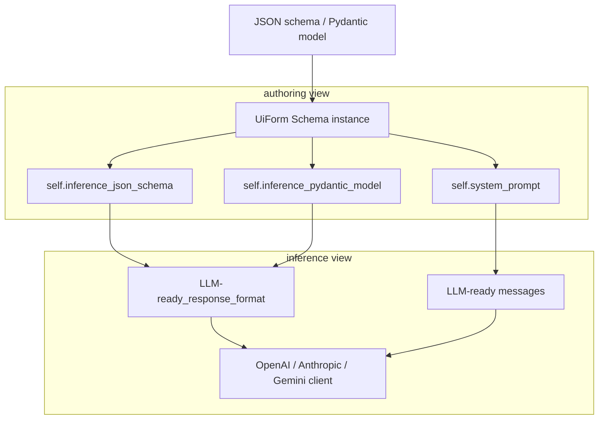

**Authoring view** - what you give: a concise JSON Schema or Pydantic model describing the payload you want to extract.

**Inference view** - what the LLM needs: the same schema plus helper reasoning fields plus a monster system prompt that teaches the model how to fill them.

Schema is the bridge that keeps those two views in sync.
