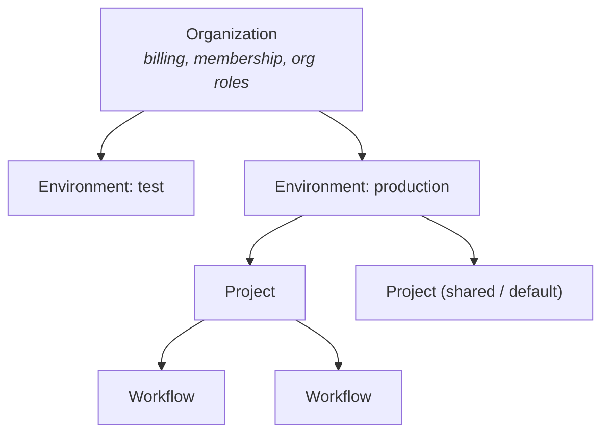

Retab access control is built from four nested layers and two access systems.
The layers decide **where a resource lives**; the access systems decide **who
can touch it**.

## The four layers



| Layer            | What it groups                                              | Scope                          |
| ---------------- | ---------------------------------------------------------- | ------------------------------ |
| **Organization** | Members, billing, org-wide roles                           | Global — one per customer      |
| **Environment**  | API keys, files, runs, webhooks, secrets, analytics        | `test` and `production`        |
| **Project**      | A named group of workflows, plus the access grants on them | Lives in one environment       |
| **Workflow**     | Blocks, edges, runs, versions                              | Belongs to exactly one project |

Membership and billing are **organization-global**; everything else is
**scoped to one environment**. A project in `test` and a project in
`production` are different resources even if they share a name — see
[Environments](/enterprise/environments) for what environment isolation
guarantees.

## The two access systems

Retab separates coarse organizational authority from fine-grained,
per-resource access. They answer different questions and are configured in
different places.

<CardGroup cols={2}>
  <Card title="Organization RBAC" icon="building">
    Three org-wide roles — **SuperAdmin**, **Admin**, **Member** — govern
    account-level authority: billing, invitations, API keys, secrets,
    environments. Coarse and organization-wide.
  </Card>

  <Card title="Fine-Grained Authorization (FGA)" icon="key">
    Per-**project** and per-**workflow** roles — owner, editor, operator,
    viewer — govern who can view, run, edit, review, publish, or delete a
    specific project's workflows. This is where product access actually
    comes from.
  </Card>
</CardGroup>

A member's org role is **not** what lets them run a workflow. Being an
organization `Member` gives baseline account access; the ability to open,
run, or edit a given workflow comes from an FGA grant on the project that
owns it. See [Roles and permissions](/enterprise/roles-and-permissions) for the
full role tables.

## Who the actor is

Every request is authenticated as one of two kinds of caller, and they map
to access differently:

| Caller                       | Identity                                      | Access model                                                                        |
| ---------------------------- | --------------------------------------------- | ----------------------------------------------------------------------------------- |
| **Dashboard / OAuth user**   | An organization member                        | Org role **plus** the FGA roles granted to them on projects and workflows.          |
| **API key** (`rt_test_`/`rt_live_`) | A machine credential bound to one environment | Full access **within its environment**. Not a member; not narrowed by FGA.          |
| **Access token** (`acctk_`)  | Acts as the user who created it                | Narrowed to the specific project and workflow **grants** placed on it.              |

<Note>
  An API key is bound to an environment, not to a project. `rt_test_…` keys
  act inside `test`, `rt_live_…` keys inside `production`, and within that
  environment the key is not narrowed by project/workflow roles — FGA roles
  scope **people**, not keys. When an agent or automation should be confined
  to specific projects or a single workflow, mint a scoped **access token**
  instead — see [Access tokens](/enterprise/access-tokens).
</Note>

## Capabilities on API responses

You rarely need to compute permissions yourself. Project and workflow
responses carry a server-computed **`capabilities`** array telling you what
the current caller may do with that resource:

```json
{
  "id": "wf_…",
  "name": "Invoice extraction",
  "project_id": "proj_…",
  "capabilities": ["workflow:view", "workflow:run", "workflow:review"],
  "authz_status": "ready"
}
```

Use `capabilities` to drive UI state (hide the *Publish* button when
`workflow:publish` is absent) instead of hard-coding role logic on the
client. `authz_status` reflects the resource's authorization
provisioning state (`provisioning`, `ready`, `failed`, …); it is `ready`
under normal operation.

## Where things are managed today

<Info>
  **Projects and role assignments are managed in the dashboard.** The
  project and membership endpoints are not part of the public API surface.
  The public API *references* projects — every workflow carries a
  `project_id` — but you create projects, invite members, and assign roles
  from the Retab dashboard.
</Info>

Workflow-level FGA is **provisioned but mostly inherited**: a workflow's
access resource is created under its project, so in practice you grant access
at the **project** level and every workflow in that project follows. There is
no first-class "give this person a role on one workflow" dashboard flow today.
The one place workflow-scoped access *is* exposed is
[access tokens](/enterprise/access-tokens), whose grants can target a single
workflow.
[Roles and permissions](/enterprise/roles-and-permissions#project-to-workflow-inheritance)
explains the inheritance model.

## Where to go next

<CardGroup cols={2}>
  <Card title="Projects" icon="folder" href="/enterprise/projects">
    How projects group workflows, the shared Default Project, and how the
    API references them by `project_id`.
  </Card>

  <Card title="Roles and permissions" icon="shield-halved" href="/enterprise/roles-and-permissions">
    The full org-RBAC and FGA role tables, the permission vocabulary, and
    scoped access tokens.
  </Card>

  <Card title="Environments" icon="layer-group" href="/enterprise/environments">
    What is isolated per environment and how the API key selects it.
  </Card>

  <Card title="Access tokens" icon="key" href="/enterprise/access-tokens">
    Scoped, user-acting credentials for agents and automation.
  </Card>
</CardGroup>
