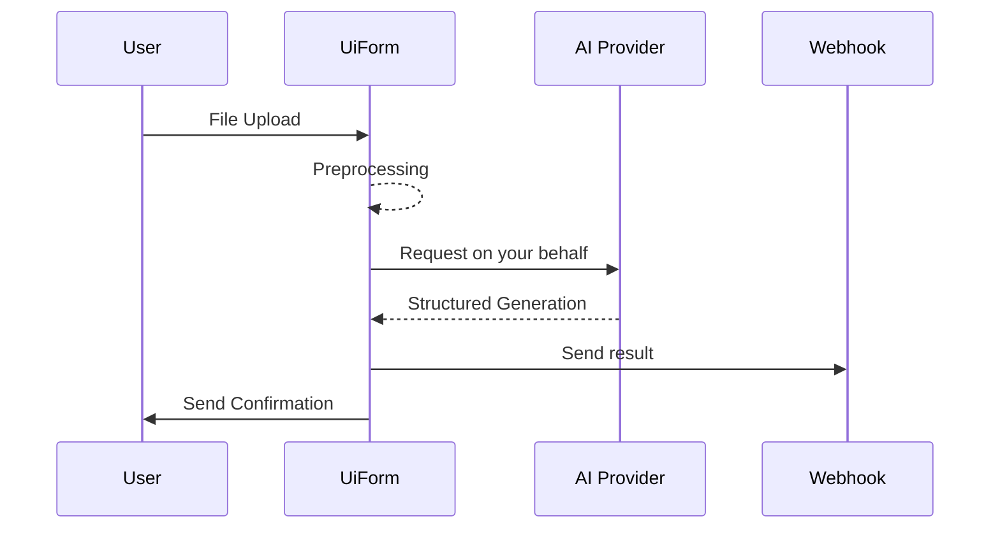

UiForm solves three major challenges in document processing with LLMs:

1. **Universal Document Processing**: Convert any file type (PDFs, Excel, emails, etc.) into LLM-ready format without writing custom parsers
2. **Structured, Schema-driven Extraction**: Get consistent, reliable outputs using schema-based prompt engineering
3. **Automations**: Create custom mailboxes and links to process documents at scale

We see it as building **Stripe** for document processing.

Our goal is to make the process of analyzing documents and unstructured data as **easy** and **transparent** as possible.

Many people haven't yet realized how powerful LLMs have become at document processing tasks - we're here to help **unlock these capabilities**.

---

## How it works

UiForm allows you to easily create document processing automations. Here is the general workflow:



---

## General philosophy

Our goal is to : 
<Steps>
  <Step title="Document Processing">
    Helping you leverage OpenAI API to do document processing tasks with structured generations
  </Step>
  <Step title="Automation">
    Create custom mailboxes and links connected to your webhooks to process documents at scale
  </Step>
  <Step title="Optimization">
    Identify the most used automations and help you finetune models to reduce costs and improve performance
  </Step>
</Steps>


---


We currently support [OpenAI](https://platform.openai.com/docs/overview), [Anthropic](https://www.anthropic.com/api), [Gemini](https://aistudio.google.com/) and [xAI](https://x.ai/api) models.

You come with your own API key from your favorite AI provider, and we handle the rest.

---

## Quickstart

<Steps>
  <Step title="Setup the Python SDK">
    Install the UiForm Python SDK and configure your API keys to start processing documents with your preferred AI provider
  </Step>
  <Step title="Create your JSON schema">
    Define the structure of the data you want to extract from your documents using our schema format with custom prompting capabilities
  </Step>
  <Step title="Create your FastAPI server with a webhook">
    Set up an endpoint that will receive the structured data extracted from your documents after processing
  </Step>
  <Step title="Create your automation">
    Configure an automation (mailbox or link) that will automatically process incoming documents using your schema and send results to your webhook
  </Step>
  <Step title="Test your automation">
    Validate your setup by sending test documents through your automation and verify the extracted data matches your requirements
  </Step>
</Steps>

### Step 1: Setup the Python SDK

To get started, install the `uiform` package using pip:

```bash
pip install uiform
```

Then, [create your API key on uiform.com](https://www.uiform.com) and populate your `env` variables:

```bash .env
UIFORM_API_KEY=sk_xxxxxxxxx # Create your API key on https://www.uiform.com
```

Then, as we will use your API key to make requests to OpenAI on your behalf within an automation, you need to store your API key in the UiForm secrets manager:

```python
import uiform
import os

uiclient = uiform.UiForm()

uiclient.secrets.external_api_keys.create(
    provider="OpenAI", 
    api_key=os.getenv("OPENAI_API_KEY")
)
```

**Process your first document**

Here is how to process your first document with the create_messages method:

<CodeGroup>
```python main.py (OpenAI Completions API)
from uiform import UiForm
from openai import OpenAI

# Initialize UiForm client
uiclient = UiForm()

# Convert any document into LLM-ready format
doc_msg = uiclient.documents.create_messages(
    document = "invoice.pdf"  # Works with PDFs, Excel, emails, etc.
)

client = OpenAI()
completion = client.chat.completions.create(
    model="gpt-4.1-nano",
    messages=doc_msg.openai_messages + [
        {
            "role": "user",
            "content": "Summarize the document"
        }
    ]
)
```
```python main.py (OpenAI Responses API)
from uiform import UiForm
from openai import OpenAI

# Initialize UiForm client
uiclient = UiForm()

# Convert any document into LLM-ready format
doc_msg = uiclient.documents.create_messages(
    document = "invoice.pdf"  # Works with PDFs, Excel, emails, etc.
)

client = OpenAI()
response = client.responses.create(
    model = "gpt-4.1-nano",
    input = doc_msg.openai_responses_input + [
        {
            "role": "user",
            "content": "Summarize the document"
        }
    ]
)
```

```json doc_msg object
{
    "id": "doc_dd003f95-81ce-4a55-9180-00c5a58d82ec",
    "object": "document.message",
    "messages": [
        {
            "role": "user",
            "content": [
                {
                    "type": "text",
                    "text": "INVOICE\n\nABC Logistics Inc.\n123 Shipping Lane\nPort City, PC 12345\n\nBill To:\nXYZ Corporation\n456 Business Ave\nMetro City, MC 67890\n\nInvoice Number: INV-2024-0123\nInvoice Date: 2024-01-15\nDue Date: 2024-02-14\n\nDescription:\n1. Ocean Freight (20ft Container) - $2,500.00\n2. Documentation Fee - $150.00\n3. Terminal Handling Charges - $350.00\n4. Customs Clearance - $275.00\n\nSubtotal: $3,275.00\nTax (10%): $327.50\nTotal Amount: $3,602.50\n\nPayment Terms: Net 30\nBank Details:\nBank: Global Trade Bank\nAccount: 1234567890\nSwift: GTBKUS12\n\nThank you for your business!\n\nFor questions contact:\naccounts@abclogistics.com\n+1 (555) 123-4567"
                }
            ]
        }
    ],
    "created": 1736524416,
    "modality": "text",
    "document": {
        "id": "cf908729402d0796537bb91e63df5e339ce93b4cabdcac2f9a4f90592647e130",
        "name": "invoice.pdf",
        "mime_type": "application/pdf",
    }
}
```
</CodeGroup>


### Step 2 : Create your JSON Schema

We use a standard JSON Schema with custom annotations (`X-SystemPrompt`, `X-FieldPrompt`, and `X-ReasoningPrompt`) as a prompt-engineering framework for the extraction process.

These annotations help guide the LLM's behavior and improve extraction accuracy. 
You can learn more about these in our [JSON Schema documentation](https://docs.uiform.com/get-started/prompting-with-the-JSON-schema).

<CodeGroup>
```python Pydantic BaseModel (OpenAI Completions API)
from uiform import UiForm
from openai import OpenAI
from pydantic import BaseModel, Field, ConfigDict

# Define your extraction schema
class Invoice(BaseModel):
    model_config = ConfigDict(
        json_schema_extra = {
            "X-SystemPrompt": "You are an expert at analyzing invoice documents."
        }
    )
    
    total_amount: float = Field(...,
        description="The total invoice amount",
        json_schema_extra={
            "X-FieldPrompt": "Find the final total amount including taxes"
        }
    )
    date: str = Field(...,
        description="Invoice date in YYYY-MM-DD format",
        json_schema_extra={
            "X-ReasoningPrompt": "Look for dates labeled as 'Invoice Date', 'Date', etc."
        }
    )

# Process document and extract data
uiclient = UiForm()
doc_msg = uiclient.documents.create_messages(
    document = "invoice.pdf"
)
schema_obj = uiclient.schemas.load(
    pydantic_model = Invoice
)

# Extract structured data with any LLM
client = OpenAI()
completion = client.beta.chat.completions.parse(
    model="gpt-4o",
    messages=schema_obj.openai_messages + doc_msg.openai_messages,
    response_format=schema_obj.inference_pydantic_model
)

print("Extracted data:", completion.choices[0].message.parsed)

# Validate the response against the original schema if you want to remove the reasoning fields
from uiform._utils.json_schema import filter_reasoning_fields_json
assert completion.choices[0].message.content is not None
extraction = schema_obj.pydantic_model.model_validate(
    filter_reasoning_fields_json(completion.choices[0].message.content, schema_obj.pydantic_model)
)
```
```python JSON Schema (OpenAI Completions API)
from uiform import UiForm
from openai import OpenAI

# Define your extraction schema
schema = {
    "X-SystemPrompt": "You are an expert at analyzing invoice documents.",
    "properties": {
        "total_amount": {
            "type": "number",
            "description": "The total invoice amount",
            "X-FieldPrompt": "Find the final total amount including taxes"
        },
        "date": {
            "type": "string",
            "description": "Invoice date in YYYY-MM-DD format",
            "X-ReasoningPrompt": "Look for dates labeled as 'Invoice Date', 'Date', etc."
        }
    },
    "required": ["total_amount", "date"]
}

# Process document and extract data
uiclient = UiForm()
doc_msg = uiclient.documents.create_messages(
    document = "invoice.pdf"
)
schema_obj = uiclient.schemas.load(
    json_schema = schema
)

# Extract structured data with any LLM
client = OpenAI()
completion = client.chat.completions.create(
    model="gpt-4o",
    messages=schema_obj.openai_messages + doc_msg.openai_messages,
    response_format={
        "type": "json_schema",
        "json_schema": {
            "name": schema_obj.id,
            "schema": schema_obj.inference_json_schema,
            "strict": True
        }
    }
)

print("Extracted data with the reasoning fields:", completion.choices[0].message.content) 

# Validate the response against the original schema if you want to remove the reasoning fields
from uiform._utils.json_schema import filter_reasoning_fields_json
assert completion.choices[0].message.content is not None
extraction = schema_obj.pydantic_model.model_validate(
    filter_reasoning_fields_json(completion.choices[0].message.content, schema_obj.pydantic_model)
)

print("Extracted data without the reasoning fields:", extraction)

```

```python JSON Schema (OpenAI Responses API)
from uiform import UiForm
from openai import OpenAI

# Define your extraction schema
schema = {
    "X-SystemPrompt": "You are an expert at analyzing invoice documents.",
    "properties": {
        "total_amount": {
            "type": "number",
            "description": "The total invoice amount",
            "X-FieldPrompt": "Find the final total amount including taxes"
        },
        "date": {
            "type": "string",
            "description": "Invoice date in YYYY-MM-DD format",
            "X-ReasoningPrompt": "Look for dates labeled as 'Invoice Date', 'Date', etc."
        }
    },
    "required": ["total_amount", "date"]
}

# Process document and extract data
uiclient = UiForm()
doc_msg = uiclient.documents.create_messages(
    document = "invoice.pdf"
)
schema_obj = uiclient.schemas.load(
    json_schema = schema
)

# Extract structured data with any LLM
# Updated to use Responses API instead of Chat Completions
client = OpenAI()
response = client.responses.create(
    model = model,
    temperature = temperature,
    input = schema_obj.openai_responses_input + doc_msg.openai_responses_input,
    text ={
        "format": {
            "type": "json_schema",
            "name": schema_obj.id,
            "schema": schema_obj.inference_json_schema,
            "strict": True
            }
        }
)

print("Extracted data with the reasoning fields:", response.output_text) 

# Validate the response against the original schema if you want to remove the reasoning fields
from uiform._utils.json_schema import filter_reasoning_fields_json
assert response.output_text is not None
extraction = schema_obj.pydantic_model.model_validate(
    filter_reasoning_fields_json(response.output_text, schema_obj.pydantic_model)
)

print("Extracted data without the reasoning fields:", extraction)

```

```python JSON Schema (UiForm API)
from uiform import UiForm

# All-in-one extraction API
uiclient = UiForm()
response = uiclient.documents.extractions.parse(
    document = "invoice.pdf",
    model = "gpt-4o",
    json_schema = {
        "X-SystemPrompt": "You are an expert at analyzing invoice documents.",
        "properties": {
            "total_amount": {
                "type": "number",
                "description": "The total invoice amount",
                "X-FieldPrompt": "Find the final total amount including taxes"
            },
            "date": {
                "type": "string",
                "description": "Invoice date in YYYY-MM-DD format",
                "X-ReasoningPrompt": "Look for dates labeled as 'Invoice Date', 'Date', etc."
            }
        },
        "required": ["total_amount", "date"]
    }
)

print("Extracted data:", response.choices[0].message.content)
```
</CodeGroup>


### Step 3: Create your FastAPI server with a webhook


Next, set up a FastAPI route that will handle incoming webhook POST requests. Below is an example of a simple FastAPI application with a webhook endpoint:

```python
from fastapi import FastAPI, Request
from fastapi.responses import JSONResponse
from uiform.types.automations.webhooks import WebhookRequest
from pydantic import BaseModel, Field, ConfigDict

app = FastAPI()

@app.post("/webhook")
async def webhook(request: WebhookRequest):
    invoice_object = request.completion.choices[0].message.parsed # The parsed object is the same Invoice object as the one you defined in the Pydantic model
    print("Received payload:", invoice_object)
    return JSONResponse(content={"status": "success", "data": invoice_object})

# To run the FastAPI app locally, use the command:
# uvicorn your_module_name:app --reload
if __name__ == "__main__":
    import uvicorn
    uvicorn.run(app, host="0.0.0.0", port=8000)
```

You can test the webhook endpoint locally with a tool like curl or Postman. For example, using curl:

```bash
curl -X POST "http://localhost:8000/webhook" \
     -H "Content-Type: application/json" \
     -d '{"name": "Team Meeting", "date": "2023-12-31"}'
```

<Warning>To continue, you need to deploy your FastAPI app to a server to make your webhook endpoint publicly accessible. We recommend using [Replit](https://replit.com/) to get started quickly if you don't have a server yet.</Warning>


### Step 4: Create your automation

Finally, integrate the webhook with your automation system using the `uiform` client. This example demonstrates how to create an automation that triggers the webhook when a matching event occurs:

```python
from uiform import UiForm

# Initialize the UiForm client
uiclient = UiForm()

# Create an automation that uses the webhook URL from Step 2
automation = uiclient.automations.mailboxes.create(
    email="invoices@mailbox.uiform.com",
    model="gpt-4.1-nano",
    json_schema=Invoice.model_json_schema(), # use the pydantic model to create the json schema
    webhook_url="https://your-server.com/webhook",  # Replace with your actual webhook URL
)

```

At any email sent to `invoices@mailbox.uiform.com`, the automation will send a POST request to your FastAPI webhook endpoint, where the payload can be processed.

You can see the automation you just created on your [dashboard](https://www.uiform.com/dashboard/automations) !

### Step 5: Test your automation

Finally, you can test the automation rapidly with the test functions of the sdk: 

```python
from uiform import UiForm

# Initialize the UiForm client
uiclient = UiForm()

# If you just want to send a test request to your webhook
log = uiclient.automations.mailboxes.tests.webhook(
    email="test-mailbox-local@devmail.uiform.com", 
)

# If you want to test the file processing logic: 
log = uiclient.automations.mailboxes.tests.process(
    email="test-mailbox-local@devmail.uiform.com", 
    document="your_invoice_email.eml"
)

# If you want to test a full email forwarding
log = uiclient.automations.mailboxes.tests.forward(
    email="uiform-quickstart@mailbox.uiform.com", 
    document="your_invoice_email.eml"
)
```

<Tip>You can also test your webhook locally by overriding the webhook url set in the automation</Tip>

```python
from uiform import UiForm

uiclient = UiForm()

# If you just want to send a test request to your webhook
log = uiclient.automations.mailboxes.tests.webhook(
    email="test-mailbox-local@devmail.uiform.com", 
    webhook_url="http://localhost:8000/webhook" # If you want to try your webhook locally, you can override the webhook url set in the automation
)
```


---


That's it! You can start processing documents at scale. 
You have 1000 free requests to get started, and you can [subscribe](https://www.uiform.com) to the pro plan to get more.

But this minimalistic example is just the beginning. Continue reading to learn more about how to use UiForm **to its full potential**.

---

## Go further

- [Prompt Engineering Guide](/get-started/prompting-with-the-JSON-schema)
- [General Concepts](/SDK/General-Concepts)
    - [Consensus](/SDK/General-Concepts#consensus)
- [Create mailboxes](/SDK/Automations#mailbox)
- [Create links](/SDK/Automations#link)
- Finetuning (coming soon)
- Prompt optimization (coming soon)
- Data-Labelling with our AI-powered annotator (coming soon)

---

## Jupyter Notebooks

You can view minimal notebooks that demonstrate how to use UiForm to process documents:
- [Mailbox creation quickstart](https://github.com/UiForm/uiform/blob/main/notebooks/mailboxes_quickstart.ipynb)
- [Upload Links creation quickstart](https://github.com/UiForm/uiform/blob/main/notebooks/links_quickstart.ipynb)
- [Document Extractions quickstart](https://github.com/UiForm/uiform/blob/main/notebooks/Quickstart.ipynb)
- [Document Extractions quickstart - Async](https://github.com/UiForm/uiform/blob/main/notebooks/Quickstart-Async.ipynb)

--- 


## Community

Let's create the future of document processing together!

Join our [discord community](https://discord.com/invite/vc5tWRPqag) to share tips, discuss best practices, and showcase what you build. Or just [tweet](https://x.com/uiformAPI) at us.

We can't wait to see how you'll use UiForm.

- [Discord](https://discord.com/invite/vc5tWRPqag)
- [Twitter](https://x.com/uiformAPI)

---

## Roadmap

We share our roadmap publicly on [Github](https://github.com/UiForm/uiform)

Among the features we're working on:

[ ] Node.js SDK
[ ] Finetuning
[ ] Prompt optimization
[ ] Data-Labelling platform
