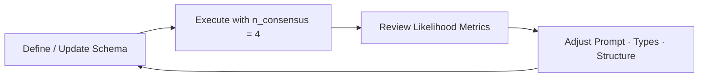

## How to Build a Great Schema

**Consensus** is Retab's approach to schema validation: it makes multiple parallel AI requests using the same schema and compares the results.

**Why consensus matters:** When multiple AI responses disagree, it reveals ambiguities in your schema or prompt. This lets you understand failure modes and fix them before production.

Instead of hoping your schema works reliably and experimenting blindly, consensus shows you exactly where it might fail.

---

### The Schema Building Process



1. **Define/Update Schema** — Create your data structure with field names, types, and descriptions
2. **Execute with n_consensus = 4** — Run 4 parallel extractions using the same schema to see where responses differ
3. **Review Likelihood Metrics** — Check which fields have low consensus scores (below 0.75 means problems)
4. **Adjust Prompt·Types·Structure** — Fix the problematic fields by changing descriptions, types, or breaking them into smaller parts
5. **Repeat** — Keep iterating until all fields hit 0.75+ likelihood scores

---

### Visualizing Consensus on the Retab Dashboard

The Retab dashboard provides powerful visualization tools to help you understand consensus patterns and optimize your schemas.

**Query parameters:**

| Parameter | Description | Default |
| --------- | ----------- | ------- |
| `extraction_id` | Unique identifier for the extraction | Required |
| `include_responses` | Include individual response details | `false` |
| `format` | Response format (`summary` or `detailed`) | `summary` |
| `threshold` | Minimum likelihood threshold for filtering | `0.0` |

---

### Schema Improvement Levers

| Lever | When to apply (typical consensus patterns) | Root cause | Concrete fix |
|-------|---------------------------------------------|------------|--------------|
| **Change field names** | Diverging values because models mix up concepts (e.g. organizer vs event title) | Ambiguous or overloaded label | Rename `name` → `event_name`; clarify: "Do not include organizer." |
| **Enhance field descriptions** | Correct data, wrong format · Empty vs filled arrays · Varying data across requests | Instructions too vague | Add examples: "Return price in USD, two decimals (e.g. 1234.56)." / "Include items only if stock > 0." |
| **Adjust field types** | Numbers arrive as strings/ints/floats · Date/time fields vary wildly | Format ambiguity or loose typing | `amount: Decimal` instead of `str`; `date: datetime.date` with ISO-8601 requirement |
| **Restructure data hierarchy** | Single field conflates multiple concepts (address, full name, etc.) | Ambiguous formatting | Replace `address: str` with nested `Address` model (`street`, `city`, `zip_code`, `country`) |
| **Add reasoning prompts** | Simple computations fail or values inconsistent even with clear schema | Model needs step-by-step reasoning space | Add "Convert the weight to kg" as [reasoning prompt](https://docs.retab.com/core-concepts/Reasoning) to `weight` |
| **Remove problematic fields** | Field stays low-likelihood after multiple iterations and isn't critical | Unnecessary complexity | Drop the field entirely or defer to a later version |

---
### Example of a schema building process

#### Step 1 — Draft an Initial Schema

<CodeGroup>
```python Python
class CalendarEvent(BaseModel):
    name: str
    date: str
    address: str
```

```javascript JavaScript
import { z } from 'zod';

const CalendarEvent = z.object({
    name: z.string(),
    date: z.string(),
    address: z.string()
});
```

</CodeGroup>

---

#### Step 2 — Execute with Consensus

<CodeGroup>
```python Python
from retab import Retab

client = Retab()

result = client.documents.extract(
    model="gpt-4o-mini",
    messages=messages,
    json_schema=CalendarEvent.model_json_schema(),
    n_consensus=4,
)

print(json.dumps(result.likelihoods, indent=2))
```

```javascript JavaScript
import { Retab } from '@retab/node';
import { zodToJsonSchema } from 'zod-to-json-schema';

const client = new Retab();

const result = await client.documents.extract({
    model: "gpt-4o-mini",
    messages: messages,
    json_schema: zodToJsonSchema(CalendarEvent),
    n_consensus: 4,
});

console.log(JSON.stringify(result.likelihoods, null, 2));
```
</CodeGroup>

**Sample output:**
<CodeGroup>
```json Consolidated output
# Obtained from result.choices[0].message.content
{
  "name": "Science Fair",
  "date": "Friday",
  "address": "123 Main St, Anytown, USA"
}
```
```json Response #1
# Obtained from result.choices[1].message.content
{
  "name": "Science Fair",
  "date": "Friday",
  "address": "123 Main St, Anytown, USA"
}
```

```json Response #2
# Obtained from result.choices[2].message.content
{
  "name": "Science Fair",
  "date": "Friday",
  "address": "123 Main Street, Anytown, USA 12345"
}
```

```json Response #3
# Obtained from result.choices[3].message.content
{
  "name": "Science Fair",
  "date": "2024-03-15",
  "address": "123 Main St, Anytown"
}
```

```json Response #4
# Obtained from result.choices[4].message.content
{
  "name": "Science Fair",
  "date": "2024-03-15",
  "address": "Main Street 123, 12345 Anytown, USA"
}
```
```json Likelihoods
{
  "name": 1.0,
  "date": 0.5,
  "address": 0.25
}
```
</CodeGroup>

**Interpretation of the consensus likelihoods:**

- The **name** field is reliable (perfect consensus)
- The **date** field requires format unification (mixed formats)
- The **address** field is unstable (high variation in structure)

---

#### Step 3 — Rank Fields by Likelihood

| Field     | Likelihood | Status | Recommended Action             |
| --------- | ---------- | ------ | ------------------------------ |
| `name`    | 1.0        | ✅ Good | Retain current configuration   |
| `date`    | 0.5        | ⚠️ Needs work | Clarify format or tighten type |
| `address` | 0.25       | ❌ Poor | Redesign field data structure  |

**Production threshold:** Likelihood **≥ 0.75** is recommended for production deployment.

---

#### Step 4 — Enhance schema

| Priority | Lever                    | Use Case                         | Example Modification                                                |
| -------- | ------------------------ | -------------------------------- | ------------------------------------------------------------------- |
| 1        | **Prompt clarification** | Extraction varies across runs   | "Name is the event title, not the organizer's name"                |
| 2        | **Type constraints**     | Parsing errors, format issues   | Convert `str` → `datetime.date`                                     |
| 3        | **Structural revision**  | Field conflates multiple concepts| Break `address` into `street`, `city`, `zip_code`, `country`       |

**Revised schema:**

<CodeGroup>
```python Python
class Address(BaseModel):
    street: str
    city: str
    zip_code: str
    country: str

class CalendarEvent(BaseModel):
    name: str
    date: datetime.date
    address: Address
```

```javascript JavaScript
import { z } from 'zod';

const Address = z.object({
    street: z.string(),
    city: z.string(),
    zip_code: z.string(),
    country: z.string()
});

const CalendarEvent = z.object({
    name: z.string(),
    date: z.string().date(), // ISO date string (YYYY-MM-DD)
    address: Address
});
```
</CodeGroup>


**Improved outputs:**
<CodeGroup>
```json Consolidated output
# Obtained from result.choices[0].message.content
{
  "name": "Science Fair",
  "date": "2024-03-15",
  "address": {
    "street": "123 Main St",
    "city": "Anytown",
    "zip_code": "12345",
    "country": "USA"
  }
}
```
```json Response #1 
# Obtained from result.choices[1].message.content
{
  "name": "Science Fair",
  "date": "2024-03-15",
  "address": {
    "street": "123 Main St",
    "city": "Anytown",
    "zip_code": "12345",
    "country": "USA"
  }
}
```

```json Response #2
# Obtained from result.choices[2].message.content
{
  "name": "Science Fair",
  "date": "2024-03-15",
  "address": {
    "street": "123 Main Street",
    "city": "Anytown",
    "zip_code": "12345",
    "country": "USA"
  }
}
```

```json Response #3
# Obtained from result.choices[3].message.content
{
  "name": "Science Fair",
  "date": "2024-03-15",
  "address": {
    "street": "123 Main St",
    "city": "Anytown",
    "zip_code": "12345",
    "country": "USA"
  }
}
```

```json Response #4
# Obtained from result.choices[4].message.content
{
  "name": "Science Fair",
  "date": "2024-03-15",
  "address": {
    "street": "123 Main St",
    "city": "Anytown",
    "zip_code": "12345",
    "country": "USA"
  }
}
```
```json Likelihoods
{
  "name": 1.0,
  "date": 1.0,
  "address": {
    "street": 0.75,
    "city": 1.0,
    "zip_code": 1.0,
    "country": 1.0
  }
}
```
</CodeGroup>

**Repeat these steps** until all fields achieve high likelihood scores.

---

### Best Practices

1. **Start with n_consensus=4** for development and testing
2. **Target likelihood ≥ 0.95** on every field for production readiness
3. **Fix lowest consensus scores first** — maximize improvement impact
4. **Test with diverse documents** — different formats reveal different issues

**Consensus reveals where your schema is brittle**. Fix the ambiguities that consensus exposes, and you'll build robust schemas that work reliably in production.
