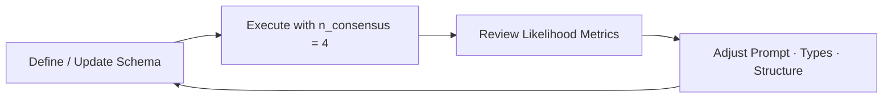

## How to Build a Great Schema

**Consensus** is Retab's approach to schema validation: it makes multiple parallel AI requests using the same schema and compares the results.

**Why consensus matters:** When multiple AI responses disagree, it reveals ambiguities in your schema or prompt. This lets you understand failure modes and fix them before production.

Instead of hoping your schema works reliably and experimenting blindly, consensus shows you exactly where it might fail.

---

### The Schema Building Process



1. **Define/Update Schema** — Create your data structure with field names, types, and descriptions
2. **Execute with n_consensus = 4** — Run 4 parallel extractions using the same schema to see where responses differ
3. **Review Likelihood Metrics** — Check which fields have low consensus scores (below 0.75 means problems)
4. **Adjust Prompt·Types·Structure** — Fix the problematic fields by changing descriptions, types, or breaking them into smaller parts
5. **Repeat** — Keep iterating until all fields hit 0.75+ likelihood scores

---

### Visualizing Consensus on the Retab Dashboard

The Retab dashboard provides powerful visualization tools to help you understand consensus patterns and optimize your schemas.

**Query parameters:**

| Parameter | Description | Default |
| --------- | ----------- | ------- |
| `extraction_id` | Unique identifier for the extraction | Required |
| `include_responses` | Include individual response details | `false` |
| `format` | Response format (`summary` or `detailed`) | `summary` |
| `threshold` | Minimum likelihood threshold for filtering | `0.0` |

---

### Quick Debugging Guide

| Consensus Pattern | Likely Cause | Best Fix |
|------------------|--------------|----------|
| Date/time fields vary wildly | Format ambiguity | Use `datetime` types with explicit formats |
| Numbers as strings inconsistent | Parsing ambiguity | Use `int`/`float`/`Decimal` types |
| Single field with multiple concepts | Cognitive overload | Break into sub-objects |
| Correct data, wrong format | Instruction unclear | Add specific formatting examples |
| Empty vs filled arrays | Inclusion criteria unclear | Define explicit inclusion rules |
| Varying data across requests | Description ambiguity | Clarify field descriptions with examples |
| Simple computations failing | Insufficient reasoning space | [Add a reasoning field](https://retab.com/core-concepts/Reasoning) |

---

### Schema Improvement Levers

**Available techniques to enhance your schema:**

1. **Change field names** — Use more descriptive, unambiguous names
2. **Enhance field descriptions** — Add examples and clarify expectations  
3. **Adjust field types** — Use specific types instead of generic strings
4. **Restructure data hierarchy** — Break complex fields into sub-objects
5. **Add reasoning prompts** — Gives some space to the model to think step by step before giving the answer
6. **Remove problematic fields** — Sometimes less is more

---
### Example of a schema building process

#### Step 1 — Draft an Initial Schema

```python
class CalendarEvent(BaseModel):
    name: str
    date: str
    address: str
```

---

#### Step 2 — Execute with Consensus

```python
from retab import Retab

client = Retab()

result = client.documents.extract(
    model="gpt-4o-mini",
    messages=messages,
    json_schema=CalendarEvent.model_json_schema(),
    n_consensus=4,
)

print(json.dumps(result.likelihoods, indent=2))
```

**Sample output:**
<CodeGroup>
```json Consolidated output
# Obtained from result.choices[0].message.content
{
  "name": "Science Fair",
  "date": "Friday",
  "address": "123 Main St, Anytown, USA"
}
```
```json Response #1
# Obtained from result.choices[1].message.content
{
  "name": "Science Fair",
  "date": "Friday",
  "address": "123 Main St, Anytown, USA"
}
```

```json Response #2
# Obtained from result.choices[2].message.content
{
  "name": "Science Fair",
  "date": "Friday",
  "address": "123 Main Street, Anytown, USA 12345"
}
```

```json Response #3
# Obtained from result.choices[3].message.content
{
  "name": "Science Fair",
  "date": "2024-03-15",
  "address": "123 Main St, Anytown"
}
```

```json Response #4
# Obtained from result.choices[4].message.content
{
  "name": "Science Fair",
  "date": "2024-03-15",
  "address": "Main Street 123, 12345 Anytown, USA"
}
```
```json Likelihoods
{
  "name": 1.0,
  "date": 0.5,
  "address": 0.25
}
```
</CodeGroup>

**Interpretation of the consensus likelihoods:**

- The **name** field is reliable (perfect consensus)
- The **date** field requires format unification (mixed formats)
- The **address** field is unstable (high variation in structure)

---

#### Step 3 — Rank Fields by Likelihood

| Field     | Likelihood | Status | Recommended Action             |
| --------- | ---------- | ------ | ------------------------------ |
| `name`    | 1.0        | ✅ Good | Retain current configuration   |
| `date`    | 0.5        | ⚠️ Needs work | Clarify format or tighten type |
| `address` | 0.25       | ❌ Poor | Redesign field data structure  |

**Production threshold:** Likelihood **≥ 0.75** is recommended for production deployment.

---

#### Step 4 — Enhance schema

| Priority | Lever                    | Use Case                         | Example Modification                                                |
| -------- | ------------------------ | -------------------------------- | ------------------------------------------------------------------- |
| 1        | **Prompt clarification** | Extraction varies across runs   | "Name is the event title, not the organizer's name"                |
| 2        | **Type constraints**     | Parsing errors, format issues   | Convert `str` → `datetime.date`                                     |
| 3        | **Structural revision**  | Field conflates multiple concepts| Break `address` into `street`, `city`, `zip_code`, `country`       |

**Revised schema:**

```python
class Address(BaseModel):
    street: str
    city: str
    zip_code: str
    country: str

class CalendarEvent(BaseModel):
    name: str
    date: datetime.date
    address: Address
```

**Improved outputs:**
<CodeGroup>
```json Consolidated output
# Obtained from result.choices[0].message.content
{
  "name": "Science Fair",
  "date": "2024-03-15",
  "address": {
    "street": "123 Main St",
    "city": "Anytown",
    "zip_code": "12345",
    "country": "USA"
  }
}
```
```json Response #1 
# Obtained from result.choices[1].message.content
{
  "name": "Science Fair",
  "date": "2024-03-15",
  "address": {
    "street": "123 Main St",
    "city": "Anytown",
    "zip_code": "12345",
    "country": "USA"
  }
}
```

```json Response #2
# Obtained from result.choices[2].message.content
{
  "name": "Science Fair",
  "date": "2024-03-15",
  "address": {
    "street": "123 Main Street",
    "city": "Anytown",
    "zip_code": "12345",
    "country": "USA"
  }
}
```

```json Response #3
# Obtained from result.choices[3].message.content
{
  "name": "Science Fair",
  "date": "2024-03-15",
  "address": {
    "street": "123 Main St",
    "city": "Anytown",
    "zip_code": "12345",
    "country": "USA"
  }
}
```

```json Response #4
# Obtained from result.choices[4].message.content
{
  "name": "Science Fair",
  "date": "2024-03-15",
  "address": {
    "street": "123 Main St",
    "city": "Anytown",
    "zip_code": "12345",
    "country": "USA"
  }
}
```
```json Likelihoods
{
  "name": 1.0,
  "date": 1.0,
  "address": {
    "street": 0.75,
    "city": 1.0,
    "zip_code": 1.0,
    "country": 1.0
  }
}
```
</CodeGroup>

**Repeat these steps** until all fields achieve high likelihood scores.
---

### Best Practices

1. **Start with n_consensus=4** for development and testing
2. **Target likelihood ≥ 0.75** on every field for production readiness
3. **Fix lowest consensus scores first** — maximize improvement impact
4. **Test with diverse documents** — different formats reveal different issues

**Remember:** Consensus reveals where your schema is brittle. Fix the ambiguities that consensus exposes, and you'll build robust schemas that work reliably in production.
