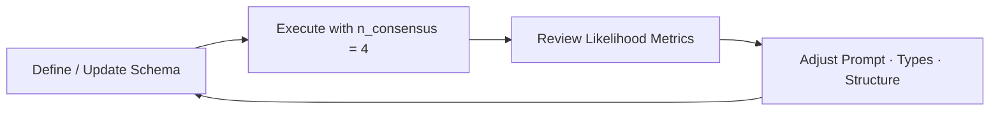

## How to build a great schema

**Consensus = Making n parallel requests and merging them into 1 result.**

The key insight: **When multiple AI responses disagree, it reveals ambiguities in your schema or prompt.** This lets you understand failure modes and fix them before production.

---

### The Schema Building Process



#### Step 1 — Draft an Initial Schema

1. Establish only the essential fields.
2. Prefer generic `str` types during the first pass.
3. Compose an extraction prompt that mirrors the schema exactly.

```python
class CalendarEvent(BaseModel):
    name: str
    date: str            # Initial permissive format
    address: str         # Initial permissive format
```

---

#### Step 2 — Execute with Consensus (n = 4)

```python
from retab import Retab

client = Retab()

result = client.documents.extract(
    model="gpt-4o-mini",
    messages=messages,
    json_schema=CalendarEvent.model_json_schema(),
    n_consensus=4,
)

print(json.dumps(result.likelihoods, indent=2))
```

Sample output:
<CodeGroup>
```json Consolidated output
# Obtained from result.choices[0].message.content
{
  "name": "Science Fair",
  "date": "Friday",
  "address": "123 Main St, Anytown, USA"
}
```
```json #1
# Obtained from result.choices[1].message.content
{
  "name": "Science Fair",
  "date": "Friday",
  "address": "123 Main St, Anytown, USA"
}
```

```json #2
# Obtained from result.choices[2].message.content
{
  "name": "Science Fair",
  "date": "Friday",
  "address": "123 Main Street, Anytown, USA 12345"
}
```

```json #3
# Obtained from result.choices[3].message.content
{
  "name": "Science Fair",
  "date": "2024-03-15",
  "address": "123 Main St, Anytown"
}
```

```json #4
# Obtained from result.choices[4].message.content
{
  "name": "Science Fair",
  "date": "2024-03-15",
  "address": "Main Street 123, 12345 Anytown, USA"
}
```
```json Likelihoods
{
  "name": 1.0,
  "date": 0.5,
  "address": 0.25
}
```
</CodeGroup>

Interpretation:

* The **name** field is reliable.
* The **date** field requires format unification.
* The **address** column is unstable.

---

#### Step 3 — Rank Fields by Likelihood

| Field          | Likelihood (4 samples) | Recommended Action             |
| -------------- | --------------------- | ------------------------------ |
| `name`         | 1.0                   | Retain current configuration   |
| `date`         | 0.5                   | Clarify format or tighten type |
| `address` | 0.25                   | Redesign field data structure       |

A working threshold of likelihood **≥ 0.75** is suitable for production deployment.

---

#### Step 4 — Disambiguation Levers

| Priority | Lever                    | Typical Use Case                     | Example Modification                                                |
| -------- | ------------------------ | ------------------------------------ | ------------------------------------------------------------------- |
| 1        | **Prompt clarification** | The data extracted varies accross iterations | "Name is the name of the event, not the name of the person organizing it"   |
| 2        | **Type constraints**     | Correct semantics, parsing errors    | Convert `str` → `datetime.date`;                             |
| 3        | **Structural revision**  | Field conflates multiple concepts    | Break down `address` into `street`, `city`, `zip_code`, `country`.  |

Revised schema:

```python
class Address(BaseModel):
    street: str
    city: str
    zip_code: str
    country: str

class CalendarEvent(BaseModel):
    name: str
    date: datetime.date
    address: Address
```

Outputs: 
<CodeGroup>
```json Consolidated output
# Obtained from result.choices[0].message.content
{
  "name": "Science Fair",
  "date": "2024-03-15",
  "address": {
    "street": "123 Main St",
    "city": "Anytown",
    "zip_code": "12345",
    "country": "USA"
  }
}
```
```json #1 
# Obtained from result.choices[1].message.content
{
  "name": "Science Fair",
  "date": "2024-03-15",
  "address": {
    "street": "123 Main St",
    "city": "Anytown",
    "zip_code": "12345",
    "country": "USA"
  }
}
```

```json #2
# Obtained from result.choices[2].message.content
{
  "name": "Science Fair",
  "date": "2024-03-15",
  "address": {
    "street": "123 Main Street",
    "city": "Anytown",
    "zip_code": "12345",
    "country": "USA"
  }
}
```

```json #3
# Obtained from result.choices[3].message.content
{
  "name": "Science Fair",
  "date": "2024-03-15",
  "address": {
    "street": "123 Main St",
    "city": "Anytown",
    "zip_code": "12345",
    "country": "USA"
  }
}
```

```json #4
# Obtained from result.choices[4].message.content
{
  "name": "Science Fair",
  "date": "2024-03-15",
  "address": {
    "street": "123 Main St",
    "city": "Anytown",
    "zip_code": "12345",
    "country": "USA"
  }
}
```
```json Likelihoods
{
  "name": 1.0,
  "date": 1.0,
  "address": {
    "street": 0.75,
    "city": 1.0,
    "zip_code": 1.0,
    "country": 1.0
  }
}
```
</CodeGroup>


Re‑execute these steps until all fields meet the have a high likelihood.

---

### Visualizing consensus on Retab

### TODO: Explain how Retab allows to visualize the consensus on the dashboard and how to access the likelihoods with the endpoint /consensus 

---

### Quick Debugging Guide

| Low Consensus Pattern | Likely Cause | Best Fix |
|----------------------|--------------|----------|
| Date/time fields vary wildly | Format ambiguity | Use `datetime` types |
| Numbers as strings inconsistent | Parsing ambiguity | Use `int`/`float`/`Decimal` |
| Single field with multiple concepts | Cognitive overload | Break into sub-objects |
| Good data, wrong format | Instruction unclear | Be more specific in your description |
| Empty vs filled arrays | Inclusion criteria unclear | Define when to include items |
| Varying data across requests | Description ambiguity | Clarify description |
| Simple computations are failing | Not enough room to think | [Add a reasoning field](https://retab.com/core-concepts/Reasoning) |

---

### Available levers to improve your schema: 

1 - ** Change the name of the field **
2 - ** Change the description of the field **
3 - ** Change the type of the field **
4 - ** Change the data structure of the field **
5 - ** Add a reasoning prompt **
6 - ** Delete the field **


---

### Best Practices

1. **Start with n_consensus=4** for development
2. **Target a likelihood ≥ 0.75** On every field
3. **Fix the worst consensus scores first** - biggest impact
4. **Test on diverse documents** - different formats reveal different issues
5. **Use evals to track consensus over time** - catch regressions early

Remember: **Consensus reveals where your schema is brittle.** Fix the ambiguities consensus exposes, and you'll have a robust schema that works reliably in production.
