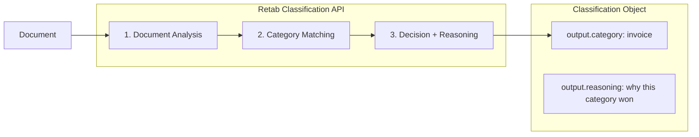

### Introduction

Retab classifications use the resource-based `POST /v1/classifications` API. A classification request analyzes a document, chooses exactly one category, and persists the result as a `Classification` object that you can later retrieve or list.

Common use cases include:

1. **Document Routing**: Route incoming files to the right downstream extraction pipeline
2. **Pre-filtering**: Choose the right schema before extraction
3. **Mailroom Automation**: Sort attachments by document type
4. **Quality Control**: Verify documents match the expected category in a workflow



Key features of the Classification API:

- **Single Decision**: Returns exactly one category for the document
- **Reasoned Output**: Includes an explanation for the selected category
- **Custom Categories**: Define categories specific to your workflow
- **Consensus Support**: Run multiple votes with `n_consensus` when you want more stability
- **Stored Resource**: The result is persisted and can be fetched later

## Classification API

<ParamField body="ClassificationRequest" type="ClassificationRequest">
  <Expandable title="properties">

<ParamField body="document" type="MIMEData" required>
  The document to classify. Can be a file path, bytes, or image input.
</ParamField>

<ParamField body="model" type="LLMModel">
  The model to use for classification. Recommended: `retab-small` for most
  cases.
</ParamField>

<ParamField body="categories" type="array[Category]" required>
  The candidate categories. Each category has: - `name`: Stable identifier for
  the category - `description`: Instructions that help the model distinguish
  that category
</ParamField>

<ParamField body="first_n_pages" type="integer">
  Restrict classification to the first N pages. Useful for large documents when
  the signal appears early.
</ParamField>

<ParamField body="instructions" type="string">
  Free-form instructions appended to the system prompt to steer the
  classification.
</ParamField>

<ParamField body="n_consensus" type="integer" default="1">
  Number of votes to run for consensus. Max: `16`.
</ParamField>

</Expandable>
</ParamField>

<ResponseField name="Returns" type="Classification Object">
  A stored classification resource containing the decision, consensus metadata,
  and usage.
  <Expandable title="properties">
    <ResponseField name="id" type="string">
      Unique identifier of the classification.
    </ResponseField>
    <ResponseField name="file" type="object">
      File metadata for the classified document.
    </ResponseField>
    <ResponseField name="model" type="string">
      Model used for classification.
    </ResponseField>
    <ResponseField name="categories" type="array[Category]">
      Categories the document was classified against.
    </ResponseField>
    <ResponseField name="n_consensus" type="integer">
      Number of votes used for the classification.
    </ResponseField>
    <ResponseField name="instructions" type="string | null">
      Free-form instructions supplied with the request.
    </ResponseField>
    <ResponseField name="output" type="ClassificationDecision">
      Final classification decision.
    </ResponseField>
    <ResponseField name="consensus" type="ClassificationConsensus">
      Consensus metadata with flat `choices` entries.
    </ResponseField>
    <ResponseField name="usage" type="RetabUsage | null">
      Usage information for the request.
    </ResponseField>
  </Expandable>
</ResponseField>

## Use Case: Document Routing in a Processing Pipeline

Classify incoming documents, then route them to the right extraction schema based on `output.category`.

<CodeGroup>
```python Python
from retab import Retab

client = Retab()

categories = [
    {"name": "invoice", "description": "Invoice documents with billing details, line items, totals, and payment terms"},
    {"name": "receipt", "description": "Payment receipts showing transaction confirmation and amounts paid"},
    {"name": "contract", "description": "Legal contracts with terms, conditions, and signature blocks"},
    {"name": "purchase_order", "description": "Purchase order documents with order details and shipping information"},
]

classification = client.classifications.create(
    document="incoming_document.pdf",
    model="retab-small",
    categories=categories,
)

print(f"Document classified as: {classification.output.category}")
print(f"Reasoning: {classification.output.reasoning}")

if classification.output.category == "invoice":
    invoice_schema = {"type": "object"}
    extraction = client.extractions.create(
        document="incoming_document.pdf",
        model="retab-small",
        json_schema=invoice_schema,
    )
elif classification.output.category == "contract":
    contract_schema = {"type": "object"}
    extraction = client.extractions.create(
        document="incoming_document.pdf",
        model="retab-small",
        json_schema=contract_schema,
    )

````

```typescript TypeScript
import { Retab } from '@retab/node';

const client = new Retab({ apiKey: process.env.RETAB_API_KEY });

const categories = [
    { name: "invoice", description: "Invoice documents with billing details, line items, totals, and payment terms" },
    { name: "receipt", description: "Payment receipts showing transaction confirmation and amounts paid" },
    { name: "contract", description: "Legal contracts with terms, conditions, and signature blocks" },
    { name: "purchase_order", description: "Purchase order documents with order details and shipping information" },
];

const classification = await client.classifications.create("incoming_document.pdf", undefined, "retab-small");

console.log(`Document classified as: ${classification.output.category}`);
console.log(`Reasoning: ${classification.output.reasoning}`);

if (classification.output.category === "invoice") {
    const invoiceSchema = {};
    const extraction = await client.extractions.create("incoming_document.pdf", invoiceSchema, "retab-small");
} else if (classification.output.category === "contract") {
    const contractSchema = {};
    const extraction = await client.extractions.create("incoming_document.pdf", contractSchema, "retab-small");
}
````

```go Go
package main

import (
	"context"
	"fmt"
	"log"

	retab "github.com/retab-dev/retab/clients/go"
)

func main() {
	ctx := context.Background()

	client, err := retab.NewClient("")
	if err != nil {
		log.Fatal(err)
	}

	invoiceDescription := "Invoice documents with billing details, line items, totals, and payment terms"
	receiptDescription := "Payment receipts showing transaction confirmation and amounts paid"
	contractDescription := "Legal contracts with terms, conditions, and signature blocks"
	purchaseOrderDescription := "Purchase order documents with order details and shipping information"
	categories := []*retab.Category{
		{Name: "invoice", Description: &invoiceDescription},
		{Name: "receipt", Description: &receiptDescription},
		{Name: "contract", Description: &contractDescription},
		{Name: "purchase_order", Description: &purchaseOrderDescription},
	}

	model := "retab-small"
	classification, err := client.Classifications.Create(ctx, &retab.ClassificationsCreateParams{
		Document:   "incoming_document.pdf",
		Model:      &model,
		Categories: categories,
	})
	if err != nil {
		log.Fatal(err)
	}

	category := classification.Output.Category
	fmt.Printf("Document classified as: %s\n", category)
	fmt.Printf("Reasoning: %v\n", classification.Output.Reasoning)

	switch category {
	case "invoice":
		invoiceSchema := map[string]any{"type": "object"}
		extraction, err := client.Extractions.Create(ctx, &retab.ExtractionsCreateParams{
			Document:   "incoming_document.pdf",
			Model:      &model,
			JSONSchema: invoiceSchema,
		})
		if err != nil {
			log.Fatal(err)
		}
		_ = extraction
	case "contract":
		contractSchema := map[string]any{"type": "object"}
		extraction, err := client.Extractions.Create(ctx, &retab.ExtractionsCreateParams{
			Document:   "incoming_document.pdf",
			Model:      &model,
			JSONSchema: contractSchema,
		})
		if err != nil {
			log.Fatal(err)
		}
		_ = extraction
	}
}
```

```ruby Ruby
require 'retab'

client = Retab::Client.new(api_key: ENV['RETAB_API_KEY'])

categories = [
  { name: 'invoice', description: 'Invoice documents with billing details, line items, totals, and payment terms' },
  { name: 'receipt', description: 'Payment receipts showing transaction confirmation and amounts paid' },
  { name: 'contract', description: 'Legal contracts with terms, conditions, and signature blocks' },
  { name: 'purchase_order', description: 'Purchase order documents with order details and shipping information' },
]

classification = client.classifications.create(
  document: 'incoming_document.pdf',
  model: 'retab-small',
  categories: categories,
)

puts "Document classified as: #{classification.output.category}"
puts "Reasoning: #{classification.output.reasoning}"

case classification.output.category
when 'invoice'
  invoice_schema = { 'type' => 'object' }
  client.extractions.create(
    document: 'incoming_document.pdf',
    model: 'retab-small',
    json_schema: invoice_schema,
  )
when 'contract'
  contract_schema = { 'type' => 'object' }
  client.extractions.create(
    document: 'incoming_document.pdf',
    model: 'retab-small',
    json_schema: contract_schema,
  )
end
```

```typescript TypeScript
import { Retab } from "@retab/node";

interface Category {
  name: string;
  description: string;
}

const client = new Retab({ apiKey: process.env.RETAB_API_KEY });

const categories: Category[] = [
  {
    name: "invoice",
    description:
      "Invoice documents with billing details, line items, totals, and payment terms",
  },
  {
    name: "receipt",
    description:
      "Payment receipts showing transaction confirmation and amounts paid",
  },
  {
    name: "contract",
    description: "Legal contracts with terms, conditions, and signature blocks",
  },
  {
    name: "purchase_order",
    description:
      "Purchase order documents with order details and shipping information",
  },
];

const classification = await client.classifications.create("incoming_document.pdf", undefined, "retab-small");

console.log(`Document classified as: ${classification.output.category}`);
console.log(`Reasoning: ${classification.output.reasoning}`);

switch (classification.output.category) {
  case "invoice":
    break;
  case "contract":
    break;
  default:
    break;
}
```

```php PHP
<?php
require 'vendor/autoload.php';

use Retab\Client;
use Retab\Resource\Category;

$client = new Client();

$categories = [
    new Category(name: 'invoice', description: 'Invoice documents with billing details, line items, totals, and payment terms'),
    new Category(name: 'receipt', description: 'Payment receipts showing transaction confirmation and amounts paid'),
    new Category(name: 'contract', description: 'Legal contracts with terms, conditions, and signature blocks'),
    new Category(name: 'purchase_order', description: 'Purchase order documents with order details and shipping information'),
];

$classification = $client->classifications()->create(
    document: 'incoming_document.pdf',
    categories: $categories,
    model: 'retab-small',
);

echo "Document classified as: {$classification->output->category}" . PHP_EOL;
echo "Reasoning: {$classification->output->reasoning}" . PHP_EOL;

if ($classification->output->category === 'invoice') {
    $invoiceSchema = ['type' => 'object'];
    $extraction = $client->extractions()->create(
        document: 'incoming_document.pdf',
        jsonSchema: $invoiceSchema,
        model: 'retab-small',
    );
} elseif ($classification->output->category === 'contract') {
    $contractSchema = ['type' => 'object'];
    $extraction = $client->extractions()->create(
        document: 'incoming_document.pdf',
        jsonSchema: $contractSchema,
        model: 'retab-small',
    );
}
```

```csharp C#
using System;
using System.Collections.Generic;
using System.IO;
using Retab;
using RetabClient = Retab.Retab;

var client = new RetabClient("YOUR_API_KEY");

var categories = new List<Category>
{
    new Category { Name = "invoice",        Description = "Invoice documents with billing details, line items, totals, and payment terms" },
    new Category { Name = "receipt",        Description = "Payment receipts showing transaction confirmation and amounts paid" },
    new Category { Name = "contract",       Description = "Legal contracts with terms, conditions, and signature blocks" },
    new Category { Name = "purchase_order", Description = "Purchase order documents with order details and shipping information" },
};

var classification = await client.Classifications.CreateAsync(
    new ClassificationsCreateOptions
    {
        Document = new FileInfo("incoming_document.pdf"),
        Model = "retab-small",
        Categories = categories,
    }
);

Console.WriteLine($"Document classified as: {classification.Output.Category}");
Console.WriteLine($"Reasoning: {classification.Output.Reasoning}");

switch (classification.Output.Category)
{
    case "invoice":
    {
        var invoiceSchema = new Dictionary<string, object> { ["type"] = "object" };
        var extraction = await client.Extractions.CreateAsync(
    new ExtractionsCreateOptions
            {
                Document = new FileInfo("incoming_document.pdf"),
                Model = "retab-small",
                JsonSchema = invoiceSchema,
            }
        );
        Console.WriteLine(extraction.Id);
        break;
    }
    case "contract":
    {
        var contractSchema = new Dictionary<string, object> { ["type"] = "object" };
        var extraction = await client.Extractions.CreateAsync(
    new ExtractionsCreateOptions
            {
                Document = new FileInfo("incoming_document.pdf"),
                Model = "retab-small",
                JsonSchema = contractSchema,
            }
        );
        Console.WriteLine(extraction.Id);
        break;
    }
}
```

```rust Rust
use retab::models::Category;
use retab::resources::classifications::CreateParams;
use retab::Retab;
use std::path::PathBuf;

#[tokio::main]
async fn main() -> Result<(), Box<dyn std::error::Error>> {
    let client = Retab::new(std::env::var("RETAB_API_KEY")?);

    let categories = vec![
        Category {
            name: "invoice".into(),
            handle_key: None,
            description: Some(
                "Invoice documents with billing details, line items, totals, and payment terms".into(),
            ),
        },
        Category {
            name: "receipt".into(),
            handle_key: None,
            description: Some(
                "Payment receipts showing transaction confirmation and amounts paid".into(),
            ),
        },
        Category {
            name: "contract".into(),
            handle_key: None,
            description: Some(
                "Legal contracts with terms, conditions, and signature blocks".into(),
            ),
        },
        Category {
            name: "purchase_order".into(),
            handle_key: None,
            description: Some(
                "Purchase order documents with order details and shipping information".into(),
            ),
        },
    ];

    let mut params = CreateParams::new(PathBuf::from("incoming_document.pdf"), categories);
    params.body.model = Some("retab-small".into());

    let classification = client.classifications().create(params).await?;

    println!("Document classified as: {}", classification.output.category);
    println!("Reasoning: {}", classification.output.reasoning);

    Ok(())
}
```

```java Java
import com.retab.RetabClient;

public final class Example {
  public static void main(String[] args) throws Exception {
    RetabClient client = new RetabClient(System.getenv("RETAB_API_KEY"));

    var result = client.classifications().create(null, null, "retab-1.5", 10L, "Extract the invoice fields", 10L, null);
    System.out.println(result);
  }
}
```

</CodeGroup>

## Use Case: Email Attachment Filtering

Classify attachments first, then branch on `output.category`.

<CodeGroup>
```python Python
from retab import Retab

client = Retab()

categories = [
    {"name": "invoice", "description": "Invoice or billing documents requiring payment"},
    {"name": "quote", "description": "Price quotes or proposals from vendors"},
    {"name": "marketing", "description": "Marketing materials, brochures, or promotional content"},
    {"name": "other", "description": "Miscellaneous documents not fitting other categories"},
]

for attachment in email_attachments:
    classification = client.classifications.create(
        document=attachment,
        model="retab-small",
        categories=categories,
    )

    if classification.output.category == "invoice":
        process_invoice(attachment)
    elif classification.output.category == "quote":
        queue_for_review(attachment)
    elif classification.output.category == "marketing":
        archive_document(attachment)

    print(f"{attachment.name}: {classification.output.category}")
    print(f"  Reason: {classification.output.reasoning[:100]}...")

````

```typescript TypeScript
import { Retab } from '@retab/node';

const client = new Retab({ apiKey: process.env.RETAB_API_KEY });

const categories = [
    { name: "invoice", description: "Invoice or billing documents requiring payment" },
    { name: "quote", description: "Price quotes or proposals from vendors" },
    { name: "marketing", description: "Marketing materials, brochures, or promotional content" },
    { name: "other", description: "Miscellaneous documents not fitting other categories" },
];

for (const attachment of emailAttachments) {
    const classification = await client.classifications.create(attachment, undefined, "retab-small");

    if (classification.output.category === "invoice") {
        await processInvoice(attachment);
    } else if (classification.output.category === "quote") {
        await queueForReview(attachment);
    } else if (classification.output.category === "marketing") {
        await archiveDocument(attachment);
    }

    console.log(`${attachment.name}: ${classification.output.category}`);
    console.log(`  Reason: ${classification.output.reasoning.slice(0, 100)}...`);
}
````

```go Go
package main

import (
	"context"
	"fmt"
	"log"

	retab "github.com/retab-dev/retab/clients/go"
)

type emailAttachment struct {
	Name string
	Path string
}

func processInvoice(_ emailAttachment)   {}
func queueForReview(_ emailAttachment)   {}
func archiveDocument(_ emailAttachment)  {}

func main() {
	ctx := context.Background()

	client, err := retab.NewClient("")
	if err != nil {
		log.Fatal(err)
	}

	invoiceDescription := "Invoice or billing documents requiring payment"
	quoteDescription := "Price quotes or proposals from vendors"
	marketingDescription := "Marketing materials, brochures, or promotional content"
	otherDescription := "Miscellaneous documents not fitting other categories"
	categories := []*retab.Category{
		{Name: "invoice", Description: &invoiceDescription},
		{Name: "quote", Description: &quoteDescription},
		{Name: "marketing", Description: &marketingDescription},
		{Name: "other", Description: &otherDescription},
	}

	emailAttachments := []emailAttachment{}

	model := "retab-small"
	for _, attachment := range emailAttachments {
		classification, err := client.Classifications.Create(ctx, &retab.ClassificationsCreateParams{
			Document:   attachment.Path,
			Model:      &model,
			Categories: categories,
		})
		if err != nil {
			log.Fatal(err)
		}

		category := classification.Output.Category
		reasoning := classification.Output.Reasoning

		switch category {
		case "invoice":
			processInvoice(attachment)
		case "quote":
			queueForReview(attachment)
		case "marketing":
			archiveDocument(attachment)
		}

		fmt.Printf("%s: %s\n", attachment.Name, category)
		preview := reasoning
		if len(preview) > 100 {
			preview = preview[:100]
		}
		fmt.Printf("  Reason: %s...\n", preview)
	}
}
```

```ruby Ruby
require 'retab'

client = Retab::Client.new(api_key: ENV['RETAB_API_KEY'])

categories = [
  { name: 'invoice', description: 'Invoice or billing documents requiring payment' },
  { name: 'quote', description: 'Price quotes or proposals from vendors' },
  { name: 'marketing', description: 'Marketing materials, brochures, or promotional content' },
  { name: 'other', description: 'Miscellaneous documents not fitting other categories' },
]

email_attachments.each do |attachment|
  classification = client.classifications.create(
    document: attachment,
    model: 'retab-small',
    categories: categories,
  )

  case classification.output.category
  when 'invoice'
    process_invoice(attachment)
  when 'quote'
    queue_for_review(attachment)
  when 'marketing'
    archive_document(attachment)
  end

  puts "#{attachment.name}: #{classification.output.category}"
  puts "  Reason: #{classification.output.reasoning[0, 100]}..."
end
```

```php PHP
<?php
require 'vendor/autoload.php';

use Retab\Client;
use Retab\Resource\Category;

$client = new Client();

$categories = [
    new Category(name: 'invoice', description: 'Invoice or billing documents requiring payment'),
    new Category(name: 'quote', description: 'Price quotes or proposals from vendors'),
    new Category(name: 'marketing', description: 'Marketing materials, brochures, or promotional content'),
    new Category(name: 'other', description: 'Miscellaneous documents not fitting other categories'),
];

foreach ($emailAttachments as $attachment) {
    $classification = $client->classifications()->create(
        document: $attachment->path,
        categories: $categories,
        model: 'retab-small',
    );

    switch ($classification->output->category) {
        case 'invoice':
            processInvoice($attachment);
            break;
        case 'quote':
            queueForReview($attachment);
            break;
        case 'marketing':
            archiveDocument($attachment);
            break;
    }

    echo "{$attachment->name}: {$classification->output->category}" . PHP_EOL;
    echo '  Reason: ' . substr($classification->output->reasoning, 0, 100) . '...' . PHP_EOL;
}
```

```csharp C#
using System;
using System.Collections.Generic;
using System.IO;
using Retab;
using RetabClient = Retab.Retab;

var client = new RetabClient("YOUR_API_KEY");

var categories = new List<Category>
{
    new Category { Name = "invoice",   Description = "Invoice or billing documents requiring payment" },
    new Category { Name = "quote",     Description = "Price quotes or proposals from vendors" },
    new Category { Name = "marketing", Description = "Marketing materials, brochures, or promotional content" },
    new Category { Name = "other",     Description = "Miscellaneous documents not fitting other categories" },
};

// Pretend these were retrieved from an email server.
var emailAttachments = new List<FileInfo>();

foreach (var attachment in emailAttachments)
{
    var classification = await client.Classifications.CreateAsync(
    new ClassificationsCreateOptions
        {
            Document = attachment,
            Model = "retab-small",
            Categories = categories,
        }
    );

    switch (classification.Output.Category)
    {
        case "invoice":
            // ProcessInvoice(attachment);
            break;
        case "quote":
            // QueueForReview(attachment);
            break;
        case "marketing":
            // ArchiveDocument(attachment);
            break;
    }

    Console.WriteLine($"{attachment.Name}: {classification.Output.Category}");
    var reasoning = classification.Output.Reasoning ?? "";
    var preview = reasoning.Length > 100 ? reasoning.Substring(0, 100) : reasoning;
    Console.WriteLine($"  Reason: {preview}...");
}
```

```rust Rust
use retab::models::Category;
use retab::resources::classifications::CreateParams;
use retab::Retab;
use std::path::PathBuf;

struct EmailAttachment {
    name: &'static str,
    path: &'static str,
}

fn process_invoice(_: &EmailAttachment) {}
fn queue_for_review(_: &EmailAttachment) {}
fn archive_document(_: &EmailAttachment) {}

#[tokio::main]
async fn main() -> Result<(), Box<dyn std::error::Error>> {
    let client = Retab::new(std::env::var("RETAB_API_KEY")?);

    let categories = vec![
        Category {
            name: "invoice".into(),
            handle_key: None,
            description: Some("Invoice or billing documents requiring payment".into()),
        },
        Category {
            name: "quote".into(),
            handle_key: None,
            description: Some("Price quotes or proposals from vendors".into()),
        },
        Category {
            name: "marketing".into(),
            handle_key: None,
            description: Some(
                "Marketing materials, brochures, or promotional content".into(),
            ),
        },
        Category {
            name: "other".into(),
            handle_key: None,
            description: Some("Miscellaneous documents not fitting other categories".into()),
        },
    ];

    let email_attachments: Vec<EmailAttachment> = Vec::new();

    for attachment in &email_attachments {
        let mut params = CreateParams::new(PathBuf::from(attachment.path), categories.clone());
        params.body.model = Some("retab-small".into());

        let classification = client.classifications().create(params).await?;

        match classification.output.category.as_str() {
            "invoice" => process_invoice(attachment),
            "quote" => queue_for_review(attachment),
            "marketing" => archive_document(attachment),
            _ => {}
        }

        println!("{}: {}", attachment.name, classification.output.category);
        let reasoning = &classification.output.reasoning;
        let preview = &reasoning[..reasoning.len().min(100)];
        println!("  Reason: {preview}...");
    }
    Ok(())
}
```

```java Java
import com.retab.RetabClient;

public final class Example {
  public static void main(String[] args) throws Exception {
    RetabClient client = new RetabClient(System.getenv("RETAB_API_KEY"));

    var result = client.classifications().create(null, null, "retab-1.5", 10L, "Extract the invoice fields", 10L, null);
    System.out.println(result);
  }
}
```

</CodeGroup>

## Classify vs Split

| Feature          | Classify                              | Split                                 |
| ---------------- | ------------------------------------- | ------------------------------------- |
| **Purpose**      | Categorize the whole document         | Identify sections within a document   |
| **Output**       | One `output` decision                 | Multiple subdocument assignments      |
| **Use Case**     | Routing, filtering, triage            | Batch separation, section extraction  |
| **Result Shape** | `output.category`, `output.reasoning` | `output[]` with pages per subdocument |

**Use Classify when:**

- You need to know what kind of document you have
- The document should map to one main category
- You are routing to another workflow or extraction schema

**Use Split when:**

- The file contains multiple sections with different meanings
- You need page-level grouping
- You plan to extract multiple subdocuments from one upload

## Best Practices

### Category Definition

- **Be Specific**: Describe what makes each category unique
- **Use Visual Cues**: Mention layouts, headers, logos, or tables when useful
- **Keep Overlap Low**: Categories should be distinguishable from each other
- **Add a Catch-all**: Include an `other` category when documents can fall outside the expected set

### Reasoning and Consensus

- **Review `output.reasoning`** when you need an audit trail or human validation
- **Use `n_consensus > 1`** for noisy or ambiguous document sets
- **Inspect `consensus.choices`** to understand close calls between categories

### Performance

- **Use 3-7 categories** for best results in most routing setups
- **Limit pages** with `first_n_pages` when the first page contains enough signal
- **Start with `retab-small`** and only scale up when accuracy demands it
