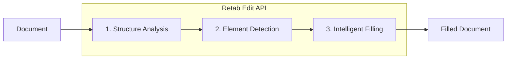

### Introduction

The `edit` API in Retab's document processing pipeline enables intelligent document form filling. It supports **PDF, Word (DOCX), Excel (XLSX), and PowerPoint (PPTX)** files, automatically detecting fillable elements and populating them based on natural language instructions. This is ideal for automating form completion workflows, document generation, and batch processing of standardized forms.

### Supported Formats

| Format         | Extension               | Processing Method                          |
| -------------- | ----------------------- | ------------------------------------------ |
| **PDF**        | `.pdf`                  | Computer vision + LLM form field detection |
| **Word**       | `.docx`, `.doc`, `.odt` | Native XML editing (preserves formatting)  |
| **Excel**      | `.xlsx`, `.xls`, `.ods` | Native cell editing                        |
| **PowerPoint** | `.pptx`, `.ppt`, `.odp` | Native shape/text editing                  |

### How It Works

**For PDF files:**

1. **Computer Vision**: Detect form field bounding boxes with precise coordinates
2. **LLM Inference**: Name and classify detected fields semantically
3. **Intelligent Filling**: Match your instructions to the appropriate form fields
4. **PDF Generation**: Create a new PDF with the filled values

**For Office files (DOCX, XLSX, PPTX):**

1. **Structure Extraction**: Parse the document's XML structure to identify all text elements
2. **Element Detection**: LLM identifies fillable placeholders (empty cells, whitespace after labels, placeholder text)
3. **Native Editing**: Apply edits directly to the XML, preserving all original formatting and styles
4. **Document Generation**: Return the filled document in its original format



Unlike manual form filling or template-based approaches, `edit` provides:

- **Multi-Format Support**: PDF, Word, Excel, and PowerPoint files
- **Zero Configuration**: No need to pre-define field positions or create templates
- **Natural Language Instructions**: Describe what to fill in plain English or JSON
- **Format Preservation**: Office files retain all original formatting, styles, and layout
- **Automatic Field Matching**: LLM intelligently maps your data to form fields
- **MIMEData Output**: Get the filled document as MIMEData with filename and base64 content

## SDK Surface

The edit SDK exposes the same workflow in both clients:

- `client.edits.create(...)` for direct document filling (pass `document=...`) or template-based filling (pass `template_id=...`)
- `client.edits.templates.create(...)` to register a reusable PDF form template

<Note>
  In both SDKs, `color` is a top-level argument on `edits.create(...)`.
</Note>

## Edit API

The Edit API provides two approaches, both served by `edits.create(...)`:

- **Direct Fill** (`edits.create` with `document=...`): AI-powered document filling that automatically detects and fills form fields
- **Template Fill** (`edits.create` with `template_id=...`): Optimized filling against a pre-registered PDF template (skips field detection)

### Direct Fill

The main endpoint for filling documents with AI. Supports all document formats.

<ParamField body="EditRequest" type="EditRequest">
  <Expandable title="properties">

<ParamField body="instructions" type="string" required>
  Natural language or JSON instructions describing how to fill the document. Include the field values you want to populate, e.g., "Name: John Doe, Date: 2025-01-15" or `{"name": "John Doe", "date": "2025-01-15"}`.
</ParamField>

<ParamField body="document" type="MIMEData">
  The document to edit. Supports PDF, DOCX, XLSX, and PPTX files. Can be a file
  path, URL, or MIMEData object containing: - `filename`: Name of the file
  (e.g., "form.pdf", "template.docx", "data.xlsx") - `url`: Data URI with base64
  content (e.g., "data:application/pdf;base64,..."). Mutually exclusive with
  `template_id` — provide exactly one of the two.
</ParamField>

<ParamField body="template_id" type="string">
  Id of a pre-registered PDF form template (see `edits.templates.create`).
  Mutually exclusive with `document` — provide exactly one of the two. Use this
  for batch-filling the same PDF form repeatedly without re-detecting fields.
</ParamField>

<ParamField body="model" type="LLMModel" default="retab-small">
  The AI model to use for element detection and filling. Recommended:
  `retab-small` for accuracy.
</ParamField>

<ParamField body="color" type="string" default="#000080">
  Hex color code for filled text (e.g., "#FF0000" for red). Defaults to dark
  blue. Only applies to PDF form filling.
</ParamField>

</Expandable>
</ParamField>

<ResponseField name="Returns" type="Edit Object">
An `Edit` resource with the filled document and form data.
  <Expandable title="properties">

    <ResponseField name="id" type="string">
      Unique identifier of the edit record.
    </ResponseField>

    <ResponseField name="output" type="EditResult">
      Contains `form_data` (the filled `FormField` list, each with bbox, description, type, key, and value) and `filled_document` (the rendered PDF/DOCX/XLSX/PPTX as MIMEData).
    </ResponseField>

    <ResponseField name="usage" type="RetabUsage">
      Usage information for the edit operation.
    </ResponseField>

  </Expandable>
</ResponseField>

### Create Template (Pre-Register A Form)

Register a reusable PDF form template with its empty PDF and a list of form fields. You typically detect those fields in the dashboard first, or reuse a form schema you already own, and then persist the template for fast batch filling.

<ParamField body="EditTemplateRequest" type="EditTemplateRequest">
  <Expandable title="properties">

<ParamField body="name" type="string" required>
  Human-readable name for the template.
</ParamField>

<ParamField body="document" type="MIMEData" required>
  The empty PDF to use as the template background. Only PDF format is supported.
</ParamField>

<ParamField body="form_fields" type="array[FormField]" required>
  Ordered list of form fields (each with `bbox`, `description`, `type`, `key`).
</ParamField>

</Expandable>
</ParamField>

<ResponseField name="Returns" type="EditTemplate Object">
  <Expandable title="properties">

    <ResponseField name="id" type="string">
      Unique template identifier, used later by `edits.create(template_id=...)`.
    </ResponseField>

    <ResponseField name="form_fields" type="list[FormField]">
      The form fields attached to the template.
    </ResponseField>

    <ResponseField name="field_count" type="int">
      Number of form fields in the template.
    </ResponseField>

  </Expandable>
</ResponseField>

## Use Case: PDF Form Filling

Fill PDF forms programmatically using natural language instructions.

<CodeGroup>
```python Python
from retab import Retab
import base64

client = Retab()

# Fill the form with natural language instructions.
# The SDK accepts file paths directly.
result = client.edits.create(
    document="application-form.pdf",
    instructions="""
Full Name: Jane Smith
Date of Birth: March 15, 1985
Email: jane.smith@example.com
Phone: (555) 123-4567
Address: 456 Oak Avenue, Suite 200
City: San Francisco
State: California
ZIP Code: 94102
I agree to the terms and conditions: checked
""",
    model="retab-small",
    color="#000080",  # Dark blue text (default)
)

# Save the filled PDF.
if result.output.filled_document:
    # Extract base64 content from the data URI.
    base64_content = result.output.filled_document.url.split(",")[1]
    filled_bytes = base64.b64decode(base64_content)
    with open("filled-application.pdf", "wb") as f:
        f.write(filled_bytes)
    print("Filled form saved!")

# Review what was filled.
print(f"Filled {len(result.output.form_data)} form fields:")
for field in result.output.form_data:
    if field.value:
        print(f"  - {field.key}: {field.value}")
```

```typescript TypeScript
import { Retab } from '@retab/node';
import { readFileSync, writeFileSync } from 'fs';

const client = new Retab({ apiKey: process.env.RETAB_API_KEY });

// Read the PDF form
const pdfBuffer = readFileSync("application-form.pdf");
const pdfBase64 = pdfBuffer.toString('base64');

// Fill the form with natural language instructions
const result = await client.edits.create(`
        Full Name: Jane Smith
        Date of Birth: March 15, 1985
        Email: jane.smith@example.com
        Phone: (555) 123-4567
        Address: 456 Oak Avenue, Suite 200
        City: San Francisco
        State: California
        ZIP Code: 94102
        I agree to the terms and conditions: checked
    `, {
        filename: "application-form.pdf",
        url: `data:application/pdf;base64,${pdfBase64}`
    }, undefined, "retab-small", { color: "#000080" });

// Save the filled PDF
if (result.output.filledDocument) {
    const base64Content = result.output.filledDocument.url.split(",")[1];
    const filledBuffer = Buffer.from(base64Content, 'base64');
    writeFileSync("filled-application.pdf", filledBuffer);
    console.log("Filled form saved!");
}

// Review what was filled
console.log(`Filled ${result.output.formData.length} form fields:`);
result.output.formData.forEach(field => {
    if (field.value) {
        console.log(`  - ${field.key}: ${field.value}`);
    }
});
````

```go Go
package main

import (
	"context"
	"encoding/base64"
	"fmt"
	"log"
	"os"
	"strings"

	retab "github.com/retab-dev/retab/clients/go"
)

func main() {
	ctx := context.Background()

	client, err := retab.NewClient("")
	if err != nil {
		log.Fatal(err)
	}

	// Fill the form with natural language instructions.
	// InferMIMEData reads the local file and produces a MIMEData payload.
	document, err := retab.InferMIMEData("application-form.pdf")
	if err != nil {
		log.Fatal(err)
	}

	model := "retab-small"
	color := "#000080" // Dark blue text (default)
	result, err := client.Edits.Create(ctx, &retab.EditsCreateParams{
		Document: document,
		Instructions: `
        Full Name: Jane Smith
        Date of Birth: March 15, 1985
        Email: jane.smith@example.com
        Phone: (555) 123-4567
        Address: 456 Oak Avenue, Suite 200
        City: San Francisco
        State: California
        ZIP Code: 94102
        I agree to the terms and conditions: checked
        `,
		Model:  &model,
		Config: &retab.EditConfig{Color: &color},
	})
	if err != nil {
		log.Fatal(err)
	}

	if url := result.Output.FilledDocument.URL; url != "" {
		parts := strings.SplitN(url, ",", 2)
		if len(parts) == 2 {
			filledBytes, err := base64.StdEncoding.DecodeString(parts[1])
			if err != nil {
				log.Fatal(err)
			}
			if err := os.WriteFile("filled-application.pdf", filledBytes, 0o644); err != nil {
				log.Fatal(err)
			}
			fmt.Println("Filled form saved!")
		}
	}

	fmt.Printf("Filled %d form fields:\n", len(result.Output.FormData))
	for _, field := range result.Output.FormData {
		if field.Value != nil && *field.Value != "" {
			fmt.Printf("  - %v: %v\n", field.Key, *field.Value)
		}
	}
}
```

```ruby Ruby
require 'retab'
require 'base64'

client = Retab::Client.new(api_key: ENV['RETAB_API_KEY'])

# Fill the form with natural language instructions
# The SDK accepts file paths directly
result = client.edits.create(
  document: 'application-form.pdf',
  instructions: <<~INSTRUCTIONS,
    Full Name: Jane Smith
    Date of Birth: March 15, 1985
    Email: jane.smith@example.com
    Phone: (555) 123-4567
    Address: 456 Oak Avenue, Suite 200
    City: San Francisco
    State: California
    ZIP Code: 94102
    I agree to the terms and conditions: checked
  INSTRUCTIONS
  model: 'retab-small',
  color: '#000080', # Dark blue text (default)
)

# Save the filled PDF
if result.output.filled_document
  base64_content = result.output.filled_document.url.split(',', 2)[1]
  filled_bytes = Base64.decode64(base64_content)
  File.binwrite('filled-application.pdf', filled_bytes)
  puts 'Filled form saved!'
end

# Review what was filled
puts "Filled #{result.output.form_data.length} form fields:"
result.output.form_data.each do |field|
  puts "  - #{field.key}: #{field.value}" if field.value && !field.value.to_s.empty?
end
```

```typescript TypeScript
import { Retab, type EditRequest, type Edit } from "@retab/node";
import { readFileSync, writeFileSync } from "fs";

const client = new Retab({ apiKey: process.env.RETAB_API_KEY });

// Read the PDF form
const pdfBuffer = readFileSync("application-form.pdf");
const pdfBase64 = pdfBuffer.toString("base64");

const editRequest: EditRequest = {
  document: {
    filename: "application-form.pdf",
    url: `data:application/pdf;base64,${pdfBase64}`,
  },
  instructions: `
        Full Name: Jane Smith
        Date of Birth: March 15, 1985
        Email: jane.smith@example.com
        Phone: (555) 123-4567
        Address: 456 Oak Avenue, Suite 200
        City: San Francisco
        State: California
        ZIP Code: 94102
        I agree to the terms and conditions: checked
    `,
  model: "retab-small",
  config: { color: "#000080" }, // Dark blue text (default)
};

const result: Edit = await client.edits.create(
  editRequest.instructions,
  editRequest.document as Parameters<typeof client.edits.create>[1],
  editRequest.templateId,
  editRequest.model,
  editRequest.config
);

// Save the filled PDF
if (result.output.filledDocument) {
  const base64Content = result.output.filledDocument.url.split(",")[1];
  const filledBuffer = Buffer.from(base64Content, "base64");
  writeFileSync("filled-application.pdf", filledBuffer);
  console.log("Filled form saved!");
}

// Review what was filled
console.log(`Filled ${result.output.formData.length} form fields:`);
result.output.formData.forEach((field) => {
  if (field.value) {
    console.log(`  - ${field.key}: ${field.value}`);
  }
});
```

```php PHP
<?php
require 'vendor/autoload.php';

use Retab\Client;
use Retab\Resource\EditConfig;

$client = new Client();

// Fill the form with natural language instructions
// The SDK accepts file paths directly
$result = $client->edits()->create(
    instructions: <<<TXT
Full Name: Jane Smith
Date of Birth: March 15, 1985
Email: jane.smith@example.com
Phone: (555) 123-4567
Address: 456 Oak Avenue, Suite 200
City: San Francisco
State: California
ZIP Code: 94102
I agree to the terms and conditions: checked
TXT,
    document: 'application-form.pdf',
    model: 'retab-small',
    config: new EditConfig(color: '#000080'), // Dark blue text (default)
);

// Save the filled PDF
$base64Content = explode(',', $result->output->filledDocument->url, 2)[1] ?? '';
$filledBytes = base64_decode($base64Content);
file_put_contents('filled-application.pdf', $filledBytes);
echo 'Filled form saved!' . PHP_EOL;

// Review what was filled
echo 'Filled ' . count($result->output->formData) . ' form fields:' . PHP_EOL;
foreach ($result->output->formData as $field) {
    if ($field->value !== null && $field->value !== '') {
        echo "  - {$field->key}: {$field->value}" . PHP_EOL;
    }
}
```

```rust Rust
use base64::engine::general_purpose::STANDARD;
use base64::Engine;
use retab::resources::edits::CreateParams;
use retab::Retab;
use std::fs;
use std::path::PathBuf;

#[tokio::main]
async fn main() -> Result<(), Box<dyn std::error::Error>> {
    let client = Retab::new(std::env::var("RETAB_API_KEY")?);

    // Fill the form with natural language instructions.
    // The SDK accepts file paths directly.
    let mut params = CreateParams::new(
        "\
Full Name: Jane Smith
Date of Birth: March 15, 1985
Email: jane.smith@example.com
Phone: (555) 123-4567
Address: 456 Oak Avenue, Suite 200
City: San Francisco
State: California
ZIP Code: 94102
I agree to the terms and conditions: checked
",
    );
    let document: retab::MimeData = PathBuf::from("application-form.pdf").into();
    params.body.document = Some(
        retab::models::ClassificationRequestDocumentOneOf::MimeData(Box::new(document)),
    );
    params.body.model = Some("retab-small".into());
    params.body.config = Some(retab::models::EditConfig {
        color: Some("#000080".into()), // Dark blue text (default)
    });

    let result = client.edits().create(params).await?;

    // Save the filled PDF.
    let url = &result.output.filled_document.url;
    if let Some((_, b64)) = url.split_once(',') {
        let filled_bytes = STANDARD.decode(b64)?;
        fs::write("filled-application.pdf", filled_bytes)?;
        println!("Filled form saved!");
    }

    // Review what was filled.
    println!("Filled {} form fields:", result.output.form_data.len());
    for field in &result.output.form_data {
        if let Some(value) = &field.value {
            if !value.is_empty() {
                println!("  - {}: {}", field.key, value);
            }
        }
    }
    Ok(())
}
```

```csharp C#
using System;
using System.IO;
using Retab;
using RetabClient = Retab.Retab;

var client = new RetabClient("YOUR_API_KEY");

// Fill the form with natural language instructions.
// FileInfo implicitly converts to MimeData.
var result = await client.Edits.CreateAsync(
    new EditsCreateOptions
    {
        Document = new FileInfo("application-form.pdf"),
        Instructions = @"
Full Name: Jane Smith
Date of Birth: March 15, 1985
Email: jane.smith@example.com
Phone: (555) 123-4567
Address: 456 Oak Avenue, Suite 200
City: San Francisco
State: California
ZIP Code: 94102
I agree to the terms and conditions: checked
",
        Model = "retab-small",
        Config = new EditConfig
        {
            Color = "#000080", // Dark blue text (default)
        },
    }
);

// Save the filled PDF.
if (result.Output.FilledDocument != null)
{
    var dataUrl = result.Output.FilledDocument.Url;
    var base64Content = dataUrl.Split(',', 2)[1];
    var filledBytes = Convert.FromBase64String(base64Content);
    await System.IO.File.WriteAllBytesAsync("filled-application.pdf", filledBytes);
    Console.WriteLine("Filled form saved!");
}

// Review what was filled.
Console.WriteLine($"Filled {result.Output.FormData.Count} form fields:");
foreach (var field in result.Output.FormData)
{
    if (!string.IsNullOrEmpty(field.Value))
    {
        Console.WriteLine($"  - {field.Key}: {field.Value}");
    }
}
```

```java Java
import com.retab.RetabClient;

public final class Example {
  public static void main(String[] args) throws Exception {
    RetabClient client = new RetabClient(System.getenv("RETAB_API_KEY"));

    var result = client.edits().create("Extract the invoice fields", null, "tmpl_abc123", "retab-1.5", null, null);
    System.out.println(result);
  }
}
```

</CodeGroup>

## Use Case: Create a Template

Persist an empty PDF together with its list of form fields as a reusable template. Templates are the recommended way to fill the same form repeatedly — they skip field detection on every fill and guarantee consistent field mapping.

<CodeGroup>
```python Python
from retab import Retab

client = Retab()

# Register a reusable template (document + form_fields)

template = client.edits.templates.create(
name="Application Form",
document="blank-form.pdf",
form_fields=[
{
"key": "full_name",
"description": "Applicant's full legal name",
"type": "text",
"bbox": {"left": 0.15, "top": 0.12, "width": 0.35, "height": 0.03, "page": 1},
},
{
"key": "date_of_birth",
"description": "Date of birth, ISO 8601",
"type": "text",
"bbox": {"left": 0.15, "top": 0.18, "width": 0.25, "height": 0.03, "page": 1},
},
],
)

print(f"Template {template.id} with {template.field_count} fields ready for fill calls")

````

```typescript TypeScript
import { Retab } from '@retab/node';

const client = new Retab({ apiKey: process.env.RETAB_API_KEY });

const template = await client.edits.templates.create("Application Form", "blank-form.pdf", [
        {
            key: "full_name",
            description: "Applicant's full legal name",
            type: "text",
            bbox: { left: 0.15, top: 0.12, width: 0.35, height: 0.03, page: 1 },
        },
        {
            key: "date_of_birth",
            description: "Date of birth, ISO 8601",
            type: "text",
            bbox: { left: 0.15, top: 0.18, width: 0.25, height: 0.03, page: 1 },
        },
    ]);

console.log(`Template ${template.id} with ${template.fieldCount} fields ready for fill calls`);
````

```go Go
package main

import (
	"context"
	"fmt"
	"log"

	retab "github.com/retab-dev/retab/clients/go"
)

func main() {
	ctx := context.Background()

	client, err := retab.NewClient("")
	if err != nil {
		log.Fatal(err)
	}

	fullNameDescription := "Applicant's full legal name"
	dateOfBirthDescription := "Date of birth, ISO 8601"
	template, err := client.Edits.Templates.Create(ctx, &retab.EditTemplatesCreateParams{
		Name:     "Application Form",
		Document: "blank-form.pdf",
		FormFields: []*retab.FormField{
			{
				Key:         "full_name",
				Description: fullNameDescription,
				Type:        "text",
				Bbox:        retab.BBox{Left: 0.15, Top: 0.12, Width: 0.35, Height: 0.03, Page: 1},
			},
			{
				Key:         "date_of_birth",
				Description: dateOfBirthDescription,
				Type:        "text",
				Bbox:        retab.BBox{Left: 0.15, Top: 0.18, Width: 0.25, Height: 0.03, Page: 1},
			},
		},
	})
	if err != nil {
		log.Fatal(err)
	}

	fmt.Printf("Template %v with %v fields ready for fill calls\n", template.ID, *template.FieldCount)
}
```

```ruby Ruby
require 'retab'

client = Retab::Client.new(api_key: ENV['RETAB_API_KEY'])

# Register a reusable template (document + form_fields)
template = client.edit_templates.create(
  name: 'Application Form',
  document: 'blank-form.pdf',
  form_fields: [
    {
      key: 'full_name',
      description: "Applicant's full legal name",
      type: 'text',
      bbox: { left: 0.15, top: 0.12, width: 0.35, height: 0.03, page: 1 },
    },
    {
      key: 'date_of_birth',
      description: 'Date of birth, ISO 8601',
      type: 'text',
      bbox: { left: 0.15, top: 0.18, width: 0.25, height: 0.03, page: 1 },
    },
  ],
)

puts "Template #{template.id} with #{template.field_count} fields ready for fill calls"
```

```php PHP
<?php
require 'vendor/autoload.php';

use Retab\Client;
use Retab\Resource\BBox;
use Retab\Resource\FieldType;
use Retab\Resource\FormField;

$client = new Client();

$template = $client->editTemplates()->create(
    name: 'Application Form',
    document: 'blank-form.pdf',
    formFields: [
        new FormField(
            bbox: new BBox(left: 0.15, top: 0.12, width: 0.35, height: 0.03, page: 1),
            description: "Applicant's full legal name",
            type: FieldType::Text,
            key: 'full_name',
        ),
        new FormField(
            bbox: new BBox(left: 0.15, top: 0.18, width: 0.25, height: 0.03, page: 1),
            description: 'Date of birth, ISO 8601',
            type: FieldType::Text,
            key: 'date_of_birth',
        ),
    ],
);

echo "Template {$template->id} with {$template->fieldCount} fields ready for fill calls" . PHP_EOL;
```

```rust Rust
use retab::enums::FieldType;
use retab::models::{BBox, FormField};
use retab::resources::edit_templates::CreateParams;
use retab::Retab;
use std::path::PathBuf;

#[tokio::main]
async fn main() -> Result<(), Box<dyn std::error::Error>> {
    let client = Retab::new(std::env::var("RETAB_API_KEY")?);

    let form_fields = vec![
        FormField {
            bbox: BBox::new(0.15, 0.12, 0.35, 0.03, 1),
            description: "Applicant's full legal name".into(),
            type_: FieldType::Text,
            key: "full_name".into(),
            value: None,
        },
        FormField {
            bbox: BBox::new(0.15, 0.18, 0.25, 0.03, 1),
            description: "Date of birth, ISO 8601".into(),
            type_: FieldType::Text,
            key: "date_of_birth".into(),
            value: None,
        },
    ];

    let params = CreateParams::new(
        "Application Form",
        PathBuf::from("blank-form.pdf"),
        form_fields,
    );

    let template = client.edits().templates().create(params).await?;

    println!(
        "Template {} with {} fields ready for fill calls",
        template.id,
        template.field_count.unwrap_or_default(),
    );
    Ok(())
}
```

```csharp C#
using System;
using System.Collections.Generic;
using System.IO;
using Retab;
using RetabClient = Retab.Retab;

var client = new RetabClient("YOUR_API_KEY");

var template = await client.Edits.Templates.CreateAsync(
    new EditTemplatesCreateOptions
    {
        Name = "Application Form",
        Document = new FileInfo("blank-form.pdf"),
        FormFields = new List<FormField>
        {
            new FormField
            {
                Key = "full_name",
                Description = "Applicant's full legal name",
                Type = FieldType.Text,
                Bbox = new BBox { Left = 0.15, Top = 0.12, Width = 0.35, Height = 0.03, Page = 1 },
            },
            new FormField
            {
                Key = "date_of_birth",
                Description = "Date of birth, ISO 8601",
                Type = FieldType.Text,
                Bbox = new BBox { Left = 0.15, Top = 0.18, Width = 0.25, Height = 0.03, Page = 1 },
            },
        },
    }
);

Console.WriteLine($"Template {template.Id} with {template.FieldCount} fields ready for fill calls");
```

```java Java
import com.retab.RetabClient;

public final class Example {
  public static void main(String[] args) throws Exception {
    RetabClient client = new RetabClient(System.getenv("RETAB_API_KEY"));

    var result = client.edits().templates().create("Invoice Processing", null, null);
    System.out.println(result);
  }
}
```

</CodeGroup>

<Note>
  You can discover field bounding boxes visually in the Retab dashboard editor,
  then pass the resulting `form_fields` list into `edits.templates.create(...)`
  to persist it.
</Note>

## Use Case: Template-Based Form Filling

Use pre-defined templates for consistent form filling without re-detecting fields each time. This is optimized for batch processing scenarios.

<CodeGroup>
```python Python
from retab import Retab
import base64

client = Retab()

# Use edits.create with template_id for fast, consistent filling.
result = client.edits.create(
    template_id="edittplt_abc123",
    instructions="""
Full Name: Jane Smith
Date of Birth: March 15, 1985
Email: jane.smith@example.com
""",
    model="retab-small",
    color="#000080",  # Dark blue text (default)
)

# Save the filled PDF.
if result.output.filled_document:
    base64_content = result.output.filled_document.url.split(",")[1]
    with open("filled-from-template.pdf", "wb") as f:
        f.write(base64.b64decode(base64_content))
    print("Template-based form filled and saved!")

````

```typescript TypeScript
import { Retab } from '@retab/node';
import { writeFileSync } from 'fs';

const client = new Retab({ apiKey: process.env.RETAB_API_KEY });

// Use edits.create with templateId for fast, consistent filling
const result = await client.edits.create(`
        Full Name: Jane Smith
        Date of Birth: March 15, 1985
        Email: jane.smith@example.com
    `, undefined, "edittplt_abc123", "retab-small", { color: "#000080" });

// Save the filled PDF
if (result.output.filledDocument) {
    const base64Content = result.output.filledDocument.url.split(",")[1];
    writeFileSync("filled-from-template.pdf", Buffer.from(base64Content, 'base64'));
    console.log("Template-based form filled and saved!");
}
````

```go Go
package main

import (
	"context"
	"encoding/base64"
	"fmt"
	"log"
	"os"
	"strings"

	retab "github.com/retab-dev/retab/clients/go"
)

func main() {
	ctx := context.Background()

	client, err := retab.NewClient("")
	if err != nil {
		log.Fatal(err)
	}

	templateID := "edittplt_abc123"
	model := "retab-small"
	color := "#000080" // Dark blue text (default)
	result, err := client.Edits.Create(ctx, &retab.EditsCreateParams{
		TemplateID: &templateID,
		Instructions: `
        Full Name: Jane Smith
        Date of Birth: March 15, 1985
        Email: jane.smith@example.com
        `,
		Model:  &model,
		Config: &retab.EditConfig{Color: &color},
	})
	if err != nil {
		log.Fatal(err)
	}

	if url := result.Output.FilledDocument.URL; url != "" {
		parts := strings.SplitN(url, ",", 2)
		if len(parts) == 2 {
			filledBytes, err := base64.StdEncoding.DecodeString(parts[1])
			if err != nil {
				log.Fatal(err)
			}
			if err := os.WriteFile("filled-from-template.pdf", filledBytes, 0o644); err != nil {
				log.Fatal(err)
			}
			fmt.Println("Template-based form filled and saved!")
		}
	}
}
```

```ruby Ruby
require 'retab'
require 'base64'

client = Retab::Client.new(api_key: ENV['RETAB_API_KEY'])

# Use edits.create with template_id for fast, consistent filling
result = client.edits.create(
  template_id: 'edittplt_abc123',
  instructions: <<~INSTRUCTIONS,
    Full Name: Jane Smith
    Date of Birth: March 15, 1985
    Email: jane.smith@example.com
  INSTRUCTIONS
  model: 'retab-small',
  color: '#000080', # Dark blue text (default)
)

# Save the filled PDF
if result.output.filled_document
  base64_content = result.output.filled_document.url.split(',', 2)[1]
  File.binwrite('filled-from-template.pdf', Base64.decode64(base64_content))
  puts 'Template-based form filled and saved!'
end
```

```php PHP
<?php
require 'vendor/autoload.php';

use Retab\Client;
use Retab\Resource\EditConfig;

$client = new Client();

// Use edits.create with templateId for fast, consistent filling
$result = $client->edits()->create(
    instructions: <<<TXT
Full Name: Jane Smith
Date of Birth: March 15, 1985
Email: jane.smith@example.com
TXT,
    templateId: 'edittplt_abc123',
    model: 'retab-small',
    config: new EditConfig(color: '#000080'),
);

$base64Content = explode(',', $result->output->filledDocument->url, 2)[1] ?? '';
file_put_contents('filled-from-template.pdf', base64_decode($base64Content));
echo 'Template-based form filled and saved!' . PHP_EOL;
```

```rust Rust
use base64::engine::general_purpose::STANDARD;
use base64::Engine;
use retab::resources::edits::CreateParams;
use retab::Retab;
use std::fs;

#[tokio::main]
async fn main() -> Result<(), Box<dyn std::error::Error>> {
    let client = Retab::new(std::env::var("RETAB_API_KEY")?);

    // Use edits.create with template_id for fast, consistent filling
    let mut params = CreateParams::new(
        "\
Full Name: Jane Smith
Date of Birth: March 15, 1985
Email: jane.smith@example.com
",
    );
    params.body.template_id = Some("edittplt_abc123".into());
    params.body.model = Some("retab-small".into());
    params.body.config = Some(retab::models::EditConfig {
        color: Some("#000080".into()), // Dark blue text (default)
    });

    let result = client.edits().create(params).await?;

    let url = &result.output.filled_document.url;
    if let Some((_, b64)) = url.split_once(',') {
        let filled_bytes = STANDARD.decode(b64)?;
        fs::write("filled-from-template.pdf", filled_bytes)?;
        println!("Template-based form filled and saved!");
    }
    Ok(())
}
```

```csharp C#
using System;
using System.IO;
using Retab;
using RetabClient = Retab.Retab;

var client = new RetabClient("YOUR_API_KEY");

// Use Edits.CreateAsync with TemplateId for fast, consistent filling.
var result = await client.Edits.CreateAsync(
    new EditsCreateOptions
    {
        TemplateId = "edittplt_abc123",
        Instructions = @"
Full Name: Jane Smith
Date of Birth: March 15, 1985
Email: jane.smith@example.com
",
        Model = "retab-small",
        Config = new EditConfig
        {
            Color = "#000080", // Dark blue text (default)
        },
    }
);

if (result.Output.FilledDocument != null)
{
    var dataUrl = result.Output.FilledDocument.Url;
    var base64Content = dataUrl.Split(',', 2)[1];
    await System.IO.File.WriteAllBytesAsync("filled-from-template.pdf", Convert.FromBase64String(base64Content));
    Console.WriteLine("Template-based form filled and saved!");
}
```

```java Java
import com.retab.RetabClient;

public final class Example {
  public static void main(String[] args) throws Exception {
    RetabClient client = new RetabClient(System.getenv("RETAB_API_KEY"));

    var result = client.edits().create("Extract the invoice fields", null, "tmpl_abc123", "retab-1.5", null, null);
    System.out.println(result);
  }
}
```

</CodeGroup>

<Note>
**When to use templates vs direct fill:**
- Use `edits.create(template_id=...)` for batch processing the same PDF form with different data
- Use `edits.create(document=...)` for one-off document filling or when you don't have a pre-defined template

Templates skip the field detection step, making them faster and more consistent for repeated use.

</Note>

## Use Case: Batch Form Processing

Process multiple forms with different data programmatically. For best performance with repeated forms, use templates.

<CodeGroup>
```python Python
import base64
from retab import Retab

client = Retab()

# Sample data for multiple applicants.
applicants = [
    {
        "name": "John Doe",
        "dob": "January 10, 1990",
        "email": "john.doe@example.com",
        "phone": "(555) 111-2222",
    },
    {
        "name": "Alice Johnson",
        "dob": "July 22, 1988",
        "email": "alice.j@example.com",
        "phone": "(555) 333-4444",
    },
    {
        "name": "Bob Williams",
        "dob": "December 5, 1995",
        "email": "bob.w@example.com",
        "phone": "(555) 555-6666",
    },
]

# For batch processing, use edits.create(template_id=...) with a pre-created
# template. This skips field detection for each document, making it much faster.
for i, applicant in enumerate(applicants):
    instructions = f"""
Full Name: {applicant['name']}
Date of Birth: {applicant['dob']}
Email Address: {applicant['email']}
Phone Number: {applicant['phone']}
"""

    result = client.edits.create(
        template_id="edittplt_your_template_id",
        instructions=instructions,
        model="retab-small",
    )

    if result.output.filled_document:
        output_filename = f"filled-form-{i+1}-{applicant['name'].replace(' ', '-')}.pdf"
        base64_content = result.output.filled_document.url.split(",")[1]
        with open(output_filename, "wb") as f:
            f.write(base64.b64decode(base64_content))
        print(f"Created: {output_filename}")

print(f"Processed {len(applicants)} forms successfully!")

````

```typescript TypeScript
import { Retab } from '@retab/node';
import { writeFileSync } from 'fs';

const client = new Retab({ apiKey: process.env.RETAB_API_KEY });

// Sample data for multiple applicants
const applicants = [
    {
        name: "John Doe",
        dob: "January 10, 1990",
        email: "john.doe@example.com",
        phone: "(555) 111-2222"
    },
    {
        name: "Alice Johnson",
        dob: "July 22, 1988",
        email: "alice.j@example.com",
        phone: "(555) 333-4444"
    },
    {
        name: "Bob Williams",
        dob: "December 5, 1995",
        email: "bob.w@example.com",
        phone: "(555) 555-6666"
    }
];

// For batch processing, use edits.create with templateId against a pre-created template
// This skips field detection for each document, making it much faster
for (let i = 0; i < applicants.length; i++) {
    const applicant = applicants[i];
    const instructions = `
        Full Name: ${applicant.name}
        Date of Birth: ${applicant.dob}
        Email Address: ${applicant.email}
        Phone Number: ${applicant.phone}
    `;

    const result = await client.edits.create(instructions, undefined, "edittplt_your_template_id", "retab-small");

    if (result.output.filledDocument) {
        const outputFilename = `filled-form-${i+1}-${applicant.name.replace(/ /g, '-')}.pdf`;
        const base64Content = result.output.filledDocument.url.split(",")[1];
        writeFileSync(outputFilename, Buffer.from(base64Content, 'base64'));
        console.log(`Created: ${outputFilename}`);
    }
}

console.log(`Processed ${applicants.length} forms successfully!`);
````

```go Go
package main

import (
	"context"
	"encoding/base64"
	"fmt"
	"log"
	"os"
	"strings"

	retab "github.com/retab-dev/retab/clients/go"
)

func main() {
	ctx := context.Background()

	client, err := retab.NewClient("")
	if err != nil {
		log.Fatal(err)
	}

	type applicant struct {
		Name  string
		DOB   string
		Email string
		Phone string
	}

	applicants := []applicant{
		{Name: "John Doe", DOB: "January 10, 1990", Email: "john.doe@example.com", Phone: "(555) 111-2222"},
		{Name: "Alice Johnson", DOB: "July 22, 1988", Email: "alice.j@example.com", Phone: "(555) 333-4444"},
		{Name: "Bob Williams", DOB: "December 5, 1995", Email: "bob.w@example.com", Phone: "(555) 555-6666"},
	}

	// For batch processing, use Edits.Create with a TemplateID against a pre-created template.
	// This skips field detection for each document, making it much faster.
	for i, person := range applicants {
		instructions := fmt.Sprintf(`
        Full Name: %s
        Date of Birth: %s
        Email Address: %s
        Phone Number: %s
        `, person.Name, person.DOB, person.Email, person.Phone)

		templateID := "edittplt_your_template_id"
		model := "retab-small"
		result, err := client.Edits.Create(ctx, &retab.EditsCreateParams{
			TemplateID:   &templateID,
			Instructions: instructions,
			Model:        &model,
		})
		if err != nil {
			log.Fatal(err)
		}

		if url := result.Output.FilledDocument.URL; url != "" {
			parts := strings.SplitN(url, ",", 2)
			if len(parts) == 2 {
				filledBytes, err := base64.StdEncoding.DecodeString(parts[1])
				if err != nil {
					log.Fatal(err)
				}
				outputFilename := fmt.Sprintf("filled-form-%d-%s.pdf", i+1, strings.ReplaceAll(person.Name, " ", "-"))
				if err := os.WriteFile(outputFilename, filledBytes, 0o644); err != nil {
					log.Fatal(err)
				}
				fmt.Printf("Created: %s\n", outputFilename)
			}
		}
	}

	fmt.Printf("Processed %d forms successfully!\n", len(applicants))
}
```

```ruby Ruby
require 'retab'
require 'base64'

client = Retab::Client.new(api_key: ENV['RETAB_API_KEY'])

# Sample data for multiple applicants
applicants = [
  { name: 'John Doe', dob: 'January 10, 1990', email: 'john.doe@example.com', phone: '(555) 111-2222' },
  { name: 'Alice Johnson', dob: 'July 22, 1988', email: 'alice.j@example.com', phone: '(555) 333-4444' },
  { name: 'Bob Williams', dob: 'December 5, 1995', email: 'bob.w@example.com', phone: '(555) 555-6666' },
]

# For batch processing, use edits.create(template_id:) against a pre-created template.
# This skips field detection for each document, making it much faster.
applicants.each_with_index do |applicant, i|
  instructions = <<~INSTRUCTIONS
    Full Name: #{applicant[:name]}
    Date of Birth: #{applicant[:dob]}
    Email Address: #{applicant[:email]}
    Phone Number: #{applicant[:phone]}
  INSTRUCTIONS

  result = client.edits.create(
    template_id: 'edittplt_your_template_id',
    instructions: instructions,
    model: 'retab-small',
  )

  next unless result.output.filled_document

  output_filename = "filled-form-#{i + 1}-#{applicant[:name].gsub(' ', '-')}.pdf"
  base64_content = result.output.filled_document.url.split(',', 2)[1]
  File.binwrite(output_filename, Base64.decode64(base64_content))
  puts "Created: #{output_filename}"
end

puts "Processed #{applicants.length} forms successfully!"
```

```php PHP
<?php
require 'vendor/autoload.php';

use Retab\Client;

$client = new Client();

$applicants = [
    ['name' => 'John Doe', 'dob' => 'January 10, 1990', 'email' => 'john.doe@example.com', 'phone' => '(555) 111-2222'],
    ['name' => 'Alice Johnson', 'dob' => 'July 22, 1988', 'email' => 'alice.j@example.com', 'phone' => '(555) 333-4444'],
    ['name' => 'Bob Williams', 'dob' => 'December 5, 1995', 'email' => 'bob.w@example.com', 'phone' => '(555) 555-6666'],
];

// For batch processing, use edits.create with templateId against a pre-created template
// This skips field detection for each document, making it much faster
foreach ($applicants as $i => $applicant) {
    $instructions = <<<TXT
Full Name: {$applicant['name']}
Date of Birth: {$applicant['dob']}
Email Address: {$applicant['email']}
Phone Number: {$applicant['phone']}
TXT;

    $result = $client->edits()->create(
        instructions: $instructions,
        templateId: 'edittplt_your_template_id',
        model: 'retab-small',
    );

    $base64Content = explode(',', $result->output->filledDocument->url, 2)[1] ?? '';
    $outputFilename = sprintf('filled-form-%d-%s.pdf', $i + 1, str_replace(' ', '-', $applicant['name']));
    file_put_contents($outputFilename, base64_decode($base64Content));
    echo "Created: {$outputFilename}" . PHP_EOL;
}

echo 'Processed ' . count($applicants) . ' forms successfully!' . PHP_EOL;
```

```rust Rust
use base64::engine::general_purpose::STANDARD;
use base64::Engine;
use retab::resources::edits::CreateParams;
use retab::Retab;
use std::fs;

struct Applicant {
    name: &'static str,
    dob: &'static str,
    email: &'static str,
    phone: &'static str,
}

#[tokio::main]
async fn main() -> Result<(), Box<dyn std::error::Error>> {
    let client = Retab::new(std::env::var("RETAB_API_KEY")?);

    let applicants = vec![
        Applicant { name: "John Doe", dob: "January 10, 1990", email: "john.doe@example.com", phone: "(555) 111-2222" },
        Applicant { name: "Alice Johnson", dob: "July 22, 1988", email: "alice.j@example.com", phone: "(555) 333-4444" },
        Applicant { name: "Bob Williams", dob: "December 5, 1995", email: "bob.w@example.com", phone: "(555) 555-6666" },
    ];

    // For batch processing, use edits.create with template_id against a pre-created template.
    // This skips field detection for each document, making it much faster.
    for (i, person) in applicants.iter().enumerate() {
        let instructions = format!(
            "\
        Full Name: {}
        Date of Birth: {}
        Email Address: {}
        Phone Number: {}
        ",
            person.name, person.dob, person.email, person.phone,
        );

        let mut params = CreateParams::new(instructions);
        params.body.template_id = Some("edittplt_your_template_id".into());
        params.body.model = Some("retab-small".into());

        let result = client.edits().create(params).await?;

        let url = &result.output.filled_document.url;
        if let Some((_, b64)) = url.split_once(',') {
            let filled_bytes = STANDARD.decode(b64)?;
            let output_filename = format!(
                "filled-form-{}-{}.pdf",
                i + 1,
                person.name.replace(' ', "-"),
            );
            fs::write(&output_filename, filled_bytes)?;
            println!("Created: {output_filename}");
        }
    }

    println!("Processed {} forms successfully!", applicants.len());
    Ok(())
}
```

```csharp C#
using System;
using System.Collections.Generic;
using System.IO;
using Retab;
using RetabClient = Retab.Retab;

var client = new RetabClient("YOUR_API_KEY");

var applicants = new List<(string Name, string DOB, string Email, string Phone)>
{
    ("John Doe",      "January 10, 1990", "john.doe@example.com", "(555) 111-2222"),
    ("Alice Johnson", "July 22, 1988",    "alice.j@example.com",  "(555) 333-4444"),
    ("Bob Williams",  "December 5, 1995", "bob.w@example.com",    "(555) 555-6666"),
};

// For batch processing, use TemplateId against a pre-created template.
// This skips field detection for each document, making it much faster.
for (int i = 0; i < applicants.Count; i++)
{
    var applicant = applicants[i];
    var instructions = $@"
Full Name: {applicant.Name}
Date of Birth: {applicant.DOB}
Email Address: {applicant.Email}
Phone Number: {applicant.Phone}
";

    var result = await client.Edits.CreateAsync(
    new EditsCreateOptions
        {
            TemplateId = "edittplt_your_template_id",
            Instructions = instructions,
            Model = "retab-small",
        }
    );

    if (result.Output.FilledDocument != null)
    {
        var safeName = applicant.Name.Replace(' ', '-');
        var outputFilename = $"filled-form-{i + 1}-{safeName}.pdf";
        var base64Content = result.Output.FilledDocument.Url.Split(',', 2)[1];
        await System.IO.File.WriteAllBytesAsync(outputFilename, Convert.FromBase64String(base64Content));
        Console.WriteLine($"Created: {outputFilename}");
    }
}

Console.WriteLine($"Processed {applicants.Count} forms successfully!");
```

```java Java
import com.retab.RetabClient;

public final class Example {
  public static void main(String[] args) throws Exception {
    RetabClient client = new RetabClient(System.getenv("RETAB_API_KEY"));

    var result = client.edits().create("Extract the invoice fields", null, "tmpl_abc123", "retab-1.5", null, null);
    System.out.println(result);
  }
}
```

</CodeGroup>

## Use Case: Word Document Filling

Fill Word documents (DOCX) while preserving all original formatting and styles.

<CodeGroup>
```python Python
from retab import Retab
import base64

client = Retab()

# Fill a Word document with JSON data.
result = client.edits.create(
    document="contract-template.docx",
    instructions="""
{
"client_name": "Acme Corporation",
"contract_date": "January 15, 2025",
"project_description": "Website redesign and development",
"total_amount": "$25,000",
"payment_terms": "Net 30"
}
""",
    model="retab-small",
)

# Save the filled DOCX (preserves original formatting).
if result.output.filled_document:
    base64_content = result.output.filled_document.url.split(",")[1]
    filled_bytes = base64.b64decode(base64_content)
    with open("filled-contract.docx", "wb") as f:
        f.write(filled_bytes)
    print("Filled Word document saved!")

````

```typescript TypeScript
import { Retab } from '@retab/node';
import { readFileSync, writeFileSync } from 'fs';

const client = new Retab({ apiKey: process.env.RETAB_API_KEY });

const docxBuffer = readFileSync("contract-template.docx");
const docxBase64 = docxBuffer.toString('base64');

const result = await client.edits.create(JSON.stringify({
        client_name: "Acme Corporation",
        contract_date: "January 15, 2025",
        project_description: "Website redesign and development",
        total_amount: "$25,000",
        payment_terms: "Net 30"
    }), {
        filename: "contract-template.docx",
        url: `data:application/vnd.openxmlformats-officedocument.wordprocessingml.document;base64,${docxBase64}`
    }, undefined, "retab-small");

if (result.output.filledDocument) {
    const base64Content = result.output.filledDocument.url.split(",")[1];
    writeFileSync("filled-contract.docx", Buffer.from(base64Content, 'base64'));
    console.log("Filled Word document saved!");
}
````

```go Go
package main

import (
	"context"
	"encoding/base64"
	"encoding/json"
	"fmt"
	"log"
	"os"
	"strings"

	retab "github.com/retab-dev/retab/clients/go"
)

func main() {
	ctx := context.Background()

	client, err := retab.NewClient("")
	if err != nil {
		log.Fatal(err)
	}

	document, err := retab.InferMIMEData("contract-template.docx")
	if err != nil {
		log.Fatal(err)
	}

	instructions, err := json.Marshal(map[string]any{
		"client_name":         "Acme Corporation",
		"contract_date":       "January 15, 2025",
		"project_description": "Website redesign and development",
		"total_amount":        "$25,000",
		"payment_terms":       "Net 30",
	})
	if err != nil {
		log.Fatal(err)
	}

	model := "retab-small"
	result, err := client.Edits.Create(ctx, &retab.EditsCreateParams{
		Document:     document,
		Instructions: string(instructions),
		Model:        &model,
	})
	if err != nil {
		log.Fatal(err)
	}

	if url := result.Output.FilledDocument.URL; url != "" {
		parts := strings.SplitN(url, ",", 2)
		if len(parts) == 2 {
			filledBytes, err := base64.StdEncoding.DecodeString(parts[1])
			if err != nil {
				log.Fatal(err)
			}
			if err := os.WriteFile("filled-contract.docx", filledBytes, 0o644); err != nil {
				log.Fatal(err)
			}
			fmt.Println("Filled Word document saved!")
		}
	}
}
```

```ruby Ruby
require 'retab'
require 'base64'
require 'json'

client = Retab::Client.new(api_key: ENV['RETAB_API_KEY'])

# Fill a Word document with JSON data
result = client.edits.create(
  document: 'contract-template.docx',
  instructions: JSON.generate(
    client_name: 'Acme Corporation',
    contract_date: 'January 15, 2025',
    project_description: 'Website redesign and development',
    total_amount: '$25,000',
    payment_terms: 'Net 30',
  ),
  model: 'retab-small',
)

# Save the filled DOCX (preserves original formatting)
if result.output.filled_document
  base64_content = result.output.filled_document.url.split(',', 2)[1]
  File.binwrite('filled-contract.docx', Base64.decode64(base64_content))
  puts 'Filled Word document saved!'
end
```

```php PHP
<?php
require 'vendor/autoload.php';

use Retab\Client;

$client = new Client();

$result = $client->edits()->create(
    instructions: json_encode([
        'client_name' => 'Acme Corporation',
        'contract_date' => 'January 15, 2025',
        'project_description' => 'Website redesign and development',
        'total_amount' => '$25,000',
        'payment_terms' => 'Net 30',
    ]),
    document: 'contract-template.docx',
    model: 'retab-small',
);

$base64Content = explode(',', $result->output->filledDocument->url, 2)[1] ?? '';
file_put_contents('filled-contract.docx', base64_decode($base64Content));
echo 'Filled Word document saved!' . PHP_EOL;
```

```rust Rust
use base64::engine::general_purpose::STANDARD;
use base64::Engine;
use retab::resources::edits::CreateParams;
use retab::Retab;
use std::fs;
use std::path::PathBuf;

#[tokio::main]
async fn main() -> Result<(), Box<dyn std::error::Error>> {
    let client = Retab::new(std::env::var("RETAB_API_KEY")?);

    let instructions = serde_json::to_string(&serde_json::json!({
        "client_name": "Acme Corporation",
        "contract_date": "January 15, 2025",
        "project_description": "Website redesign and development",
        "total_amount": "$25,000",
        "payment_terms": "Net 30"
    }))?;

    let mut params = CreateParams::new(instructions);
    let document: retab::MimeData = PathBuf::from("contract-template.docx").into();
    params.body.document = Some(
        retab::models::ClassificationRequestDocumentOneOf::MimeData(Box::new(document)),
    );
    params.body.model = Some("retab-small".into());

    let result = client.edits().create(params).await?;

    let url = &result.output.filled_document.url;
    if let Some((_, b64)) = url.split_once(',') {
        let filled_bytes = STANDARD.decode(b64)?;
        fs::write("filled-contract.docx", filled_bytes)?;
        println!("Filled Word document saved!");
    }
    Ok(())
}
```

```csharp C#
using System;
using System.Collections.Generic;
using System.IO;
using System.Text.Json;
using Retab;
using RetabClient = Retab.Retab;

var client = new RetabClient("YOUR_API_KEY");

var data = new Dictionary<string, object>
{
    ["client_name"]         = "Acme Corporation",
    ["contract_date"]       = "January 15, 2025",
    ["project_description"] = "Website redesign and development",
    ["total_amount"]        = "$25,000",
    ["payment_terms"]       = "Net 30",
};

var result = await client.Edits.CreateAsync(
    new EditsCreateOptions
    {
        Document = new FileInfo("contract-template.docx"),
        Instructions = JsonSerializer.Serialize(data),
        Model = "retab-small",
    }
);

// Save the filled DOCX (preserves original formatting).
if (result.Output.FilledDocument != null)
{
    var base64Content = result.Output.FilledDocument.Url.Split(',', 2)[1];
    await System.IO.File.WriteAllBytesAsync("filled-contract.docx", Convert.FromBase64String(base64Content));
    Console.WriteLine("Filled Word document saved!");
}
```

```java Java
import com.retab.RetabClient;

public final class Example {
  public static void main(String[] args) throws Exception {
    RetabClient client = new RetabClient(System.getenv("RETAB_API_KEY"));

    var result = client.edits().create("Extract the invoice fields", null, "tmpl_abc123", "retab-1.5", null, null);
    System.out.println(result);
  }
}
```

</CodeGroup>

## Use Case: Excel Spreadsheet Filling

Fill Excel spreadsheets by targeting specific cells with data.

<CodeGroup>
```python Python
from retab import Retab
import base64

client = Retab()

# Fill an Excel spreadsheet.
result = client.edits.create(
    document="invoice-template.xlsx",
    instructions="""
{
"invoice_number": "INV-2025-001",
"customer_name": "Tech Solutions Inc.",
"invoice_date": "2025-01-15",
"items": [
{"description": "Consulting Services", "quantity": 10, "rate": 150},
{"description": "Software License", "quantity": 1, "rate": 500}
],
"total": "$2,000"
}
""",
    model="retab-small",
)

if result.output.filled_document:
    base64_content = result.output.filled_document.url.split(",")[1]
    with open("filled-invoice.xlsx", "wb") as f:
        f.write(base64.b64decode(base64_content))
    print("Filled Excel spreadsheet saved!")

````

```typescript TypeScript
import { Retab } from '@retab/node';
import { readFileSync, writeFileSync } from 'fs';

const client = new Retab({ apiKey: process.env.RETAB_API_KEY });

const xlsxBuffer = readFileSync("invoice-template.xlsx");
const xlsxBase64 = xlsxBuffer.toString('base64');

const result = await client.edits.create(JSON.stringify({
        invoice_number: "INV-2025-001",
        customer_name: "Tech Solutions Inc.",
        invoice_date: "2025-01-15",
        items: [
            { description: "Consulting Services", quantity: 10, rate: 150 },
            { description: "Software License", quantity: 1, rate: 500 }
        ],
        total: "$2,000"
    }), {
        filename: "invoice-template.xlsx",
        url: `data:application/vnd.openxmlformats-officedocument.spreadsheetml.sheet;base64,${xlsxBase64}`
    }, undefined, "retab-small");

if (result.output.filledDocument) {
    const base64Content = result.output.filledDocument.url.split(",")[1];
    writeFileSync("filled-invoice.xlsx", Buffer.from(base64Content, 'base64'));
    console.log("Filled Excel spreadsheet saved!");
}
````

```go Go
package main

import (
	"context"
	"encoding/base64"
	"encoding/json"
	"fmt"
	"log"
	"os"
	"strings"

	retab "github.com/retab-dev/retab/clients/go"
)

func main() {
	ctx := context.Background()

	client, err := retab.NewClient("")
	if err != nil {
		log.Fatal(err)
	}

	document, err := retab.InferMIMEData("invoice-template.xlsx")
	if err != nil {
		log.Fatal(err)
	}

	instructions, err := json.Marshal(map[string]any{
		"invoice_number": "INV-2025-001",
		"customer_name":  "Tech Solutions Inc.",
		"invoice_date":   "2025-01-15",
		"items": []map[string]any{
			{"description": "Consulting Services", "quantity": 10, "rate": 150},
			{"description": "Software License", "quantity": 1, "rate": 500},
		},
		"total": "$2,000",
	})
	if err != nil {
		log.Fatal(err)
	}

	model := "retab-small"
	result, err := client.Edits.Create(ctx, &retab.EditsCreateParams{
		Document:     document,
		Instructions: string(instructions),
		Model:        &model,
	})
	if err != nil {
		log.Fatal(err)
	}

	if url := result.Output.FilledDocument.URL; url != "" {
		parts := strings.SplitN(url, ",", 2)
		if len(parts) == 2 {
			filledBytes, err := base64.StdEncoding.DecodeString(parts[1])
			if err != nil {
				log.Fatal(err)
			}
			if err := os.WriteFile("filled-invoice.xlsx", filledBytes, 0o644); err != nil {
				log.Fatal(err)
			}
			fmt.Println("Filled Excel spreadsheet saved!")
		}
	}
}
```

```ruby Ruby
require 'retab'
require 'base64'
require 'json'

client = Retab::Client.new(api_key: ENV['RETAB_API_KEY'])

# Fill an Excel spreadsheet
result = client.edits.create(
  document: 'invoice-template.xlsx',
  instructions: JSON.generate(
    invoice_number: 'INV-2025-001',
    customer_name: 'Tech Solutions Inc.',
    invoice_date: '2025-01-15',
    items: [
      { description: 'Consulting Services', quantity: 10, rate: 150 },
      { description: 'Software License', quantity: 1, rate: 500 },
    ],
    total: '$2,000',
  ),
  model: 'retab-small',
)

if result.output.filled_document
  base64_content = result.output.filled_document.url.split(',', 2)[1]
  File.binwrite('filled-invoice.xlsx', Base64.decode64(base64_content))
  puts 'Filled Excel spreadsheet saved!'
end
```

```php PHP
<?php
require 'vendor/autoload.php';

use Retab\Client;

$client = new Client();

$result = $client->edits()->create(
    instructions: json_encode([
        'invoice_number' => 'INV-2025-001',
        'customer_name' => 'Tech Solutions Inc.',
        'invoice_date' => '2025-01-15',
        'items' => [
            ['description' => 'Consulting Services', 'quantity' => 10, 'rate' => 150],
            ['description' => 'Software License', 'quantity' => 1, 'rate' => 500],
        ],
        'total' => '$2,000',
    ]),
    document: 'invoice-template.xlsx',
    model: 'retab-small',
);

$base64Content = explode(',', $result->output->filledDocument->url, 2)[1] ?? '';
file_put_contents('filled-invoice.xlsx', base64_decode($base64Content));
echo 'Filled Excel spreadsheet saved!' . PHP_EOL;
```

```rust Rust
use base64::engine::general_purpose::STANDARD;
use base64::Engine;
use retab::resources::edits::CreateParams;
use retab::Retab;
use std::fs;
use std::path::PathBuf;

#[tokio::main]
async fn main() -> Result<(), Box<dyn std::error::Error>> {
    let client = Retab::new(std::env::var("RETAB_API_KEY")?);

    let instructions = serde_json::to_string(&serde_json::json!({
        "invoice_number": "INV-2025-001",
        "customer_name": "Tech Solutions Inc.",
        "invoice_date": "2025-01-15",
        "items": [
            {"description": "Consulting Services", "quantity": 10, "rate": 150},
            {"description": "Software License", "quantity": 1, "rate": 500}
        ],
        "total": "$2,000"
    }))?;

    let mut params = CreateParams::new(instructions);
    let document: retab::MimeData = PathBuf::from("invoice-template.xlsx").into();
    params.body.document = Some(
        retab::models::ClassificationRequestDocumentOneOf::MimeData(Box::new(document)),
    );
    params.body.model = Some("retab-small".into());

    let result = client.edits().create(params).await?;

    let url = &result.output.filled_document.url;
    if let Some((_, b64)) = url.split_once(',') {
        let filled_bytes = STANDARD.decode(b64)?;
        fs::write("filled-invoice.xlsx", filled_bytes)?;
        println!("Filled Excel spreadsheet saved!");
    }
    Ok(())
}
```

```csharp C#
using System;
using System.Collections.Generic;
using System.IO;
using System.Text.Json;
using Retab;
using RetabClient = Retab.Retab;

var client = new RetabClient("YOUR_API_KEY");

var data = new Dictionary<string, object>
{
    ["invoice_number"] = "INV-2025-001",
    ["customer_name"]  = "Tech Solutions Inc.",
    ["invoice_date"]   = "2025-01-15",
    ["items"] = new List<Dictionary<string, object>>
    {
        new Dictionary<string, object> { ["description"] = "Consulting Services", ["quantity"] = 10, ["rate"] = 150 },
        new Dictionary<string, object> { ["description"] = "Software License",    ["quantity"] = 1,  ["rate"] = 500 },
    },
    ["total"] = "$2,000",
};

var result = await client.Edits.CreateAsync(
    new EditsCreateOptions
    {
        Document = new FileInfo("invoice-template.xlsx"),
        Instructions = JsonSerializer.Serialize(data),
        Model = "retab-small",
    }
);

if (result.Output.FilledDocument != null)
{
    var base64Content = result.Output.FilledDocument.Url.Split(',', 2)[1];
    await System.IO.File.WriteAllBytesAsync("filled-invoice.xlsx", Convert.FromBase64String(base64Content));
    Console.WriteLine("Filled Excel spreadsheet saved!");
}
```

```java Java
import com.retab.RetabClient;

public final class Example {
  public static void main(String[] args) throws Exception {
    RetabClient client = new RetabClient(System.getenv("RETAB_API_KEY"));

    var result = client.edits().create("Extract the invoice fields", null, "tmpl_abc123", "retab-1.5", null, null);
    System.out.println(result);
  }
}
```

</CodeGroup>

## Use Case: PowerPoint Presentation Filling

Fill PowerPoint presentations with dynamic content.

<CodeGroup>
```python Python
from retab import Retab
import base64

client = Retab()

# Fill a PowerPoint presentation.
result = client.edits.create(
    document="sales-deck-template.pptx",
    instructions="""
{
"company_name": "Acme Corp",
"presenter_name": "Jane Smith",
"presentation_date": "Q1 2025",
"revenue_figure": "$1.2M",
"growth_percentage": "25%",
"key_highlights": ["Expanded to 3 new markets", "Launched 2 new products", "Increased team by 40%"]
}
""",
    model="retab-small",
)

if result.output.filled_document:
    base64_content = result.output.filled_document.url.split(",")[1]
    with open("filled-sales-deck.pptx", "wb") as f:
        f.write(base64.b64decode(base64_content))
    print("Filled PowerPoint presentation saved!")

````

```typescript TypeScript
import { Retab } from '@retab/node';
import { readFileSync, writeFileSync } from 'fs';

const client = new Retab({ apiKey: process.env.RETAB_API_KEY });

const pptxBuffer = readFileSync("sales-deck-template.pptx");
const pptxBase64 = pptxBuffer.toString('base64');

const result = await client.edits.create(JSON.stringify({
        company_name: "Acme Corp",
        presenter_name: "Jane Smith",
        presentation_date: "Q1 2025",
        revenue_figure: "$1.2M",
        growth_percentage: "25%",
        key_highlights: ["Expanded to 3 new markets", "Launched 2 new products", "Increased team by 40%"]
    }), {
        filename: "sales-deck-template.pptx",
        url: `data:application/vnd.openxmlformats-officedocument.presentationml.presentation;base64,${pptxBase64}`
    }, undefined, "retab-small");

if (result.output.filledDocument) {
    const base64Content = result.output.filledDocument.url.split(",")[1];
    writeFileSync("filled-sales-deck.pptx", Buffer.from(base64Content, 'base64'));
    console.log("Filled PowerPoint presentation saved!");
}
````

```go Go
package main

import (
	"context"
	"encoding/base64"
	"encoding/json"
	"fmt"
	"log"
	"os"
	"strings"

	retab "github.com/retab-dev/retab/clients/go"
)

func main() {
	ctx := context.Background()

	client, err := retab.NewClient("")
	if err != nil {
		log.Fatal(err)
	}

	document, err := retab.InferMIMEData("sales-deck-template.pptx")
	if err != nil {
		log.Fatal(err)
	}

	instructions, err := json.Marshal(map[string]any{
		"company_name":      "Acme Corp",
		"presenter_name":    "Jane Smith",
		"presentation_date": "Q1 2025",
		"revenue_figure":    "$1.2M",
		"growth_percentage": "25%",
		"key_highlights": []string{
			"Expanded to 3 new markets",
			"Launched 2 new products",
			"Increased team by 40%",
		},
	})
	if err != nil {
		log.Fatal(err)
	}

	model := "retab-small"
	result, err := client.Edits.Create(ctx, &retab.EditsCreateParams{
		Document:     document,
		Instructions: string(instructions),
		Model:        &model,
	})
	if err != nil {
		log.Fatal(err)
	}

	if url := result.Output.FilledDocument.URL; url != "" {
		parts := strings.SplitN(url, ",", 2)
		if len(parts) == 2 {
			filledBytes, err := base64.StdEncoding.DecodeString(parts[1])
			if err != nil {
				log.Fatal(err)
			}
			if err := os.WriteFile("filled-sales-deck.pptx", filledBytes, 0o644); err != nil {
				log.Fatal(err)
			}
			fmt.Println("Filled PowerPoint presentation saved!")
		}
	}
}
```

```ruby Ruby
require 'retab'
require 'base64'
require 'json'

client = Retab::Client.new(api_key: ENV['RETAB_API_KEY'])

# Fill a PowerPoint presentation
result = client.edits.create(
  document: 'sales-deck-template.pptx',
  instructions: JSON.generate(
    company_name: 'Acme Corp',
    presenter_name: 'Jane Smith',
    presentation_date: 'Q1 2025',
    revenue_figure: '$1.2M',
    growth_percentage: '25%',
    key_highlights: ['Expanded to 3 new markets', 'Launched 2 new products', 'Increased team by 40%'],
  ),
  model: 'retab-small',
)

if result.output.filled_document
  base64_content = result.output.filled_document.url.split(',', 2)[1]
  File.binwrite('filled-sales-deck.pptx', Base64.decode64(base64_content))
  puts 'Filled PowerPoint presentation saved!'
end
```

```php PHP
<?php
require 'vendor/autoload.php';

use Retab\Client;

$client = new Client();

$result = $client->edits()->create(
    instructions: json_encode([
        'company_name' => 'Acme Corp',
        'presenter_name' => 'Jane Smith',
        'presentation_date' => 'Q1 2025',
        'revenue_figure' => '$1.2M',
        'growth_percentage' => '25%',
        'key_highlights' => ['Expanded to 3 new markets', 'Launched 2 new products', 'Increased team by 40%'],
    ]),
    document: 'sales-deck-template.pptx',
    model: 'retab-small',
);

$base64Content = explode(',', $result->output->filledDocument->url, 2)[1] ?? '';
file_put_contents('filled-sales-deck.pptx', base64_decode($base64Content));
echo 'Filled PowerPoint presentation saved!' . PHP_EOL;
```

```rust Rust
use base64::engine::general_purpose::STANDARD;
use base64::Engine;
use retab::resources::edits::CreateParams;
use retab::Retab;
use std::fs;
use std::path::PathBuf;

#[tokio::main]
async fn main() -> Result<(), Box<dyn std::error::Error>> {
    let client = Retab::new(std::env::var("RETAB_API_KEY")?);

    let instructions = serde_json::to_string(&serde_json::json!({
        "company_name": "Acme Corp",
        "presenter_name": "Jane Smith",
        "presentation_date": "Q1 2025",
        "revenue_figure": "$1.2M",
        "growth_percentage": "25%",
        "key_highlights": ["Expanded to 3 new markets", "Launched 2 new products", "Increased team by 40%"]
    }))?;

    let mut params = CreateParams::new(instructions);
    let document: retab::MimeData = PathBuf::from("sales-deck-template.pptx").into();
    params.body.document = Some(
        retab::models::ClassificationRequestDocumentOneOf::MimeData(Box::new(document)),
    );
    params.body.model = Some("retab-small".into());

    let result = client.edits().create(params).await?;

    let url = &result.output.filled_document.url;
    if let Some((_, b64)) = url.split_once(',') {
        let filled_bytes = STANDARD.decode(b64)?;
        fs::write("filled-sales-deck.pptx", filled_bytes)?;
        println!("Filled PowerPoint presentation saved!");
    }
    Ok(())
}
```

```csharp C#
using System;
using System.Collections.Generic;
using System.IO;
using System.Text.Json;
using Retab;
using RetabClient = Retab.Retab;

var client = new RetabClient("YOUR_API_KEY");

var data = new Dictionary<string, object>
{
    ["company_name"]      = "Acme Corp",
    ["presenter_name"]    = "Jane Smith",
    ["presentation_date"] = "Q1 2025",
    ["revenue_figure"]    = "$1.2M",
    ["growth_percentage"] = "25%",
    ["key_highlights"]    = new List<string>
    {
        "Expanded to 3 new markets",
        "Launched 2 new products",
        "Increased team by 40%",
    },
};

var result = await client.Edits.CreateAsync(
    new EditsCreateOptions
    {
        Document = new FileInfo("sales-deck-template.pptx"),
        Instructions = JsonSerializer.Serialize(data),
        Model = "retab-small",
    }
);

if (result.Output.FilledDocument != null)
{
    var base64Content = result.Output.FilledDocument.Url.Split(',', 2)[1];
    await System.IO.File.WriteAllBytesAsync("filled-sales-deck.pptx", Convert.FromBase64String(base64Content));
    Console.WriteLine("Filled PowerPoint presentation saved!");
}
```

```java Java
import com.retab.RetabClient;

public final class Example {
  public static void main(String[] args) throws Exception {
    RetabClient client = new RetabClient(System.getenv("RETAB_API_KEY"));

    var result = client.edits().create("Extract the invoice fields", null, "tmpl_abc123", "retab-1.5", null, null);
    System.out.println(result);
  }
}
```

</CodeGroup>

## Best Practices

### Model Selection

- **`retab-large`**: Most accurate for complex documents with many fields or ambiguous layouts. Recommended for production use.
- **`retab-small`**: Faster and more cost-effective, suitable for simple documents with clear field labels.

### Format-Specific Tips

**PDF Forms:**

- Works best with forms that have clear field labels
- Supports both text fields and checkboxes
- For checkboxes, use "checked" or "unchecked" as the value
- Use `edits.templates.create()` to register a reusable template with known form fields
- Use the `color` parameter to customize the filled text color (e.g., `color="#FF0000"` for red)

**Word Documents (DOCX):**

- Best for documents with placeholders like `[Enter name]` or blank spaces after labels
- All formatting (fonts, styles, colors) is preserved
- Tables are fully supported

**Excel Spreadsheets (XLSX):**

- Ideal for templates with empty cells next to labels
- Supports multiple sheets
- Cell references use standard Excel notation (Sheet1!A1)

**PowerPoint Presentations (PPTX):**

- Works with text placeholders in shapes
- Tables within slides are supported
- Preserves all slide formatting and layouts

### Writing Effective Filling Instructions

- **Use JSON for structured data**: `{"name": "John", "date": "2025-01-15"}` works great
- **Be explicit**: Use field labels that match or closely resemble those in the document
- **Use key-value pairs**: Format as "Field Name: Value" for best matching
- **Include context**: If a document has multiple similar fields, add context like "Section A - Name: John"

### Working with MIMEData

- The `filled_document` response is a MIMEData object with `filename` and `url` properties
- The `url` is a data URI with format-appropriate MIME type
- Extract base64 content by splitting on comma: `url.split(",")[1]`
- Python SDK accepts file paths directly and handles MIMEData conversion automatically
- Output format matches input format (DOCX in → DOCX out, XLSX in → XLSX out)

### Template Workflow

1. **Register**: Use `edits.templates.create()` with a blank PDF and the list of form fields (bounding boxes + descriptions)
2. **Review**: Inspect `template.form_fields` to verify coverage
3. **Fill**: Use `edits.create(template_id=...)` for fast batch processing against the saved template
