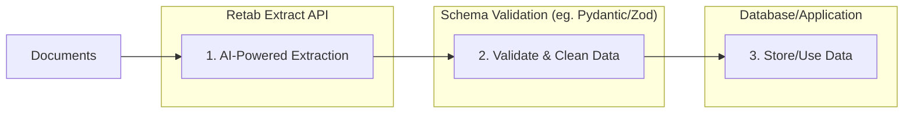
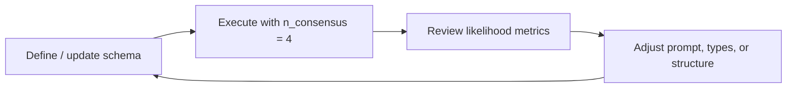

### Introduction

The `extractions.create` method in Retab's document processing pipeline uses AI models to extract structured data from any document based on a provided JSON schema. This endpoint is ideal for automating data extraction tasks, such as pulling key information from invoices, forms, receipts, images, or scanned documents, for use in workflows like data entry automation, analytics, or integration with databases and applications.

The typical extraction workflow follows these steps:

1. **Schema Definition**: Define a JSON schema that describes the structure of the data you want to extract.
2. **Extraction**: Call `client.extractions.create(...)` to process the document and retrieve structured data.
3. **Validation & Usage**: Validate the extracted data (optionally using likelihood scores) and integrate it into your application.

The SDKs already help here:

- Python parses `message.parsed` against the JSON schema you pass in
- Node accepts a JSON schema object, a schema file path, or a `zod` schema directly

You can still add your own application-level validation if you want stricter business rules.



Unlike the `parse` method that focuses on raw text extraction, `extract` provides:

- **Structured Output**: Data extracted directly into JSON format matching your schema.
- **AI-Powered Inference**: Handles complex layouts, handwritten text, and contextual understanding.
- **Modality Support**: Works with text, images, or native document formats.
- **Consensus Mode**: Optional multi-run consensus for higher accuracy on ambiguous documents.
- **Likelihood Scores**: Provides likelihood scores for each extracted field.
- **Batch Processing Ready**: Efficient for high-volume extraction tasks.

## Extract API

<ParamField body="ExtractionRequest" type="ExtractionRequest">
  <Expandable title="properties">

<ParamField body="document" type="string | object" required>
  The document to extract from. Can be a file path (string), or an object with
  `filename` (string) and `url` (string, e.g., base64-encoded data).
</ParamField>

<ParamField body="model" type="string" required>
  The AI model to use for extraction. Examples: `retab-small` for balanced
  accuracy and speed.
</ParamField>

<ParamField body="json_schema" type="object" required>
  The JSON schema defining the structure of the extracted data. Includes
  properties, required fields, and optional `X-SystemPrompt` for custom
  instructions.
</ParamField>

<ParamField body="image_resolution_dpi" type="integer" default="192">
  The DPI of the image sent to the LLM. Defaults to 192.
</ParamField>

<ParamField body="metadata" type="dict[str, str]" default="{}">
  User-defined metadata to associate with this extraction. Defaults to {}.
</ParamField>

<ParamField body="n_consensus" type="integer" default="1">
  Number of consensus runs. Set to >1 for multi-run averaging to improve
  accuracy on uncertain extractions (increases cost).
</ParamField>

<ParamField body="instructions" type="string | null" default="null">
  Free-form instructions appended to the system prompt to steer the extraction.
</ParamField>

  </Expandable>
</ParamField>

<ResponseField name="Returns" type="Extraction">
  An `Extraction` record with the extracted data, usage details, consensus
  likelihoods, and a persisted `id`.
  <Expandable title="properties">
    <ResponseField name="id" type="string">
      Unique identifier for the stored extraction record.
    </ResponseField>
    <ResponseField name="output" type="object">
      The extracted structured data (parsed against your `json_schema`).
    </ResponseField>
    <ResponseField name="consensus" type="object">
      Consensus metadata. `consensus.likelihoods` holds per-field confidence
      scores (populated when `n_consensus > 1`).
    </ResponseField>
    <ResponseField name="usage" type="object">
      Token usage details.
    </ResponseField>
    <ResponseField name="file" type="object">
      Information about the extracted file.
    </ResponseField>
  </Expandable>
</ResponseField>

<CodeGroup>
```python Python
from retab import Retab
from retab.types.extractions import ExtractionRequest

client = Retab()

extraction = client.extractions.create(
document="freight/booking_confirmation.jpg",
model="retab-micro",
json_schema={
'X-SystemPrompt': 'You are a useful assistant.',
'properties': {
'name': {
'description': 'The name of the calendar event.',
'title': 'Name',
'type': 'string'
},
'date': {
'description': 'The date of the calendar event in ISO 8601 format.',
'title': 'Date',
'type': 'string'
}
},
'required': ['name', 'date'],
'title': 'CalendarEvent',
'type': 'object'
},
n_consensus=1, # 1 means disabled (default); if > 1 the extraction runs in consensus mode
)

print(extraction.output)
print(extraction.consensus.likelihoods)
print(extraction.id)

````
```typescript TypeScript
import { Retab } from '@retab/node';

const client = new Retab({ apiKey: process.env.RETAB_API_KEY });

const extraction = await client.extractions.create("freight/booking_confirmation.jpg", {
        "X-SystemPrompt": "You are a useful assistant.",
        properties: {
            name: {
                description: "The name of the calendar event.",
                title: "Name",
                type: "string"
            },
            date: {
                description: "The date of the calendar event in ISO 8601 format.",
                title: "Date",
                type: "string"
            }
        },
        required: ["name", "date"],
        title: "CalendarEvent",
        type: "object"
    },
    "retab-micro",
    undefined,
    undefined,
    1 // 1 means disabled (default); if > 1 the extraction runs in consensus mode
);

console.log(extraction.output);
console.log(extraction.consensus?.likelihoods);
console.log(extraction.id);
````

```go Go
package main

import (
	"context"
	"fmt"
	"log"

	retab "github.com/retab-dev/retab/clients/go"
)

func main() {
	ctx := context.Background()

	client, err := retab.NewClient("")
	if err != nil {
		log.Fatal(err)
	}

	model := "retab-micro"
	nConsensus := 1
	extraction, err := client.Extractions.Create(ctx, &retab.ExtractionsCreateParams{
		Document: "freight/booking_confirmation.jpg",
		Model:    &model,
		JSONSchema: map[string]any{
			"X-SystemPrompt": "You are a useful assistant.",
			"properties": map[string]any{
				"name": map[string]any{
					"description": "The name of the calendar event.",
					"title":       "Name",
					"type":        "string",
				},
				"date": map[string]any{
					"description": "The date of the calendar event in ISO 8601 format.",
					"title":       "Date",
					"type":        "string",
				},
			},
			"required": []string{"name", "date"},
			"title":    "CalendarEvent",
			"type":     "object",
		},
		NConsensus: &nConsensus, // 1 means disabled (default); if > 1 the extraction runs in consensus mode
	})
	if err != nil {
		log.Fatal(err)
	}

	fmt.Println(extraction.Output)
	if extraction.Consensus != nil {
		fmt.Println(extraction.Consensus.Likelihoods)
	}
	fmt.Println(extraction.ID)
}
```

```ruby Ruby
require 'retab'

client = Retab::Client.new(api_key: ENV['RETAB_API_KEY'])

extraction = client.extractions.create(
  document: 'freight/booking_confirmation.jpg',
  model: 'retab-micro',
  json_schema: {
    'X-SystemPrompt' => 'You are a useful assistant.',
    'properties' => {
      'name' => {
        'description' => 'The name of the calendar event.',
        'title' => 'Name',
        'type' => 'string',
      },
      'date' => {
        'description' => 'The date of the calendar event in ISO 8601 format.',
        'title' => 'Date',
        'type' => 'string',
      },
    },
    'required' => ['name', 'date'],
    'title' => 'CalendarEvent',
    'type' => 'object',
  },
  n_consensus: 1, # 1 means disabled (default); if > 1 the extraction runs in consensus mode
)

puts extraction.output
puts extraction.consensus&.likelihoods
puts extraction.id
```

```php PHP
<?php
require 'vendor/autoload.php';

use Retab\Client;

$client = new Client(apiKey: getenv('RETAB_API_KEY'));

$extraction = $client->extractions()->create(
    document: 'freight/booking_confirmation.jpg',
    jsonSchema: [
        'X-SystemPrompt' => 'You are a useful assistant.',
        'properties' => [
            'name' => [
                'description' => 'The name of the calendar event.',
                'title' => 'Name',
                'type' => 'string',
            ],
            'date' => [
                'description' => 'The date of the calendar event in ISO 8601 format.',
                'title' => 'Date',
                'type' => 'string',
            ],
        ],
        'required' => ['name', 'date'],
        'title' => 'CalendarEvent',
        'type' => 'object',
    ],
    model: 'retab-micro',
    nConsensus: 1, // 1 means disabled (default); if > 1 the extraction runs in consensus mode
);

print_r($extraction->output);
print_r($extraction->consensus?->likelihoods);
echo $extraction->id . PHP_EOL;
```

```rust Rust
use retab::resources::extractions::CreateParams;
use retab::Retab;
use std::collections::HashMap;

#[tokio::main]
async fn main() -> Result<(), Box<dyn std::error::Error>> {
    let client = Retab::new(std::env::var("RETAB_API_KEY")?);

    let json_schema: HashMap<String, serde_json::Value> = serde_json::from_value(serde_json::json!({
        "X-SystemPrompt": "You are a useful assistant.",
        "properties": {
            "name": {
                "description": "The name of the calendar event.",
                "title": "Name",
                "type": "string"
            },
            "date": {
                "description": "The date of the calendar event in ISO 8601 format.",
                "title": "Date",
                "type": "string"
            }
        },
        "required": ["name", "date"],
        "title": "CalendarEvent",
        "type": "object"
    }))?;

    let mut params = CreateParams::new("freight/booking_confirmation.jpg", json_schema);
    params.body.model = Some("retab-micro".into());
    params.body.n_consensus = Some(1); // 1 means disabled (default); if > 1 the extraction runs in consensus mode

    let extraction = client.extractions().create(params).await?;

    println!("{:?}", extraction.output);
    if let Some(consensus) = &extraction.consensus {
        println!("{:?}", consensus.likelihoods);
    }
    println!("{}", extraction.id);
    Ok(())
}
```

```java Java
import com.retab.RetabClient;

public final class Example {
  public static void main(String[] args) throws Exception {
    RetabClient client = new RetabClient(System.getenv("RETAB_API_KEY"));

    var result = client.extractions().create(null, null, "retab-1.5", 10L, "Extract the invoice fields", 10L, null, null, null, null, null);
    System.out.println(result);
  }
}
```

```curl cURL
curl -X POST https://api.retab.com/v1/extractions \
-H "Api-Key: $RETAB_API_KEY" \
-H "Content-Type: application/json" \
-d '{
    "document": {
      "filename": "Alphabet-10Q-Q1-25.pdf",
      "url": "data:application/pdf;base64,JVBERi0xLjQKJfbk/N8KMSAwIG9iago8PAovVHlwZS…"
    },
    "model": "retab-micro",
    "json_schema": {
        "X-SystemPrompt": "You are a useful assistant.",
        "properties": {
            "name": {
                "description": "The name of the calendar event.",
                "title": "Name",
                "type": "string"
            },
            "date": {
                "description": "The date of the calendar event in ISO 8601 format.",
                "title": "Date",
                "type": "string"
            }
        },
        "required": ["name", "date"],
        "title": "CalendarEvent",
        "type": "object"
    },
    "n_consensus": 1
}
```

```json Response
{
  "id": "extr_01HZX0ABCDEF123456",
  "file": {
    "filename": "booking_confirmation.jpg",
    "mime_type": "image/jpeg"
  },
  "model": "retab-micro",
  "json_schema": { "...": "..." },
  "n_consensus": 1,
  "output": {
    "name": "Confirmation d'affrètement",
    "date": "2024-11-08"
  },
  "consensus": {
    "choices": [],
    "likelihoods": {
      "name": 0.7227993785831323,
      "date": 0.7306298416895017
    }
  },
  "usage": {
    "completion_tokens": 20,
    "prompt_tokens": 2760,
    "total_tokens": 2780
  },
  "created_at": "2025-01-10T15:30:00Z"
}
```

```csharp C#
using System;
using System.Collections.Generic;
using System.IO;
using Retab;
using RetabClient = Retab.Retab;

var client = new RetabClient("YOUR_API_KEY");

var schema = new Dictionary<string, object>
{
    ["X-SystemPrompt"] = "You are a useful assistant.",
    ["title"] = "CalendarEvent",
    ["type"] = "object",
    ["properties"] = new Dictionary<string, object>
    {
        ["name"] = new Dictionary<string, object>
        {
            ["description"] = "The name of the calendar event.",
            ["title"] = "Name",
            ["type"] = "string",
        },
        ["date"] = new Dictionary<string, object>
        {
            ["description"] = "The date of the calendar event in ISO 8601 format.",
            ["title"] = "Date",
            ["type"] = "string",
        },
    },
    ["required"] = new List<string> { "name", "date" },
};

var extraction = await client.Extractions.CreateAsync(
    new ExtractionsCreateOptions
    {
        Document = new FileInfo("freight/booking_confirmation.jpg"),
        Model = "retab-micro",
        JsonSchema = schema,
        NConsensus = 1, // 1 means disabled (default); if > 1 the extraction runs in consensus mode
    }
);

foreach (var kv in extraction.Output)
{
    Console.WriteLine($"{kv.Key}: {kv.Value}");
}
if (extraction.Consensus?.Likelihoods != null)
{
    foreach (var kv in extraction.Consensus.Likelihoods)
    {
        Console.WriteLine($"{kv.Key}: {kv.Value}");
    }
}
Console.WriteLine(extraction.Id);
```

</CodeGroup>

## Build Your Schema

Retab extraction quality depends heavily on schema quality. The fastest way to improve a schema is to run extraction with consensus enabled, inspect unstable fields, and tighten the schema until the low-confidence areas disappear.



### Why consensus helps

Consensus is Retab's practical schema debugging loop. Multiple extraction runs using the same schema reveal where the model disagrees. Those disagreements usually mean one of three things:

- The field name is ambiguous
- The field description is too loose
- The field type or structure is asking the model to normalize too much at once

As a rule of thumb, fields below `0.75` likelihood need attention before production use.

### Schema improvement levers

| Lever                   | When to apply                                 | Concrete fix                                         |
| ----------------------- | --------------------------------------------- | ---------------------------------------------------- |
| Change field names      | Models mix up concepts                        | Rename `name` to `event_name`                        |
| Improve descriptions    | Correct concept, inconsistent format          | Add format instructions and examples                 |
| Tighten field types     | Strings, numbers, and dates drift across runs | Use stronger types and explicit ISO formats          |
| Restructure nested data | One field combines multiple concepts          | Replace `address: string` with nested address fields |
| Add reasoning prompts   | Calculations or conversions are unstable      | Add `X-ReasoningPrompt` to the field                 |
| Remove weak fields      | The field is noisy and non-critical           | Drop it or defer it to a later version               |

### Example: iterating on a schema

<CodeGroup>
```python Python
from retab import Retab
from retab.types.extractions import ExtractionRequest

client = Retab()

initial_schema = {
"title": "CalendarEvent",
"type": "object",
"properties": {
"name": {"type": "string"},
"date": {"type": "string"},
"address": {"type": "string"},
},
"required": ["name", "date", "address"],
}

result = client.extractions.create(
document="event_flyer.pdf",
model="retab-small",
json_schema=initial_schema,
n_consensus=4,
)

print(result.output)
print(result.consensus.likelihoods if result.consensus else None)

````

```typescript TypeScript
import { Retab } from '@retab/node';

const client = new Retab({ apiKey: process.env.RETAB_API_KEY });

const initialSchema = {
  title: "CalendarEvent",
  type: "object",
  properties: {
    name: { type: "string" },
    date: { type: "string" },
    address: { type: "string" },
  },
  required: ["name", "date", "address"],
};

const result = await client.extractions.create("event_flyer.pdf", initialSchema, "retab-small", undefined, undefined, 4);

console.log(result.output);
console.log(result.consensus?.likelihoods);
````

```go Go
package main

import (
	"context"
	"fmt"
	"log"

	retab "github.com/retab-dev/retab/clients/go"
)

func main() {
	ctx := context.Background()

	client, err := retab.NewClient("")
	if err != nil {
		log.Fatal(err)
	}

	initialSchema := map[string]any{
		"title": "CalendarEvent",
		"type":  "object",
		"properties": map[string]any{
			"name":    map[string]any{"type": "string"},
			"date":    map[string]any{"type": "string"},
			"address": map[string]any{"type": "string"},
		},
		"required": []string{"name", "date", "address"},
	}

	model := "retab-small"
	nConsensus := 4
	result, err := client.Extractions.Create(ctx, &retab.ExtractionsCreateParams{
		Document:   "event_flyer.pdf",
		Model:      &model,
		JSONSchema: initialSchema,
		NConsensus: &nConsensus,
	})
	if err != nil {
		log.Fatal(err)
	}

	fmt.Println(result.Output)
	if result.Consensus != nil {
		fmt.Println(result.Consensus.Likelihoods)
	}
}
```

```ruby Ruby
require 'retab'

client = Retab::Client.new(api_key: ENV['RETAB_API_KEY'])

initial_schema = {
  'title' => 'CalendarEvent',
  'type' => 'object',
  'properties' => {
    'name' => { 'type' => 'string' },
    'date' => { 'type' => 'string' },
    'address' => { 'type' => 'string' },
  },
  'required' => ['name', 'date', 'address'],
}

result = client.extractions.create(
  document: 'event_flyer.pdf',
  model: 'retab-small',
  json_schema: initial_schema,
  n_consensus: 4,
)

puts result.output
puts result.consensus&.likelihoods
```

```php PHP
<?php
require 'vendor/autoload.php';

use Retab\Client;

$client = new Client();

$initialSchema = [
    'title' => 'CalendarEvent',
    'type' => 'object',
    'properties' => [
        'name' => ['type' => 'string'],
        'date' => ['type' => 'string'],
        'address' => ['type' => 'string'],
    ],
    'required' => ['name', 'date', 'address'],
];

$result = $client->extractions()->create(
    document: 'event_flyer.pdf',
    jsonSchema: $initialSchema,
    model: 'retab-small',
    nConsensus: 4,
);

print_r($result->output);
print_r($result->consensus?->likelihoods);
```

```rust Rust
use retab::resources::extractions::CreateParams;
use retab::Retab;
use std::collections::HashMap;

#[tokio::main]
async fn main() -> Result<(), Box<dyn std::error::Error>> {
    let client = Retab::new(std::env::var("RETAB_API_KEY")?);

    let initial_schema: HashMap<String, serde_json::Value> = serde_json::from_value(serde_json::json!({
        "title": "CalendarEvent",
        "type": "object",
        "properties": {
            "name": {"type": "string"},
            "date": {"type": "string"},
            "address": {"type": "string"}
        },
        "required": ["name", "date", "address"]
    }))?;

    let mut params = CreateParams::new("event_flyer.pdf", initial_schema);
    params.body.model = Some("retab-small".into());
    params.body.n_consensus = Some(4);

    let result = client.extractions().create(params).await?;

    println!("{:?}", result.output);
    if let Some(consensus) = &result.consensus {
        println!("{:?}", consensus.likelihoods);
    }
    Ok(())
}
```

```csharp C#
using System;
using System.Collections.Generic;
using System.IO;
using Retab;
using RetabClient = Retab.Retab;

var client = new RetabClient("YOUR_API_KEY");

var initialSchema = new Dictionary<string, object>
{
    ["title"] = "CalendarEvent",
    ["type"] = "object",
    ["properties"] = new Dictionary<string, object>
    {
        ["name"]    = new Dictionary<string, object> { ["type"] = "string" },
        ["date"]    = new Dictionary<string, object> { ["type"] = "string" },
        ["address"] = new Dictionary<string, object> { ["type"] = "string" },
    },
    ["required"] = new List<string> { "name", "date", "address" },
};

var result = await client.Extractions.CreateAsync(
    new ExtractionsCreateOptions
    {
        Document = new FileInfo("event_flyer.pdf"),
        Model = "retab-small",
        JsonSchema = initialSchema,
        NConsensus = 4,
    }
);

foreach (var kv in result.Output)
{
    Console.WriteLine($"{kv.Key}: {kv.Value}");
}
if (result.Consensus?.Likelihoods != null)
{
    foreach (var kv in result.Consensus.Likelihoods)
    {
        Console.WriteLine($"{kv.Key}: {kv.Value}");
    }
}
```

```java Java
import com.retab.RetabClient;

public final class Example {
  public static void main(String[] args) throws Exception {
    RetabClient client = new RetabClient(System.getenv("RETAB_API_KEY"));

    var result = client.extractions().create(null, null, "retab-1.5", 10L, "Extract the invoice fields", 10L, null, null, null, null, null);
    System.out.println(result);
  }
}
```

</CodeGroup>

Example interpretation:

- `name: 1.0` means the field is stable
- `date: 0.5` usually means the format is underspecified
- `address: 0.25` usually means the field should be decomposed into structured subfields

Common next step:

- change `date` to an ISO date field
- split `address` into `street`, `city`, `zip_code`, and `country`

Best practices:

- Start schema iteration with `n_consensus=4` or `5`
- Fix the lowest-likelihood fields first
- Test with diverse documents, not one golden sample
- Treat consensus as a schema debugging tool, not just a scoring feature

## Reasoning

Use reasoning when a field requires calculation, conversion, or multi-step logic. Retab supports this through the `X-ReasoningPrompt` JSON Schema annotation.

The model then produces an auxiliary `reasoning___<field_name>` output during extraction, which gives it room to work through the logic before returning the final field value.

### Example: Celsius to Fahrenheit

<CodeGroup>
```python Python
from pydantic import BaseModel, Field

class TemperatureReport(BaseModel):
temperature: float = Field(
...,
description="temperature in Fahrenheit",
json_schema_extra={
"X-ReasoningPrompt": (
"If the temperature is given in Celsius, explicitly convert it "
"to Fahrenheit. If it is already in Fahrenheit, leave it unchanged."
)
},
)

print(TemperatureReport.model_json_schema())

````

```typescript TypeScript
import { z } from 'zod';

const TemperatureReportSchema = z.object({
  temperature: z.number().describe("temperature in Fahrenheit").openapi({
    "X-ReasoningPrompt":
      "If the temperature is given in Celsius, explicitly convert it to Fahrenheit. If it is already in Fahrenheit, leave it unchanged."
  } as any),
});
````

```go Go
package main

import (
	"encoding/json"
	"fmt"
	"log"
)

func main() {
	temperatureReportSchema := map[string]any{
		"title": "TemperatureReport",
		"type":  "object",
		"properties": map[string]any{
			"temperature": map[string]any{
				"type":        "number",
				"description": "temperature in Fahrenheit",
				"X-ReasoningPrompt": "If the temperature is given in Celsius, explicitly convert it " +
					"to Fahrenheit. If it is already in Fahrenheit, leave it unchanged.",
			},
		},
		"required": []string{"temperature"},
	}

	encoded, err := json.MarshalIndent(temperatureReportSchema, "", "  ")
	if err != nil {
		log.Fatal(err)
	}
	fmt.Println(string(encoded))
}
```

```ruby Ruby
require 'retab'
require 'json'

temperature_report_schema = {
  'title' => 'TemperatureReport',
  'type' => 'object',
  'properties' => {
    'temperature' => {
      'type' => 'number',
      'description' => 'temperature in Fahrenheit',
      'X-ReasoningPrompt' => 'If the temperature is given in Celsius, explicitly convert it ' \
                             'to Fahrenheit. If it is already in Fahrenheit, leave it unchanged.',
    },
  },
  'required' => ['temperature'],
}

puts JSON.pretty_generate(temperature_report_schema)
```

```php PHP
<?php
$temperatureReportSchema = [
    'title' => 'TemperatureReport',
    'type' => 'object',
    'properties' => [
        'temperature' => [
            'type' => 'number',
            'description' => 'temperature in Fahrenheit',
            'X-ReasoningPrompt' => 'If the temperature is given in Celsius, explicitly convert it '
                . 'to Fahrenheit. If it is already in Fahrenheit, leave it unchanged.',
        ],
    ],
    'required' => ['temperature'],
];

echo json_encode($temperatureReportSchema, JSON_PRETTY_PRINT) . PHP_EOL;
```

```rust Rust
use serde_json::json;

fn main() -> Result<(), Box<dyn std::error::Error>> {
    let temperature_report_schema = json!({
        "title": "TemperatureReport",
        "type": "object",
        "properties": {
            "temperature": {
                "type": "number",
                "description": "temperature in Fahrenheit",
                "X-ReasoningPrompt": "If the temperature is given in Celsius, explicitly convert it to Fahrenheit. If it is already in Fahrenheit, leave it unchanged."
            }
        },
        "required": ["temperature"]
    });

    println!("{}", serde_json::to_string_pretty(&temperature_report_schema)?);
    Ok(())
}
```

```csharp C#
using System;
using System.Collections.Generic;
using System.Text.Json;

var temperatureReportSchema = new Dictionary<string, object>
{
    ["title"] = "TemperatureReport",
    ["type"] = "object",
    ["properties"] = new Dictionary<string, object>
    {
        ["temperature"] = new Dictionary<string, object>
        {
            ["type"] = "number",
            ["description"] = "temperature in Fahrenheit",
            ["X-ReasoningPrompt"] =
                "If the temperature is given in Celsius, explicitly convert it " +
                "to Fahrenheit. If it is already in Fahrenheit, leave it unchanged.",
        },
    },
    ["required"] = new List<string> { "temperature" },
};

Console.WriteLine(JsonSerializer.Serialize(
    temperatureReportSchema,
    new JsonSerializerOptions { WriteIndented = true }
));
```

```java Java
import java.util.List;
import java.util.Map;

public final class Example {
  public static void main(String[] args) {
    Map<String, Object> schema =
        Map.of(
            "type", "object",
            "properties",
                Map.of(
                    "temperature",
                    Map.of(
                        "type", "number",
                        "description", "temperature in Fahrenheit",
                        "X-ReasoningPrompt",
                            "Convert Celsius to Fahrenheit when needed.")),
            "required", List.of("temperature"));

    System.out.println(schema);
  }
}
```

</CodeGroup>

Without reasoning, a model may copy `22.5` directly. With reasoning enabled, it is more likely to compute `72.5` and explain the conversion in `reasoning___temperature`.

Use reasoning for:

- unit conversions
- tax or total calculations
- date normalization
- derived fields that depend on multiple source values

## Sources

Retab can also return provenance for extraction results. Given an extraction ID, `sources` returns the same output structure, but every scalar leaf becomes a `{ value, source }` object pointing back to the original document location.

This is useful for:

- review UIs with citations
- provenance audits
- highlighting extracted fields in viewers
- debugging incorrect outputs

<CodeGroup>
```python Python
from retab import Retab

client = Retab()

sources = client.extractions.sources("extr_01G34H8J2K")

print(sources.extraction)
print(sources.sources)

````

```typescript TypeScript
import { Retab } from '@retab/node';

const client = new Retab({ apiKey: process.env.RETAB_API_KEY });

const sources = await client.extractions.sources("extr_01G34H8J2K");

console.log(sources.extraction);
console.log(sources.sources);
````

```go Go
package main

import (
	"context"
	"fmt"
	"log"

	retab "github.com/retab-dev/retab/clients/go"
)

func main() {
	ctx := context.Background()

	client, err := retab.NewClient("")
	if err != nil {
		log.Fatal(err)
	}

	sources, err := client.Extractions.Sources(ctx, "extr_01G34H8J2K")
	if err != nil {
		log.Fatal(err)
	}

	fmt.Println(sources.Extraction)
	fmt.Println(sources.Sources)
}
```

```ruby Ruby
require 'retab'

client = Retab::Client.new(api_key: ENV['RETAB_API_KEY'])

sources = client.extractions.sources(extraction_id: 'extr_01G34H8J2K')

puts sources.extraction
puts sources.sources
```

```php PHP
<?php
require 'vendor/autoload.php';

use Retab\Client;

$client = new Client();

$sources = $client->extractions()->sources('extr_01G34H8J2K');

print_r($sources->extraction);
print_r($sources->sources);
```

```rust Rust
use retab::Retab;

#[tokio::main]
async fn main() -> Result<(), Box<dyn std::error::Error>> {
    let client = Retab::new(std::env::var("RETAB_API_KEY")?);

    let sources = client.extractions().sources("extr_01G34H8J2K").await?;

    println!("{:?}", sources.extraction);
    println!("{:?}", sources.sources);
    Ok(())
}
```

```csharp C#
using System;
using Retab;
using RetabClient = Retab.Retab;

var client = new RetabClient("YOUR_API_KEY");

var sources = await client.Extractions.SourcesAsync("extr_01G34H8J2K");

Console.WriteLine(sources.Extraction);
Console.WriteLine(sources.Sources);
```

```java Java
import com.retab.RetabClient;

public final class Example {
  public static void main(String[] args) throws Exception {
    RetabClient client = new RetabClient(System.getenv("RETAB_API_KEY"));

    var result = client.extractions().sources("extr_abc123");
    System.out.println(result);
  }
}
```

</CodeGroup>

### Response shape

Every sourced leaf looks like this:

```json
{
  "value": "INV-1032",
  "source": {
    "content": "INV-1032",
    "anchor": {
      "kind": "pdf_bbox",
      "page": 1,
      "left": 0.6,
      "top": 0.12,
      "width": 0.25,
      "height": 0.03
    }
  }
}
```

Common anchor types:

- `pdf_bbox`: normalized bounding box on a PDF page
- `image_bbox`: normalized bounding box on an image
- `csv_cell`: row and column reference in CSV
- `spreadsheet_cell`: sheet and cell reference in XLSX
- `docx_text_span` or `docx_table_cell`: DOCX paragraph or table-cell location
- `text_span`: line and character offsets in plain text

If a field cannot be sourced, Retab still returns the value and sets `source` to `null`.

## Managing Saved Extractions

Extractions are persisted resources. After calling `client.extractions.create(...)`, you can retrieve them later, list them with pagination, and filter them by metadata or date range.

### Listing extractions

Use `client.extractions.list(...)` when you need to browse recent extractions, paginate through large histories, or filter by metadata.

<CodeGroup>
```python Python
from datetime import datetime
from retab import Retab

client = Retab()

recent = client.extractions.list(
limit=10,
order="desc",
)

customer_specific = client.extractions.list(
metadata={"customer_id": "cust_acme_corp"},
limit=50,
)

date_filtered = client.extractions.list(
from_date=datetime(2024, 1, 1),
to_date=datetime(2024, 12, 31),
)

````

```typescript TypeScript
import { Retab } from '@retab/node';

const client = new Retab({ apiKey: process.env.RETAB_API_KEY });

const recent = await client.extractions.list({
  limit: 10,
  order: "desc",
});

const customerSpecific = await client.extractions.list({
  metadata: JSON.stringify({ customer_id: "cust_acme_corp" }),
  limit: 50,
});

const dateFiltered = await client.extractions.list({
  fromDate: new Date("2024-01-01").toISOString(),
  toDate: new Date("2024-12-31").toISOString(),
});
````

```go Go
package main

import (
	"context"
	"encoding/json"
	"fmt"
	"log"

	retab "github.com/retab-dev/retab/clients/go"
)

func main() {
	ctx := context.Background()

	client, err := retab.NewClient("")
	if err != nil {
		log.Fatal(err)
	}

	limit := 10
	order := "desc"
	recent, err := client.Extractions.List(ctx, &retab.ExtractionsListParams{
		PaginationParams: retab.PaginationParams{Limit: &limit, Order: &order},
	})
	if err != nil {
		log.Fatal(err)
	}
	fmt.Println(recent.Data)

	customerMetadata, err := json.Marshal(map[string]string{"customer_id": "cust_acme_corp"})
	if err != nil {
		log.Fatal(err)
	}
	customerMetadataFilter := string(customerMetadata)
	limit = 50
	customerSpecific, err := client.Extractions.List(ctx, &retab.ExtractionsListParams{
		PaginationParams: retab.PaginationParams{Limit: &limit},
		Metadata:         &customerMetadataFilter,
	})
	if err != nil {
		log.Fatal(err)
	}
	fmt.Println(customerSpecific.Data)

	from := "2024-01-01"
	to := "2024-12-31"
	dateFiltered, err := client.Extractions.List(ctx, &retab.ExtractionsListParams{
		FromDate: &from,
		ToDate:   &to,
	})
	if err != nil {
		log.Fatal(err)
	}
	fmt.Println(dateFiltered.Data)
}
```

```ruby Ruby
require 'retab'
require 'date'

client = Retab::Client.new(api_key: ENV['RETAB_API_KEY'])

recent = client.extractions.list(
  limit: 10,
  order: 'desc',
)

customer_specific = client.extractions.list(
  metadata: { customer_id: 'cust_acme_corp' },
  limit: 50,
)

date_filtered = client.extractions.list(
  from_date: DateTime.new(2024, 1, 1),
  to_date: DateTime.new(2024, 12, 31),
)
```

```php PHP
<?php
require 'vendor/autoload.php';

use Retab\Client;
use Retab\Resource\JobsOrder;

$client = new Client();

$recent = $client->extractions()->list(
    limit: 10,
    order: JobsOrder::Desc,
);

$customerSpecific = $client->extractions()->list(
    limit: 50,
    metadata: json_encode(['customer_id' => 'cust_acme_corp']),
);

$dateFiltered = $client->extractions()->list(
    fromDate: '2024-01-01',
    toDate: '2024-12-31',
);
```

```rust Rust
use retab::enums::ExtractionsOrder;
use retab::resources::extractions::ListParams;
use retab::Retab;

#[tokio::main]
async fn main() -> Result<(), Box<dyn std::error::Error>> {
    let client = Retab::new(std::env::var("RETAB_API_KEY")?);

    let recent = client
        .extractions()
        .list(ListParams {
            limit: Some(10),
            order: Some(ExtractionsOrder::Desc),
            ..Default::default()
        })
        .await?;
    println!("{:?}", recent.data);

    let customer_specific = client
        .extractions()
        .list(ListParams {
            limit: Some(50),
            metadata: Some(r#"{"customer_id":"cust_acme_corp"}"#.into()),
            ..Default::default()
        })
        .await?;
    println!("{:?}", customer_specific.data);

    let date_filtered = client
        .extractions()
        .list(ListParams {
            from_date: Some("2024-01-01".into()),
            to_date: Some("2024-12-31".into()),
            ..Default::default()
        })
        .await?;
    println!("{:?}", date_filtered.data);
    Ok(())
}
```

```csharp C#
using System;
using System.Collections.Generic;
using Retab;
using RetabClient = Retab.Retab;

var client = new RetabClient("YOUR_API_KEY");

var recent = await client.Extractions.ListAsync(
    new ExtractionsListOptions { Limit = 10, Order = "desc" }
);
foreach (var e in recent.Data) Console.WriteLine(e.Id);

var customerSpecific = await client.Extractions.ListAsync(
    new ExtractionsListOptions
    {
        Limit = 50,
        Metadata = "{\"customer_id\":\"cust_acme_corp\"}",
    }
);
foreach (var e in customerSpecific.Data) Console.WriteLine(e.Id);

var dateFiltered = await client.Extractions.ListAsync(
    new ExtractionsListOptions
    {
        FromDate = "2024-01-01",
        ToDate = "2024-12-31",
    }
);
foreach (var e in dateFiltered.Data) Console.WriteLine(e.Id);
```

```java Java
import com.retab.RetabClient;

public final class Example {
  public static void main(String[] args) throws Exception {
    RetabClient client = new RetabClient(System.getenv("RETAB_API_KEY"));

    var result = client.extractions().list(null, null, 10L, null, "invoice.pdf", null, null, null, null, null, null);
    System.out.println(result);
  }
}
```

</CodeGroup>

Useful list filters:

- `limit`: page size
- `order`: `asc` or `desc` by creation date
- `before` and `after`: id pagination
- `from_date` and `to_date`: date-range filters
- `metadata`: exact-match metadata filtering

### Getting an extraction by ID

<CodeGroup>
```python Python
from retab import Retab

client = Retab()

extraction = client.extractions.get("extr_01G34H8J2K")
print(extraction)

````

```typescript TypeScript
import { Retab } from '@retab/node';

const client = new Retab({ apiKey: process.env.RETAB_API_KEY });

const extraction = await client.extractions.get("extr_01G34H8J2K");
console.log(extraction);
````

```go Go
package main

import (
	"context"
	"fmt"
	"log"

	retab "github.com/retab-dev/retab/clients/go"
)

func main() {
	ctx := context.Background()

	client, err := retab.NewClient("")
	if err != nil {
		log.Fatal(err)
	}

	extraction, err := client.Extractions.Get(ctx, "extr_01G34H8J2K")
	if err != nil {
		log.Fatal(err)
	}
	fmt.Println(*extraction)
}
```

```ruby Ruby
require 'retab'

client = Retab::Client.new(api_key: ENV['RETAB_API_KEY'])

extraction = client.extractions.get(extraction_id: 'extr_01G34H8J2K')
puts extraction
```

```php PHP
<?php
require 'vendor/autoload.php';

use Retab\Client;

$client = new Client();

$extraction = $client->extractions()->get('extr_01G34H8J2K');
print_r($extraction);
```

```rust Rust
use retab::Retab;

#[tokio::main]
async fn main() -> Result<(), Box<dyn std::error::Error>> {
    let client = Retab::new(std::env::var("RETAB_API_KEY")?);

    let extraction = client.extractions().get("extr_01G34H8J2K").await?;
    println!("{:?}", extraction);
    Ok(())
}
```

```csharp C#
using System;
using Retab;
using RetabClient = Retab.Retab;

var client = new RetabClient("YOUR_API_KEY");

var extraction = await client.Extractions.GetAsync("extr_01G34H8J2K");
Console.WriteLine(extraction.Id);
foreach (var kv in extraction.Output)
{
    Console.WriteLine($"{kv.Key}: {kv.Value}");
}
```

```java Java
import com.retab.RetabClient;

public final class Example {
  public static void main(String[] args) throws Exception {
    RetabClient client = new RetabClient(System.getenv("RETAB_API_KEY"));

    var result = client.extractions().get("extr_abc123");
    System.out.println(result);
  }
}
```

</CodeGroup>

### Filtering by metadata

Metadata is useful when you want to organize extractions by tenant, workflow, batch, or any other business key you attached at creation time.

<CodeGroup>
```python Python
from retab import Retab

client = Retab()

customer_extractions = client.extractions.list(
metadata={"customer_id": "cust_acme_corp"},
limit=100,
)

````

```typescript TypeScript
import { Retab } from '@retab/node';

const client = new Retab({ apiKey: process.env.RETAB_API_KEY });

const customerExtractions = await client.extractions.list({
  metadata: JSON.stringify({ customer_id: "cust_acme_corp" }),
  limit: 100,
});
````

```go Go
package main

import (
	"context"
	"encoding/json"
	"fmt"
	"log"

	retab "github.com/retab-dev/retab/clients/go"
)

func main() {
	ctx := context.Background()

	client, err := retab.NewClient("")
	if err != nil {
		log.Fatal(err)
	}

	customerMetadata, err := json.Marshal(map[string]string{"customer_id": "cust_acme_corp"})
	if err != nil {
		log.Fatal(err)
	}
	customerMetadataFilter := string(customerMetadata)
	limit := 100
	customerExtractions, err := client.Extractions.List(ctx, &retab.ExtractionsListParams{
		PaginationParams: retab.PaginationParams{Limit: &limit},
		Metadata:         &customerMetadataFilter,
	})
	if err != nil {
		log.Fatal(err)
	}
	fmt.Println(customerExtractions.Data)
}
```

```ruby Ruby
require 'retab'

client = Retab::Client.new(api_key: ENV['RETAB_API_KEY'])

customer_extractions = client.extractions.list(
  metadata: { customer_id: 'cust_acme_corp' },
  limit: 100,
)
```

```php PHP
<?php
require 'vendor/autoload.php';

use Retab\Client;

$client = new Client();

$customerExtractions = $client->extractions()->list(
    limit: 100,
    metadata: json_encode(['customer_id' => 'cust_acme_corp']),
);
```

```rust Rust
use retab::resources::extractions::ListParams;
use retab::Retab;

#[tokio::main]
async fn main() -> Result<(), Box<dyn std::error::Error>> {
    let client = Retab::new(std::env::var("RETAB_API_KEY")?);

    let customer_extractions = client
        .extractions()
        .list(ListParams {
            limit: Some(100),
            metadata: Some(r#"{"customer_id":"cust_acme_corp"}"#.into()),
            ..Default::default()
        })
        .await?;
    println!("{:?}", customer_extractions.data);
    Ok(())
}
```

```csharp C#
using System;
using System.Collections.Generic;
using Retab;
using RetabClient = Retab.Retab;

var client = new RetabClient("YOUR_API_KEY");

var customerExtractions = await client.Extractions.ListAsync(
    new ExtractionsListOptions
    {
        Limit = 100,
        Metadata = "{\"customer_id\":\"cust_acme_corp\"}",
    }
);

foreach (var e in customerExtractions.Data)
{
    Console.WriteLine(e.Id);
}
```

```java Java
import com.retab.RetabClient;

public final class Example {
  public static void main(String[] args) throws Exception {
    RetabClient client = new RetabClient(System.getenv("RETAB_API_KEY"));

    var result = client.extractions().list(null, null, 10L, null, "invoice.pdf", null, null, null, null, null, null);
    System.out.println(result);
  }
}
```

</CodeGroup>

For full request and response details, see the extraction endpoints in the API Reference.

## Use Case: Extracting Event Information from Documents

Extract structured calendar event data from a booking confirmation image and validate likelihood scores before saving to a database.

<CodeGroup>
```python Python
from retab import Retab
from retab.types.extractions import ExtractionRequest

client = Retab()

# Extract data.
result = client.extractions.create(
    document="freight/booking_confirmation.jpg",
    model="retab-micro",
    json_schema={
        'X-SystemPrompt': 'You are a useful assistant.',
        'properties': {
            'name': {
                'description': 'The name of the calendar event.',
                'title': 'Name',
                'type': 'string',
            },
            'date': {
                'description': 'The date of the calendar event in ISO 8601 format.',
                'title': 'Date',
                'type': 'string',
            },
        },
        'required': ['name', 'date'],
        'title': 'CalendarEvent',
        'type': 'object',
    },
    n_consensus=1,
)

extracted_data = result.output
likelihoods = (result.consensus.likelihoods or {}) if result.consensus else {}

print(f"Extracted Event: {extracted_data.get('name')} on {extracted_data.get('date')}")

if likelihoods and all(score > 0.7 for score in likelihoods.values()):
    print("High likelihood extraction - Saving to DB...")
else:
    print("Low likelihood - Review manually")

if result.usage:
    print(f"Processed using {result.usage.credits} credits")

````

```typescript TypeScript
import { Retab } from '@retab/node';
import { z } from 'zod';

const client = new Retab({ apiKey: process.env.RETAB_API_KEY });

const CalendarEventSchema = z.object({
    name: z.string(),
    date: z.string().refine((val) => {
        return /^\d{4}-\d{2}-\d{2}$/.test(val);  // Basic ISO date check
    }, { message: "Invalid ISO 8601 date" })
});

// Extract data
const result = await client.extractions.create(
    "freight/booking_confirmation.jpg",
    CalendarEventSchema as unknown as Record<string, unknown>,
    "retab-micro",
    undefined,
    undefined,
    1
);

// Access extracted data
const extractedData = result.output;
const likelihoods = result.consensus?.likelihoods ?? {};

// Validate with Zod
const validation = CalendarEventSchema.safeParse(extractedData);
if (validation.success) {
    const event = validation.data;
    console.log(`Extracted Event: ${event.name} on ${event.date}`);

    // Check likelihoods
    const scores = Object.values(likelihoods) as number[];
    if (scores.length > 0 && Math.min(...scores) > 0.7) {
        console.log("High likelihood extraction - Saving to DB...");
        // db.save(event);  // Pseudo-code for DB integration
    } else {
        console.log("Low likelihood - Review manually");
    }
} else {
    console.log("Validation failed:", validation.error);
}

console.log(`Processed using ${result.usage?.credits ?? 0} credits`);
````

```go Go
package main

import (
	"context"
	"fmt"
	"log"

	retab "github.com/retab-dev/retab/clients/go"
)

func main() {
	ctx := context.Background()

	client, err := retab.NewClient("")
	if err != nil {
		log.Fatal(err)
	}

	model := "retab-micro"
	nConsensus := 1
	result, err := client.Extractions.Create(ctx, &retab.ExtractionsCreateParams{
		Document: "freight/booking_confirmation.jpg",
		Model:    &model,
		JSONSchema: map[string]any{
			"X-SystemPrompt": "You are a useful assistant.",
			"properties": map[string]any{
				"name": map[string]any{
					"description": "The name of the calendar event.",
					"title":       "Name",
					"type":        "string",
				},
				"date": map[string]any{
					"description": "The date of the calendar event in ISO 8601 format.",
					"title":       "Date",
					"type":        "string",
				},
			},
			"required": []string{"name", "date"},
			"title":    "CalendarEvent",
			"type":     "object",
		},
		NConsensus: &nConsensus,
	})
	if err != nil {
		log.Fatal(err)
	}

	extractedData := result.Output
	likelihoods := map[string]any{}
	if result.Consensus != nil {
		likelihoods = result.Consensus.Likelihoods
	}

	fmt.Printf("Extracted Event: %v on %v\n", extractedData["name"], extractedData["date"])

	allHigh := len(likelihoods) > 0
	for _, raw := range likelihoods {
		score, _ := raw.(float64)
		if score <= 0.7 {
			allHigh = false
			break
		}
	}
	if allHigh {
		fmt.Println("High likelihood extraction - Saving to DB...")
	} else {
		fmt.Println("Low likelihood - Review manually")
	}

	if result.Usage != nil {
		fmt.Printf("Processed with %v credits\n", result.Usage.Credits)
	}
}
```

```ruby Ruby
require 'retab'

client = Retab::Client.new(api_key: ENV['RETAB_API_KEY'])

# Extract data
result = client.extractions.create(
  document: 'freight/booking_confirmation.jpg',
  model: 'retab-micro',
  json_schema: {
    'X-SystemPrompt' => 'You are a useful assistant.',
    'properties' => {
      'name' => {
        'description' => 'The name of the calendar event.',
        'title' => 'Name',
        'type' => 'string',
      },
      'date' => {
        'description' => 'The date of the calendar event in ISO 8601 format.',
        'title' => 'Date',
        'type' => 'string',
      },
    },
    'required' => ['name', 'date'],
    'title' => 'CalendarEvent',
    'type' => 'object',
  },
  n_consensus: 1,
)

extracted_data = result.output
likelihoods = (result.consensus&.likelihoods) || {}

puts "Extracted Event: #{extracted_data['name']} on #{extracted_data['date']}"

if !likelihoods.empty? && likelihoods.values.all? { |score| score > 0.7 }
  puts 'High likelihood extraction - Saving to DB...'
else
  puts 'Low likelihood - Review manually'
end

if result.usage
  puts "Processed with #{result.usage.credits} credits"
end
```

```php PHP
<?php
require 'vendor/autoload.php';

use Retab\Client;

$client = new Client(apiKey: getenv('RETAB_API_KEY'));

// Extract data
$result = $client->extractions()->create(
    document: 'freight/booking_confirmation.jpg',
    jsonSchema: [
        'X-SystemPrompt' => 'You are a useful assistant.',
        'properties' => [
            'name' => [
                'description' => 'The name of the calendar event.',
                'title' => 'Name',
                'type' => 'string',
            ],
            'date' => [
                'description' => 'The date of the calendar event in ISO 8601 format.',
                'title' => 'Date',
                'type' => 'string',
            ],
        ],
        'required' => ['name', 'date'],
        'title' => 'CalendarEvent',
        'type' => 'object',
    ],
    model: 'retab-micro',
    nConsensus: 1,
);

$extractedData = $result->output;
$likelihoods = $result->consensus?->likelihoods ?? [];

echo "Extracted Event: {$extractedData['name']} on {$extractedData['date']}" . PHP_EOL;

if (!empty($likelihoods) && min($likelihoods) > 0.7) {
    echo 'High likelihood extraction - Saving to DB...' . PHP_EOL;
} else {
    echo 'Low likelihood - Review manually' . PHP_EOL;
}

if ($result->usage !== null) {
    echo "Processed with {$result->usage->credits} credits" . PHP_EOL;
}
```

```rust Rust
use retab::resources::extractions::CreateParams;
use retab::Retab;
use std::collections::HashMap;

#[tokio::main]
async fn main() -> Result<(), Box<dyn std::error::Error>> {
    let client = Retab::new(std::env::var("RETAB_API_KEY")?);

    let json_schema: HashMap<String, serde_json::Value> = serde_json::from_value(serde_json::json!({
        "X-SystemPrompt": "You are a useful assistant.",
        "properties": {
            "name": {
                "description": "The name of the calendar event.",
                "title": "Name",
                "type": "string"
            },
            "date": {
                "description": "The date of the calendar event in ISO 8601 format.",
                "title": "Date",
                "type": "string"
            }
        },
        "required": ["name", "date"],
        "title": "CalendarEvent",
        "type": "object"
    }))?;

    let mut params = CreateParams::new("freight/booking_confirmation.jpg", json_schema);
    params.body.model = Some("retab-micro".into());
    params.body.n_consensus = Some(1);

    let result = client.extractions().create(params).await?;

    let extracted_data = &result.output;
    let likelihoods = result
        .consensus
        .as_ref()
        .and_then(|c| c.likelihoods.as_ref())
        .cloned()
        .unwrap_or_default();

    println!(
        "Extracted Event: {:?} on {:?}",
        extracted_data.get("name"),
        extracted_data.get("date"),
    );

    let all_high = !likelihoods.is_empty()
        && likelihoods
            .values()
            .filter_map(|v| v.as_f64())
            .all(|score| score > 0.7);
    if all_high {
        println!("High likelihood extraction - Saving to DB...");
    } else {
        println!("Low likelihood - Review manually");
    }

    if let Some(usage) = &result.usage {
        println!("Processed with {} credits", usage.credits);
    }
    Ok(())
}
```

```csharp C#
using System;
using System.Collections.Generic;
using System.IO;
using System.Linq;
using Retab;
using RetabClient = Retab.Retab;

var client = new RetabClient("YOUR_API_KEY");

var schema = new Dictionary<string, object>
{
    ["X-SystemPrompt"] = "You are a useful assistant.",
    ["title"] = "CalendarEvent",
    ["type"] = "object",
    ["properties"] = new Dictionary<string, object>
    {
        ["name"] = new Dictionary<string, object>
        {
            ["description"] = "The name of the calendar event.",
            ["title"] = "Name",
            ["type"] = "string",
        },
        ["date"] = new Dictionary<string, object>
        {
            ["description"] = "The date of the calendar event in ISO 8601 format.",
            ["title"] = "Date",
            ["type"] = "string",
        },
    },
    ["required"] = new List<string> { "name", "date" },
};

// Extract data
var result = await client.Extractions.CreateAsync(
    new ExtractionsCreateOptions
    {
        Document = new FileInfo("freight/booking_confirmation.jpg"),
        Model = "retab-micro",
        JsonSchema = schema,
        NConsensus = 1,
    }
);

var name = result.GetOutputAttribute<string>("name");
var date = result.GetOutputAttribute<string>("date");
Console.WriteLine($"Extracted Event: {name} on {date}");

var likelihoods = result.Consensus?.Likelihoods;
if (likelihoods != null && likelihoods.Count > 0 && likelihoods.Values.OfType<double>().All(score => score > 0.7))
{
    Console.WriteLine("High likelihood extraction - Saving to DB...");
}
else
{
    Console.WriteLine("Low likelihood - Review manually");
}

if (result.Usage != null)
{
    Console.WriteLine($"Processed with {result.Usage.Credits} credits");
}
```

```java Java
import com.retab.RetabClient;

public final class Example {
  public static void main(String[] args) throws Exception {
    RetabClient client = new RetabClient(System.getenv("RETAB_API_KEY"));

    var result = client.extractions().create(null, null, "retab-1.5", 10L, "Extract the invoice fields", 10L, null, null, null, null, null);
    System.out.println(result);
  }
}
```

</CodeGroup>

## Use Case: Passing Extra Instructions

Use `instructions` to provide a freeform note that guides the extraction — useful for iteration context from a loop, tenant-specific conventions, or any hint that isn't captured by the schema itself.

<CodeGroup>
```python Python
from retab import Retab
from retab.types.extractions import ExtractionRequest

client = Retab()

result = client.extractions.create(
document="invoices/invoice_001.pdf",
model="retab-micro",
json_schema={
'properties': {
'vendor_name': {'type': 'string', 'description': 'Name of the vendor'},
'invoice_number': {'type': 'string', 'description': 'Invoice number'},
'total_amount': {'type': 'number', 'description': 'Total amount due'},
'currency': {'type': 'string', 'description': 'Currency code (e.g., USD, EUR)'}
},
'required': ['vendor_name', 'invoice_number', 'total_amount'],
'type': 'object'
},
instructions=(
"This invoice is from our European supplier. "
"Amounts should be in EUR unless explicitly stated otherwise. "
"Extract values exactly as written; do not infer a missing currency."
),
)

print(result.output)

````

```typescript TypeScript
import { Retab } from '@retab/node';

const client = new Retab({ apiKey: process.env.RETAB_API_KEY });

const result = await client.extractions.create("invoices/invoice_001.pdf", {
        properties: {
            vendor_name: { type: "string", description: "Name of the vendor" },
            invoice_number: { type: "string", description: "Invoice number" },
            total_amount: { type: "number", description: "Total amount due" },
            currency: { type: "string", description: "Currency code (e.g., USD, EUR)" }
        },
        required: ["vendor_name", "invoice_number", "total_amount"],
        type: "object"
    }, "retab-micro", undefined, "This invoice is from our European supplier. Amounts should be in EUR unless explicitly stated otherwise. Extract values exactly as written; do not infer a missing currency.");

console.log(result.output);
````

```go Go
package main

import (
	"context"
	"fmt"
	"log"

	retab "github.com/retab-dev/retab/clients/go"
)

func main() {
	ctx := context.Background()

	client, err := retab.NewClient("")
	if err != nil {
		log.Fatal(err)
	}

	model := "retab-micro"
	instructions := "This invoice is from our European supplier. " +
		"Amounts should be in EUR unless explicitly stated otherwise. " +
		"Extract values exactly as written; do not infer a missing currency."
	result, err := client.Extractions.Create(ctx, &retab.ExtractionsCreateParams{
		Document: "invoices/invoice_001.pdf",
		Model:    &model,
		JSONSchema: map[string]any{
			"properties": map[string]any{
				"vendor_name":    map[string]any{"type": "string", "description": "Name of the vendor"},
				"invoice_number": map[string]any{"type": "string", "description": "Invoice number"},
				"total_amount":   map[string]any{"type": "number", "description": "Total amount due"},
				"currency":       map[string]any{"type": "string", "description": "Currency code (e.g., USD, EUR)"},
			},
			"required": []string{"vendor_name", "invoice_number", "total_amount"},
			"type":     "object",
		},
		Instructions: &instructions,
	})
	if err != nil {
		log.Fatal(err)
	}

	fmt.Println(result.Output)
}
```

```ruby Ruby
require 'retab'

client = Retab::Client.new(api_key: ENV['RETAB_API_KEY'])

result = client.extractions.create(
  document: 'invoices/invoice_001.pdf',
  model: 'retab-micro',
  json_schema: {
    'properties' => {
      'vendor_name' => { 'type' => 'string', 'description' => 'Name of the vendor' },
      'invoice_number' => { 'type' => 'string', 'description' => 'Invoice number' },
      'total_amount' => { 'type' => 'number', 'description' => 'Total amount due' },
      'currency' => { 'type' => 'string', 'description' => 'Currency code (e.g., USD, EUR)' },
    },
    'required' => ['vendor_name', 'invoice_number', 'total_amount'],
    'type' => 'object',
  },
  instructions: 'This invoice is from our European supplier. ' \
                'Amounts should be in EUR unless explicitly stated otherwise. ' \
                'Extract values exactly as written; do not infer a missing currency.',
)

puts result.output
```

```php PHP
<?php
require 'vendor/autoload.php';

use Retab\Client;

$client = new Client(apiKey: getenv('RETAB_API_KEY'));

$result = $client->extractions()->create(
    document: 'invoices/invoice_001.pdf',
    jsonSchema: [
        'properties' => [
            'vendor_name' => ['type' => 'string', 'description' => 'Name of the vendor'],
            'invoice_number' => ['type' => 'string', 'description' => 'Invoice number'],
            'total_amount' => ['type' => 'number', 'description' => 'Total amount due'],
            'currency' => ['type' => 'string', 'description' => 'Currency code (e.g., USD, EUR)'],
        ],
        'required' => ['vendor_name', 'invoice_number', 'total_amount'],
        'type' => 'object',
    ],
    model: 'retab-micro',
    instructions: 'This invoice is from our European supplier. '
        . 'Amounts should be in EUR unless explicitly stated otherwise. '
        . 'Extract values exactly as written; do not infer a missing currency.',
);

print_r($result->output);
```

```rust Rust
use retab::resources::extractions::CreateParams;
use retab::Retab;
use std::collections::HashMap;

#[tokio::main]
async fn main() -> Result<(), Box<dyn std::error::Error>> {
    let client = Retab::new(std::env::var("RETAB_API_KEY")?);

    let json_schema: HashMap<String, serde_json::Value> = serde_json::from_value(serde_json::json!({
        "properties": {
            "vendor_name": {"type": "string", "description": "Name of the vendor"},
            "invoice_number": {"type": "string", "description": "Invoice number"},
            "total_amount": {"type": "number", "description": "Total amount due"},
            "currency": {"type": "string", "description": "Currency code (e.g., USD, EUR)"}
        },
        "required": ["vendor_name", "invoice_number", "total_amount"],
        "type": "object"
    }))?;

    let mut params = CreateParams::new("invoices/invoice_001.pdf", json_schema);
    params.body.model = Some("retab-micro".into());
    params.body.instructions = Some(
        "This invoice is from our European supplier. \
         Amounts should be in EUR unless explicitly stated otherwise. \
         Extract values exactly as written; do not infer a missing currency."
            .into(),
    );

    let result = client.extractions().create(params).await?;

    println!("{:?}", result.output);
    Ok(())
}
```

```java Java
import com.retab.RetabClient;

public final class Example {
  public static void main(String[] args) throws Exception {
    RetabClient client = new RetabClient(System.getenv("RETAB_API_KEY"));

    var result = client.extractions().create(null, null, "retab-1.5", 10L, "Extract the invoice fields", 10L, null, null, null, null, null);
    System.out.println(result);
  }
}
```

```curl cURL
curl -X POST https://api.retab.com/v1/extractions \
-H "Api-Key: $RETAB_API_KEY" \
-H "Content-Type: application/json" \
-d '{
    "document": {
      "filename": "invoice_001.pdf",
      "url": "data:application/pdf;base64,..."
    },
    "model": "retab-micro",
    "json_schema": {
        "properties": {
            "vendor_name": {"type": "string", "description": "Name of the vendor"},
            "invoice_number": {"type": "string", "description": "Invoice number"},
            "total_amount": {"type": "number", "description": "Total amount due"},
            "currency": {"type": "string", "description": "Currency code (e.g., USD, EUR)"}
        },
        "required": ["vendor_name", "invoice_number", "total_amount"],
        "type": "object"
    },
    "instructions": "This invoice is from our European supplier. Amounts should be in EUR unless explicitly stated otherwise."
}'
```

```csharp C#
using System;
using System.Collections.Generic;
using System.IO;
using Retab;
using RetabClient = Retab.Retab;

var client = new RetabClient("YOUR_API_KEY");

var schema = new Dictionary<string, object>
{
    ["type"] = "object",
    ["properties"] = new Dictionary<string, object>
    {
        ["vendor_name"]    = new Dictionary<string, object> { ["type"] = "string", ["description"] = "Name of the vendor" },
        ["invoice_number"] = new Dictionary<string, object> { ["type"] = "string", ["description"] = "Invoice number" },
        ["total_amount"]   = new Dictionary<string, object> { ["type"] = "number", ["description"] = "Total amount due" },
        ["currency"]       = new Dictionary<string, object> { ["type"] = "string", ["description"] = "Currency code (e.g., USD, EUR)" },
    },
    ["required"] = new List<string> { "vendor_name", "invoice_number", "total_amount" },
};

var result = await client.Extractions.CreateAsync(
    new ExtractionsCreateOptions
    {
        Document = new FileInfo("invoices/invoice_001.pdf"),
        Model = "retab-micro",
        JsonSchema = schema,
        Instructions =
            "This invoice is from our European supplier. " +
            "Amounts should be in EUR unless explicitly stated otherwise. " +
            "Extract values exactly as written; do not infer a missing currency.",
    }
);

foreach (var kv in result.Output)
{
    Console.WriteLine($"{kv.Key}: {kv.Value}");
}
```

</CodeGroup>

## Metadata Filters

Use `metadata` at extraction time to tag each document with stable identifiers, then filter those extractions later using the same keys.

This is especially important in multi-tenant systems: always include stable tenant-scoping metadata keys to avoid cross-tenant contamination.

### 1. Tag the extraction request with metadata

<CodeGroup>
```python Python
from retab import Retab
from retab.types.extractions import ExtractionRequest

client = Retab()

result = client.extractions.create(
document="freight/booking_confirmation.jpg",
model="retab-small",
json_schema=my_schema,
metadata={
"customer_id": "cust_123",
"source": "sinari_jobs",
"project_id": "project_abc",
},
)

````

```typescript TypeScript
import { Retab } from "@retab/node";

const client = new Retab({ apiKey: process.env.RETAB_API_KEY });

const result = await client.extractions.create("freight/booking_confirmation.jpg", mySchema, "retab-small", undefined, undefined, undefined, {
    customer_id: "cust_123",
    source: "sinari_jobs",
    project_id: "project_abc",
  });
````

```go Go
package main

import (
	"context"
	"fmt"
	"log"

	retab "github.com/retab-dev/retab/clients/go"
)

func main() {
	ctx := context.Background()

	client, err := retab.NewClient("")
	if err != nil {
		log.Fatal(err)
	}

	mySchema := map[string]any{"type": "object"}

	model := "retab-small"
	result, err := client.Extractions.Create(ctx, &retab.ExtractionsCreateParams{
		Document:   "freight/booking_confirmation.jpg",
		Model:      &model,
		JSONSchema: mySchema,
		Metadata: map[string]string{
			"customer_id": "cust_123",
			"source":          "sinari_jobs",
			"project_id":      "project_abc",
		},
	})
	if err != nil {
		log.Fatal(err)
	}

	fmt.Println(*result)
}
```

```ruby Ruby
require 'retab'

client = Retab::Client.new(api_key: ENV['RETAB_API_KEY'])

result = client.extractions.create(
  document: 'freight/booking_confirmation.jpg',
  model: 'retab-small',
  json_schema: my_schema,
  metadata: {
    'customer_id' => 'cust_123',
    'source' => 'sinari_jobs',
    'project_id' => 'project_abc',
  },
)
```

```php PHP
<?php
require 'vendor/autoload.php';

use Retab\Client;

$client = new Client();

$result = $client->extractions()->create(
    document: 'freight/booking_confirmation.jpg',
    jsonSchema: $mySchema,
    model: 'retab-small',
    metadata: [
        'customer_id' => 'cust_123',
        'source' => 'sinari_jobs',
        'project_id' => 'project_abc',
    ],
);
```

```rust Rust
use retab::resources::extractions::CreateParams;
use retab::Retab;
use std::collections::HashMap;

#[tokio::main]
async fn main() -> Result<(), Box<dyn std::error::Error>> {
    let client = Retab::new(std::env::var("RETAB_API_KEY")?);

    let my_schema: HashMap<String, serde_json::Value> =
        serde_json::from_value(serde_json::json!({"type": "object"}))?;

    let mut params = CreateParams::new("freight/booking_confirmation.jpg", my_schema);
    params.body.model = Some("retab-small".into());
    params.body.metadata = Some(HashMap::from([
        ("customer_id".to_string(), "cust_123".to_string()),
        ("source".to_string(), "sinari_jobs".to_string()),
        ("project_id".to_string(), "project_abc".to_string()),
    ]));

    let result = client.extractions().create(params).await?;
    println!("{:?}", result);
    Ok(())
}
```

```csharp C#
using System;
using System.Collections.Generic;
using System.IO;
using Retab;
using RetabClient = Retab.Retab;

var client = new RetabClient("YOUR_API_KEY");

var mySchema = new Dictionary<string, object> { ["type"] = "object" };

var result = await client.Extractions.CreateAsync(
    new ExtractionsCreateOptions
    {
        Document = new FileInfo("freight/booking_confirmation.jpg"),
        Model = "retab-small",
        JsonSchema = mySchema,
        Metadata = new Dictionary<string, string>
        {
            ["customer_id"] = "cust_123",
            ["source"]      = "sinari_jobs",
            ["project_id"]  = "project_abc",
        },
    }
);

Console.WriteLine(result.Id);
```

```java Java
import com.retab.RetabClient;

public final class Example {
  public static void main(String[] args) throws Exception {
    RetabClient client = new RetabClient(System.getenv("RETAB_API_KEY"));

    var result = client.extractions().create(null, null, "retab-1.5", 10L, "Extract the invoice fields", 10L, null, null, null, null, null);
    System.out.println(result);
  }
}
```

</CodeGroup>

### 2. Filter extractions by metadata

<CodeGroup>
```python Python
from retab import Retab

client = Retab()

customer_extractions = client.extractions.list(
limit=50,
metadata={
"customer_id": "cust_123",
"source": "sinari_jobs",
},
)

````

```typescript TypeScript
import { Retab } from "@retab/node";

const client = new Retab({ apiKey: process.env.RETAB_API_KEY });

const customerExtractions = await client.extractions.list({
  limit: 50,
  metadata: JSON.stringify({
    customer_id: "cust_123",
    source: "sinari_jobs",
  }),
});
````

```go Go
package main

import (
	"context"
	"encoding/json"
	"fmt"
	"log"

	retab "github.com/retab-dev/retab/clients/go"
)

func main() {
	ctx := context.Background()

	client, err := retab.NewClient("")
	if err != nil {
		log.Fatal(err)
	}

	customerMetadata, err := json.Marshal(map[string]string{
			"customer_id": "cust_123",
			"source":          "sinari_jobs",
	})
	if err != nil {
		log.Fatal(err)
	}
	customerMetadataFilter := string(customerMetadata)
	limit := 50
	customerExtractions, err := client.Extractions.List(ctx, &retab.ExtractionsListParams{
		PaginationParams: retab.PaginationParams{Limit: &limit},
		Metadata:         &customerMetadataFilter,
	})
	if err != nil {
		log.Fatal(err)
	}
	fmt.Println(customerExtractions.Data)
}
```

```ruby Ruby
require 'retab'

client = Retab::Client.new(api_key: ENV['RETAB_API_KEY'])

customer_extractions = client.extractions.list(
  limit: 50,
  metadata: {
    'customer_id' => 'cust_123',
    'source' => 'sinari_jobs',
  },
)
```

```php PHP
<?php
require 'vendor/autoload.php';

use Retab\Client;

$client = new Client();

$customerExtractions = $client->extractions()->list(
    limit: 50,
    metadata: json_encode([
        'customer_id' => 'cust_123',
        'source' => 'sinari_jobs',
    ]),
);
```

```rust Rust
use retab::resources::extractions::ListParams;
use retab::Retab;

#[tokio::main]
async fn main() -> Result<(), Box<dyn std::error::Error>> {
    let client = Retab::new(std::env::var("RETAB_API_KEY")?);

    let customer_extractions = client
        .extractions()
        .list(ListParams {
            limit: Some(50),
            metadata: Some(r#"{"customer_id":"cust_123","source":"sinari_jobs"}"#.into()),
            ..Default::default()
        })
        .await?;
    println!("{:?}", customer_extractions.data);
    Ok(())
}
```

```java Java
import com.retab.RetabClient;

public final class Example {
  public static void main(String[] args) throws Exception {
    RetabClient client = new RetabClient(System.getenv("RETAB_API_KEY"));

    var result = client.extractions().list(null, null, 10L, null, "invoice.pdf", null, null, null, null, null, null);
    System.out.println(result);
  }
}
```

```curl cURL
curl -G 'https://api.retab.com/v1/extractions' \
  -H 'Api-Key: $RETAB_API_KEY' \
  --data-urlencode 'limit=50' \
  --data-urlencode 'metadata={"customer_id":"cust_123","source":"sinari_jobs"}'
```

```csharp C#
using System;
using System.Collections.Generic;
using Retab;
using RetabClient = Retab.Retab;

var client = new RetabClient("YOUR_API_KEY");

var customerExtractions = await client.Extractions.ListAsync(
    new ExtractionsListOptions
    {
        Limit = 50,
        Metadata = "{\"customer_id\":\"cust_123\",\"source\":\"sinari_jobs\"}",
    }
);

foreach (var e in customerExtractions.Data)
{
    Console.WriteLine(e.Id);
}
```

</CodeGroup>

When multiple metadata keys are provided, all keys are applied together as exact-match filters.

## Best Practices

### Model Selection

- **`retab-large`**: Use for complex documents requiring deep contextual understanding.
- **`retab-small`**: Balanced for accuracy and cost, recommended for most extraction tasks.
- **`retab-micro`**: Faster and cheaper for simple extractions or high-volume processing.

### Schema Design

- Keep schemas concise: Only include required fields to improve extraction accuracy.
- Use descriptive `description` fields: Helps the AI model understand what to extract.
- Add `X-SystemPrompt` for custom guidance: E.g., "Focus on freight details" for domain-specific extractions.

### Confidence Handling

- Set a threshold (e.g., 0.7) for automated processing.
- For critical tasks, enable `n_consensus > 1` to average results and boost reliability.

### Using Instructions

- Use `instructions` to pass domain-specific hints that aren't part of the schema.
- Ideal for: currency defaults, date format preferences, handling ambiguous abbreviations, or specifying regional conventions.
- Keep the string concise to avoid diluting the extraction focus.

```python
from retab.types.extractions import ExtractionRequest

result = client.extractions.create(
    document="invoices/invoice_001.pdf",
    json_schema=my_schema,
    model="retab-small",
    instructions="This invoice is from our European supplier. Amounts should be in EUR unless explicitly stated otherwise.",
)
```
