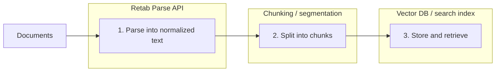

### Introduction

<Note>
  Parse is a first-class resource: `client.parses.create(...)` (Python) / `client.parses.create({...})` (Node) persist the result and make it retrievable via `client.parses.get(id)` and `client.parses.list()`.
</Note>

The `parses.create` method turns a document into normalized text content, returned both page-by-page and as one combined string. It is the right tool when you need readable document text for RAG pipelines, search indexing, prompting, debugging, or any workflow that works on free text rather than schema-constrained extraction.

Unlike `extract`, parse does not try to fit the document into a JSON schema. Instead, it returns a `Parse` resource with:

- `output.pages`: one parsed string per page
- `output.text`: the full document content as a single string
- `file`: basic file metadata (`id`, `filename`, `mime_type`)
- `usage`: page count and credits consumed
- `id`, `created_at`: resource identifier and creation timestamp

Table content can be rendered as `html`, `markdown`, `yaml`, or `json`, depending on what your downstream system expects.



For chunking, [chonkie](https://chonkie.ai/) is a good fit for RAG-style pipelines.

## Parse API

<ParamField body="ParseRequest" type="ParseRequest">
  <Expandable title="properties">

<ParamField body="document" type="MIMEData" required>
  The document to parse. The HTTP API accepts `MIMEData`. The SDK also accepts
  convenient local inputs such as file paths, file-like objects, images,
  buffers, and URLs, then converts them for you.
</ParamField>

<ParamField body="model" type="string" default="retab-small">
  The model used for parsing.
</ParamField>

<ParamField
  body="table_parsing_format"
  type='"markdown" | "yaml" | "html" | "json"'
  default="html"
>
  Controls how tables are represented in the parsed text.
</ParamField>

<ParamField body="instructions" type="string">
  Free-form instructions appended to the system prompt to steer the parse.
</ParamField>

  </Expandable>
</ParamField>

<ResponseField name="Returns" type="Parse">
  A persisted parse resource with text content and usage metadata.
  <Expandable title="properties">
    <ResponseField name="id" type="string">
      Unique parse identifier.
    </ResponseField>

    <ResponseField name="file" type="FileRef">
      Processed document metadata with `id`, `filename`, and `mime_type`.
    </ResponseField>

    <ResponseField name="model" type="string">
      The model that produced this parse.
    </ResponseField>

    <ResponseField name="table_parsing_format" type="string">
      Table rendering format used for this parse.
    </ResponseField>

    <ResponseField name="instructions" type="string | null">
      Free-form instructions supplied with the request.
    </ResponseField>

    <ResponseField name="output" type="ParseOutput">
      Nested parse output with `pages` (one string per page) and `text` (full document content as a single string).
    </ResponseField>

    <ResponseField name="usage" type="RetabUsage">
      Processing usage information including `page_count` and `credits`.
    </ResponseField>

    <ResponseField name="created_at" type="string">
      ISO 8601 creation timestamp.
    </ResponseField>

  </Expandable>
</ResponseField>

## Use Case: Preparing Documents For RAG

This pattern is useful when you want Retab to handle document parsing and your application to handle chunking and indexing.

<CodeGroup>
```python Python
from retab import Retab
from chonkie import SentenceChunker

client = Retab()

parse = client.parses.create(
    document="technical-manual.pdf",
    model="retab-small",
    table_parsing_format="markdown",
)

chunker = SentenceChunker(
    tokenizer="gpt2",
    chunk_size=512,
    chunk_overlap=128,
    min_sentences_per_chunk=1,
)

all_chunks = []
for page_num, page_text in enumerate(parse.output.pages, start=1):
    chunks = list(chunker(page_text))
    for chunk_idx, chunk in enumerate(chunks):
        all_chunks.append(
            {
                "page": page_num,
                "chunk_id": f"page_{page_num}_chunk_{chunk_idx}",
                "text": str(chunk),
                "document": parse.file.filename,
            }
        )

print(f"Created {len(all_chunks)} chunks ({parse.usage.credits if parse.usage else 0} credits used)")
```

```typescript TypeScript
import { Retab } from '@retab/node';

const client = new Retab({ apiKey: process.env.RETAB_API_KEY });

const parse = await client.parses.create('technical-manual.pdf', 'retab-small', 'markdown');

const allChunks = [];
parse.output.pages.forEach((pageText, index) => {
  const pageNum = index + 1;
  const sentences = pageText.split(/[.!?]+/).filter((s) => s.trim().length > 0);

  for (let i = 0; i < sentences.length; i += 3) {
    allChunks.push({
      page: pageNum,
      chunk_id: `page_${pageNum}_chunk_${Math.floor(i / 3)}`,
      text: sentences.slice(i, i + 3).join('. '),
      document: parse.file.filename,
    });
  }
});

console.log(`Created ${allChunks.length} chunks (${parse.usage?.credits ?? 0} credits used)`);
console.log(parse.output.text);
````

```go Go
package main

import (
	"context"
	"fmt"
	"log"
	"strings"

	retab "github.com/retab-dev/retab/clients/go"
)

func main() {
	ctx := context.Background()

	client, err := retab.NewClient("")
	if err != nil {
		log.Fatal(err)
	}

	model := "retab-small"
	tableFormat := retab.ParseRequestTableParsingFormatMarkdown
	parse, err := client.Parses.Create(ctx, &retab.ParsesCreateParams{
		Document:           "technical-manual.pdf",
		Model:              &model,
		TableParsingFormat: &tableFormat,
	})
	if err != nil {
		log.Fatal(err)
	}

	pages := parse.Output.Pages
	filename := parse.File.Filename

	type chunkData struct {
		Page     int    `json:"page"`
		ChunkID  string `json:"chunk_id"`
		Text     string `json:"text"`
		Document string `json:"document"`
	}

	var allChunks []chunkData
	for index, pageText := range pages {
		pageNum := index + 1
		sentences := strings.FieldsFunc(pageText, func(r rune) bool {
			return r == '.' || r == '!' || r == '?'
		})
		var trimmed []string
		for _, s := range sentences {
			s = strings.TrimSpace(s)
			if s != "" {
				trimmed = append(trimmed, s)
			}
		}
		for i := 0; i < len(trimmed); i += 3 {
			end := i + 3
			if end > len(trimmed) {
				end = len(trimmed)
			}
			allChunks = append(allChunks, chunkData{
				Page:     pageNum,
				ChunkID:  fmt.Sprintf("page_%d_chunk_%d", pageNum, i/3),
				Text:     strings.Join(trimmed[i:end], ". "),
				Document: filename,
			})
		}
	}

	fmt.Printf("Created %d chunks from %d pages\n", len(allChunks), len(pages))
	fmt.Println(parse.Output.Text)
}
```

```ruby Ruby
require 'retab'

client = Retab::Client.new(api_key: ENV['RETAB_API_KEY'])

parse = client.parses.create(
  document: 'technical-manual.pdf',
  model: 'retab-small',
  table_parsing_format: 'markdown',
)

all_chunks = []
parse.output.pages.each_with_index do |page_text, index|
  page_num = index + 1
  sentences = page_text.split(/[.!?]+/).map(&:strip).reject(&:empty?)
  sentences.each_slice(3).with_index do |window, chunk_idx|
    all_chunks << {
      page: page_num,
      chunk_id: "page_#{page_num}_chunk_#{chunk_idx}",
      text: window.join('. '),
      document: parse.file.filename,
    }
  end
end

puts "Created #{all_chunks.length} chunks from #{parse.output.pages.length} pages"
puts parse.output.text
```

```typescript TypeScript
import { Retab, type Parse } from "@retab/node";

interface ChunkData {
  page: number;
  chunk_id: string;
  text: string;
  document: string;
}

const client = new Retab({ apiKey: process.env.RETAB_API_KEY });

const parse: Parse = await client.parses.create("technical-manual.pdf", "retab-small", "markdown");

const allChunks: ChunkData[] = [];
parse.output.pages.forEach((pageText, index) => {
  const pageNum = index + 1;
  const sentences = pageText.split(/[.!?]+/).filter((s) => s.trim().length > 0);

  for (let i = 0; i < sentences.length; i += 3) {
    allChunks.push({
      page: pageNum,
      chunk_id: `page_${pageNum}_chunk_${Math.floor(i / 3)}`,
      text: sentences.slice(i, i + 3).join(". "),
      document: parse.file.filename,
    });
  }
});

console.log(
  `Created ${allChunks.length} chunks (${parse.usage?.credits ?? 0} credits used)`,
);
console.log(parse.output.text);
```

```php PHP
<?php
require 'vendor/autoload.php';

use Retab\Client;
use Retab\Resource\TableParsingFormat;

$client = new Client();

$parse = $client->parses()->create(
    document: 'technical-manual.pdf',
    model: 'retab-small',
    tableParsingFormat: TableParsingFormat::Markdown,
);

$allChunks = [];
foreach ($parse->output->pages as $index => $pageText) {
    $pageNum = $index + 1;
    $sentences = array_values(array_filter(
        array_map('trim', preg_split('/[.!?]+/', $pageText) ?: []),
        fn ($s) => $s !== '',
    ));

    for ($i = 0; $i < count($sentences); $i += 3) {
        $allChunks[] = [
            'page' => $pageNum,
            'chunk_id' => "page_{$pageNum}_chunk_" . intdiv($i, 3),
            'text' => implode('. ', array_slice($sentences, $i, 3)),
            'document' => $parse->file->filename,
        ];
    }
}

printf("Created %d chunks from %d pages\n", count($allChunks), $parse->usage?->credits ?? 0);
echo $parse->output->text . PHP_EOL;
```

```rust Rust
use retab::enums::ParseRequestTableParsingFormat;
use retab::resources::parses::CreateParams;
use retab::Retab;
use std::path::PathBuf;

#[derive(Debug)]
struct ChunkData {
    page: usize,
    chunk_id: String,
    text: String,
    document: String,
}

#[tokio::main]
async fn main() -> Result<(), Box<dyn std::error::Error>> {
    let client = Retab::new(std::env::var("RETAB_API_KEY")?);

    let mut params = CreateParams::new(PathBuf::from("technical-manual.pdf"));
    params.body.model = Some("retab-small".into());
    params.body.table_parsing_format = Some(ParseRequestTableParsingFormat::Markdown);

    let parse = client.parses().create(params).await?;

    let mut all_chunks: Vec<ChunkData> = Vec::new();
    for (index, page_text) in parse.output.pages.iter().enumerate() {
        let page_num = index + 1;
        let sentences: Vec<&str> = page_text
            .split(|c: char| c == '.' || c == '!' || c == '?')
            .map(str::trim)
            .filter(|s| !s.is_empty())
            .collect();

        for (chunk_idx, window) in sentences.chunks(3).enumerate() {
            all_chunks.push(ChunkData {
                page: page_num,
                chunk_id: format!("page_{page_num}_chunk_{chunk_idx}"),
                text: window.join(". "),
                document: parse.file.filename.clone(),
            });
        }
    }

    let credits = parse
        .usage
        .as_ref()
        .map(|u| u.credits)
        .unwrap_or_default();
    println!(
        "Created {} chunks from {} pages worth of content (credits: {})",
        all_chunks.len(),
        parse.output.pages.len(),
        credits
    );
    println!("{}", parse.output.text);
    Ok(())
}
```

```csharp C#
using System;
using System.Collections.Generic;
using System.IO;
using System.Linq;
using Retab;
using RetabClient = Retab.Retab;

var client = new RetabClient("YOUR_API_KEY");

var parse = await client.Parses.CreateAsync(
    new ParsesCreateOptions
    {
        Document = new FileInfo("technical-manual.pdf"),
        Model = "retab-small",
        TableParsingFormat = ParseRequestTableParsingFormat.Markdown,
    }
);

var allChunks = new List<Dictionary<string, object>>();
for (int index = 0; index < parse.Output.Pages.Count; index++)
{
    var pageText = parse.Output.Pages[index];
    var pageNum = index + 1;
    var sentences = pageText
        .Split(new[] { '.', '!', '?' }, StringSplitOptions.RemoveEmptyEntries)
        .Select(s => s.Trim())
        .Where(s => s.Length > 0)
        .ToList();

    for (int i = 0; i < sentences.Count; i += 3)
    {
        var slice = sentences.Skip(i).Take(3);
        allChunks.Add(new Dictionary<string, object>
        {
            ["page"] = pageNum,
            ["chunk_id"] = $"page_{pageNum}_chunk_{i / 3}",
            ["text"] = string.Join(". ", slice),
            ["document"] = parse.File.Filename,
        });
    }
}

Console.WriteLine($"Created {allChunks.Count} chunks from {parse.Output.Pages.Count} pages");
Console.WriteLine(parse.Output.Text);
```

```java Java
import com.retab.RetabClient;

public final class Example {
  public static void main(String[] args) throws Exception {
    RetabClient client = new RetabClient(System.getenv("RETAB_API_KEY"));

    var result = client.parses().create(null, "retab-1.5", null, "Extract the invoice fields", null, null);
    System.out.println(result);
  }
}
```

</CodeGroup>

## Best Practices

### When To Use Parse

- Use `parse` when your downstream system wants readable text.
- Use `extract` when you need typed fields that match a schema.

### Picking A Table Format

- Use `markdown` for chunking, prompting, and most RAG pipelines.
- Use `html` when preserving table structure matters more than readability.
- Use `json` or `yaml` when another parser will consume the table output directly.

### Indexing Advice

- Store the page number with every chunk you create from `parse.output.pages`.
- Keep the original `parse.file.id` or `parse.file.filename` alongside indexed text so retrieval results remain traceable.
