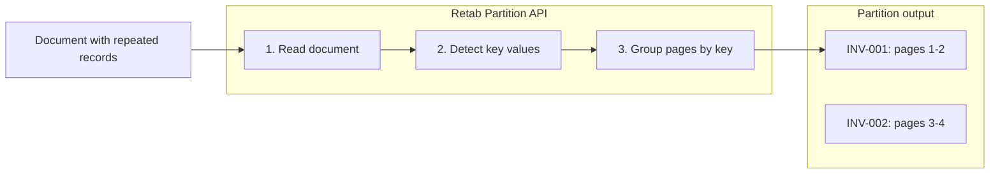

### Introduction

`partitions.create` groups a document into repeated chunks using a key such as `invoice_number`, `policy_id`, or `claim_number`.

This is a separate primitive from `split`.

- `split` answers: "What subdocument type is on these pages?"
- `partition` answers: "Which pages belong to each key value?"

Use `partition` when one document contains many records of the same conceptual type and you want one result per detected key.

Common use cases include:

1. **Invoice batches**: Group one PDF into one chunk per invoice number.
2. **Claim packets**: Group pages by claim ID inside a large insurance packet.
3. **Policy exports**: Break a carrier export into one chunk per policy number.
4. **Repeated forms**: Segment a homogeneous packet into one chunk per repeated identifier.



Key features of the Partition API:

- **Key-based grouping**: Separate repeated records by business identifier.
- **Canonical response**: Returns `output`, `consensus`, and `usage`.
- **Page-level mapping**: Each chunk includes the 1-indexed pages assigned to it.
- **Consensus support**: Increase `n_consensus` to inspect `consensus.likelihoods` and `consensus.choices`.
- **No stored resource**: The endpoint returns derived results directly.

## Partition API

<ParamField body="PartitionRequest" type="PartitionRequest">
  <Expandable title="properties">

<ParamField body="document" type="MIMEData" required>
  The document to partition. The HTTP API accepts `MIMEData`. The SDKs also accept convenient local inputs such as file paths, file-like objects, images, buffers, and URLs, then convert them for you.
</ParamField>

<ParamField body="key" type="string" required>
  The field or concept used to separate the document into chunks, such as `invoice_number`, `policy_id`, or `claim_number`.
</ParamField>

<ParamField body="instructions" type="string" required>
  Natural-language guidance describing how the document should be partitioned.
</ParamField>

<ParamField body="model" type="string" default="retab-small">
  The model used for partitioning.
</ParamField>

<ParamField body="n_consensus" type="integer" default="1">
  Number of partitioning runs to use for consensus voting.
</ParamField>

<ParamField body="bust_cache" type="boolean" default="false">
  When `true`, bypass the cache and force a fresh partition run.
</ParamField>

  </Expandable>
</ParamField>

<ResponseField name="Returns" type="PartitionResponse">
  A direct response containing grouped chunks.
  <Expandable title="properties">
    <ResponseField name="output" type="array[PartitionChunk]">
      One chunk per detected key value, each containing:
      - `key`: The detected partition key value
      - `pages`: The 1-indexed pages assigned to that chunk
    </ResponseField>
    <ResponseField name="consensus" type="PartitionConsensus">
      Present for all responses and populated when `n_consensus > 1`:
      - `likelihoods`: A tree aligned with `output`, with confidence for `key` and for each page leaf
      - `choices`: One entry per consensus run
    </ResponseField>
    <ResponseField name="usage" type="RetabUsage | null">
      Usage information for the partition operation.
    </ResponseField>
  </Expandable>
</ResponseField>

## Use Case: Partitioning an Invoice Batch

Use partitioning when every record is the same general document type, but each record has its own identifier and should become its own chunk.

<CodeGroup>
```python Python
from retab import Retab

client = Retab()

response = client.partitions.create(
    document="invoice_batch.pdf",
    key="invoice_number",
    instructions="Return one chunk per invoice number and keep all pages for the same invoice together.",
    model="retab-small",
    n_consensus=3,
)

for chunk in response.output:
    print(chunk.key, chunk.pages)

print(response.consensus.likelihoods)
```

```javascript JavaScript
import { Retab } from '@retab/node';

const client = new Retab();

const response = await client.partitions.create({
  document: "invoice_batch.pdf",
  key: "invoice_number",
  instructions: "Return one chunk per invoice number and keep all pages for the same invoice together.",
  model: "retab-small",
  n_consensus: 3,
});

for (const chunk of response.output) {
  console.log(chunk.key, chunk.pages);
}

console.log(response.consensus.likelihoods);
```
</CodeGroup>

## When to Use Partition vs Split

- Use `partitions.create` when every record is conceptually the same kind of document and you want one chunk per repeated key value.
- Use `splits.create` when you need to classify a document into different subdocument types such as `invoice`, `receipt`, and `contract`.
- Use `partitions.create` after `splits.create` when you first need to isolate a subdocument type and then group that subset by a key.

## Best Practices

- Make the `key` semantically precise: `invoice_number`, `claim_id`, `policy_number`.
- Write `instructions` as grouping guidance, not as extraction schema guidance.
- Use `partition` only when the packet is homogeneous or when you have already isolated the relevant subdocument pages.
- Raise `n_consensus` when key assignment quality is important enough to inspect disagreements.
