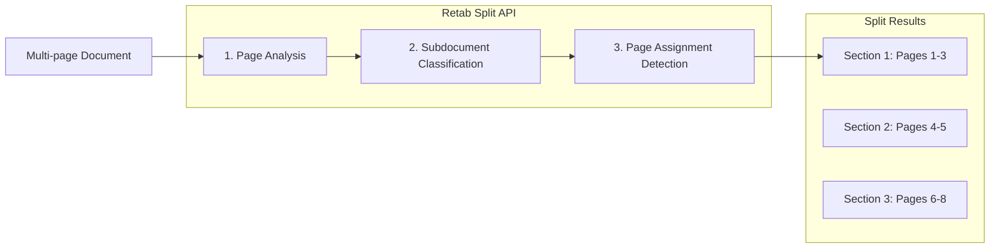

---

## title: Splitting

---

### Introduction

The `splits.create` method in Retab's document processing pipeline analyzes a multi-page document and classifies pages into user-defined subdocuments. Each result returns a `name` and the exact `pages` assigned to that subdocument. The same subdocument can appear multiple times in one response, which makes `split` useful for mixed batches, merged PDFs, and long documents with repeated sections.

Common use cases include:

1. **Document Separation**: Split a combined PDF containing multiple invoices, receipts, or contracts into individual sections
2. **Content Classification**: Identify and locate different sections within legal documents, reports, or manuals
3. **Batch Processing**: Process scanned document batches and organize them by document type
4. **Workflow Automation**: Route different document types to appropriate processing pipelines



Key features of the Split API:

- **Multi-Subdocument Support**: Define multiple subdocuments with descriptions for accurate classification
- **Discontinuous Sections**: Same subdocument can appear multiple times for non-contiguous content
- **Page-Level Precision**: Get the exact list of 1-indexed pages for each section
- **Vision-Based Analysis**: Uses LLM vision capabilities for accurate page classification
- **Flexible Subdocuments**: Define custom subdocuments tailored to your document types
- **Partition Detection**: Add a `partition_key` to break one subdocument into repeated items
- **Consensus Scoring**: Increase `n_consensus` to get `consensus.likelihoods` and per-run `consensus.choices`

## Split API

<ParamField body="SplitRequest" type="SplitRequest">
  <Expandable title="properties">

<ParamField body="document" type="MIMEData" required>
  The document to split. Can be a file path, bytes, or PIL.Image.Image object.
</ParamField>

<ParamField body="model" type="LLMModel" required>
  The AI model to use for document splitting. Recommended: `retab-small` for best balance of speed and accuracy.
</ParamField>

<ParamField body="subdocuments" type="array[Subdocument]" required>
  List of subdocuments to classify document sections into. Each subdocument has:
  - `name`: Unique identifier for the subdocument
  - `description`: Detailed description to help the model identify this subdocument
  - `partition_key` (optional): A key to further partition this subdocument. When specified, the API will identify individual items within pages belonging to this subdocument (e.g., "property ID" to find individual properties within a real estate document, or "invoice number" to separate multiple invoices)
  - `allow_multiple_instances` (optional, SDK-only): Set to `true` when this subdocument type can appear more than once in the document and you want each distinct instance detected separately (runs an additional vision-based refinement pass). Only usable via the SDK — it does not apply in the workflow UI, where each split handle emits a single output document.
</ParamField>

<ParamField body="instructions" type="string">
  Free-form instructions appended to the system prompt to steer the split.
</ParamField>

<ParamField body="n_consensus" type="integer">
  Number of split passes to run before building the final answer. Leave it at `1` for the fastest deterministic pass, or raise it when boundary quality is business-critical and you want `consensus.likelihoods` and `consensus.choices` in the response.
</ParamField>

</Expandable>
</ParamField>

<ResponseField name="Returns" type="Split Object">
A split result object containing the classified sections with their assigned pages.
  <Expandable title="properties">
    <ResponseField name="id" type="string">
      Unique identifier of the split record.
    </ResponseField>
    <ResponseField name="output" type="array[SplitResult]">
      List of document sections, each containing:
      - `name`: The subdocument name this section belongs to
      - `pages`: List of 1-indexed page numbers belonging to this section
      - `partitions`: List of repeated items detected inside this split (populated when `partition_key` is specified on the subdocument)
        - `key`: The partition key value (e.g., property ID, invoice number)
        - `pages`: List of page numbers in this partition
    </ResponseField>
    <ResponseField name="consensus" type="SplitConsensus | null">
      Present when `n_consensus > 1` and contains:
      - `likelihoods`: A likelihood tree that mirrors `output`, with scores for each split name, page leaf, partition key, and partition page leaf
      - `choices`: One entry per consensus run
    </ResponseField>
  </Expandable>
</ResponseField>

## Recommended Workflow

Define the subdocument list you want to detect, then pass it directly into `splits.create`.

<CodeGroup>
```python Python
from retab import Retab

client = Retab()

result = client.splits.create(
    document="property_portfolio.pdf",
    model="retab-small",
    subdocuments=[
        {"name": "property_listing", "description": "Property listing pages with photos, pricing, and listing details"},
        {"name": "legal_notice", "description": "Legal notices, disclaimers, or policy pages"},
    ],
    n_consensus=3,
)

for split in result.output:
    print(split.name, split.pages)
print(result.consensus.likelihoods if result.consensus else None)
```

```typescript TypeScript
import { Retab } from '@retab/node';

const client = new Retab();

const result = await client.splits.create({
  document: "property_portfolio.pdf",
  model: "retab-small",
  subdocuments: [
    { name: "property_listing", description: "Property listing pages with photos, pricing, and listing details" },
    { name: "legal_notice", description: "Legal notices, disclaimers, or policy pages" },
  ],
  n_consensus: 3,
});

for (const split of result.output) {
  console.log(split.name, split.pages);
}
console.log(result.consensus?.likelihoods);
```
</CodeGroup>

## Use Case: Processing Mixed Document Batches

Split a batch of scanned documents into individual invoices, receipts, and contracts for separate processing.

<CodeGroup>
```python Python
from retab import Retab

client = Retab()

# Define subdocuments for classification
subdocuments = [
    {"name": "invoice", "description": "Invoice documents with billing details, line items, totals, and payment terms"},
    {"name": "receipt", "description": "Payment receipts showing transaction confirmation and amounts paid"},
    {"name": "contract", "description": "Legal contracts with terms, conditions, and signature blocks"},
    {"name": "cover_letter", "description": "Cover letters or transmittal documents"},
]

# Split the document batch
result = client.splits.create(
    document="scanned_batch.pdf",
    model="retab-small",
    subdocuments=subdocuments
)

# Process each section
for split in result.output:
    print(f"{split.name}: pages {split.pages}")

    # Route to appropriate processing pipeline
    if split.name == "invoice":
        # Extract invoice data
        pass
    elif split.name == "contract":
        # Extract contract terms
        pass

# Example output:
# invoice: pages [1, 2, 3]
# receipt: pages [4]
# contract: pages [5, 6, 7, 8]
# invoice: pages [9, 10, 11]
```

```javascript Javascript
import { Retab } from '@retab/node';

const client = new Retab();

// Define subdocuments for classification
const subdocuments = [
    { name: "invoice", description: "Invoice documents with billing details, line items, totals, and payment terms" },
    { name: "receipt", description: "Payment receipts showing transaction confirmation and amounts paid" },
    { name: "contract", description: "Legal contracts with terms, conditions, and signature blocks" },
    { name: "cover_letter", description: "Cover letters or transmittal documents" },
];

// Split the document batch
const result = await client.splits.create({
    document: "scanned_batch.pdf",
    model: "retab-small",
    subdocuments: subdocuments
});

// Process each section
result.output.forEach(split => {
    console.log(`${split.name}: pages ${split.pages}`);

    // Route to appropriate processing pipeline
    if (split.name === "invoice") {
        // Extract invoice data
    } else if (split.name === "contract") {
        // Extract contract terms
    }
});
```

```typescript TypeScript
import { Retab, type SplitRequest, type Split, type Subdocument } from '@retab/node';

const client = new Retab();

// Define subdocuments for classification
const subdocuments: Subdocument[] = [
    { name: "invoice", description: "Invoice documents with billing details, line items, totals, and payment terms" },
    { name: "receipt", description: "Payment receipts showing transaction confirmation and amounts paid" },
    { name: "contract", description: "Legal contracts with terms, conditions, and signature blocks" },
    { name: "cover_letter", description: "Cover letters or transmittal documents" },
];

// Split the document batch
const splitRequest: SplitRequest = {
    document: "scanned_batch.pdf",
    model: "retab-small",
    subdocuments: subdocuments
};

const result: Split = await client.splits.create(splitRequest);

// Process each section
result.output.forEach(split => {
    console.log(`${split.name}: pages ${split.pages}`);

    // Route to appropriate processing pipeline
    if (split.name === "invoice") {
        // Extract invoice data
    } else if (split.name === "contract") {
        // Extract contract terms
    }
});
```
</CodeGroup>

## Use Case: Extracting Specific Sections from Reports

Identify and locate specific sections within a large report or manual.

<CodeGroup>
```python Python
from retab import Retab

client = Retab()

# Define report sections
subdocuments = [
    {"name": "executive_summary", "description": "Executive summary with key findings and recommendations"},
    {"name": "financial_data", "description": "Financial statements, tables, charts, and numerical analysis"},
    {"name": "appendix", "description": "Appendices with supporting documents, references, and supplementary materials"},
    {"name": "table_of_contents", "description": "Table of contents or index pages"},
]

result = client.splits.create(
    document="annual_report.pdf",
    model="retab-small",
    subdocuments=subdocuments
)

# Find specific sections
financial_sections = [s for s in result.output if s.name == "financial_data"]
for section in financial_sections:
    print(f"Financial data found on pages {section.pages}")
```

```javascript Javascript
import { Retab } from '@retab/node';

const client = new Retab();

// Define report sections
const subdocuments = [
    { name: "executive_summary", description: "Executive summary with key findings and recommendations" },
    { name: "financial_data", description: "Financial statements, tables, charts, and numerical analysis" },
    { name: "appendix", description: "Appendices with supporting documents, references, and supplementary materials" },
    { name: "table_of_contents", description: "Table of contents or index pages" },
];

const result = await client.splits.create({
    document: "annual_report.pdf",
    model: "retab-small",
    subdocuments: subdocuments
});

// Find specific sections
const financialSections = result.output.filter(s => s.name === "financial_data");
financialSections.forEach(section => {
    console.log(`Financial data found on pages ${section.pages}`);
});
```
</CodeGroup>

## Understanding Discontinuous Sections

The Split API correctly handles cases where the same subdocument appears multiple times in a document. This is common when documents are interleaved or when similar content appears in different parts of a document.

```python
# Example: A batch with interleaved invoices and receipts
result = client.splits.create(
    document="mixed_batch.pdf",
    model="retab-small",
    subdocuments=[
        {"name": "invoice", "description": "Invoice documents"},
        {"name": "receipt", "description": "Receipt documents"},
    ]
)

# The result correctly identifies non-contiguous sections:
# invoice: pages [1, 2, 3]
# receipt: pages [4, 5]
# invoice: pages [6, 7, 8]  <- Same subdocument, different location
# receipt: pages [9, 10]

for split in result.output:
    print(f"{split.name}: pages {split.pages}")
```

## Use Case: Partitioning by Key

When processing documents that contain multiple items of the same type (e.g., multiple invoices, multiple property listings), use the `partition_key` parameter to identify and separate individual items within a subdocument.

<CodeGroup>
```python Python
from retab import Retab

client = Retab()

# Define subdocuments with partition_key for sub-document splitting
subdocuments = [
    {
        "name": "property_listing",
        "description": "Real estate property listings with details and photos",
        "partition_key": "property ID"  # Will identify individual properties
    },
    {
        "name": "legal_notices",
        "description": "Legal disclaimers and general information"
    },
]

result = client.splits.create(
    document="property_portfolio.pdf",
    model="retab-small",
    subdocuments=subdocuments
)

# Access partitions for each subdocument
for split in result.output:
    print(f"{split.name}: pages {split.pages}")
    for partition in split.partitions:
        print(f"  Property {partition.key}: pages {partition.pages}")

# Example output:
# property_listing: pages [1, 2, 3, 4, 5, 6]
#   Property PROP-001: pages [1, 2]
#   Property PROP-002: pages [3, 4]
#   Property PROP-003: pages [5, 6]
# legal_notices: pages [7]
```

```javascript Javascript
import { Retab } from '@retab/node';

const client = new Retab();

// Define subdocuments with partition_key for sub-document splitting
const subdocuments = [
    {
        name: "property_listing",
        description: "Real estate property listings with details and photos",
        partition_key: "property ID"  // Will identify individual properties
    },
    {
        name: "legal_notices",
        description: "Legal disclaimers and general information"
    },
];

const result = await client.splits.create({
    document: "property_portfolio.pdf",
    model: "retab-small",
    subdocuments: subdocuments
});

// Access partitions for each subdocument
result.output.forEach(split => {
    console.log(`${split.name}: pages ${split.pages}`);
    split.partitions.forEach(partition => {
        console.log(`  Property ${partition.key}: pages ${partition.pages}`);
    });
});
```
</CodeGroup>

## Sub-Page Precision with Partitions

The Split API provides sub-page level precision through the `partitions` field. Each partition includes Y-coordinates that specify exactly where content starts and ends within pages, enabling precise extraction even when document sections don't align with page boundaries.

```python
from retab import Retab

client = Retab()

result = client.splits.create(
    document="multi_invoice_page.pdf",
    model="retab-small",
    subdocuments=[
        {
            "name": "invoice",
            "description": "Invoice documents with billing details",
            "partition_key": "invoice number"
        },
    ]
)

# Access partition details and consensus metadata
for split in result.output:
    print(f"{split.name}: pages {split.pages}")
    for partition in split.partitions:
        print(f"  Invoice {partition.key}:")
        print(f"    Pages: {partition.pages}")
if result.consensus:
    print(result.consensus.likelihoods)

# Example output:
# invoice: pages [1, 2]
#   Invoice INV-001:
#     Pages: [1]
#   Invoice INV-002:
#     Pages: [1, 2]
#   Invoice INV-003:
#     Pages: [2]
# [{'name': 0.97, 'pages': [1.0, 0.96], 'partitions': [{'key': 0.99, 'pages': [1.0]}, {'key': 0.95, 'pages': [0.95, 0.95]}, {'key': 0.92, 'pages': [0.92]}]}]
```

## Best Practices

### Subdocument Definition
- **Be Specific**: Provide detailed descriptions that distinguish subdocuments clearly
- **Use Visual Cues**: Mention distinctive visual elements (logos, headers, layouts)
- **Include Examples**: Reference typical content found in each subdocument
- **Avoid Overlap**: Ensure subdocuments are mutually exclusive when possible

### Model Selection
- **`retab-large`**: Best balance of speed and accuracy for most use cases
- **`retab-small`**: Higher accuracy for complex or ambiguous documents
- **`retab-micro`**: Alternative for specific document types

### Performance Tips
- **Batch Similar Documents**: Group similar document types for consistent results
- **Limit Subdocuments**: Use 3-7 well-defined subdocuments for best accuracy
- **Test Descriptions**: Iterate on subdocument descriptions to improve classification
