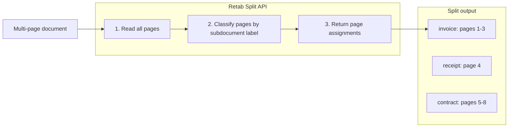

### Introduction

`splits.create` assigns pages in a multi-page document to named subdocuments. Each result contains only:

- `name`
- `pages`

That is the full mental model for split. It is a document-labeling primitive, not a key-based grouping primitive.

Use `split` when one file contains different document types, sections, or repeated subdocument instances and you want to know which pages belong to each one.

Common use cases include:

1. **Mixed document batches**: Separate invoices, receipts, contracts, and cover letters from one uploaded PDF.
2. **Report section detection**: Find the executive summary, appendix, or financial section inside a long report.
3. **Repeated instances**: Detect repeated occurrences of the same subdocument type with `allow_multiple_instances=True`.
4. **Workflow routing**: Route each detected subdocument type into its own downstream extraction or review branch.



Key features of the Split API:

- **Named subdocuments**: Define the labels you care about with natural-language descriptions.
- **Page-level output**: Results are explicit 1-indexed page arrays.
- **Repeated instances**: The same `name` can appear multiple times in `output`.
- **Consensus support**: Increase `n_consensus` to get `consensus.likelihoods` and `consensus.choices`.
- **Pure split primitive**: Key-based grouping is handled by `partitions.create`, not by `split`.

## Split API

<ParamField body="SplitRequest" type="SplitRequest">
  <Expandable title="properties">

<ParamField body="document" type="MIMEData" required>
  The document to split. The HTTP API accepts `MIMEData`. The SDKs also accept
  convenient local inputs such as file paths, file-like objects, images,
  buffers, and URLs, then convert them for you.
</ParamField>

<ParamField body="model" type="LLMModel" required>
  The model to use for document splitting. Recommended default: `retab-small`.
</ParamField>

<ParamField body="subdocuments" type="array[Subdocument]" required>
  List of subdocuments to classify the document into. Each subdocument has: -
  `name`: Unique identifier for the subdocument - `description`: Detailed
  description to help the model identify this subdocument - `partition_key`
  (optional): Key used to partition repeated instances inside this subdocument -
  `allow_overlap` (optional, default `true`): Set to `false` when partition
  chunks for this subdocument must be exclusive - `allow_multiple_instances`
  (optional): Set to `true` when this subdocument type can appear more than once
  in the document and you want each distinct instance detected separately
</ParamField>

<ParamField body="instructions" type="string">
  Free-form instructions appended to the system prompt to steer the split.
</ParamField>

<ParamField body="n_consensus" type="integer">
  Number of split passes to run before building the final answer. Leave it at
  `1` for the fastest deterministic pass, or raise it when boundary quality is
  business-critical and you want `consensus.likelihoods` and
  `consensus.choices`.
</ParamField>

</Expandable>
</ParamField>

<ResponseField name="Returns" type="Split">
  A persisted split resource containing the page assignments.
  <Expandable title="properties">
    <ResponseField name="id" type="string">
      Unique identifier of the split record.
    </ResponseField>
    <ResponseField name="output" type="array[SplitResult]">
      List of split results, each containing: - `name`: The subdocument label -
      `pages`: List of 1-indexed page numbers assigned to that split
    </ResponseField>
    <ResponseField name="consensus" type="SplitConsensus | null">
      Present when `n_consensus > 1` and contains: - `likelihoods`: A tree
      aligned with `output`, with confidence for `name` and for each page leaf -
      `choices`: One entry per consensus run
    </ResponseField>
  </Expandable>
</ResponseField>

## Recommended Workflow

Define the subdocument labels you want to detect, then pass them directly into `splits.create`.

<CodeGroup>
```python Python
from retab import Retab

client = Retab()

result = client.splits.create(
    document="property_portfolio.pdf",
    model="retab-small",
    subdocuments=[
        {
            "name": "property_listing",
            "description": "Property listing pages with photos, pricing, and listing details",
            "allow_multiple_instances": True,
        },
        {
            "name": "legal_notice",
            "description": "Legal notices, disclaimers, or policy pages",
        },
    ],
    n_consensus=3,
)

for split in result.output:
    print(split.name, split.pages)

print(result.consensus.likelihoods if result.consensus else None)

````

```typescript TypeScript
import { Retab } from '@retab/node';

const client = new Retab({ apiKey: process.env.RETAB_API_KEY });

const result = await client.splits.create("property_portfolio.pdf", [
    {
      name: "property_listing",
      description: "Property listing pages with photos, pricing, and listing details",
      allowMultipleInstances: true,
    },
    {
      name: "legal_notice",
      description: "Legal notices, disclaimers, or policy pages",
    },
  ], "retab-small", undefined, 3);

for (const split of result.output) {
  console.log(split.name, split.pages);
}

console.log(result.consensus?.likelihoods);
````

```go Go
package main

import (
	"context"
	"fmt"
	"log"

	retab "github.com/retab-dev/retab/clients/go"
)

func main() {
	ctx := context.Background()

	client, err := retab.NewClient("")
	if err != nil {
		log.Fatal(err)
	}

	result, err := client.Splits.Create(ctx, retab.SplitCreateRequest{
		Document: "property_portfolio.pdf",
		Model:    "retab-small",
		Subdocuments: []retab.SplitSubdocument{
			{
				Name:                   "property_listing",
				Description:            "Property listing pages with photos, pricing, and listing details",
				AllowMultipleInstances: true,
			},
			{
				Name:        "legal_notice",
				Description: "Legal notices, disclaimers, or policy pages",
			},
		},
		NConsensus: 3,
	})
	if err != nil {
		log.Fatal(err)
	}

	output, _ := (*result)["output"].([]any)
	for _, raw := range output {
		split, _ := raw.(map[string]any)
		fmt.Println(split["name"], split["pages"])
	}

	if consensus, ok := (*result)["consensus"].(map[string]any); ok {
		fmt.Println(consensus["likelihoods"])
	}
}
```

```ruby Ruby
require 'retab'

client = Retab::Client.new(api_key: ENV['RETAB_API_KEY'])

result = client.splits.create(
  document: 'property_portfolio.pdf',
  model: 'retab-small',
  subdocuments: [
    {
      name: 'property_listing',
      description: 'Property listing pages with photos, pricing, and listing details',
      allow_multiple_instances: true,
    },
    {
      name: 'legal_notice',
      description: 'Legal notices, disclaimers, or policy pages',
    },
  ],
  n_consensus: 3,
)

result.output.each do |split|
  puts "#{split.name} #{split.pages}"
end

puts result.consensus&.likelihoods
```

```php PHP
<?php
require 'vendor/autoload.php';

use Retab\Client;
use Retab\Resource\Subdocument;

$client = new Client();

$result = $client->splits()->create(
    document: 'property_portfolio.pdf',
    subdocuments: [
        new Subdocument(
            name: 'property_listing',
            description: 'Property listing pages with photos, pricing, and listing details',
            allowMultipleInstances: true,
        ),
        new Subdocument(
            name: 'legal_notice',
            description: 'Legal notices, disclaimers, or policy pages',
        ),
    ],
    model: 'retab-small',
    nConsensus: 3,
);

foreach ($result->output as $split) {
    echo $split->name . ': ' . implode(', ', $split->pages) . PHP_EOL;
}

print_r($result->consensus?->likelihoods);
```

```rust Rust
use retab::models::Subdocument;
use retab::resources::splits::CreateParams;
use retab::Retab;
use std::path::PathBuf;

#[tokio::main]
async fn main() -> Result<(), Box<dyn std::error::Error>> {
    let client = Retab::new(std::env::var("RETAB_API_KEY")?);

    let subdocuments = vec![
        Subdocument {
            name: "property_listing".into(),
            description: Some(
                "Property listing pages with photos, pricing, and listing details".into(),
            ),
            allow_multiple_instances: Some(true),
        },
        Subdocument {
            name: "legal_notice".into(),
            description: Some("Legal notices, disclaimers, or policy pages".into()),
            allow_multiple_instances: None,
        },
    ];

    let mut params = CreateParams::new(PathBuf::from("property_portfolio.pdf"), subdocuments);
    params.body.model = Some("retab-small".into());
    params.body.n_consensus = Some(3);

    let result = client.splits().create(params).await?;

    for split in &result.output {
        println!("{} {:?}", split.name, split.pages);
    }

    if let Some(consensus) = &result.consensus {
        println!("{:?}", consensus.likelihoods);
    }
    Ok(())
}
```

```csharp C#
using System;
using System.Collections.Generic;
using System.IO;
using Retab;

var client = new Retab("YOUR_API_KEY");

var result = await client.Splits.CreateAsync(
    client.ApiKey,
    new SplitsCreateOptions
    {
        Document = new FileInfo("property_portfolio.pdf"),
        Model = "retab-small",
        Subdocuments = new List<Subdocument>
        {
            new Subdocument
            {
                Name = "property_listing",
                Description = "Property listing pages with photos, pricing, and listing details",
                AllowMultipleInstances = true,
            },
            new Subdocument
            {
                Name = "legal_notice",
                Description = "Legal notices, disclaimers, or policy pages",
            },
        },
        NConsensus = 3,
    }
);

foreach (var split in result.Output)
{
    Console.WriteLine($"{split.Name}: pages {string.Join(",", split.Pages)}");
}

if (result.Consensus?.Likelihoods != null)
{
    Console.WriteLine(result.Consensus.Likelihoods);
}
```

</CodeGroup>

## Use Case: Processing Mixed Document Batches

Split a batch of scanned documents into invoices, receipts, and contracts for separate downstream handling.

<CodeGroup>
```python Python
from retab import Retab

client = Retab()

subdocuments = [
    {"name": "invoice", "description": "Invoice documents with billing details, line items, totals, and payment terms"},
    {"name": "receipt", "description": "Payment receipts showing transaction confirmation and amounts paid"},
    {"name": "contract", "description": "Legal contracts with terms, conditions, and signature blocks"},
    {"name": "cover_letter", "description": "Cover letters or transmittal documents"},
]

result = client.splits.create(
    document="scanned_batch.pdf",
    model="retab-small",
    subdocuments=subdocuments,
)

for split in result.output:
    print(f"{split.name}: pages {split.pages}")

````

```typescript TypeScript
import { Retab } from '@retab/node';

const client = new Retab({ apiKey: process.env.RETAB_API_KEY });

const result = await client.splits.create("scanned_batch.pdf", [
    { name: "invoice", description: "Invoice documents with billing details, line items, totals, and payment terms" },
    { name: "receipt", description: "Payment receipts showing transaction confirmation and amounts paid" },
    { name: "contract", description: "Legal contracts with terms, conditions, and signature blocks" },
    { name: "cover_letter", description: "Cover letters or transmittal documents" },
  ], "retab-small");

result.output.forEach((split) => {
  console.log(`${split.name}: pages ${split.pages}`);
});
````

```go Go
package main

import (
	"context"
	"fmt"
	"log"

	retab "github.com/retab-dev/retab/clients/go"
)

func main() {
	ctx := context.Background()

	client, err := retab.NewClient("")
	if err != nil {
		log.Fatal(err)
	}

	subdocuments := []retab.SplitSubdocument{
		{Name: "invoice", Description: "Invoice documents with billing details, line items, totals, and payment terms"},
		{Name: "receipt", Description: "Payment receipts showing transaction confirmation and amounts paid"},
		{Name: "contract", Description: "Legal contracts with terms, conditions, and signature blocks"},
		{Name: "cover_letter", Description: "Cover letters or transmittal documents"},
	}

	result, err := client.Splits.Create(ctx, retab.SplitCreateRequest{
		Document:     "scanned_batch.pdf",
		Model:        "retab-small",
		Subdocuments: subdocuments,
	})
	if err != nil {
		log.Fatal(err)
	}

	output, _ := (*result)["output"].([]any)
	for _, raw := range output {
		split, _ := raw.(map[string]any)
		fmt.Printf("%v: pages %v\n", split["name"], split["pages"])
	}
}
```

```ruby Ruby
require 'retab'

client = Retab::Client.new(api_key: ENV['RETAB_API_KEY'])

subdocuments = [
  { name: 'invoice', description: 'Invoice documents with billing details, line items, totals, and payment terms' },
  { name: 'receipt', description: 'Payment receipts showing transaction confirmation and amounts paid' },
  { name: 'contract', description: 'Legal contracts with terms, conditions, and signature blocks' },
  { name: 'cover_letter', description: 'Cover letters or transmittal documents' },
]

result = client.splits.create(
  document: 'scanned_batch.pdf',
  model: 'retab-small',
  subdocuments: subdocuments,
)

result.output.each do |split|
  puts "#{split.name}: pages #{split.pages}"
end
```

```php PHP
<?php
require 'vendor/autoload.php';

use Retab\Client;
use Retab\Resource\Subdocument;

$client = new Client();

$subdocuments = [
    new Subdocument(name: 'invoice', description: 'Invoice documents with billing details, line items, totals, and payment terms'),
    new Subdocument(name: 'receipt', description: 'Payment receipts showing transaction confirmation and amounts paid'),
    new Subdocument(name: 'contract', description: 'Legal contracts with terms, conditions, and signature blocks'),
    new Subdocument(name: 'cover_letter', description: 'Cover letters or transmittal documents'),
];

$result = $client->splits()->create(
    document: 'scanned_batch.pdf',
    subdocuments: $subdocuments,
    model: 'retab-small',
);

foreach ($result->output as $split) {
    echo "{$split->name}: pages " . implode(', ', $split->pages) . PHP_EOL;
}
```

```rust Rust
use retab::models::Subdocument;
use retab::resources::splits::CreateParams;
use retab::Retab;
use std::path::PathBuf;

#[tokio::main]
async fn main() -> Result<(), Box<dyn std::error::Error>> {
    let client = Retab::new(std::env::var("RETAB_API_KEY")?);

    let subdocuments = vec![
        Subdocument {
            name: "invoice".into(),
            description: Some(
                "Invoice documents with billing details, line items, totals, and payment terms".into(),
            ),
            allow_multiple_instances: None,
        },
        Subdocument {
            name: "receipt".into(),
            description: Some(
                "Payment receipts showing transaction confirmation and amounts paid".into(),
            ),
            allow_multiple_instances: None,
        },
        Subdocument {
            name: "contract".into(),
            description: Some(
                "Legal contracts with terms, conditions, and signature blocks".into(),
            ),
            allow_multiple_instances: None,
        },
        Subdocument {
            name: "cover_letter".into(),
            description: Some("Cover letters or transmittal documents".into()),
            allow_multiple_instances: None,
        },
    ];

    let mut params = CreateParams::new(PathBuf::from("scanned_batch.pdf"), subdocuments);
    params.body.model = Some("retab-small".into());

    let result = client.splits().create(params).await?;

    for split in &result.output {
        println!("{}: pages {:?}", split.name, split.pages);
    }
    Ok(())
}
```

```csharp C#
using System;
using System.Collections.Generic;
using System.IO;
using Retab;

var client = new Retab("YOUR_API_KEY");

var subdocuments = new List<Subdocument>
{
    new Subdocument { Name = "invoice",      Description = "Invoice documents with billing details, line items, totals, and payment terms" },
    new Subdocument { Name = "receipt",      Description = "Payment receipts showing transaction confirmation and amounts paid" },
    new Subdocument { Name = "contract",     Description = "Legal contracts with terms, conditions, and signature blocks" },
    new Subdocument { Name = "cover_letter", Description = "Cover letters or transmittal documents" },
};

var result = await client.Splits.CreateAsync(
    client.ApiKey,
    new SplitsCreateOptions
    {
        Document = new FileInfo("scanned_batch.pdf"),
        Model = "retab-small",
        Subdocuments = subdocuments,
    }
);

foreach (var split in result.Output)
{
    Console.WriteLine($"{split.Name}: pages {string.Join(",", split.Pages)}");
}
```

</CodeGroup>

## Understanding Repeated Instances

The same subdocument can appear more than once in a response. This is useful for interleaved packets or repeated document types inside one file.

```python
result = client.splits.create(
    document="mixed_batch.pdf",
    model="retab-small",
    subdocuments=[
        {
            "name": "invoice",
            "description": "Invoice documents",
            "allow_multiple_instances": True,
        },
        {
            "name": "receipt",
            "description": "Receipt documents",
            "allow_multiple_instances": True,
        },
    ],
)

for split in result.output:
    print(f"{split.name}: pages {split.pages}")

# Example output:
# invoice: pages [1, 2, 3]
# receipt: pages [4, 5]
# invoice: pages [6, 7, 8]
# receipt: pages [9, 10]
```

## Split vs Partition

Use `split` when the question is:

- "What kind of subdocument is on these pages?"
- "Where are the invoices, receipts, and contracts in this file?"

Use `partition` when the question is:

- "Which pages belong to invoice INV-001 versus INV-002?"
- "Group this homogeneous packet by claim ID / policy number / invoice number."

Example:

- `split`: classify a mixed packet into `invoice`, `receipt`, `contract`
- `partition`: group an invoice-only batch into one chunk per `invoice_number`

If you need both:

1. Run `split` first to isolate the relevant subdocument type.
2. Run `partitions.create` on that subdocument’s pages.

## Best Practices

### Subdocument Definitions

- **Be specific**: Write descriptions that distinguish labels clearly.
- **Use visual cues**: Mention headers, logos, tables, signatures, or layouts.
- **Avoid overlap**: Overlapping labels reduce routing accuracy.
- **Prefer 3-7 labels**: Too many similar labels usually hurts quality.

### Model Selection

- **`retab-small`**: Good default for most split tasks
- **Raise `n_consensus`** when boundary accuracy matters more than latency

### Pipeline Design

- Use `split` before `extract` when a bundle must be separated first.
- Use `partition` only for key-based grouping, not as a subdocument definition feature.
