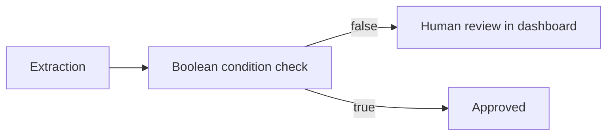

An **extraction** can request a human review when a boolean condition you define evaluates to the desired trigger state (typically false). This lets you route edge cases to a reviewer directly in the dashboard — without Automations.

## Introduction

Retab can flag extractions that need a second look based on conditions you control. Add any boolean in your schema (or computed during inference) and connect it to the human-in-the-loop criteria. When the condition triggers:

- **requires_human_review**: true in the projects/extract response (field on the completion object)
- **human_review_flag**: "pending" in the stored extraction and in the dashboard

## Define a condition in your schema

You can designate any boolean field as a human-in-the-loop trigger. For example, define a field like `is_document_an_invoice` and instruct the model to act as a judge for this condition during inference. If the condition evaluates to the trigger state (e.g., false), the extraction is flagged for review.

### Example condition

- **Field**: `is_document_an_invoice: boolean`
- **Trigger**: When `is_document_an_invoice` is false
- **Outcome**: The extraction requires human review and appears in the dashboard with a pending status

## API response (projects/extract)

When you call `POST /v1/projects/extract/{project_id}` (or `client.projects.extract` in the SDK), the response is a `RetabParsedChatCompletion`. Use `requires_human_review` to know if a human review is needed.

```json (6)
{
  "id": "cmpl_...",
  "object": "chat.completion",
  "model": "auto-small",
  "choices": [
    {
      "index": 0,
      "message": {
        "parsed": { /* your fields, including is_document_an_invoice */ }
      }
    }
  ],
  "requires_human_review": true
}
```

The dashboard tracks review state via `human_review_flag` on the stored extraction.

## Review in the dashboard

- **Where**: Project → Monitor -> Files -> Requires review
- **Filter**: Use the "Requires review" filter (internally `human_review_flag = "pending"`).
- **Actions**:
  - Inspect the parsed output and the document
  - Make corrections to the extracted object as needed
  - Mark the extraction as reviewed

Once reviewed, the extraction moves to `human_review_flag = "reviewed"` and is removed from the pending queue.

That's it — use boolean conditions to route edge cases to reviewers and keep your pipeline robust.
