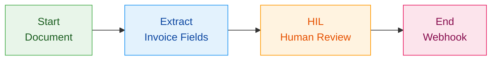
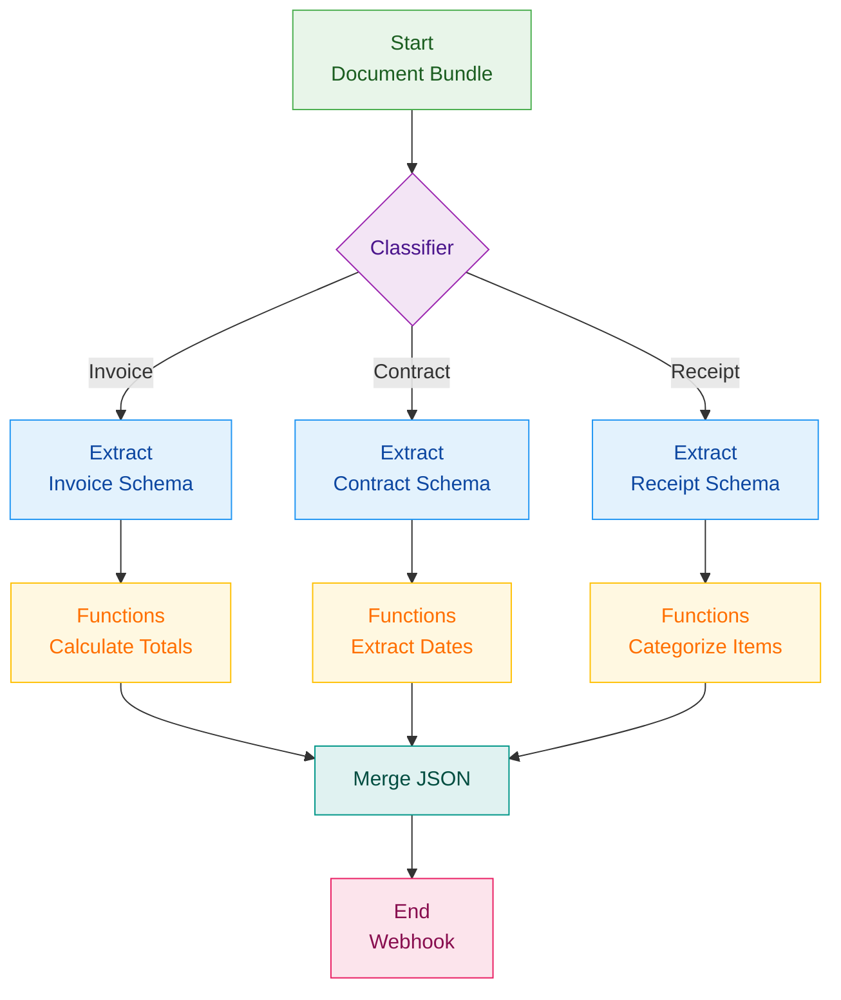

## What are Workflows?

Workflows are visual, node-based pipelines that let you chain together multiple document processing operations. Instead of writing code for each step, you can drag and drop nodes onto a canvas, connect them, and create powerful document automation flows.

A workflow typically consists of:
- **Input nodes** - Entry points for data:
  - **Document** - Upload files (PDF, images, Word, Excel)
  - **JSON Input** - Pass structured JSON data
  - **Text Input** - Pass plain text strings
- **Processing nodes** - Operations like Extract, Parse, Split, Classifier
- **Logic nodes** - Conditional flows like Human-in-the-Loop, Functions, If/Else routing, and API Call
- **Output nodes** (Webhook) - Destinations for your processed data


## Creating a Workflow

1. Navigate to the **Workflows** section in your dashboard
2. Click **Create Workflow** to open a new canvas
3. Drag nodes from the sidebar onto the canvas
4. Connect nodes by dragging from output handles to input handles
5. Configure each node by clicking on it
6. Your workflow auto-saves as you build

## Connecting Nodes

Nodes communicate through **handles** that define the type of data they accept or produce:

| Handle Type | Icon | Description |
|-------------|------|-------------|
| **File** | 📎 | Document files (PDF, images, Word, Excel) |
| **JSON** | `{ }` | Structured data extracted from documents |
| **Text** | 📄 | Plain text or instruction strings |

### Connection Rules

- **File → File**: Pass documents between processing nodes
- **JSON → JSON**: Pass extracted data between logic nodes
- **JSON → Text**: JSON data can connect to text inputs (e.g., for template instructions)
- Each input handle accepts only **one connection**
- Connections validate automatically to prevent incompatible links

## Edit Mode vs Run Mode

Workflows have two operational modes:

### Edit Mode
- Add, remove, and configure nodes
- Create and delete connections
- Rename the workflow
- View generated Python code

### Run Mode
- Upload documents to input nodes
- Execute the workflow step-by-step
- View results at each stage
- Download processed files and extracted data

Toggle between modes using the switch at the top of the canvas.

## Running a Workflow

### From the Dashboard

1. Switch to **Run Mode**
2. Upload a document to each **Document** input node
3. Click **Run Workflow**
4. Watch as each node processes (status indicators show progress)
5. Click on output handles to view results

### Using the SDK

Workflows support three types of inputs:
- **documents**: For Document (start) nodes - file inputs
- **json_inputs**: For JSON Input (start_json) nodes - structured data
- **text_inputs**: For Text Input (start_text) nodes - plain text

<CodeGroup>
```python Python
from retab import Retab
from pathlib import Path

client = Retab()

# Run a workflow with documents only
run = client.workflows.runs.create(
    workflow_id="wf_abc123",
    documents={
        "document-node-id": Path("path/to/invoice.pdf")
    }
)

# Run a workflow with documents and JSON data
run = client.workflows.runs.create(
    workflow_id="wf_abc123",
    documents={
        "document-node-id": Path("path/to/invoice.pdf")
    },
    json_inputs={
        "json-node-id": {"customer_id": "cust_123", "priority": "high"}
    }
)

# Run a workflow with all input types
run = client.workflows.runs.create(
    workflow_id="wf_abc123",
    documents={
        "document-node-id": Path("path/to/invoice.pdf")
    },
    json_inputs={
        "json-node-id": {"customer_id": "cust_123"}
    },
    text_inputs={
        "text-node-id": "Process with high priority"
    }
)

# Poll for completion
import time
while run.status in ["pending", "running"]:
    time.sleep(1)
    run = client.workflows.runs.get(run.id)

# Access the results
for step in run.steps:
    print(f"{step.node_id}: {step.status}")
    if step.output:
        print(f"  Output: {step.output}")
```

```typescript Node.js
import Retab from 'retab';

const client = new Retab();

// Run a workflow with documents only
const run = await client.workflows.runs.create({
    workflowId: 'wf_abc123',
    documents: {
        'document-node-id': 'path/to/invoice.pdf'
    }
});

// Run a workflow with documents and JSON data
const run2 = await client.workflows.runs.create({
    workflowId: 'wf_abc123',
    documents: {
        'document-node-id': 'path/to/invoice.pdf'
    },
    jsonInputs: {
        'json-node-id': { customerId: 'cust_123', priority: 'high' }
    }
});

// Run a workflow with all input types
const run3 = await client.workflows.runs.create({
    workflowId: 'wf_abc123',
    documents: {
        'document-node-id': 'path/to/invoice.pdf'
    },
    jsonInputs: {
        'json-node-id': { customerId: 'cust_123' }
    },
    textInputs: {
        'text-node-id': 'Process with high priority'
    }
});

// Poll for completion
let currentRun = run;
while (currentRun.status === 'pending' || currentRun.status === 'running') {
    await new Promise(resolve => setTimeout(resolve, 1000));
    currentRun = await client.workflows.runs.get(currentRun.id);
}

// Access the results
for (const step of currentRun.steps) {
    console.log(`${step.node_id}: ${step.status}`);
    if (step.output) {
        console.log(`  Output: ${JSON.stringify(step.output)}`);
    }
}
```
</CodeGroup>

## Workflow Execution Order

Workflows execute in **topological order** based on the node connections:

1. Start from Document input nodes
2. Process each node once all its inputs are ready
3. Continue until all nodes are processed or an error occurs
4. Send results to any Webhook output nodes

If a node fails, execution stops and the error is displayed on that node.

### Conditional Routing

When using **Classifier** or **If/Else** nodes, only the branches that receive data are executed. Nodes on skipped branches are marked as "skipped" rather than failed.

## Viewing Generated Code

Every workflow can be exported as Python code. Click **View Code** in the sidebar to see the equivalent SDK calls for your workflow. This is useful for:

- Integrating workflows into your existing codebase
- Running workflows in production environments
- Understanding how the visual nodes translate to API calls

## Best Practices

<AccordionGroup>
  <Accordion title="Start simple">
    Begin with a single Extract or Parse node, then gradually add complexity. Test each addition before moving on.
  </Accordion>
  
  <Accordion title="Use descriptive labels">
    Rename nodes to describe their purpose (e.g., "Invoice Data" instead of "Extract 1"). This makes complex workflows easier to understand.
  </Accordion>
  
  <Accordion title="Add notes for documentation">
    Use Note nodes to document sections of your workflow. They don't affect execution but help explain the logic.
  </Accordion>
  
  <Accordion title="Validate with Human-in-the-Loop">
    For critical data, add a HIL node after extraction. This ensures a human reviews low-likelihood results before they proceed.
  </Accordion>
  
  <Accordion title="Use Classifier for document routing">
    When processing different document types, use a Classifier node to route each document to the appropriate extraction schema.
  </Accordion>
  
  <Accordion title="Test with sample documents">
    Before deploying, run your workflow with representative sample documents to catch edge cases.
  </Accordion>
</AccordionGroup>

## Example: Invoice Processing Workflow

Here's a common workflow pattern for processing invoices:



1. **Start** node accepts the invoice PDF
2. **Extract** node pulls out vendor, amount, date, line items
3. **HIL** node flags low-likelihood extractions for human review
4. **End** node sends verified data to your webhook

## Example: Multi-Document Classification Workflow

For workflows that process mixed document bundles:



1. **Classifier** routes documents by category (Invoice, Contract, Receipt)
2. Each **Extract** node uses a document-specific schema
3. **Functions** nodes compute derived fields for each document type
4. **Merge JSON** combines results from all branches into a single output
