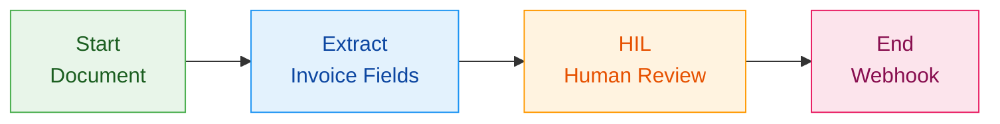
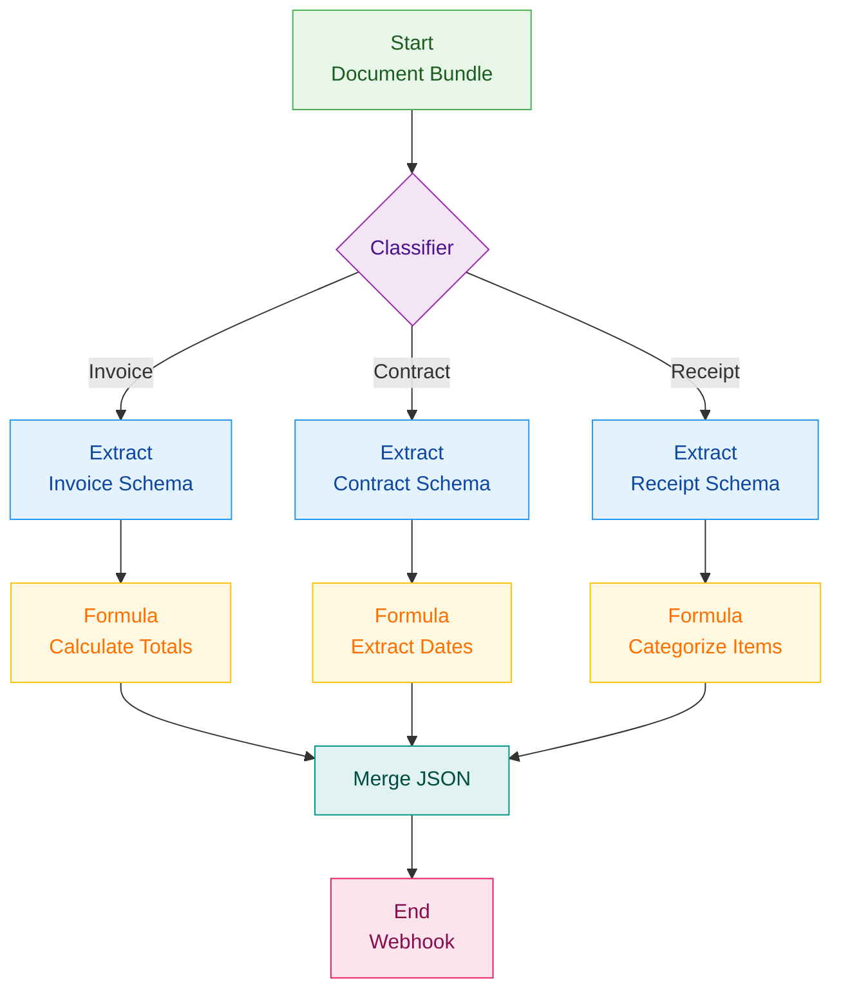

## What are Workflows?

Workflows are visual, node-based pipelines that let you chain together multiple document processing operations. Instead of writing code for each step, you can drag and drop nodes onto a canvas, connect them, and create powerful document automation flows.

A workflow typically consists of:
- **Input nodes** - Entry points for data:
  - **Document** - Upload files (PDF, images, Word, Excel)
  - **JSON Input** - Pass structured JSON data
- **Processing nodes** - Operations like Extract, Parse, Split, Classifier
- **Logic nodes** - Conditional flows like Human-in-the-Loop, Formula, If/Else routing, and API Call
- **Output nodes** - Optional destinations such as webhooks for your processed data


## Creating a Workflow

1. Navigate to the **Workflows** section in your dashboard
2. Click **Create Workflow** to open a new canvas
3. Drag nodes from the sidebar onto the canvas
4. Connect nodes by dragging from output handles to input handles
5. Configure each node by clicking on it
6. Your workflow auto-saves as you build

## Connecting Nodes

Nodes communicate through **handles** that define the type of data they accept or produce:

| Handle Type | Icon | Description |
|-------------|------|-------------|
| **File** | 📎 | Document files (PDF, images, Word, Excel) |
| **JSON** | `{ }` | Structured data extracted from documents |

### Connection Rules

- **File → File**: Pass documents between processing nodes
- **JSON → JSON**: Pass extracted data between logic nodes
- Each input handle accepts only **one connection**
- Connections validate automatically to prevent incompatible links

## Edit Mode vs Run Mode

Workflows have two operational modes:

### Edit Mode
- Add, remove, and configure nodes
- Create and delete connections
- Rename the workflow
- View generated Python code

### Run Mode
- Upload documents to input nodes
- Execute the workflow step-by-step
- View results at each stage
- Download processed files and extracted data

Toggle between modes using the switch at the top of the canvas.

## Running a Workflow

A workflow is fundamentally an asynchronous job. When you start it, Retab creates a workflow run, executes each step on the server, and stores the results on that run. A webhook is optional: you can configure one if you want Retab to notify your system automatically, but you can also simply run the workflow and poll the run until it finishes.

For the SDK and HTTP endpoint details, see the workflow API reference:
- [List Workflows](/api-reference/workflows/list)
- [Get Workflow](/api-reference/workflows/get)
- [Run Workflow](/api-reference/workflows/runs/create)
- [Get Run](/api-reference/workflows/runs/get)
- [Submit HIL Decision](/api-reference/workflows/runs/submit-hil-decision)
- [Get HIL Decision](/api-reference/workflows/runs/get-hil-decision)
- [List Steps](/api-reference/workflows/runs/steps/list)
- [Get Step](/api-reference/workflows/runs/steps/get)

### From the Dashboard

1. Switch to **Run Mode**
2. Upload a document to each **Document** input node
3. Click **Run Workflow**
4. Watch as each node processes (status indicators show progress)
5. Click on output handles to view results

### Using the SDK

The Python SDK exposes workflow metadata, graph authoring, run execution, and typed step inspection:

- `client.workflows.*` for `list()`, `get()`, `create()`, `publish()`, `duplicate()`, and `get_entities()`
- `client.workflows.blocks.*` and `client.workflows.edges.*` for programmatic graph changes
- `client.workflows.runs.*` and `client.workflows.runs.steps.*` for running flows and reading results

#### Discover input node IDs

Workflow run inputs are keyed by the IDs of your `start` and `start_json` nodes. `get_entities()` is the easiest way to discover them.

```python
from retab import Retab

client = Retab()

workflow = client.workflows.get_entities("wf_abc123")

document_start_id = workflow.start_nodes[0].id
json_start_id = workflow.start_json_nodes[0].id
```

#### Run and wait for completion

Workflows support two input maps:

- `documents` for Document (`start`) nodes
- `json_inputs` for JSON Input (`start_json`) nodes

```python
from pathlib import Path

from retab import Retab

client = Retab()

workflow = client.workflows.get_entities("wf_abc123")
document_start_id = workflow.start_nodes[0].id
json_start_id = workflow.start_json_nodes[0].id

run = client.workflows.runs.create(
    workflow_id=workflow.workflow.id,
    documents={
        document_start_id: Path("path/to/invoice.pdf"),
    },
    json_inputs={
        json_start_id: {"customer_id": "cust_123", "priority": "high"},
    },
)

run = client.workflows.runs.wait_for_completion(
    run.id,
    poll_interval_seconds=1.0,
)
run.raise_for_status()

print(run.status)
print(run.waiting_for_node_ids)
print(run.final_outputs)
```

`run.steps` contains per-node status summaries. For typed inputs and outputs on each node, use the step helpers.

#### Inspect typed step outputs

Step payloads are normalized into `HandlePayload` objects. For JSON-producing nodes, `extracted_data` is shorthand for the default `output-json-0` handle.

```python
step = client.workflows.runs.steps.get(run.id, "extract-node-id")

print(step.status)
print(step.extracted_data)

all_step_outputs = client.workflows.runs.steps.get_all(run)
for node_id, output in all_step_outputs.outputs.items():
    print(node_id, output.status, output.extracted_data)
```

Use `client.workflows.runs.steps.list(run.id)` when you want the persisted step documents for every node, or `client.workflows.runs.steps.list(run.id, node_ids=[...])` when you only need a subset of those step documents. Use `client.workflows.runs.steps.get_many(run.id, [...])` when you want normalized handle payloads for a subset of nodes.

#### Build workflows from code

The same SDK can create and publish workflow graphs:

```python
workflow = client.workflows.create(name="Invoice Pipeline")
entities = client.workflows.get_entities(workflow.id)
start_node = entities.start_nodes[0]

extract_block = client.workflows.blocks.create(
    workflow.id,
    id="extract-invoice",
    type="extract",
    label="Extract Invoice",
    position_x=320,
    position_y=0,
    config={
        "json_schema": {
            "type": "object",
            "properties": {
                "invoice_number": {"type": "string"},
                "total_amount": {"type": "number"},
            },
        },
    },
)

client.workflows.edges.create(
    workflow.id,
    id="edge-start-to-extract",
    source_block=start_node.id,
    target_block=extract_block.id,
    source_handle="output-file-0",
    target_handle="input-file-0",
)

client.workflows.publish(workflow.id, description="Initial version")
```

Use `client.workflows.list()` or `client.workflows.get(workflow_id)` when you need to browse existing workflows before launching a run, and `client.workflows.duplicate(workflow_id)` when you want a draft copy of an existing flow.

### Polling vs Webhooks

There are two standard ways to use a workflow in production:

#### 1. Run the workflow and poll the run

This is the core workflow model.

1. Start the workflow from the SDK or API
2. Receive a `run.id` and an initial status immediately
3. Poll the workflow run until it reaches a terminal status such as `completed` or `error`
4. Read the step results from the completed run

This is enough for many scripts, internal tools, and synchronous backend flows. You do **not** need a webhook for this pattern. The workflow run remains the source of truth, and the step results stay attached to the run after completion.

#### 2. Add a webhook for automatic notification

If you want Retab to call your backend automatically when a workflow finishes, add a webhook on an **End** node.

This is useful when:
- your system is event-driven
- another service should start work automatically after the workflow completes
- you do not want an active polling loop

The webhook does not replace the workflow run. It complements it. Even when a webhook is configured, the run still has its own id, status, and step results that you can retrieve from the API.

## Workflow Execution Order

Workflows execute in **topological order** based on the node connections:

1. Start from Document input nodes
2. Process each node once all its inputs are ready
3. Continue until all nodes are processed or an error occurs
4. Optionally send results to any configured Webhook output nodes

If a node fails, execution stops and the error is displayed on that node.

### Conditional Routing

When using **Classifier** or **If/Else** nodes, only the branches that receive data are executed. Nodes on skipped branches are marked as "skipped" rather than failed.

## Viewing Generated Code

Every workflow can be exported as Python code. Click **View Code** in the sidebar to see the equivalent SDK calls for your workflow. This is useful for:

- Integrating workflows into your existing codebase
- Running workflows in production environments
- Understanding how the visual nodes translate to API calls

## Best Practices

<AccordionGroup>
  <Accordion title="Start simple">
    Begin with a single Extract or Parse node, then gradually add complexity. Test each addition before moving on.
  </Accordion>
  
  <Accordion title="Use descriptive labels">
    Rename nodes to describe their purpose (e.g., "Invoice Data" instead of "Extract 1"). This makes complex workflows easier to understand.
  </Accordion>
  
  <Accordion title="Add notes for documentation">
    Use Note nodes to document sections of your workflow. They don't affect execution but help explain the logic.
  </Accordion>
  
  <Accordion title="Validate with Human-in-the-Loop">
    For critical data, add a HIL node after extraction. This ensures a human reviews low-likelihood results before they proceed.
  </Accordion>
  
  <Accordion title="Use Classifier for document routing">
    When processing different document types, use a Classifier node to route each document to the appropriate extraction schema.
  </Accordion>
  
  <Accordion title="Test with sample documents">
    Before deploying, run your workflow with representative sample documents to catch edge cases.
  </Accordion>
</AccordionGroup>

## Example: Invoice Processing Workflow

Here's a common workflow pattern for processing invoices:


```mermaid
flowchart LR
    A[Start\nDocument] --> B[Extract\nInvoice Fields]
    B --> C[HIL\nHuman Review]
    C --> D[End\nWebhook]

    style A fill:#e8f5e9,stroke:#4caf50,color:#1b5e20
    style B fill:#e3f2fd,stroke:#2196f3,color:#0d47a1
    style C fill:#fff3e0,stroke:#ff9800,color:#e65100
    style D fill:#fce4ec,stroke:#e91e63,color:#880e4f
```

1. **Start** node accepts the invoice PDF
2. **Extract** node pulls out vendor, amount, date, line items
3. **HIL** node flags low-likelihood extractions for human review
4. **End** node sends verified data to your webhook

## Example: Multi-Document Classification Workflow

For workflows that process mixed document bundles:


```mermaid
flowchart TD
    A[Start\nDocument Bundle] --> B{Classifier}
    
    B -->|Invoice| C[Extract\nInvoice Schema]
    B -->|Contract| D[Extract\nContract Schema]
    B -->|Receipt| E[Extract\nReceipt Schema]
    
    C --> F[Formula\nCalculate Totals]
    D --> G[Formula\nExtract Dates]
    E --> H[Formula\nCategorize Items]
    
    F --> I[Merge JSON]
    G --> I
    H --> I
    
    I --> J[End\nWebhook]

    style A fill:#e8f5e9,stroke:#4caf50,color:#1b5e20
    style B fill:#f3e5f5,stroke:#9c27b0,color:#4a148c
    style C fill:#e3f2fd,stroke:#2196f3,color:#0d47a1
    style D fill:#e3f2fd,stroke:#2196f3,color:#0d47a1
    style E fill:#e3f2fd,stroke:#2196f3,color:#0d47a1
    style F fill:#fff8e1,stroke:#ffc107,color:#ff6f00
    style G fill:#fff8e1,stroke:#ffc107,color:#ff6f00
    style H fill:#fff8e1,stroke:#ffc107,color:#ff6f00
    style I fill:#e0f2f1,stroke:#009688,color:#004d40
    style J fill:#fce4ec,stroke:#e91e63,color:#880e4f
```

1. **Classifier** routes documents by category (Invoice, Contract, Receipt)
2. Each **Extract** node uses a document-specific schema
3. **Formula** nodes compute derived fields for each document type
4. **Merge JSON** combines results from all branches into a single output
