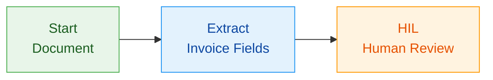
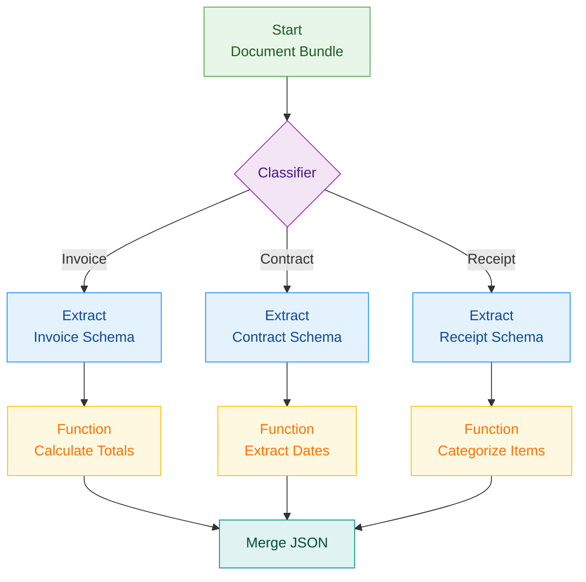

## What are Workflows?

Workflows are visual, block-based pipelines that let you chain together multiple document processing operations. Instead of writing code for each step, you can drag and drop blocks onto a canvas, connect them, and create powerful document automation flows.

A workflow typically consists of:
- **Input blocks** - Entry points for data:
  - **Document** - Upload files (PDF, images, Word, Excel)
  - **JSON Input** - Pass structured JSON data
- **Processing blocks** - Operations like Extract, Parse, Split, Classifier
- **Logic blocks** - Conditional flows like Human-in-the-Loop, Function, If/Else routing, and API Call


## Creating a Workflow

1. Navigate to the **Workflows** section in your dashboard
2. Click **Create Workflow** to open a new canvas
3. Drag blocks from the sidebar onto the canvas
4. Connect blocks by dragging from output handles to input handles
5. Configure each block by clicking on it
6. Your workflow auto-saves as you build

## Connecting Blocks

Blocks communicate through **handles** that define the type of data they accept or produce:

| Handle Type | Icon | Description |
|-------------|------|-------------|
| **File** | 📎 | Document files (PDF, images, Word, Excel) |
| **JSON** | `{ }` | Structured data extracted from documents |

### Connection Rules

- **File → File**: Pass documents between processing blocks
- **JSON → JSON**: Pass extracted data between logic blocks
- Each input handle accepts only **one connection**
- Connections validate automatically to prevent incompatible links

## Edit Mode vs Run Mode

Workflows have two operational modes:

### Edit Mode
- Add, remove, and configure blocks
- Create and delete connections
- Rename the workflow
- View generated Python code

### Run Mode
- Upload documents to input blocks
- Execute the workflow step-by-step
- View results at each stage
- Download processed files and extracted data

Toggle between modes using the switch at the top of the canvas.

## Running a Workflow

A workflow is fundamentally an asynchronous job. When you start it, Retab creates a workflow run, executes each step on the server, and stores the results on that run. You can then poll the run until it finishes and inspect the stored step outputs.

For the SDK and HTTP endpoint details, see the workflow API reference:
- [List Workflows](/api-reference/workflows/list)
- [Get Workflow](/api-reference/workflows/get)
- [Run Workflow](/api-reference/workflows/runs/create)
- [Get Run](/api-reference/workflows/runs/get)
- [List Steps](/api-reference/workflows/runs/steps/list)
- [Get Step](/api-reference/workflows/runs/steps/get)

### From the Dashboard

1. Switch to **Run Mode**
2. Upload a document to each **Document** input block
3. Click **Run Workflow**
4. Watch as each block processes (status indicators show progress)
5. Click on output handles to view results

### Using the SDK

The Python SDK exposes workflow metadata, graph authoring, run execution, and typed step inspection:

- `client.workflows.*` for `list()`, `get()`, `create()`, `publish()`, `duplicate()`, and `get_entities()`
- `client.workflows.blocks.*` and `client.workflows.edges.*` for programmatic graph changes
- `client.workflows.runs.*` and `client.workflows.runs.steps.*` for running flows and reading results

#### Discover input block IDs

Workflow run inputs are keyed by the IDs of your `start` and `start_json` blocks. `get_entities()` is the easiest way to discover them.

```python
from retab import Retab

client = Retab()

workflow = client.workflows.get_entities("wf_abc123")

document_start_id = workflow.start_blocks[0].id
json_start_id = workflow.start_json_blocks[0].id
```

#### Run and wait for completion

Workflows support two input maps:

- `documents` for Document (`start`) blocks
- `json_inputs` for JSON Input (`start_json`) blocks

```python
from pathlib import Path

from retab import Retab

client = Retab()

workflow = client.workflows.get_entities("wf_abc123")
document_start_id = workflow.start_blocks[0].id
json_start_id = workflow.start_json_blocks[0].id

run = client.workflows.runs.create(
    workflow_id=workflow.workflow.id,
    documents={
        document_start_id: Path("path/to/invoice.pdf"),
    },
    json_inputs={
        json_start_id: {"customer_id": "cust_123", "priority": "high"},
    },
)

run = client.workflows.runs.wait_for_completion(
    run.id,
    poll_interval_seconds=1.0,
)
run.raise_for_status()

print(run.status)
print(run.waiting_for_block_ids)
print(run.final_outputs)
```

`run.steps` contains per-block status summaries. For typed inputs and outputs on each block, use the step helpers.

#### Inspect typed step outputs

Step payloads are normalized into `HandlePayload` objects. For JSON-producing blocks, `extracted_data` is shorthand for the default `output-json-0` handle.

```python
step = client.workflows.runs.steps.get(run.id, "extract-block-id")

print(step.status)
print(step.extracted_data)

all_step_outputs = client.workflows.runs.steps.get_all(run)
for block_id, output in all_step_outputs.outputs.items():
    print(block_id, output.status, output.extracted_data)
```

Use `client.workflows.runs.steps.list(run.id)` when you want the persisted step documents for every block, or `client.workflows.runs.steps.list(run.id, block_ids=[...])` when you only need a subset of those step documents. Use `client.workflows.runs.steps.get_many(run.id, [...])` when you want normalized handle payloads for a subset of blocks.

#### Build workflows from code

The same SDK can create and publish workflow graphs:

```python
workflow = client.workflows.create(name="Invoice Pipeline")
entities = client.workflows.get_entities(workflow.id)
start_block = entities.start_blocks[0]

extract_block = client.workflows.blocks.create(
    workflow.id,
    id="extract-invoice",
    type="extract",
    label="Extract Invoice",
    position_x=320,
    position_y=0,
    config={
        "json_schema": {
            "type": "object",
            "properties": {
                "invoice_number": {"type": "string"},
                "total_amount": {"type": "number"},
            },
        },
    },
)

client.workflows.edges.create(
    workflow.id,
    id="edge-start-to-extract",
    source_block=start_block.id,
    target_block=extract_block.id,
    source_handle="output-file-0",
    target_handle="input-file-0",
)

client.workflows.publish(workflow.id, description="Initial version")
```

Use `client.workflows.list()` or `client.workflows.get(workflow_id)` when you need to browse existing workflows before launching a run, and `client.workflows.duplicate(workflow_id)` when you want a draft copy of an existing flow.

### Reading Workflow Results

The standard production pattern is to run the workflow, keep the returned `run.id`,
and poll the run until it reaches a terminal status such as `completed` or `error`.

1. Start the workflow from the SDK or API
2. Receive a `run.id` and an initial status immediately
3. Poll the workflow run until it finishes
4. Read the step results from the completed run

The workflow run is the source of truth for execution state and outputs. This is
enough for many scripts, internal tools, and backend services.

## Workflow Execution Order

Workflows execute in **topological order** based on the block connections:

1. Start from Document input blocks
2. Process each block once all its inputs are ready
3. Continue until all blocks are processed or an error occurs
4. Read outputs from the completed run and its step results

If a block fails, execution stops and the error is displayed on that block.

### Conditional Routing

When using **Classifier** or **If/Else** blocks, only the branches that receive data are executed. Blocks on skipped branches are marked as "skipped" rather than failed.

## Viewing Generated Code

Every workflow can be exported as Python code. Click **View Code** in the sidebar to see the equivalent SDK calls for your workflow. This is useful for:

- Integrating workflows into your existing codebase
- Running workflows in production environments
- Understanding how the visual blocks translate to API calls

## Best Practices

<AccordionGroup>
  <Accordion title="Start simple">
    Begin with a single Extract or Parse block, then gradually add complexity. Test each addition before moving on.
  </Accordion>
  
  <Accordion title="Use descriptive labels">
    Rename blocks to describe their purpose (e.g., "Invoice Data" instead of "Extract 1"). This makes complex workflows easier to understand.
  </Accordion>
  
  <Accordion title="Add notes for documentation">
    Use Note blocks to document sections of your workflow. They don't affect execution but help explain the logic.
  </Accordion>
  
  <Accordion title="Validate with Human-in-the-Loop">
    For critical data, add a HIL block after extraction. This ensures a human reviews low-likelihood results before they proceed.
  </Accordion>
  
  <Accordion title="Use Classifier for document routing">
    When processing different document types, use a Classifier block to route each document to the appropriate extraction schema.
  </Accordion>
  
  <Accordion title="Test with sample documents">
    Before deploying, run your workflow with representative sample documents to catch edge cases.
  </Accordion>
</AccordionGroup>

## Example: Invoice Processing Workflow

Here's a common workflow pattern for processing invoices:


```mermaid
flowchart LR
    A[Start\nDocument] --> B[Extract\nInvoice Fields]
    B --> C[HIL\nHuman Review]

    style A fill:#e8f5e9,stroke:#4caf50,color:#1b5e20
    style B fill:#e3f2fd,stroke:#2196f3,color:#0d47a1
    style C fill:#fff3e0,stroke:#ff9800,color:#e65100
```

1. **Start** block accepts the invoice PDF
2. **Extract** block pulls out vendor, amount, date, line items
3. **HIL** block flags low-likelihood extractions for human review
4. Read the verified data from the completed workflow run

## Example: Multi-Document Classification Workflow

For workflows that process mixed document bundles:


```mermaid
flowchart TD
    A[Start\nDocument Bundle] --> B{Classifier}
    
    B -->|Invoice| C[Extract\nInvoice Schema]
    B -->|Contract| D[Extract\nContract Schema]
    B -->|Receipt| E[Extract\nReceipt Schema]
    
    C --> F[Function\nCalculate Totals]
    D --> G[Function\nExtract Dates]
    E --> H[Function\nCategorize Items]
    
    F --> I[Merge JSON]
    G --> I
    H --> I

    style A fill:#e8f5e9,stroke:#4caf50,color:#1b5e20
    style B fill:#f3e5f5,stroke:#9c27b0,color:#4a148c
    style C fill:#e3f2fd,stroke:#2196f3,color:#0d47a1
    style D fill:#e3f2fd,stroke:#2196f3,color:#0d47a1
    style E fill:#e3f2fd,stroke:#2196f3,color:#0d47a1
    style F fill:#fff8e1,stroke:#ffc107,color:#ff6f00
    style G fill:#fff8e1,stroke:#ffc107,color:#ff6f00
    style H fill:#fff8e1,stroke:#ffc107,color:#ff6f00
    style I fill:#e0f2f1,stroke:#009688,color:#004d40
```

1. **Classifier** routes documents by category (Invoice, Contract, Receipt)
2. Each **Extract** block uses a document-specific schema
3. **Function** blocks compute derived fields for each document type
4. **Merge JSON** combines results from all branches into a single output
