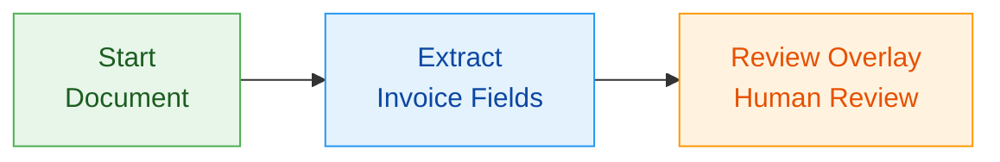
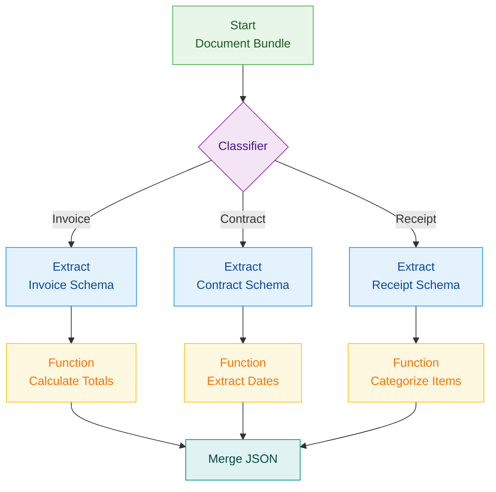

## What are Workflows?

Workflows are visual, block-based pipelines that let you chain together multiple document processing operations. Instead of writing code for each step, you can drag and drop blocks onto a canvas, connect them, and create powerful document automation flows.

A workflow typically consists of:

- **Input blocks** - Entry points for data:
  - **Document** - Upload files (PDF, images, Word, Excel)
  - **JSON Input** - Pass structured JSON data
- **Processing blocks** - Operations like Extract, Parse, Split, Classifier
- **Logic blocks** - Conditional flows like review gates, Function, If/Else routing, and API Call

### Tests

Workflow tests validate individual block outputs with saved inputs and
assertions. Use them to check that an Extract, Function, Split, or Classifier
block still behaves as expected after you change schemas, prompts, code, or
block configuration.

Learn more in [Tests](/workflows/tests).

### Experiments

Experiments measure a block's consistency by replaying the same Extract, Split,
Classifier, or split-by-key For Each block over a fixed document set with
multiple consensus passes. Use them to compare block configurations, find
low-agreement documents or fields, and decide what needs stricter tests.

Learn more in [Experiments](/workflows/Experiments).

## Creating a Workflow

1. Navigate to the **Workflows** section in your dashboard
2. Click **Create Workflow** to open a new canvas
3. Drag blocks from the sidebar onto the canvas
4. Connect blocks by dragging from output handles to input handles
5. Configure each block by clicking on it
6. Your workflow auto-saves as you build

## Connecting Blocks

Blocks communicate through **handles** that define the type of data they accept or produce:

| Handle Type | Icon  | Description                               |
| ----------- | ----- | ----------------------------------------- |
| **File**    | 📎    | Document files (PDF, images, Word, Excel) |
| **JSON**    | `{ }` | Structured data extracted from documents  |

### Connection Rules

- **File → File**: Pass documents between processing blocks
- **JSON → JSON**: Pass extracted data between logic blocks
- Each input handle accepts only **one connection**
- Connections validate automatically to prevent incompatible links

## Declarative Workflow Specs

You can also define and manage workflows from YAML. Declarative specs use
`apiVersion: workflows.retab.com/v1alpha2` and keep topology in `spec.edges`.
Every edge endpoint is explicit: it names the block and the raw runtime handle.

```yaml
apiVersion: workflows.retab.com/v1alpha2
kind: Workflow
metadata:
  id: wf_abc123
  name: Invoice Workflow

spec:
  blocks:
    start_document-node:
      type: start_document
      label: Input Document

    extract-node:
      type: extract
      label: Extract Fields
      config:
        inputs:
          - name: source_doc
            type: file
            is_primary: true
        json_schema:
          type: object
          properties: {}

  edges:
    - from:
        block: start_document-node
        handle: output-file-0
      to:
        block: extract-node
        handle: input-file-source_doc
```

The SDK exposes the spec lifecycle under `client.workflows.specs`:

<CodeGroup>
```python Python
validation = client.workflows.specs.validate(yaml_definition)
plan = client.workflows.specs.plan(yaml_definition)
result = client.workflows.specs.apply(yaml_definition)
exported = client.workflows.specs.export(result.workflow_id)
```

```javascript JavaScript
const validation = await client.workflows.specs.validate(yamlDefinition);
const plan = await client.workflows.specs.plan(yamlDefinition);
const result = await client.workflows.specs.apply(yamlDefinition);
const exported = await client.workflows.specs.export(result.workflow_id);
```

</CodeGroup>

Use `validate()` for parse and handle checks, `plan()` to preview draft
changes, `apply()` to reconcile the draft workflow, and `export()` to get
canonical YAML from an existing workflow.
`plan()` and `apply()` return Terraform-style `summary`, `resource_changes`,
and `rendered_plan` fields so clients can inspect exactly what changed.
Call `client.workflows.publish(workflow_id)` separately when the draft should
become the live published workflow.

For endpoint details, see:

- [Validate Workflow Spec](/api-reference/workflows/spec/validate)
- [Plan Workflow Spec](/api-reference/workflows/spec/plan)
- [Apply Workflow Spec](/api-reference/workflows/spec/apply)
- [Export Workflow Spec](/api-reference/workflows/spec)

## Edit Mode vs Run Mode

Workflows have two operational modes:

### Edit Mode

- Add, remove, and configure blocks
- Create and delete connections
- Rename the workflow
- View generated Python code

### Run Mode

- Upload documents to input blocks
- Execute the workflow step-by-step
- View results at each stage
- Download processed files and extracted data

Toggle between modes using the switch at the top of the canvas.

## Running a Workflow

A workflow is fundamentally an asynchronous job. When you start it, Retab creates a workflow run, executes each step on the server, and stores the results on that run. You can then poll the run until it finishes and inspect the stored step outputs.

For the SDK and HTTP endpoint details, see the workflow API reference:

- [List Workflows](/api-reference/workflows/list)
- [Get Workflow](/api-reference/workflows/get)
- [Run Workflow](/api-reference/workflows/runs/create)
- [Get Run](/api-reference/workflows/runs/get)
- [List Steps](/api-reference/workflows/steps/list)
- [Get Step](/api-reference/workflows/steps/get)

### From the Dashboard

1. Switch to **Run Mode**
2. Upload a document to each **Document** input block
3. Click **Run Workflow**
4. Watch as each block processes (status indicators show progress)
5. Click on output handles to view results

### Using the SDK

The Python, Node, and Go SDKs expose workflow metadata, graph authoring, run execution, and typed step inspection:

- `client.workflows.*` / `client.Workflows.*` for `list()`, `get()`, `create()`, `update()`, `delete()`, and `publish()`
- `client.workflows.blocks.*` / `client.Workflows.Blocks.*` and `client.workflows.edges.*` / `client.Workflows.Edges.*` for programmatic graph changes
- `client.workflows.runs.*` / `client.Workflows.Runs.*` and `client.workflows.steps.*` / `client.Workflows.Steps.*` for running flows and reading results

#### Discover input block IDs

Workflow run inputs are keyed by the IDs of your `start_document` and `start_json` blocks. List the workflow's blocks to discover them.

<CodeGroup>
```python Python
from retab import Retab

client = Retab()

blocks = client.workflows.blocks.list("wf_abc123")

document_start_id = next(block.id for block in blocks.data if block.type == "start_document")
json_start_id = next(block.id for block in blocks.data if block.type == "start_json")

````

```javascript JavaScript
import { Retab } from "@retab/node";

const client = new Retab({ apiKey: process.env.RETAB_API_KEY });

const blocks = await client.workflows.blocks.list("wf_abc123");

const documentStartId = blocks.data.find((block) => block.type === "start_document")?.id;
const jsonStartId = blocks.data.find((block) => block.type === "start_json")?.id;

if (!documentStartId || !jsonStartId) {
  throw new Error("Workflow is missing a required input block");
}
````

```go Go
package main

import (
	"context"
	"fmt"
	"log"

	retab "github.com/retab-dev/retab/clients/go"
)

func main() {
	ctx := context.Background()

	client, err := retab.NewClient("")
	if err != nil {
		log.Fatal(err)
	}

	blocks, err := client.Workflows.Blocks.List(ctx, "wf_abc123")
	if err != nil {
		log.Fatal(err)
	}

	var documentStartID string
	var jsonStartID string
	for _, block := range blocks.Data {
		switch block.Type {
		case "start_document":
			documentStartID = block.ID
		case "start_json":
			jsonStartID = block.ID
		}
	}

	fmt.Println(documentStartID)
	fmt.Println(jsonStartID)
}
```

</CodeGroup>

#### Run and wait for completion

Workflows support two input maps:

- `documents` for Document (`start_document`) blocks
- `json_inputs` for JSON Input (`start_json`) blocks

<CodeGroup>
```python Python
import time
from pathlib import Path

from retab import Retab

client = Retab()

workflow = client.workflows.get("wf_abc123")
blocks = client.workflows.blocks.list(workflow.id)
document_start_id = next(block.id for block in blocks.data if block.type == "start_document")
json_start_id = next(block.id for block in blocks.data if block.type == "start_json")

run = client.workflows.runs.create(
workflow_id=workflow.id,
documents={
document_start_id: Path("path/to/invoice.pdf"),
},
json_inputs={
json_start_id: {"customer_id": "cust_123", "priority": "high"},
},
)

terminal_statuses = {"completed", "error", "cancelled"}
while run.lifecycle.status not in terminal_statuses and run.lifecycle.status != "awaiting_review":
time.sleep(1)
run = client.workflows.runs.get(run.id)

print(run.lifecycle.status)
if run.lifecycle.status == "awaiting_review":
print(run.lifecycle.waiting_for_block_ids)
elif run.lifecycle.status == "error":
raise RuntimeError(run.lifecycle.message)
elif run.lifecycle.status == "cancelled":
raise RuntimeError(run.lifecycle.reason or "Workflow run was cancelled")
else:
for step_summary in client.workflows.steps.list(run.id):
step = client.workflows.steps.get(run.id, step_summary.block_id)
if step.handle_outputs:
print(step.block_id, step.handle_outputs)

````

```javascript JavaScript
import { Retab } from "@retab/node";

const client = new Retab({ apiKey: process.env.RETAB_API_KEY });

const workflow = await client.workflows.get("wf_abc123");
const blocks = await client.workflows.blocks.list(workflow.id);
const documentStartId = blocks.data.find((block) => block.type === "start_document")?.id;
const jsonStartId = blocks.data.find((block) => block.type === "start_json")?.id;

if (!documentStartId || !jsonStartId) {
  throw new Error("Workflow is missing a required input block");
}

let run = await client.workflows.runs.create({
  workflowId: workflow.id,
  documents: {
    [documentStartId]: "path/to/invoice.pdf",
  },
  jsonInputs: {
    [jsonStartId]: { customer_id: "cust_123", priority: "high" },
  },
});

const terminalStatuses = new Set(["completed", "error", "cancelled"]);
while (!terminalStatuses.has(run.lifecycle.status) && run.lifecycle.status !== "awaiting_review") {
  await new Promise((resolve) => setTimeout(resolve, 1000));
  run = await client.workflows.runs.get(run.id);
}

console.log(run.lifecycle.status);
if (run.lifecycle.status === "awaiting_review") {
  console.log(run.lifecycle.waiting_for_block_ids);
} else if (run.lifecycle.status === "error") {
  throw new Error(run.lifecycle.message);
} else if (run.lifecycle.status === "cancelled") {
  throw new Error(run.lifecycle.reason ?? "Workflow run was cancelled");
} else {
  const steps = await client.workflows.steps.list(run.id);
  for (const stepSummary of steps) {
    const step = await client.workflows.steps.get(run.id, stepSummary.block_id);
    if (Object.keys(step.handle_outputs).length > 0) {
      console.log(step.block_id, step.handle_outputs);
    }
  }
}
````

```go Go
package main

import (
	"context"
	"fmt"
	"log"
	"time"

	retab "github.com/retab-dev/retab/clients/go"
)

func main() {
	ctx := context.Background()

	client, err := retab.NewClient("")
	if err != nil {
		log.Fatal(err)
	}

	workflow, err := client.Workflows.Get(ctx, "wf_abc123")
	if err != nil {
		log.Fatal(err)
	}

	blocks, err := client.Workflows.Blocks.List(ctx, workflow.ID)
	if err != nil {
		log.Fatal(err)
	}

	var documentStartID string
	var jsonStartID string
	for _, block := range blocks.Data {
		switch block.Type {
		case "start_document":
			documentStartID = block.ID
		case "start_json":
			jsonStartID = block.ID
		}
	}

	run, err := client.Workflows.Runs.Create(ctx, retab.CreateWorkflowRunRequest{
		WorkflowID: workflow.ID,
		Documents: map[string]any{
			documentStartID: "path/to/invoice.pdf",
		},
		JSONInputs: map[string]any{
			jsonStartID: map[string]any{
				"customer_id": "cust_123",
				"priority":    "high",
			},
		},
	})
	if err != nil {
		log.Fatal(err)
	}

	deadline := time.Now().Add(10 * time.Minute)
	for !run.Terminal() && run.Lifecycle.Status != "awaiting_review" {
		if time.Now().After(deadline) {
			log.Fatalf("timed out waiting for workflow run %s", run.ID)
		}
		time.Sleep(time.Second)
		run, err = client.Workflows.Runs.Get(ctx, run.ID)
		if err != nil {
			log.Fatal(err)
		}
	}

	fmt.Println(run.Lifecycle.Status)
	if run.Lifecycle.Status == "awaiting_review" {
		fmt.Println(run.Lifecycle.WaitingForBlockIDs)
		return
	}
	if !run.Completed() {
		log.Fatalf("workflow finished with lifecycle %s", run.Lifecycle.Status)
	}

	steps, err := client.Workflows.Steps.List(ctx, run.ID)
	if err != nil {
		log.Fatal(err)
	}
	for _, stepSummary := range steps {
		step, err := client.Workflows.Steps.Get(ctx, run.ID, stepSummary.BlockID)
		if err != nil {
			log.Fatal(err)
		}
		if len(step.HandleOutputs) > 0 {
			fmt.Println(step.BlockID, step.HandleOutputs)
		}
	}
}
```

</CodeGroup>

`steps.list(run.id)` returns the step roster for a run. For the full execution record for one block, including typed inputs and outputs, use `steps.get(run.id, block_id)`.

#### Inspect step outputs

Start with `steps.list(run.id)` when you need the blocks that ran. Then call `steps.get(run.id, block_id)` for the specific execution record you want to inspect.

Step payloads are normalized into `HandlePayload` objects. For JSON-producing blocks, `extracted_data` is shorthand for the default `output-json-0` handle.

<CodeGroup>
```python Python
# Step roster:
for step in client.workflows.steps.list(run.id):
    print(step.block_id, step.lifecycle.status)
    if step.artifact:
        print(step.artifact.operation, step.artifact.id)

# Full execution record for one step:

step = client.workflows.steps.get(run.id, "extract-block-id")
print(step.lifecycle.status)
if step.extracted_data:
print(step.extracted_data)

````

```javascript JavaScript
// Step roster:
const steps = await client.workflows.steps.list(run.id);
for (const step of steps) {
  console.log(step.block_id, step.lifecycle.status);
  if (step.artifact) {
    console.log(step.artifact.operation, step.artifact.id);
  }
}

// Full execution record for one step:
const step = await client.workflows.steps.get(run.id, "extract-block-id");
console.log(step.lifecycle.status);
const extractedData = step.handle_outputs["output-json-0"]?.data;
if (extractedData) {
  console.log(extractedData);
}
````

```go Go
// Step roster:
steps, err := client.Workflows.Steps.List(ctx, run.ID)
if err != nil {
	log.Fatal(err)
}
for _, step := range steps {
	fmt.Println(step.BlockID, step.Lifecycle["status"])
	if step.Artifact != nil {
		fmt.Println(step.Artifact.Operation, step.Artifact.ID)
	}
}

// Full execution record for one step:
step, err := client.Workflows.Steps.Get(ctx, run.ID, "extract-block-id")
if err != nil {
	log.Fatal(err)
}
fmt.Println(step.Lifecycle["status"])
if extractedData := step.ExtractedData(); extractedData != nil {
	fmt.Println(extractedData)
}
```

</CodeGroup>

Use `steps.list(run.id, block_ids=[...])` when you only need a subset of step summaries. Use `steps.get(run.id, block_id)` when you need the normalized execution record for a single block.

#### Fetch the artifact record

Some blocks persist a durable artifact record. `step.artifact` is only the stable
pointer:

```json
{ "operation": "conditional_evaluation", "id": "ceval_abc123" }
```

Use `client.workflows.artifacts.get(step.artifact)` to dereference that pointer.
The response is the backing record flattened with `operation` at the top level,
so consumers can dispatch on one object without juggling an extra `record`
wrapper.

<CodeGroup>
```python Python
step = client.workflows.steps.get(run.id, "conditional-block-id")
if step.artifact:
    artifact = client.workflows.artifacts.get(step.artifact)
    print(artifact.operation)
    print(artifact.matched_condition_ids)
    print(artifact.evaluations)
```

```javascript JavaScript
const step = await client.workflows.steps.get(run.id, "function-block-id");
if (step.artifact) {
  const artifact = await client.workflows.artifacts.get(step.artifact);
  console.log(artifact.operation);
  console.log(artifact.output);
  console.log(artifact.error);
}
```

</CodeGroup>

`workflows.artifacts.list(run.id)` dereferences every artifact produced by a
run. Pass `operation=` or `block_id=` when you only need a subset.

<CodeGroup>
```python Python
condition_records = client.workflows.artifacts.list(
    run.id,
    operation="conditional_evaluation",
)
```

```javascript JavaScript
const conditionRecords = await client.workflows.artifacts.list({
  runId: run.id,
  operation: "conditional_evaluation",
});
```

</CodeGroup>

| operation                | produced by               | record includes                                            |
| ------------------------ | ------------------------- | ---------------------------------------------------------- |
| `extraction`             | `extract`                 | extraction result, choices, likelihoods, schema details    |
| `split`                  | `split`                   | split result and output document grouping                  |
| `classification`         | `classifier`              | selected class and consensus details                       |
| `parse`                  | `parse`                   | parsed document content                                    |
| `edit`                   | `edit`                    | edited document result                                     |
| `partition`              | `for_each_sentinel_start` | partitioned items for the loop                             |
| `conditional_evaluation` | `conditional`             | `evaluations`, `selected_handles`, `matched_condition_ids` |
| `while_loop_termination` | `while_loop`              | termination reason and final condition evaluations         |
| `api_call_invocation`    | `api_call`                | request/response attempts, retry trace, and final error    |
| `function_invocation`    | `function`                | function inputs, output, duration, and final error         |

#### Build workflows from code

The same SDK can create and publish workflow graphs:

<CodeGroup>
```python Python
workflow = client.workflows.create(name="Invoice Pipeline")
blocks = client.workflows.blocks.list(workflow.id)
start_document_block = next(block for block in blocks.data if block.type == "start_document")

extract_block = client.workflows.blocks.create(
workflow.id,
id="extract-invoice",
type="extract",
label="Extract Invoice",
position_x=320,
position_y=0,
config={
"json_schema": {
"type": "object",
"properties": {
"invoice_number": {"type": "string"},
"total_amount": {"type": "number"},
},
},
},
)

client.workflows.edges.create(
workflow.id,
id="edge-start-to-extract",
source_block=start_document_block.id,
target_block=extract_block.id,
source_handle="output-file-0",
target_handle="input-file-0",
)

client.workflows.publish(workflow.id, description="Initial version")

````

```javascript JavaScript
const workflow = await client.workflows.create({ name: "Invoice Pipeline" });
const blocks = await client.workflows.blocks.list(workflow.id);
const startDocumentBlock = blocks.data.find((block) => block.type === "start_document");

if (!startDocumentBlock) {
  throw new Error("Workflow is missing a start_document block");
}

const extractBlock = await client.workflows.blocks.create(workflow.id, {
  id: "extract-invoice",
  type: "extract",
  label: "Extract Invoice",
  positionX: 320,
  positionY: 0,
  config: {
    json_schema: {
      type: "object",
      properties: {
        invoice_number: { type: "string" },
        total_amount: { type: "number" },
      },
    },
  },
});

await client.workflows.edges.create(workflow.id, {
  id: "edge-start-to-extract",
  sourceBlock: startDocumentBlock.id,
  targetBlock: extractBlock.id,
  sourceHandle: "output-file-0",
  targetHandle: "input-file-0",
});

await client.workflows.publish(workflow.id, { description: "Initial version" });
````

```go Go
workflow, err := client.Workflows.Create(ctx, retab.CreateWorkflowRequest{
	Name: "Invoice Pipeline",
})
if err != nil {
	log.Fatal(err)
}

blocks, err := client.Workflows.Blocks.List(ctx, workflow.ID)
if err != nil {
	log.Fatal(err)
}

var startDocumentBlock retab.WorkflowBlock
for _, block := range blocks.Data {
	if block.Type == "start_document" {
		startDocumentBlock = block
		break
	}
}

extractBlock, err := client.Workflows.Blocks.Create(ctx, workflow.ID, retab.WorkflowBlockCreateRequest{
	ID:        "extract-invoice",
	Type:      "extract",
	Label:     "Extract Invoice",
	PositionX: 320,
	PositionY: 0,
	Config: map[string]any{
		"json_schema": map[string]any{
			"type": "object",
			"properties": map[string]any{
				"invoice_number": map[string]any{"type": "string"},
				"total_amount":   map[string]any{"type": "number"},
			},
		},
	},
})
if err != nil {
	log.Fatal(err)
}

_, err = client.Workflows.Edges.Create(ctx, workflow.ID, retab.WorkflowEdgeCreateRequest{
	ID:           "edge-start-to-extract",
	SourceBlock:  startDocumentBlock.ID,
	TargetBlock:  extractBlock.ID,
	SourceHandle: "output-file-0",
	TargetHandle: "input-file-0",
})
if err != nil {
	log.Fatal(err)
}

_, err = client.Workflows.Publish(ctx, workflow.ID, retab.PublishWorkflowRequest{
	Description: "Initial version",
})
if err != nil {
	log.Fatal(err)
}
```

</CodeGroup>

Use `client.workflows.list()` or `client.workflows.get(workflow_id)` when you need to browse existing workflows before launching a run.

### Reading Workflow Results

The standard production pattern is to run the workflow, keep the returned `run.id`,
and poll the run until `lifecycle.status` reaches `completed`, `error`, `cancelled`,
or `awaiting_review`.

1. Start the workflow from the SDK or API
2. Receive a `run.id` and an initial lifecycle immediately
3. Poll the workflow run until it finishes or waits for review
4. Read the step results from the completed run

The workflow run is the source of truth for execution state and outputs. This is
enough for many scripts, internal tools, and backend services.

## Workflow Execution Order

Workflows execute in **topological order** based on the block connections:

1. Start from Document input blocks
2. Process each block once all its inputs are ready
3. Continue until all blocks are processed or an error occurs
4. Read outputs from the completed run and its step results

If a block fails, execution stops and the error is displayed on that block.

### Conditional Routing

When using **Classifier** or **If/Else** blocks, only the branches that receive data are executed. Blocks on skipped branches are marked as "skipped" rather than failed.

## Viewing Generated Code

Every workflow can be exported as Python code. Click **View Code** in the sidebar to see the equivalent SDK calls for your workflow. This is useful for:

- Integrating workflows into your existing codebase
- Running workflows in production environments
- Understanding how the visual blocks translate to API calls

## Best Practices

<AccordionGroup>
  <Accordion title="Start simple">
    Begin with a single Extract or Parse block, then gradually add complexity.
    Test each addition before moving on.
  </Accordion>

<Accordion title="Use descriptive labels">
  Rename blocks to describe their purpose (e.g., "Invoice Data" instead of
  "Extract 1"). This makes complex workflows easier to understand.
</Accordion>

<Accordion title="Add notes for documentation">
  Use Note blocks to document sections of your workflow. They don't affect
  execution but help explain the logic.
</Accordion>

<Accordion title="Validate with review gates">
  For critical data, add a review gate to the extraction block. This ensures a
  reviewer checks low-likelihood results before they proceed.
</Accordion>

<Accordion title="Use Classifier for document routing">
  When processing different document types, use a Classifier block to route each
  document to the appropriate extraction schema.
</Accordion>

  <Accordion title="Test with sample documents">
    Before deploying, run your workflow with representative sample documents to
    catch edge cases.
  </Accordion>
</AccordionGroup>

## Example: Invoice Processing Workflow

Here's a common workflow pattern for processing invoices:


```mermaid
flowchart LR
    A[Start\nDocument] --> B[Extract\nInvoice Fields]
    B --> C[Review Overlay\nHuman Review]

    style A fill:#e8f5e9,stroke:#4caf50,color:#1b5e20
    style B fill:#e3f2fd,stroke:#2196f3,color:#0d47a1
    style C fill:#fff3e0,stroke:#ff9800,color:#e65100
```

1. **Start** block accepts the invoice PDF
2. **Extract** block pulls out vendor, amount, date, line items
3. The extract block's **review gate** flags low-likelihood extractions for review
4. Read the verified data from the completed workflow run

## Example: Multi-Document Classification Workflow

For workflows that process mixed document bundles:


```mermaid
flowchart TD
    A[Start\nDocument Bundle] --> B{Classifier}

    B -->|Invoice| C[Extract\nInvoice Schema]
    B -->|Contract| D[Extract\nContract Schema]
    B -->|Receipt| E[Extract\nReceipt Schema]

    C --> F[Function\nCalculate Totals]
    D --> G[Function\nExtract Dates]
    E --> H[Function\nCategorize Items]

    F --> I[Merge JSON]
    G --> I
    H --> I

    style A fill:#e8f5e9,stroke:#4caf50,color:#1b5e20
    style B fill:#f3e5f5,stroke:#9c27b0,color:#4a148c
    style C fill:#e3f2fd,stroke:#2196f3,color:#0d47a1
    style D fill:#e3f2fd,stroke:#2196f3,color:#0d47a1
    style E fill:#e3f2fd,stroke:#2196f3,color:#0d47a1
    style F fill:#fff8e1,stroke:#ffc107,color:#ff6f00
    style G fill:#fff8e1,stroke:#ffc107,color:#ff6f00
    style H fill:#fff8e1,stroke:#ffc107,color:#ff6f00
    style I fill:#e0f2f1,stroke:#009688,color:#004d40
```

1. **Classifier** routes documents by category (Invoice, Contract, Receipt)
2. Each **Extract** block uses a document-specific schema
3. **Function** blocks compute derived fields for each document type
4. **Merge JSON** combines results from all branches into a single output
